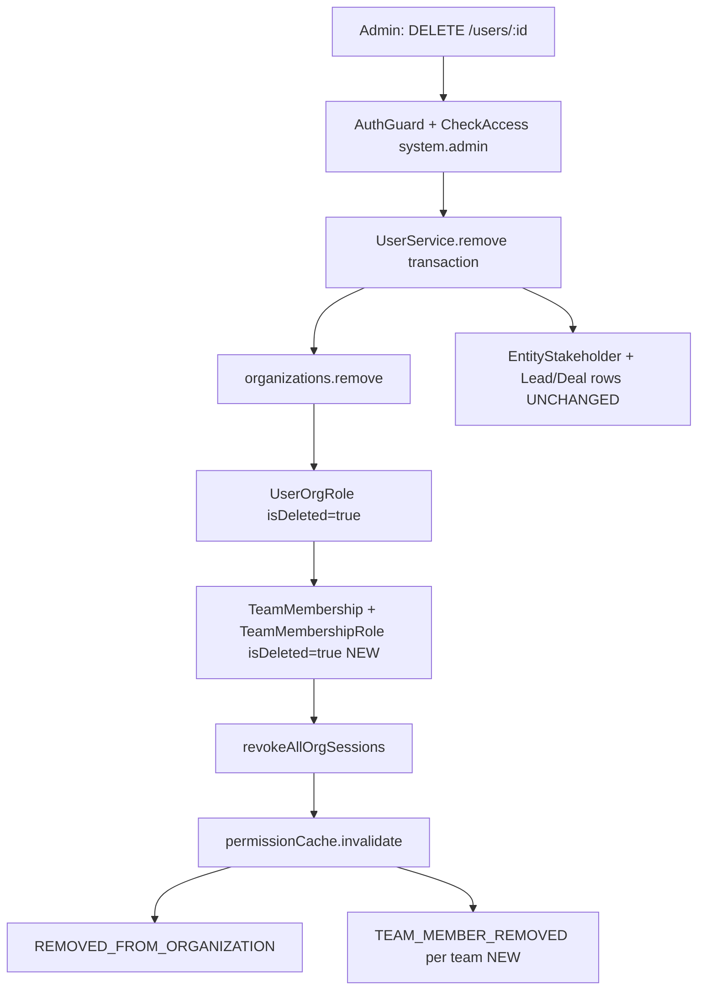

<Note>
**Status:** Phases 1–5 implemented (backend, API badge, frontend UX, optional enhancements, docs + E2E)

**Related Documentation:**
- [RBAC System Specification](/backend/rbac/rbac-system-specification)
- [Stakeholder System](/backend/crm/stakeholder-system)
- [Session System](/backend/auth/session-system-documentation)
- [Messaging Module](/backend/messaging/messaging-module-specification)
- [Soft Delete Filter Standard](/backend/standards/soft-delete-filter-standard)
</Note>

## Executive Summary

**Feature Name:** Remove user from organization (org-scoped deactivation)

**User-Facing Label:** "Remove from organization" (not "Delete user account")

**Endpoint:** `DELETE /v1/users/:id` → `UserService.remove()`

- **Controller:** `src/modules/user/user.controller.ts`
- **Service:** `src/modules/user/user.service.ts` (`remove()`, ~lines 864–1103)

<Warning>
**Critical Architectural Decision:** Do **not** set global `User.isDeleted` for org removal. `User` is global across orgs; `isDeleted` would remove the person everywhere and affect unique email constraints. Removal is expressed via **junction soft-deletes** (`UserOrgRole`, `TeamMembership`, `TeamMembershipRole`) and removing the user from the `organizations` M:N collection.
</Warning>

### Core Principle

Industry-aligned approach: Deactivate **membership and access** in one org; **retain** CRM history (leads, deals, stakeholders, commissions, activities). Managers **manually reassign** stale assignments; UI shows a **badge** on users who are no longer active org members.



## Terminology

<AccordionGroup>
  <Accordion title="Org removal">
    User loses access to one organization; CRM rows stay.
  </Accordion>

  <Accordion title="Global user delete">
    `User.isDeleted = true` — **out of scope** for this feature.
  </Accordion>

  <Accordion title="Active org member">
    Has at least one non-deleted `UserOrgRole` for the org (authoritative; see `InvitationService` — source of truth is active `UserOrgRole`, not `User.organizations` alone).
  </Accordion>

  <Accordion title="Removed org member">
    No active `UserOrgRole` for org; may still appear on historical CRM data.
  </Accordion>
</AccordionGroup>

## Goals

<Steps>
  <Step title="Access cut-off">
    Removed user cannot use org-scoped APIs or refresh org sessions for that tenant.
  </Step>

  <Step title="RBAC cleanup">
    All org roles and team roles for that org are soft-deleted consistently.
  </Step>

  <Step title="Realtime/messaging cleanup">
    Messaging listeners receive the same events as explicit team removal.
  </Step>

  <Step title="CRM preservation">
    No auto-unassign from leads/deals; commission % and stakeholder rows remain until manual change.
  </Step>

  <Step title="Discoverability">
    Historical UI shows name + **"Removed from org"** badge; pickers exclude removed users.
  </Step>

  <Step title="Re-invite path">
    Invitation accept can restore membership (partially implemented today).
  </Step>
</Steps>

## Non-Goals (v1)

<Info>
The following features are explicitly out of scope for the initial implementation:

- Global account deletion (`User.isDeleted`)
- Auto-redistribution of leads, deals, distribution pools, or commission
- Bulk remove users API
- Admin "reassignment worklist" endpoint (optional Phase 4)
- Blocking removal when user has pending `EntityTransfer` (document as future policy; v1 allows removal)
- Anonymizing PII on `User` row
</Info>

## Current State vs Target State

### Already Implemented Features

<CardGroup cols={2}>
  <Card title="Self-Removal Protection" icon="shield-halved">
    Self-removal is forbidden with appropriate validation
  </Card>

  <Card title="Hierarchy Checks" icon="sitemap">
    Admin/Owner hierarchy validation is complete
  </Card>

  <Card title="Team Leader Check" icon="users">
    Last team leader per team validation (uses active `TeamMembership`)
  </Card>

  <Card title="Organization Link" icon="link-slash">
    `user.organizations.remove(org)` implemented
  </Card>

  <Card title="Role Soft-Delete" icon="user-slash">
    Soft-delete all active `UserOrgRole` for org
  </Card>

  <Card title="Session Cleanup" icon="clock-rotate-left">
    Clear `selectedOrganization` if matching and revoke sessions
  </Card>

  <Card title="Cache Invalidation" icon="trash-can">
    `permissionCache.invalidate` implemented
  </Card>

  <Card title="Event Notification" icon="bell">
    Post-commit `REMOVED_FROM_ORGANIZATION` event
  </Card>
</CardGroup>

### Implementation Status

| Gap | Risk if Unfixed | Status |
|-----|----------------|--------|
| `TeamMembership` / `TeamMembershipRole` **not** soft-deleted on org remove | Stale team rosters, permission cache edge cases, no `TEAM_MEMBER_REMOVED` per team | **Done (Phase 1)** — `TeamMembershipService.softDeleteTeamMembershipInTransaction` + `UserService.remove` loop |
| No `TEAM_MEMBER_REMOVED` events after org remove | `team-membership-removal.listener.ts` may not evict conversation rooms per team | **Done (Phase 1)** — post-commit emit per team |
| Removing `organizations.owner_id` user | Org left without owner account linkage | **Done (Phase 1)** — `ForbiddenException` in `UserService.remove` |
| No `isActiveOrgMember` on `UserDto` / display maps | Frontend cannot badge removed users on stakeholders/history | **Done (Phase 2)** |
| Swagger says "Soft deletes a user" | Misleading — should say "Removes from organization" | **Done (Phase 1)** |
| Dialog copy: "cannot be undone" | Misleading if re-invite is supported | Phase 3 |

<Tip>
**Reuse Pattern:** Team soft-delete logic already exists in `TeamMembershipService.removeMemberInTransaction()` (`src/modules/rbac/team-membership/team-membership.service.ts`, ~lines 672–678): soft-delete all `teamRoles`, then `membership.isDeleted = true`.
</Tip>

### Stale Assignment Validation (Phase 4.3)

<Check>
**Status:** Implemented

The system now provides visibility into stale assignments before user removal:

- `EntityStakeholderService.countStalePrimaryAssignmentsForUserInTransaction()` counts leads and deals where the user is the primary stakeholder
- Used by `GET /users/:id/stale-assignments` to show admins potential assignment conflicts
- Informational only - does not block removal, following the manual reassignment principle
- Tracked post-removal via `stakeholdersWithoutActiveUserOrgRoleCount` in the data integrity audit
</Check>

## API Contract

### Request Specification

<ParamField path="id" type="string" required>
  Target user UUID
</ParamField>

**Method:** `DELETE`

**Path:** `/v1/users/:id`

**Authentication:** JWT + org tenant context (`organizationId` on token)

**Permission:** `OrgPermissionKey.SYSTEM_ADMIN` via `@CheckAccess` on controller

**Body:** None

### Response Specification

<Tabs>
  <Tab title="200 Success">
    ```json
    {
      "success": true
    }
    ```
  </Tab>

  <Tab title="400 Bad Request">
    Last team leader in a team (message includes team name)
  </Tab>

  <Tab title="403 Forbidden">
    - Self-removal attempt
    - Admin removing Admin/Owner
    - Owner removing Owner (see validation section)
  </Tab>

  <Tab title="404 Not Found">
    Removing actor not in org; or target not found in org
    
    <Note>
    Service returns `{ success: false }` when target user not in org — consider normalizing to 404 in a follow-up
    </Note>
  </Tab>
</Tabs>

### Swagger Correction (Phase 1)

Update `@ApiOperation` description from "Soft deletes a user" to:

```typescript
"Removes user from the current organization; retains global account and CRM history."
```

## Authorization Matrix

<Warning>
**Team Leader Rule:** If target holds `team.admin` on a team and no other active member on that team holds `team.admin`, removal is **blocked** with `BadRequestException` (already implemented using loaded `teamMemberships`).
</Warning>

| Actor | Target | Allowed? |
|-------|--------|----------|
| Any user | Self | **No** (`ForbiddenException`) |
| Admin (not Owner, not `org.owner`) | Admin or Owner | **No** |
| Admin | Non-admin, non-owner | **Yes** |
| Owner role (not `org.owner`) | Another Owner | **No** |
| `organization.owner_id` | Anyone except self | **Yes** (subject to team-leader rule) |
| User without `system.admin` | Anyone | **No** (guard) |

## Transaction Specification

<Info>
All steps run in **one** MikroORM transaction (existing pattern). Order matters for validations before mutations.
</Info>

### Transaction Flow (`executeInOrg`)

<Steps>
  <Step title="Load actors">
    Load `deletedByUser`, `user` (target) with `organizations`, `orgRoles`, `selectedOrganization`
  </Step>

  <Step title="Validate">
    Check self-removal, role hierarchy, last team leader (on **active** memberships)
  </Step>

  <Step title="Load team memberships">
    Query `TeamMembership` where `user`, `organization`, `isDeleted: false`, populate `team`, `teamRoles`, `teamRoles.role.permissions`
  </Step>

  <Step title="Mutate org link">
    Execute `user.organizations.remove(organizationToRemove)`
  </Step>

  <Step title="Soft-delete org roles">
    All `UserOrgRole` with `isDeleted: false` for user+org → `isDeleted = true`
  </Step>

  <Step title="Soft-delete team memberships (NEW)">
    For each membership from step 3:
    - For each `TeamMembershipRole` on membership: `isDeleted = true`
    - Set `membership.isDeleted = true`
    - Collect `{ teamId, teamName }` for post-commit events
  </Step>

  <Step title="Clear selected org">
    If `user.selectedOrganization.id === organizationId`, unset
  </Step>

  <Step title="Revoke sessions">
    Call `sessionService.revokeAllOrgSessions(id, organizationId)` inside transaction (existing)
  </Step>

  <Step title="Flush">
    Execute `em.flush()`
  </Step>

  <Step title="Invalidate cache">
    Call `permissionCache.invalidate(id, organizationId)` (existing)
  </Step>

  <Step title="Post-commit events">
    - Emit `REMOVED_FROM_ORGANIZATION` event
    - Emit `TEAM_MEMBER_REMOVED` event for each team collected in step 6
  </Step>
</Steps>

### Code Example

<CodeGroup>

```typescript UserService.remove()
async remove(
  id: string,
  deletedBy: User,
  em: EntityManager,
  organizationId: string
): Promise<{ success: boolean }> {
  return await this.executeInOrg(
    async (org: Organization) => {
      // Step 1-2: Load and validate
      const [deletedByUser, user] = await Promise.all([
        em.findOneOrFail(User, { id: deletedBy.id }),
        em.findOneOrFail(
          User,
          { id },
          { 
            populate: ['organizations', 'orgRoles', 'selectedOrganization'],
            refresh: true 
          }
        ),
      ]);

      this.validateRemoval(user, deletedByUser, org);

      // Step 3: Load team memberships
      const teamMemberships = await em.find(
        TeamMembership,
        {
          user,
          organization: org,
          isDeleted: false,
        },
        {
          populate: ['team', 'teamRoles', 'teamRoles.role.permissions'],
        }
      );

      // Step 4-6: Mutations
      user.organizations.remove(org);
      await this.softDeleteOrgRoles(user, org, em);
      
      const affectedTeams = [];
      for (const membership of teamMemberships) {
        await this.teamMembershipService.softDeleteTeamMembershipInTransaction(
          membership,
          em
        );
        affectedTeams.push({
          teamId: membership.team.id,
          teamName: membership.team.name,
        });
      }

      // Step 7-9: Cleanup and flush
      if (user.selectedOrganization?.id === organizationId) {
        user.selectedOrganization = null;
      }

      await this.sessionService.revokeAllOrgSessions(id, organizationId, em);
      await em.flush();

      // Step 10: Cache and events
      await this.permissionCache.invalidate(id, organizationId);
      
      this.eventEmitter.emit(UserEventType.REMOVED_FROM_ORGANIZATION, {
        userId: id,
        organizationId,
        deletedByUserId: deletedBy.id,
      });

      for (const { teamId, teamName } of affectedTeams) {
        this.eventEmitter.emit(TeamEventType.TEAM_MEMBER_REMOVED, {
          teamId,
          userId: id,
          organizationId,
        });
      }

      return { success: true };
    },
    organizationId,
    em
  );
}
```

```typescript Validation Logic
private validateRemoval(
  user: User,
  deletedByUser: User,
  org: Organization
): void {
  // Self-removal
  if (user.id === deletedByUser.id) {
    throw new ForbiddenException('Cannot remove yourself');
  }

  // Organization owner
  if (user.id === org.owner?.id) {
    throw new ForbiddenException('Cannot remove organization owner');
  }

  // Role hierarchy
  const deletedByIsOwner = this.hasOwnerRole(deletedByUser, org);
  const targetIsOwner = this.hasOwnerRole(user, org);
  const targetIsAdmin = this.hasAdminRole(user, org);

  if (!deletedByIsOwner && (targetIsOwner || targetIsAdmin)) {
    throw new ForbiddenException(
      'Admins cannot remove other admins or owners'
    );
  }

  if (deletedByIsOwner && targetIsOwner && !deletedByUser.id === org.owner?.id) {
    throw new ForbiddenException('Only organization owner can remove owners');
  }

  // Last team leader check
  this.validateNotLastTeamLeader(user, org);
}
```

</CodeGroup>

## Implementation Phases

<AccordionGroup>
  <Accordion title="Phase 1: Backend Core (Completed)">
    - Add team membership soft-delete loop in `UserService.remove()`
    - Emit `TEAM_MEMBER_REMOVED` events per team
    - Add organization owner validation
    - Update Swagger documentation
    - Write unit tests for new logic
  </Accordion>

  <Accordion title="Phase 2: API Badge (Completed)">
    - Add `isActiveOrgMember` boolean to `UserDto`
    - Update serialization maps for stakeholder views
    - Frontend displays badge on removed users
  </Accordion>

  <Accordion title="Phase 3: Frontend UX">
    - Update removal dialog copy
    - Show stale assignment warnings
    - Implement user picker filtering
    - Add "removed" user badges in UI
  </Accordion>

  <Accordion title="Phase 4: Optional Enhancements">
    - Stale assignment validation endpoint
    - Data integrity audit queries
    - Reassignment workflow helpers
    - Bulk removal capabilities
  </Accordion>

  <Accordion title="Phase 5: Documentation & E2E">
    - Complete API documentation
    - Integration test coverage
    - E2E test scenarios
    - Migration guides
  </Accordion>
</AccordionGroup>

## Related Systems

<CardGroup cols={2}>
  <Card 
    title="RBAC System" 
    icon="shield-halved"
    href="/backend/rbac/rbac-system-specification"
  >
    Core permission and role management
  </Card>

  <Card 
    title="Stakeholder System" 
    icon="users"
    href="/backend/crm/stakeholder-system"
  >
    CRM assignment and history preservation
  </Card>

  <Card 
    title="Session System" 
    icon="key"
    href="/backend/auth/session-system-documentation"
  >
    Session revocation and token management
  </Card>

  <Card 
    title="Messaging Module" 
    icon="message"
    href="/backend/messaging/messaging-module-specification"
  >
    Real-time event cleanup
  </Card>
</CardGroup>

## Best Practices

<Tip>
**Manual Reassignment:** The system intentionally preserves CRM assignments and requires manual reassignment. This ensures:

- Audit trail integrity
- Deliberate ownership transitions
- Commission and historical accuracy
- No accidental data loss
</Tip>

<Warning>
**Testing Checklist:**

- [ ] Verify last team leader blocking
- [ ] Confirm organization owner protection
- [ ] Test role hierarchy enforcement
- [ ] Validate session revocation
- [ ] Check permission cache invalidation
- [ ] Verify CRM data preservation
- [ ] Test re-invitation flow
- [ ] Confirm event emission
</Warning>