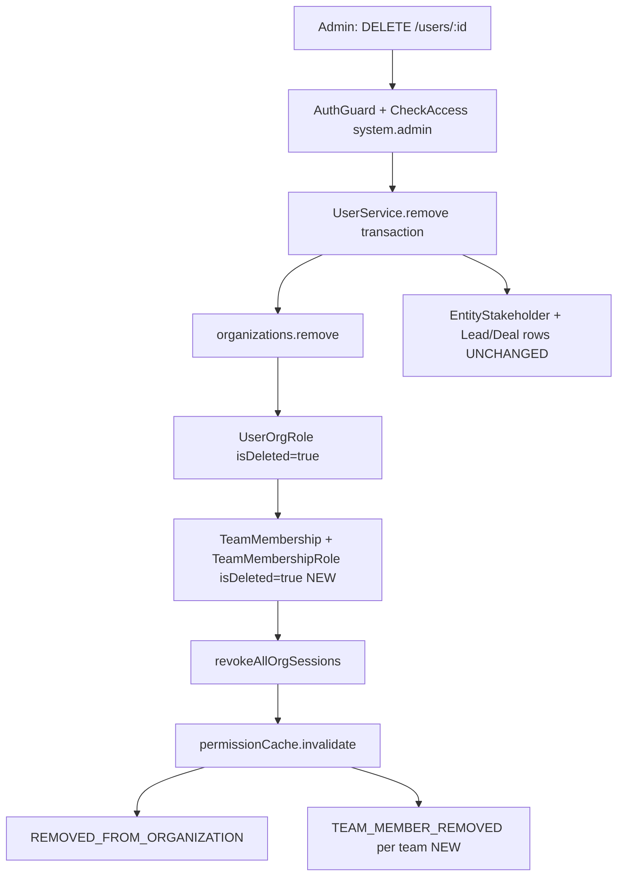

## Executive Summary

**Feature name:** Remove user from organization (org-scoped deactivation).

**User-facing label:** "Remove from organization" (not "Delete user account").

**Endpoint:** Existing `DELETE /v1/users/:id` → `UserService.remove()`
- Controller: `src/modules/user/user.controller.ts`
- Service: `src/modules/user/user.service.ts` (`remove()`, ~lines 864–1103)

<Note>
**Core principle (industry-aligned):** Deactivate **membership and access** in one org; **retain** CRM history (leads, deals, stakeholders, commissions, activities). Managers **manually reassign** stale assignments; UI shows a **badge** on users who are no longer active org members.
</Note>

<Warning>
**Critical architectural decision:** Do **not** set global `User.isDeleted` for org removal. `User` is global across orgs; `isDeleted` would remove the person everywhere and affect unique email constraints. Removal is expressed via **junction soft-deletes** (`UserOrgRole`, `TeamMembership`, `TeamMembershipRole`) and removing the user from the `organizations` M:N collection.
</Warning>



## Terminology

| Term | Meaning |
|------|---------|
| **Org removal** | User loses access to one organization; CRM rows stay. |
| **Global user delete** | `User.isDeleted = true` — **out of scope** for this feature. |
| **Active org member** | Has at least one non-deleted `UserOrgRole` for the org (authoritative; see `InvitationService` — source of truth is active `UserOrgRole`, not `User.organizations` alone). |
| **Removed org member** | No active `UserOrgRole` for org; may still appear on historical CRM data. |

## Goals

<Tabs>
  <Tab title="Primary Goals">
    1. **Access cut-off:** Removed user cannot use org-scoped APIs or refresh org sessions for that tenant.
    2. **RBAC cleanup:** All org roles and team roles for that org are soft-deleted consistently.
    3. **Realtime/messaging cleanup:** Messaging listeners receive the same events as explicit team removal.
    4. **CRM preservation:** No auto-unassign from leads/deals; commission % and stakeholder rows remain until manual change.
    5. **Discoverability:** Historical UI shows name + **"Removed from org"** badge; pickers exclude removed users.
    6. **Re-invite path:** Invitation accept can restore membership (partially implemented today).
  </Tab>
  <Tab title="Non-Goals (v1)">
    - Global account deletion (`User.isDeleted`).
    - Auto-redistribution of leads, deals, distribution pools, or commission.
    - Bulk remove users API.
    - Admin "reassignment worklist" endpoint (optional Phase 4).
    - Blocking removal when user has pending `EntityTransfer` (document as future policy; v1 allows removal).
    - Anonymizing PII on `User` row.
  </Tab>
</Tabs>

## Current State vs Target State

### Already Implemented in `UserService.remove()`

<Check>
- Self-removal forbidden
- Admin/Owner hierarchy checks
- Last team leader per team check (uses active `TeamMembership`)
- `user.organizations.remove(org)`
- Soft-delete all active `UserOrgRole` for org
- Clear `selectedOrganization` if matching
- `sessionService.revokeAllOrgSessions`
- `permissionCache.invalidate`
- Post-commit `REMOVED_FROM_ORGANIZATION`
- Messaging cleanup via `messaging-cleanup.listener.ts` (org-level)
</Check>

### Gaps Closed (Implementation)

| Gap | Risk if Unfixed | Status |
|-----|-----------------|--------|
| `TeamMembership` / `TeamMembershipRole` **not** soft-deleted on org remove | Stale team rosters, permission cache edge cases, no `TEAM_MEMBER_REMOVED` per team | **Done (Phase 1)** — `TeamMembershipService.softDeleteTeamMembershipInTransaction` + `UserService.remove` loop |
| No `TEAM_MEMBER_REMOVED` events after org remove | `team-membership-removal.listener.ts` may not evict conversation rooms per team | **Done (Phase 1)** — post-commit emit per team |
| Removing `organizations.owner_id` user | Org left without owner account linkage | **Done (Phase 1)** — `ForbiddenException` in `UserService.remove` |
| No `isActiveOrgMember` on `UserDto` / display maps | Frontend cannot badge removed users on stakeholders/history | **Done (Phase 2)** |
| Swagger says "Soft deletes a user" | Misleading — should say "Removes from organization" | **Done (Phase 1)** |
| Dialog copy: "cannot be undone" | Misleading if re-invite is supported | Phase 3 |

### Stale Assignment Validation

<Info>
**Status:** Implemented

The system now provides visibility into stale assignments before user removal:

- `EntityStakeholderService.countStalePrimaryAssignmentsForUserInTransaction()` counts leads and deals where the user is the primary stakeholder
- Used by `GET /users/:id/stale-assignments` to show admins potential assignment conflicts
- Informational only - does not block removal, following the manual reassignment principle
- Tracked post-removal via `stakeholdersWithoutActiveUserOrgRoleCount` in the data integrity audit
</Info>

## API Contract

### Request Specification

<CodeGroup>
```http HTTP Request
DELETE /v1/users/:id
Authorization: Bearer <jwt-token>
X-Organization-ID: <org-id>
```

```typescript Type Definition
interface RemoveUserRequest {
  params: {
    id: string; // target user UUID
  };
}
```
</CodeGroup>

**Authentication:** JWT + org tenant context (`organizationId` on token)  
**Permission:** `OrgPermissionKey.SYSTEM_ADMIN` via `@CheckAccess` on controller  
**Body:** None  
**Path param:** `id` = target user UUID

### Response Specification

<Tabs>
  <Tab title="Success Response">
    **200 OK**
    ```json
    {
      "success": true
    }
    ```
  </Tab>
  <Tab title="Error Responses">
    **403 Forbidden**
    - Self-removal attempt
    - Admin removing Admin/Owner
    - Owner removing Owner
    
    **400 Bad Request**
    - Last team leader in a team (message includes team name)
    
    **404 Not Found**
    - Removing actor not in org
    - Target not found in org
  </Tab>
</Tabs>

<Tip>
**Swagger correction (Phase 1):** Updated `@ApiOperation` description from "Soft deletes a user" to "Removes user from the current organization; retains global account and CRM history."
</Tip>

## Authorization Matrix

| Actor | Target | Allowed? | Notes |
|-------|--------|----------|-------|
| Any user | Self | **No** | `ForbiddenException` |
| Admin (not Owner, not `org.owner`) | Admin or Owner | **No** | Insufficient permissions |
| Admin | Non-admin, non-owner | **Yes** | Standard removal |
| Owner role (not `org.owner`) | Another Owner | **No** | Peer restriction |
| `organization.owner_id` | Anyone except self | **Yes** | Subject to team-leader rule |
| User without `system.admin` | Anyone | **No** | Guard blocked |

<Warning>
**Team leader rule:** If target holds `team.admin` on a team and no other active member on that team holds `team.admin`, removal is **blocked** with `BadRequestException` (already implemented using loaded `teamMemberships`).
</Warning>

## Transaction Specification

All steps run in **one** MikroORM transaction (existing pattern). Order matters for validations before mutations.

<Steps>
  <Step title="Load Actors">
    Load `deletedByUser`, `user` (target) with `organizations`, `orgRoles`, `selectedOrganization`.
  </Step>
  
  <Step title="Validate">
    Check self-removal, role hierarchy, last team leader (on **active** memberships).
  </Step>
  
  <Step title="Load Team Memberships">
    Load `TeamMembership` where `user`, `organization`, `isDeleted: false`, populate `team`, `teamRoles`, `teamRoles.role.permissions`.
  </Step>
  
  <Step title="Mutate Org Link">
    Execute `user.organizations.remove(organizationToRemove)`.
  </Step>
  
  <Step title="Soft-Delete Org Roles">
    Set all `UserOrgRole` with `isDeleted: false` for user+org → `isDeleted = true`.
  </Step>
  
  <Step title="Soft-Delete Team Memberships (NEW)">
    For each membership from step 3:
    - For each `TeamMembershipRole` on membership: `isDeleted = true`
    - `membership.isDeleted = true`
    - Collect `{ teamId, teamName }` for post-commit events
  </Step>
  
  <Step title="Clear Selected Org">
    If `user.selectedOrganization.id === organizationId`, unset.
  </Step>
  
  <Step title="Revoke Sessions">
    Call `sessionService.revokeAllOrgSessions(id, organizationId)` inside transaction.
  </Step>
  
  <Step title="Flush Changes">
    Execute `em.flush()`.
  </Step>
  
  <Step title="Invalidate Cache">
    Call `permissionCache.invalidate(id, organizationId)`.
  </Step>
</Steps>

### Post-Transaction Events

<AccordionGroup>
  <Accordion title="REMOVED_FROM_ORGANIZATION">
    Existing event sent to removed user via configured notification channels.
  </Accordion>
  
  <Accordion title="TEAM_MEMBER_REMOVED (NEW)">
    For each team from step 6, emit like `TeamService.removeUserFromTeam`:
    - Skip if `deletedByUserId === id` (self — N/A for org remove)
    - Payload: `organizationId`, `userId`, `teamId`, `teamName`, `removedByName`
    - Wrap in try/catch per team (do not fail removal if event fails)
  </Accordion>
</AccordionGroup>

<Info>
**Implementation note:** Prefer **inline loop** in `UserService.remove()` reusing the same soft-delete lines as `removeMemberInTransaction` rather than calling `removeMemberInTransaction` per team (which re-runs hierarchy checks and throws `NotFoundException` if membership already processed).
</Info>

## Data Retention Matrix

| Entity / Data | On Org Removal | Rationale |
|---------------|----------------|-----------|
| `User` row | **Unchanged** (`isDeleted` stays false) | Global identity; other orgs unaffected |
| `organizations` M:N | **Removed** | User no longer listed in org staff |
| `organization_users` profile row | **Likely retained** (publicId/avatar colors) | Used for display maps; historical references |
| `UserOrgRole` | **Soft-deleted** | Authoritative org membership |
| `TeamMembership` | **Soft-deleted (NEW)** | Parity with team removal |
| `TeamMembershipRole` | **Soft-deleted (NEW)** | Parity with team removal |
| `EntityStakeholder` | **Unchanged** | Manual reassignment; commission preserved |
| `Lead` / `Deal` / `Contact` / `Company` | **Unchanged** | Business history |
| `entity_transfer` pending | **Unchanged (v1)** | Managers resolve manually |
| `Session` (org-scoped) | **Revoked** | Security |
| `Invitation` pending | **Unchanged** | Separate flows |
| Audit `audit_log` | **New rows via triggers** on junction updates | Automatic |

## Side Effects by Subsystem

### Sessions

<CardGroup cols={1}>
  <Card title="Session Management" icon="key">
    - All org sessions for target revoked immediately
    - If removed user had this org selected, `selectedOrganization` cleared
    - Next login forces org picker without that org
  </Card>
</CardGroup>

### Notifications

<Tabs>
  <Tab title="REMOVED_FROM_ORGANIZATION">
    In-app (+ configured channels) to removed user; registry entry exists.
  </Tab>
  <Tab title="TEAM_MEMBER_REMOVED (NEW)">
    Per team; drives notification + WebSocket `team-membership-changed` via `rbac-event.listener.ts`.
  </Tab>
</Tabs>

### Messaging

Org removal triggers `src/modules/messaging/listeners/messaging-cleanup.listener.ts` on `REMOVED_FROM_ORGANIZATION` event for proper cleanup of messaging-related data and subscriptions.

## Related Documentation

<CardGroup cols={2}>
  <Card title="RBAC System Specification" href="/backend/rbac/rbac-system-specification">
    Core RBAC implementation details
  </Card>
  <Card title="Stakeholder System" href="/backend/stakeholder/stakeholder-system">
    Entity assignment and stakeholder management
  </Card>
  <Card title="Session System Documentation" href="/backend/auth/session-system-documentation">
    Session management and revocation
  </Card>
  <Card title="Soft Delete Filter Standard" href="/backend/standards/soft-delete-filter-standard">
    Soft deletion patterns and implementations
  </Card>
</CardGroup>