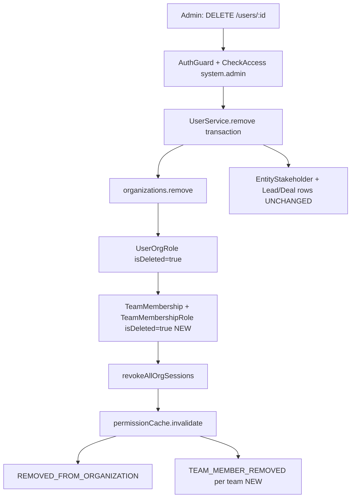

<Note>
**Status:** Phases 1–5 implemented (backend, API badge, frontend UX, optional enhancements, docs + E2E)  
**Related docs:** RBAC System Specification, Stakeholder System, Session System Documentation, Messaging Module Specification, Soft Delete Filter Standard
</Note>

## Executive summary

**Feature name:** Remove user from organization (org-scoped deactivation).

**User-facing label:** "Remove from organization" (not "Delete user account").

**Endpoint:** Existing `DELETE /v1/users/:id` → `UserService.remove()`  
- Controller: `src/modules/user/user.controller.ts`  
- Service: `src/modules/user/user.service.ts` (`remove()`, ~lines 864–1103)

<Info>
**Core principle (industry-aligned):** Deactivate **membership and access** in one org; **retain** CRM history (leads, deals, stakeholders, commissions, activities). Managers **manually reassign** stale assignments; UI shows a **badge** on users who are no longer active org members.
</Info>

<Warning>
**Critical architectural decision:** Do **not** set global `User.isDeleted` for org removal. `User` is global across orgs; `isDeleted` would remove the person everywhere and affect unique email constraints. Removal is expressed via **junction soft-deletes** (`UserOrgRole`, `TeamMembership`, `TeamMembershipRole`) and removing the user from the `organizations` M:N collection.
</Warning>



## Terminology

<AccordionGroup>
<Accordion title="Key terms and definitions">

| Term | Meaning |
|------|---------|
| **Org removal** | User loses access to one organization; CRM rows stay. |
| **Global user delete** | `User.isDeleted = true` — **out of scope** for this feature. |
| **Active org member** | Has at least one non-deleted `UserOrgRole` for the org (authoritative; see `InvitationService` — source of truth is active `UserOrgRole`, not `User.organizations` alone). |
| **Removed org member** | No active `UserOrgRole` for org; may still appear on historical CRM data. |

</Accordion>
</AccordionGroup>

## Goals

<Check>
**Access cut-off:** Removed user cannot use org-scoped APIs or refresh org sessions for that tenant.
</Check>

<Check>
**RBAC cleanup:** All org roles and team roles for that org are soft-deleted consistently.
</Check>

<Check>
**Realtime/messaging cleanup:** Messaging listeners receive the same events as explicit team removal.
</Check>

<Check>
**CRM preservation:** No auto-unassign from leads/deals; commission % and stakeholder rows remain until manual change.
</Check>

<Check>
**Discoverability:** Historical UI shows name + **"Removed from org"** badge; pickers exclude removed users.
</Check>

<Check>
**Re-invite path:** Invitation accept can restore membership (partially implemented today).
</Check>

## Non-goals (v1)

<Warning>
The following items are explicitly out of scope for the initial version:
</Warning>

- Global account deletion (`User.isDeleted`)
- Auto-redistribution of leads, deals, distribution pools, or commission
- Bulk remove users API
- Admin "reassignment worklist" endpoint (optional Phase 4)
- Blocking removal when user has pending `EntityTransfer` (document as future policy; v1 allows removal)
- Anonymizing PII on `User` row

## Current state vs target state

### Already implemented in `UserService.remove()`

| Step | Status |
|------|--------|
| Self-removal forbidden | ✅ Done |
| Admin/Owner hierarchy checks | ✅ Done |
| Last team leader per team check | ✅ Done (uses active `TeamMembership`) |
| `user.organizations.remove(org)` | ✅ Done |
| Soft-delete all active `UserOrgRole` for org | ✅ Done |
| Clear `selectedOrganization` if matching | ✅ Done |
| `sessionService.revokeAllOrgSessions` | ✅ Done |
| `permissionCache.invalidate` | ✅ Done |
| Post-commit `REMOVED_FROM_ORGANIZATION` | ✅ Done |
| Messaging cleanup via `messaging-cleanup.listener.ts` | ✅ Done (org-level) |

### Gaps closed

| Gap | Risk if unfixed | Status |
|-----|-----------------|--------|
| `TeamMembership` / `TeamMembershipRole` **not** soft-deleted on org remove | Stale team rosters, permission cache edge cases, no `TEAM_MEMBER_REMOVED` per team | ✅ **Done (Phase 1)** — `TeamMembershipService.softDeleteTeamMembershipInTransaction` + `UserService.remove` loop |
| No `TEAM_MEMBER_REMOVED` events after org remove | `team-membership-removal.listener.ts` may not evict conversation rooms per team | ✅ **Done (Phase 1)** — post-commit emit per team |
| Removing `organizations.owner_id` user | Org left without owner account linkage | ✅ **Done (Phase 1)** — `ForbiddenException` in `UserService.remove` |
| No `isActiveOrgMember` on `UserDto` / display maps | Frontend cannot badge removed users on stakeholders/history | ✅ **Done (Phase 2)** |
| Swagger says "Soft deletes a user" | Misleading — should say "Removes from organization" | ✅ **Done (Phase 1)** |

<Tip>
**Reuse pattern:** Team soft-delete logic already exists in `TeamMembershipService.removeMemberInTransaction()` (`src/modules/rbac/team-membership/team-membership.service.ts`, ~lines 672–678): soft-delete all `teamRoles`, then `membership.isDeleted = true`.
</Tip>

### Phase 4.3: Stale assignment validation

<Info>
**Status:** Implemented

The system now provides visibility into stale assignments before user removal:
- `EntityStakeholderService.countStalePrimaryAssignmentsForUserInTransaction()` counts leads and deals where the user is the primary stakeholder
- Used by `GET /users/:id/stale-assignments` to show admins potential assignment conflicts
- Informational only - does not block removal, following the manual reassignment principle
- Tracked post-removal via `stakeholdersWithoutActiveUserOrgRoleCount` in the data integrity audit
</Info>

## API contract

### Request

<CodeGroup>
```http HTTP
DELETE /v1/users/:id
Authorization: Bearer <jwt_token>
Content-Type: application/json
```
</CodeGroup>

**Auth:** JWT + org tenant context (`organizationId` on token)  
**Permission:** `OrgPermissionKey.SYSTEM_ADMIN` via `@CheckAccess` on controller  
**Body:** none  
**Path param:** `id` = target user UUID

### Response

<Tabs>
<Tab title="Success">
```json
{
  "success": true
}
```
**Status:** 200
</Tab>

<Tab title="Forbidden">
```json
{
  "statusCode": 403,
  "message": "Cannot remove yourself from organization"
}
```
**Status:** 403  
**Cases:** Self-removal; Admin removing Admin/Owner; Owner removing Owner
</Tab>

<Tab title="Bad Request">
```json
{
  "statusCode": 400,
  "message": "Cannot remove user: they are the last team leader in team 'Engineering'"
}
```
**Status:** 400  
**Case:** Last team leader in a team
</Tab>

<Tab title="Not Found">
```json
{
  "statusCode": 404,
  "message": "User not found in organization"
}
```
**Status:** 404  
**Cases:** Removing actor not in org; or target not found in org
</Tab>
</Tabs>

### Swagger correction (Phase 1)

<Note>
Update `@ApiOperation` description from "Soft deletes a user" to "Removes user from the current organization; retains global account and CRM history."
</Note>

## Authorization matrix

| Actor | Target | Allowed? |
|-------|--------|----------|
| Any user | Self | **No** (`ForbiddenException`) |
| Admin (not Owner, not `org.owner`) | Admin or Owner | **No** |
| Admin | Non-admin, non-owner | **Yes** |
| Owner role (not `org.owner`) | Another Owner | **No** |
| `organization.owner_id` | Anyone except self | **Yes** (subject to team-leader rule) |
| User without `system.admin` | Anyone | **No** (guard) |

<Warning>
**Team leader rule:** If target holds `team.admin` on a team and no other active member on that team holds `team.admin`, removal is **blocked** with `BadRequestException` (already implemented using loaded `teamMemberships`).
</Warning>

## Transaction specification

<Info>
All steps run in **one** MikroORM transaction (existing pattern). Order matters for validations before mutations.
</Info>

### Step-by-step implementation

<Steps>
<Step title="Load actors">
Load `deletedByUser`, `user` (target) with `organizations`, `orgRoles`, `selectedOrganization`.
</Step>

<Step title="Validate removal">
Check self-removal, role hierarchy, last team leader (on **active** memberships).
</Step>

<Step title="Load team memberships">
Load `TeamMembership` where `user`, `organization`, `isDeleted: false`, populate `team`, `teamRoles`, `teamRoles.role.permissions`.
</Step>

<Step title="Mutate org link">
Execute `user.organizations.remove(organizationToRemove)`.
</Step>

<Step title="Soft-delete org roles">
Set all `UserOrgRole` with `isDeleted: false` for user+org → `isDeleted = true`.
</Step>

<Step title="Soft-delete team memberships (NEW)">
For each membership from step 3:
- For each `TeamMembershipRole` on membership: `isDeleted = true`
- `membership.isDeleted = true`
- Collect `{ teamId, teamName }` for post-commit events
</Step>

<Step title="Clear selected org">
If `user.selectedOrganization.id === organizationId`, unset.
</Step>

<Step title="Revoke sessions">
Execute `sessionService.revokeAllOrgSessions(id, organizationId)` inside transaction.
</Step>

<Step title="Flush and invalidate">
- `em.flush()`
- `permissionCache.invalidate(id, organizationId)`
</Step>
</Steps>

### Post-transaction events

<Steps>
<Step title="REMOVED_FROM_ORGANIZATION">
Emit existing event to removed user.
</Step>

<Step title="TEAM_MEMBER_REMOVED (NEW)">
For each team from step 6, emit like `TeamService.removeUserFromTeam`:
- Skip if `deletedByUserId === id` (self — N/A for org remove)
- Payload: `organizationId`, `userId`, `teamId`, `teamName`, `removedByName`
- Wrap in try/catch per team (do not fail removal if event fails)
</Step>
</Steps>

<Tip>
**Implementation note:** Prefer **inline loop** in `UserService.remove()` reusing the same soft-delete lines as `removeMemberInTransaction` rather than calling `removeMemberInTransaction` per team (which re-runs hierarchy checks and throws `NotFoundException` if membership already processed).
</Tip>

## Data retention matrix

| Entity / data | On org removal | Rationale |
|---------------|----------------|-----------|
| `User` row | **Unchanged** (`isDeleted` stays false) | Global identity; other orgs unaffected |
| `organizations` M:N | **Removed** | User no longer listed in org staff |
| `organization_users` profile row | **Likely retained** (publicId/avatar colors) | Used for display maps; historical references |
| `UserOrgRole` | **Soft-deleted** | Authoritative org membership |
| `TeamMembership` | **Soft-deleted (NEW)** | Parity with team removal |
| `TeamMembershipRole` | **Soft-deleted (NEW)** | Parity with team removal |
| `EntityStakeholder` | **Unchanged** | Manual reassignment; commission preserved |
| `Lead` / `Deal` / `Contact` / `Company` | **Unchanged** | Business history |
| `entity_transfer` pending | **Unchanged (v1)** | Managers resolve manually |
| `Session` (org-scoped) | **Revoked** | Security |
| `Invitation` pending | **Unchanged** | Separate flows |
| Audit `audit_log` | **New rows via triggers** on junction updates | Automatic |

## Side effects by subsystem

### Sessions

<Info>
See Session System Documentation for complete details.
</Info>

- All org sessions for target revoked immediately
- If removed user had this org selected, `selectedOrganization` cleared — next login forces org picker without that org

### Notifications

- **`REMOVED_FROM_ORGANIZATION`** — in-app (+ configured channels) to removed user; registry entry exists
- **`TEAM_MEMBER_REMOVED` (NEW)** — per team; drives notification + WebSocket `team-membership-changed` via `rbac-event.listener.ts`

### Messaging

<Info>
See Messaging Module Specification for complete details.
</Info>

Org removal: `src/modules/messaging/listeners/messaging-cleanup.listener.ts` on `REMOVED_FROM_ORGANIZATION` handles cleanup automatically.