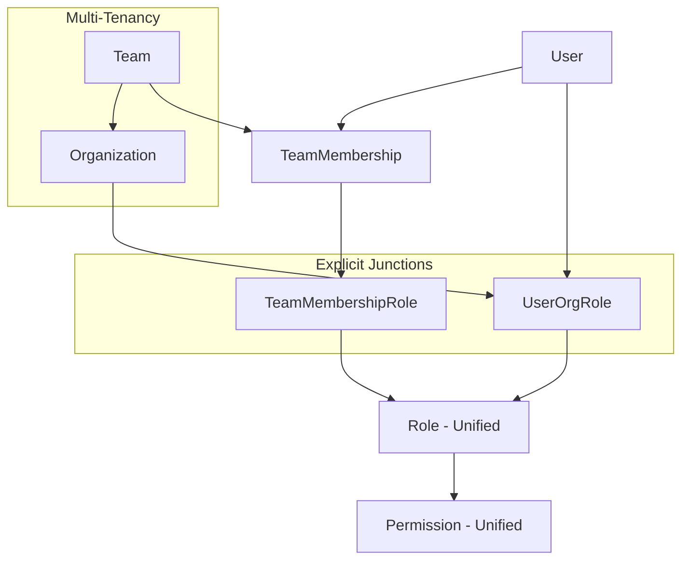

The RBAC (Role-Based Access Control) system provides comprehensive access control for multi-tenant applications with organization and team-level permissions.

## Architecture overview

### Design principles

The RBAC system follows these core principles:

<Steps>
<Step title="Unified Role & Permission System">
Single `Role` table for both org-level and team-level roles with `scope` field differentiation (ORG | TEAM). Single `Permission` table for all permissions with unified scope handling.
</Step>
<Step title="System vs Custom Roles">
System roles have `organization = NULL` (global/seeded) while custom roles have specific org IDs. System roles: Owner, Admin, Basic, Team Leader, Agent, AI Service.
</Step>
<Step title="Explicit Junction Tables">
`UserOrgRole` and `TeamMembershipRole` tables enable multi-org support with metadata like `assigned_by`, `created_at`, and `organization_id` for RLS.
</Step>
<Step title="Multi-Tenancy Support">
Users can belong to multiple organizations with different roles per organization. Row-Level Security (RLS) enforced at database level.
</Step>
<Step title="Permission Inheritance">
Team roles can have both TEAM-scoped and ORG-scoped permissions. Team-available permissions controlled via `team_available_permissions`.
</Step>
</Steps>

### CRM directory visibility reference

CRM picker endpoints use the same RBAC keys plus resource relationships to filter returned rows instead of rejecting the request. The detailed matrix for `GET /leads/directory`, `GET /deals/directory`, `GET /contacts/directory`, and `GET /companies/directory` lives in `Docs/CRM_DIRECTORY_ACCESS_MATRIX.md`.

### System architecture



## Core entities

### User

Represents a user account in the system with multi-organization support.

```typescript
User
├── id: uuid
├── first_name, last_name: string
├── email: string (globally unique among active users)
├── password: string (hashed)
├── phone_number?: string
├── avatar_url?: string (WebP on R2)
├── languages?: { code: string; proficiency: 'BASIC' | 'CONVERSATIONAL' | 'FLUENT' | 'NATIVE' }[] (JSONB)
├── is_verified: boolean
├── is_active: boolean
├── is_system_admin: boolean (platform-level admin)
├── is_ai_service_user: boolean (per-org AI agent service account; never logs in)
├── is_system_service_user: boolean (per-org System automation actor; never logs in)
├── is_deleted: boolean (soft delete)
├── selected_organization_id?: uuid → Organization
├── Auth Fields:
│   ├── refresh_token?: string
│   ├── token_version: number (default: 1)
│   ├── verification_code?: string
│   ├── verification_code_expires?: timestamp
│   ├── verification_email_attempts: number (default: 0)
│   ├── last_verification_email_sent_at?: timestamp
│   ├── reset_password_code?: string
│   └── reset_password_code_expires?: timestamp
├── Relationships:
│   ├── organizations → Organization[] (via organization_users)
│   ├── orgRoles → UserOrgRole[]
│   └── teamMemberships → TeamMembership[]
└── Timestamps: created_at, updated_at

Indexes:
├── (first_name, last_name) [composite]
└── (email, is_deleted) [unique, where: is_deleted = false]
```

<Note>
User public IDs and fallback avatar colors are org-scoped membership metadata stored on `organization_users`, not on the global `user` row. Email is globally unique among non-deleted users via unique index on `[email, is_deleted]` where `is_deleted = false`.
</Note>

#### Service accounts (non-human users)

Two flags mark per-org service accounts that are real `user` rows but never log in and are excluded from every user/member listing:

| Flag                     | Account                      | Role / RBAC footprint                                                | Purpose                                                                                                                                       | Synthetic email                    |
| ------------------------ | ---------------------------- | ------------------------------------------------------------------- | --------------------------------------------------------------------------------------------------------------------------------------------- | ---------------------------------- |
| `is_ai_service_user`     | **AI agent service account** | Holds the `system.admin` `UserOrgRole` (the `AI Service` system role) | The actor ORGANIZATION-scope AI agents act as                                                                                                | `ai-user+<orgId>@propwise.com`     |
| `is_system_service_user` | **System automation actor**  | **None** — no role, no RBAC footprint                                | The actor for system processes (webhooks, integrations, CRON jobs) that need to be traceable as an identifiable user but without permissions | `system+<orgId>@propwise.com`      |

### Organization

Represents a tenant organization serving as the tenant boundary for multi-tenancy.

```typescript
Organization
├── id: uuid
├── name: string
├── website?: string
├── email?: string
├── phone?: string (workspace / public contact phone)
├── vat?: string
├── avatar_url?: string (WebP on R2)
├── settings?: jsonb (org-level config)
├── address?: jsonb (embedded Address object)
├── owner_id: uuid → User
├── Relationships:
│   ├── users → User[] (ManyToMany, owner side, via organization_users)
│   ├── owner → User
│   ├── leads → Lead[]
│   ├── contacts → Contact[]
│   ├── deals → Deal[]
│   └── companies → Company[]
└── Timestamps: created_at, updated_at, is_deleted
```

**`settings` JSONB keys** (camelCase in API):

| Key | Type | Purpose |
| --- | --- | --- |
| `businessHours` | `{ enabled, timezone, schedule[] }` | Org business-hours config for distribution/escalation |
| `defaultAiMode` | `string` | Default AI configuration |
| `leadDistributionRules` | `object` | Lead assignment and distribution logic |
| `customFields` | `object` | Organization-specific field definitions |

<Warning>
Each organization has exactly one owner who is automatically assigned the "Owner" role on creation.
</Warning>

### Role (Unified)

Unified table for both org-level and team-level roles with scope differentiation.

```typescript
Role
├── id: uuid
├── name: string
├── description?: string
├── color?: string
├── scope: RoleScope (ORG | TEAM)
├── is_system: boolean (true for seeded roles)
├── organization_id?: uuid → Organization (NULL for system roles)
├── team_id?: uuid → Team (NULL for org roles)
├── Relationships:
│   ├── permissions → Permission[] (via role_permissions)
│   ├── userOrgRoles → UserOrgRole[]
│   └── teamMembershipRoles → TeamMembershipRole[]
└── Timestamps: created_at, updated_at, is_deleted

Indexes:
├── (name, organization_id, scope) [unique]
└── (is_system, organization_id) [composite]
```

### Permission

Atomic units of access control representing specific capabilities within functional domains.

```typescript
Permission
├── id: uuid
├── key: string (e.g., 'crm.view', 'team_crm.manage')
├── name: string (display name)
├── description?: string
├── group: string (e.g., 'CRM', 'Sales', 'System', 'TeamCRM')
├── scope: PermissionScope (ORG | TEAM)
├── Flags:
│   ├── is_system_sensitive: boolean (only Owner can use)
│   ├── has_admin_access: boolean (requires admin/leadership)
│   └── has_write_access: boolean (modify vs read-only)
├── Relationships:
│   └── roles → Role[] (ManyToMany, inverse side)
└── Timestamps: created_at, updated_at, is_deleted

Indexes:
└── (key, scope, is_deleted) [unique, where: is_deleted = false]
```

<Info>
Permissions are NOT organization-specific (global registry). The `key` is unique per scope. System-sensitive permissions like `system.owner` can only be assigned to the Owner role.
</Info>

### Team

Represents a team within an organization with hierarchical structure support.

```typescript
Team
├── id: uuid
├── name: string
├── description?: string
├── avatar_url?: string
├── organization_id: uuid → Organization
├── team_lead_id?: uuid → User
├── parent_team_id?: uuid → Team (hierarchical)
├── available_permissions: Permission[] (ORG permissions available to team roles)
├── Relationships:
│   ├── memberships → TeamMembership[]
│   ├── teamLead → User
│   ├── parentTeam → Team
│   └── childTeams → Team[]
└── Timestamps: created_at, updated_at, is_deleted
```

### TeamMembership

Represents a user's membership in a team.

```typescript
TeamMembership
├── id: uuid
├── user_id: uuid → User
├── team_id: uuid → Team
├── organization_id: uuid → Organization (for RLS)
├── joined_at?: timestamp
├── Relationships:
│   ├── user → User
│   ├── team → Team
│   └── teamMembershipRoles → TeamMembershipRole[]
└── Timestamps: created_at, updated_at, is_deleted

Indexes:
├── (user_id, team_id) [unique, where: is_deleted = false]
└── (team_id, organization_id) [composite]
```

## Explicit junction tables

### UserOrgRole

Explicit junction table for user-role assignments in organization context.

```typescript
UserOrgRole
├── id: uuid
├── user_id: uuid → User
├── role_id: uuid → Role
├── organization_id: uuid → Organization
├── assigned_by_id?: uuid → User
├── assigned_at?: timestamp
├── Metadata:
│   ├── notes?: string
│   └── expires_at?: timestamp
└── Timestamps: created_at, updated_at, is_deleted

Indexes:
├── (user_id, organization_id, role_id) [unique, where: is_deleted = false]
└── (organization_id, user_id) [composite]
```

<Note>
Required for multi-org support where users can have different roles in different organizations, includes metadata for audit trails and RLS enforcement.
</Note>

### TeamMembershipRole

Explicit junction table for team membership role assignments.

```typescript
TeamMembershipRole
├── id: uuid
├── team_membership_id: uuid → TeamMembership
├── role_id: uuid → Role
├── organization_id: uuid → Organization (for RLS)
├── assigned_by_id?: uuid → User
├── assigned_at?: timestamp
└── Timestamps: created_at, updated_at, is_deleted

Indexes:
├── (team_membership_id, role_id) [unique, where: is_deleted = false]
└── (organization_id, team_membership_id) [composite]
```

## Permission resolution

Permission resolution follows a structured algorithm to determine effective access rights across organization and team contexts.

### Resolution algorithm

<Steps>
<Step title="Organization Context">
Retrieve all user's organization roles via `UserOrgRole` for the specified organization.
</Step>
<Step title="Team Context">
Retrieve all user's team memberships and associated team roles via `TeamMembershipRole`.
</Step>
<Step title="Permission Aggregation">
Collect all permissions from both organization and team roles, respecting scope rules.
</Step>
<Step title="Resource Ownership">
Apply resource ownership and creator context for additional access rights.
</Step>
</Steps>

### Permission check patterns

<CodeGroup>
```typescript hasPermission
async function hasPermission(
  userId: string,
  permissionKey: string,
  resourceOwnerId?: string,
  resourceCreatorId?: string,
  organizationId?: string,
): Promise<PermissionCheckResult> {
  // 1. Check permission-based access
  const hasRolePermission = await checkRolePermission(userId, permissionKey, organizationId);
  
  // 2. Check resource ownership/creator context
  const hasResourceAccess = checkResourceAccess(userId, resourceOwnerId, resourceCreatorId);
  
  return {
    hasAccess: hasRolePermission || hasResourceAccess,
    reason: determineAccessReason(hasRolePermission, hasResourceAccess)
  };
}
```

```typescript getUserEffectivePermissions
async function getUserEffectivePermissions(
  userId: string,
  organizationId?: string,
): Promise<EffectivePermissions> {
  const orgPermissions = await getOrgPermissions(userId, organizationId);
  const teamPermissions = await getTeamPermissions(userId, organizationId);
  
  return {
    orgPermissions: [...orgPermissions],
    teamPermissions: [...teamPermissions],
    allPermissions: [...new Set([...orgPermissions, ...teamPermissions])]
  };
}
```

```typescript hasTeamPermission
async function hasTeamPermission(
  userId: string,
  teamId: string,
  permissionKey: string,
): Promise<boolean> {
  const membership = await em.findOne(
    TeamMembership,
    { user: userId, team: teamId, isDeleted: false },
    { populate: ['teamMembershipRoles.role.permissions'] },
  );
  
  if (!membership) return false;
  
  return membership.teamMembershipRoles
    .getItems()
    .some(tmr => 
      tmr.role.permissions
        .getItems()
        .some(p => p.key === permissionKey)
    );
}
```
</CodeGroup>

## System roles

The system provides 6 predefined system roles with specific permission sets:

<Tabs>
<Tab title="Organization Roles">
| Role | Scope | Permissions | Description |
| --- | --- | --- | --- |
| **Owner** | ORG | All permissions including `system.owner` | Organization owner with full control |
| **Admin** | ORG | All except `system.owner` | Administrative access without ownership |
| **Basic** | ORG | Basic view permissions | Standard user access |
| **AI Service** | ORG | `system.admin` | AI agent service account |
</Tab>
<Tab title="Team Roles">
| Role | Scope | Permissions | Description |
| --- | --- | --- | --- |
| **Team Leader** | TEAM | `team.admin` + domain management | Team leadership with admin access |
| **Agent** | TEAM | Basic team permissions | Standard team member access |
</Tab>
</Tabs>

<Warning>
System roles have `organization = NULL` and cannot be modified. Custom roles are organization-specific.
</Warning>

### System role definitions

Each system role has a specific set of permissions based on their intended access level:

<Tabs>
<Tab title="Owner Role">
**Permission Set**: All permissions including system-sensitive ones
```typescript
{
  permissions: [
    'crm.view', 'crm.manage', 
    'sales.view', 'sales.manage',
    'real_estate.manage', 'marketing.manage',
    'system.admin', 'system.owner'  // includes system-sensitive
  ],
  systemSensitive: true,
  adminAccess: true
}
```
</Tab>
<Tab title="Admin Role">
**Permission Set**: All permissions except system-sensitive
```typescript
{
  permissions: [
    'crm.view', 'crm.manage',
    'sales.view', 'sales.manage', 
    'real_estate.manage', 'marketing.manage',
    'system.admin'  // excludes system.owner
  ],
  adminAccess: true
}
```
</Tab>
<Tab title="Basic Role">
**Permission Set**: Basic view permissions
```typescript
{
  permissions: [
    'crm.view', 'sales.view'
  ],
  standardAccess: true
}
```
</Tab>
<Tab title="AI Service Role">
**Permission Set**: AI service permissions
```typescript
{
  permissions: [
    'system.admin'  // AI agent service account
  ],
  serviceAccount: true
}
```
</Tab>
<Tab title="Team Leader Role">
**Permission Set**: Team admin with domain permissions
```typescript
{
  permissions: [
    'team.admin', 'team_crm.view', 'team_crm.manage',
    'team_sales.view', 'team_sales.manage',
    'team_transfer.manage', 'team_report.view'
  ],
  teamAdmin: true
}
```
</Tab>
<Tab title="Agent Role">
**Permission Set**: Basic team member permissions
```typescript
{
  permissions: [
    'team_crm.view', 'team_sales.view', 'team_report.view'
  ],
  teamMember: true
}
```
</Tab>
</Tabs>

## Invitation system

The invitation system enables secure onboarding of new users with predefined role and team assignments.

### Invitation workflow

<Steps>
<Step title="Create Invitation">
Admin/Owner creates invitation with email, roles, and optional team assignments.
</Step>
<Step title="Send Email">
System sends invitation email with secure token and expiration.
</Step>
<Step title="Accept Invitation">
User clicks link, creates account (if new), and accepts invitation.
</Step>
<Step title="Role Assignment">
System automatically assigns specified roles and team memberships.
</Step>
</Steps>

### UserInvitation entity

```typescript
UserInvitation
├── id: uuid
├── email: string
├── token: string (secure, expires)
├── expires_at: timestamp
├── status: InvitationStatus (PENDING | ACCEPTED | EXPIRED | REVOKED)
├── organization_id: uuid → Organization
├── invited_by_id: uuid → User
├── accepted_by_id?: uuid → User
├── role_assignments: InvitationRoleAssignment[]
├── team_assignments: InvitationTeamAssignment[]
└── Timestamps: created_at, updated_at, accepted_at

Indexes:
├── (email, organization_id, status) [composite]
└── (token) [unique]
```

### Supporting entities

```typescript
InvitationRoleAssignment
├── id: uuid
├── invitation_id: uuid → UserInvitation
├── role_id: uuid → Role
├── organization_id: uuid → Organization (for RLS)
└── Timestamps: created_at, updated_at

InvitationTeamAssignment
├── id: uuid
├── invitation_id: uuid → UserInvitation
├── team_id: uuid → Team
├── role_id?: uuid → Role (specific team role)
├── organization_id: uuid → Organization (for RLS)
└── Timestamps: created_at, updated_at
```

<Info>
Invitations expire automatically and can be revoked by administrators. Role and team assignments are applied atomically upon acceptance.
</Info>

### Invitation status lifecycle

<Tabs>
<Tab title="Status Flow">
| Status | Description | Transitions |
| --- | --- | --- |
| `PENDING` | Initial state after creation | → ACCEPTED, EXPIRED, REVOKED |
| `ACCEPTED` | User successfully accepted invitation | Terminal state |
| `EXPIRED` | Invitation passed expiration date | Terminal state |
| `REVOKED` | Admin manually revoked invitation | Terminal state |
</Tab>
<Tab title="Business Rules">
- Invitations expire after 7 days by default
- Only one pending invitation per email per organization
- Expired invitations can be recreated with new token
- Revoked invitations require admin approval to resend
- Role assignments validated on creation and acceptance
</Tab>
</Tabs>

## Query patterns

### Common permission queries

<CodeGroup>
```typescript Organization Users with Roles
const usersWithRoles = await em.find(
  User,
  { organizations: { id: organizationId } },
  {
    populate: [
      'orgRoles.role',
      'orgRoles.role.permissions',
      'teamMemberships.team',
      'teamMemberships.teamMembershipRoles.role'
    ]
  }
);
```

```typescript User's Team Permissions
const teamPermissions = await em.createQueryBuilder(Permission, 'p')
  .leftJoin('p.roles', 'r')
  .leftJoin('r.teamMembershipRoles', 'tmr')
  .leftJoin('tmr.teamMembership', 'tm')
  .where('tm.user = ? AND tm.team.organization = ?', [userId, orgId])
  .andWhere('r.scope = ?', [RoleScope.TEAM])
  .getResult();
```

```typescript Role Permission Matrix
const rolePermissionMatrix = await em.createQueryBuilder(Role, 'r')
  .leftJoinAndSelect('r.permissions', 'p')
  .where('r.organization = ? OR r.organization IS NULL', [orgId])
  .orderBy({ 'r.scope': 'ASC', 'r.name': 'ASC' })
  .getResult();
```

```typescript User Role Assignments
const userRoleAssignments = await em.find(
  UserOrgRole,
  { user: userId, organization: organizationId },
  {
    populate: ['role', 'role.permissions', 'assignedBy'],
    orderBy: { createdAt: 'DESC' }
  }
);
```

```typescript Team Member Roles
const teamMemberRoles = await em.find(
  TeamMembershipRole,
  { teamMembership: { team: teamId, user: userId } },
  {
    populate: ['role', 'role.permissions', 'assignedBy'],
    orderBy: { assignedAt: 'DESC' }
  }
);
```

```typescript Check User Permission
const hasPermission = await em.createQueryBuilder(Permission, 'p')
  .leftJoin('p.roles', 'r')
  .leftJoin('r.userOrgRoles', 'uor')
  .leftJoin('r.teamMembershipRoles', 'tmr')
  .leftJoin('tmr.teamMembership', 'tm')
  .where('p.key = ?', [permissionKey])
  .andWhere('(uor.user = ? AND uor.organization = ?) OR (tm.user = ? AND tm.team.organization = ?)', 
    [userId, orgId, userId, orgId])
  .getCount();

return hasPermission > 0;
```
</CodeGroup>

## Business rules

<AccordionGroup>
<Accordion title="Permission Scope Rules">
- **ORG permissions** can be assigned to both ORG and TEAM roles
- **TEAM permissions** can only be assigned to TEAM roles
- ORG permissions on TEAM roles must be in the team's `availablePermissions`
- System-sensitive permissions can only be assigned to Owner role
- Permission keys must be unique within their scope (ORG | TEAM)
</Accordion>
<Accordion title="System Role Rules">
- System roles cannot be modified or deleted (`isSystem = true`)
- Only Owner role can have `isSystemSensitive` permissions
- Admin role gets all permissions except `isSystemSensitive` ones
- Custom roles inherit from system role templates when created
- System roles are seeded automatically on organization creation
- System role permission updates affect all organizations globally
</Accordion>
<Accordion title="Multi-Organization Rules">
- Users can have different roles in different organizations
- Team memberships are organization-scoped via `organization_id`
- Permission checks always include organization context
- RLS ensures data isolation between organizations
- UserOrgRole assignments must match organization context
- Cross-organization data access is explicitly prohibited
</Accordion>
<Accordion title="Team Rules">
- Team roles can only be assigned within team membership context
- Team members can have multiple roles within the same team
- Team leader assignment creates automatic Team Leader role assignment
- Team permissions are additive with organization permissions
- Team hierarchy enables permission inheritance from parent teams
- Team available permissions limit which ORG permissions can be assigned to team roles
</Accordion>
<Accordion title="Invitation Rules">
- Invitations expire after 7 days by default (`expires_at`)
- Only admins/owners can send invitations (`hasAdminAccess` required)
- Role assignments in invitations must be valid for organization
- Team assignments must belong to the invitation organization
- Users can accept multiple invitations for different organizations
- One pending invitation per email per organization (unique constraint)
- Invitation tokens are cryptographically secure and single-use
</Accordion>
<Accordion title="Role Assignment Rules">
- Users cannot assign roles higher than their own
- Only owners can assign Owner role
- Role assignments require `system.admin` or higher permission
- Team role assignments require team membership or admin access
- Assignment metadata (`assigned_by`, `assigned_at`) is mandatory
- Bulk role assignments must be atomic (all succeed or all fail)
</Accordion>
<Accordion title="Remove user from organization">
When removing a user from an organization, the system must:

1. Remove all `UserOrgRole` assignments for the user in that organization
2. Remove all team memberships (`TeamMembership`) and associated `TeamMembershipRole` assignments
3. If the user is an organization owner, transfer ownership to another admin first
4. Clean up any pending invitations for the user in that organization
5. Update any resources where the user is assigned as owner/creator (optional reassignment)
</Accordion>
</AccordionGroup>

## Services & controllers

### Services

<AccordionGroup>
<Accordion title="PermissionService">
**Location:** `rbac/permission/permission.service.ts`

Core service for permission checks and resolution.

| Method | Signature | Description |
| --- | --- | --- |
| `hasPermission` | `(userId, permissionKey, resourceOwnerId?, resourceCreatorId?, organizationId?)` → `PermissionCheckResult` | Comprehensive permission check with resource context |
| `getUserEffectivePermissions` | `(userId, organizationId?)` → `EffectivePermissions` | Resolves all permissions for a user |
| `isAdmin` | `(userId, organizationId)` → `boolean` | Checks if user has admin access |
| `hasTeamPermission` | `(userId, teamId, permissionKey)` → `boolean` | Team-specific permission check |
| `checkRolePermission` | `(userId, permissionKey, organizationId?)` → `boolean` | Role-based permission validation |
| `getOrgPermissions` | `(userId, organizationId)` → `Permission[]` | Organization-level permissions |
| `getTeamPermissions` | `(userId, organizationId?)` → `Permission[]` | Team-level permissions |
| `canAssignRole` | `(assignerId, targetRoleId, organizationId)` → `boolean` | Validates role assignment permissions |
| `resolveResourceAccess` | `(userId, resourceOwnerId, resourceCreatorId)` → `boolean` | Resource ownership access check |
</Accordion>
<Accordion title="RoleService">
**Location:** `rbac/role/role.service.ts`

Manages role lifecycle and assignments.

| Method | Description |
| --- | --- |
| `createCustomRole(data)` | Creates organization-specific custom role |
| `assignRoleToUser(userId, roleId, orgId)` | Assigns role to user in organization context |
| `removeRoleFromUser(userId, roleId, orgId)` | Removes role assignment |
| `syncSystemRoles(organization)` | Syncs system roles for organization |
| `getUserRoles(userId, orgId)` | Gets all roles for user in organization |
| `updateCustomRole(roleId, data)` | Updates custom role properties |
| `deleteCustomRole(roleId)` | Soft deletes custom role |
| `validateRoleAssignment(assignerId, roleId, targetUserId)` | Validates assignment permissions |
| `getTeamRoles(teamId)` | Gets available roles for team |
| `assignTeamRole(membershipId, roleId)` | Assigns role to team membership |
</Accordion>
<Accordion title="InvitationService">
**Location:** `rbac/invitation/invitation.service.ts`

Handles invitation workflow and role assignments.

| Method | Description |
| --- | --- |
| `createInvitation(email, roles, teams)` | Creates new invitation with role/team assignments |
| `sendInvitationEmail(invitation)` | Sends invitation email with secure token |
| `acceptInvitation(token, userData?)` | Processes invitation acceptance |
| `revokeInvitation(invitationId)` | Revokes pending invitation |
| `resendInvitation(invitationId)` | Resends invitation email |
| `getOrganizationInvitations(orgId)` | Lists pending invitations for organization |
| `validateInvitationToken(token)` | Validates invitation token and expiration |
| `processInvitationAcceptance(invitation, user)` | Atomic role/team assignment on acceptance |
| `cleanupExpiredInvitations()` | Background task to clean expired invitations |
</Accordion>
<Accordion title="PermissionSeederService">
**Location:** `rbac/permission/permission-seeder.service.ts`

Manages permission and role seeding lifecycle.

| Method | Description |
| --- | --- |
| `seedOrganizationPermissions()` | Initial seed of permissions for organization |
| `syncGlobalPermissions(em)` | Syncs global permission registry |
| `updateGlobalPermissions()` | Triggers global permission update |
| `seedSystemRoles(organization)` | Seeds system roles for new organization |
| `updateSystemRolePermissions()` | Updates system role permission assignments |
| `validatePermissionDefinitions()` | Validates permission definition consistency |
| `migratePermissionChanges()` | Handles permission registry migrations |
</Accordion>
<Accordion title="TeamService">
**Location:** `rbac/team/team.service.ts`

Manages team operations and memberships.

| Method | Description |
| --- | --- |
| `createTeam(data, organizationId)` | Creates new team with hierarchy support |
| `addTeamMember(teamId, userId, roles?)` | Adds user to team with optional roles |
| `removeTeamMember(teamId, userId)` | Removes user from team |
| `updateTeamAvailablePermissions(teamId, permissions)` | Updates team's available ORG permissions |
| `getTeamHierarchy(organizationId)` | Returns complete team hierarchy |
| `transferTeamLead(teamId, newLeadId)` | Transfers team leadership |
| `validateTeamPermissions(teamId, roleId)` | Validates role can be assigned to team |
</Accordion>
</AccordionGroup>

### Controllers

**`/rbac`** — `rbac/rbac.controller.ts`

<Tabs>
<Tab title="Permissions">
| Method | Endpoint | Access | Description |
| --- | --- | --- | --- |
| GET | `/rbac/permissions/org` | Authenticated | Get all org-scoped permissions |
| GET | `/rbac/permissions/team` | Authenticated | Get all team-scoped permissions |
| GET | `/rbac/permissions/effective` | Authenticated | Get user's effective permissions |
| POST | `/rbac/permissions/check` | Authenticated | Check specific permission |
</Tab>
<Tab title="Roles">
| Method | Endpoint | Access | Description |
| --- | --- | --- | --- |
| GET | `/rbac/roles` | Admin | Get organization roles |
| POST | `/rbac/roles` | Admin | Create custom role |
| PUT | `/rbac/roles/:id` | Admin | Update custom role |
| DELETE | `/rbac/roles/:id` | Admin | Delete custom role |
| GET | `/rbac/roles/system` | Admin | Get system roles |
| POST | `/rbac/roles/sync-system` | Owner | Sync system roles |
</Tab>
<Tab title="User Roles">
| Method | Endpoint | Access | Description |
| --- | --- | --- | --- |
| POST | `/rbac/users/:id/roles` | Admin | Assign role to user |
| DELETE | `/rbac/users/:id/roles/:roleId` | Admin | Remove role from user |
| GET | `/rbac/users/:id/permissions` | Admin | Get user's effective permissions |
| GET | `/rbac/users/:id/roles` | Admin | Get user's roles |
| POST | `/rbac/users/:id/teams/:teamId/roles` | Admin/TeamLead | Assign team role |
</Tab>
<Tab title="Invitations">
| Method | Endpoint | Access | Description |
| --- | --- | --- | --- |
| POST | `/rbac/invitations` | Admin | Create invitation |
| GET | `/rbac/invitations` | Admin | List organization invitations |
| POST | `/rbac/invitations/:id/revoke` | Admin | Revoke invitation |
| POST | `/rbac/invitations/:id/resend` | Admin | Resend invitation |
| POST | `/rbac/accept-invitation` | Public | Accept invitation (with token) |
| GET | `/rbac/invitation/:token` | Public | Get invitation details |
</Tab>
<Tab title="System">
| Method | Endpoint | Access | Description |
| --- | --- | --- | --- |
| POST | `/rbac/reseed-permissions` | Owner | Reseed global permissions |
| GET | `/rbac/role-matrix` | Admin | Get role-permission matrix |
| GET | `/rbac/audit/assignments` | Admin | Get role assignment history |
| POST | `/rbac/validate-permissions` | SystemAdmin | Validate permission consistency |
</Tab>
</Tabs>

## RLS integration

Row-Level Security (RLS) ensures data isolation between organizations and enforces access controls at the database level.

### Row-level security patterns

<CodeGroup>
```sql Organization RLS
-- Users can only see data from organizations they belong to
CREATE POLICY user_organization_access ON leads
  FOR ALL TO authenticated_user
  USING (organization_id IN (
    SELECT organization_id FROM organization_users 
    WHERE user_id = current_user_id()
  ));
```

```sql Team RLS
-- Users can only see team data for teams they're members of
CREATE POLICY team_member_access ON team_leads
  FOR ALL TO authenticated_user
  USING (team_id IN (
    SELECT team_id FROM team_memberships 
    WHERE user_id = current_user_id() AND is_deleted = false
  ));
```

```sql Role-Based RLS
-- Additional restrictions based on user roles
CREATE POLICY admin_only_access ON sensitive_data
  FOR ALL TO authenticated_user
  USING (
    EXISTS (
      SELECT 1 FROM user_org_roles uor
      JOIN roles r ON uor.role_id = r.id
      WHERE uor.user_id = current_user_id()
      AND r.name IN ('Owner', 'Admin')
      AND uor.organization_id = organization_id
    )
  );
```

```sql Junction Table RLS
-- RLS on explicit junction tables
CREATE POLICY user_org_role_access ON user_org_roles
  FOR ALL TO authenticated_user
  USING (
    user_id = current_user_id() OR
    EXISTS (
      SELECT 1 FROM user_org_roles admin_uor
      JOIN roles admin_r ON admin_uor.role_id = admin_r.id
      WHERE admin_uor.user_id = current_user_id()
      AND admin_uor.organization_id = organization_id
      AND admin_r.name IN ('Owner', 'Admin')
    )
  );
```
</CodeGroup>

### RLS enforcement strategies

<Tabs>
<Tab title="Organization Level">
- **Entity Scope**: All organization-owned entities (Leads, Contacts, Deals, etc.)
- **Filter**: `organization_id IN (user's organizations)`
- **Implementation**: Automatic via entity relationships
- **Bypass**: System admins with `is_system_admin = true`
</Tab>
<Tab title="Team Level">
- **Entity Scope**: Team-specific data and assignments
- **Filter**: `team_id IN (user's team memberships)`
- **Implementation**: Via TeamMembership junction table
- **Bypass**: Organization admins for their org's teams
</Tab>
<Tab title="Role Level">
- **Entity Scope**: Role assignments and permission grants
- **Filter**: Based on user's admin permissions
- **Implementation**: Via role hierarchy checks
- **Bypass**: Owner role for complete organization access
</Tab>
<Tab title="Resource Level">
- **Entity Scope**: Individual records with ownership
- **Filter**: `created_by = user_id OR assigned_to = user_id`
- **Implementation**: Creator/assignee context in permission checks
- **Override**: Admin permissions supersede ownership
</Tab>
</Tabs>

## Permission registry

The system uses **domain-level coarse-grained permissions** rather than fine-grained per-entity permissions.

<Tabs>
<Tab title="Org-scoped">
| Key | Enum | Group | Name | Description | Flags |
| --- | --- | --- | --- | --- | --- |
| `crm.view` | `CRM_VIEW` | CRM | View | View leads, contacts, and companies | — |
| `crm.manage` | `CRM_MANAGE` | CRM | Manage | Manage leads, contacts, and companies | `hasWriteAccess` |
| `sales.view` | `SALES_VIEW` | Sales | View | View deals and commissions | — |
| `sales.manage` | `SALES_MANAGE` | Sales | Manage | Manage deals and commissions | `hasWriteAccess` |
| `real_estate.manage` | `REAL_ESTATE_MANAGE` | RealEstate | Manage | Manage real estate | `hasWriteAccess` |
| `marketing.manage` | `MARKETING_MANAGE` | Marketing | Manage | Manage marketing | — |
| `system.admin` | `SYSTEM_ADMIN` | System | Admin | Manage admin settings | `hasAdminAccess`, `hasWriteAccess` |
| `system.owner` | `SYSTEM_OWNER` | System | Owner | Manage owner settings | `hasAdminAccess`, `hasWriteAccess`, `isSystemSensitive` |
</Tab>
<Tab title="Team-scoped">
| Key | Enum | Group | Name | Description | Flags |
| --- | --- | --- | --- | --- | --- |
| `team_crm.view` | `TEAM_CRM_VIEW` | TeamCRM | View | View team leads, contacts, and companies | — |
| `team_crm.manage` | `TEAM_CRM_MANAGE` | TeamCRM | Manage | Manage team leads, contacts, and companies | `hasWriteAccess` |
| `team_sales.view` | `TEAM_SALES_VIEW` | TeamSales | View | View team deals and commissions | — |
| `team_sales.manage` | `TEAM_SALES_MANAGE` | TeamSales | Manage | Manage team deals and commissions | `hasWriteAccess` |
| `team.admin` | `TEAM_ADMIN` | Team | Admin | Full team administration | `hasAdminAccess`, `hasWriteAccess` |
| `team_transfer.manage` | `TEAM_TRANSFER_MANAGE` | TeamTransfer | Manage | Manage team transfers | `hasWriteAccess` |
| `team_report.view` | `TEAM_REPORT_VIEW` | TeamReport | View | View team reports | — |
</Tab>
<Tab title="Flags">
| Flag | Purpose |
| --- | --- |
| `isSystemSensitive` | Only Owner role can have this permission |
| `hasAdminAccess` | Requires admin/leadership access level |
| `hasWriteAccess` | Grants modification rights (vs read-only) |
</Tab>
</Tabs>

### Permission categories

- **CRM/TeamCRM**: Lead, contact, and company management
- **Sales/TeamSales**: Deal pipeline and commission tracking
- **RealEstate**: Property and listing management
- **Marketing**: Campaign and marketing tool management
- **System**: Organization administration and settings
- **Team**: Team-specific administration and management
- **TeamTransfer**: Cross-team resource transfer capabilities
- **TeamReport**: Team-specific reporting and analytics

<Info>
Source of truth: `src/modules/rbac/permission/permission-definitions.ts` and `src/modules/shared/permission-key.enum.ts`
</Info>

## Module structure & organization

```
src/modules/rbac/
├── permission/
│   ├── permission.entity.ts
│   ├── permission.service.ts
│   ├── permission-seeder.service.ts
│   ├── permission-definitions.ts
│   └── dto/
│       ├── permission-response.dto.ts
│       ├── effective-permissions.dto.ts
│       └── permission-check.dto.ts
├── role/
│   ├── role.entity.ts
│   ├── role.service.ts
│   ├── user-org-role.entity.ts
│   ├── team-membership-role.entity.ts
│   └── dto/
│       ├── create-role.dto.ts
│       ├── update-role.dto.ts
│       ├── assign-role.dto.ts
│       ├── role-response.dto.ts
│       └── role-assignment.dto.ts
├── invitation/
│   ├── invitation.entity.ts
│   ├── invitation.service.ts
│   ├── invitation-role-assignment.entity.ts
│   ├── invitation-team-assignment.entity.ts
│   └── dto/
│       ├── create-invitation.dto.ts
│       ├── accept-invitation.dto.ts
│       ├── invitation-response.dto.ts
│       └── invitation-assignment.dto.ts
├── team/
│   ├── team.entity.ts
│   ├── team.service.ts
│   ├── team-membership.entity.ts
│   └── dto/
│       ├── create-team.dto.ts
│       ├── update-team.dto.ts
│       ├── team-membership.dto.ts
│       └── team-response.dto.ts
├── access-control/
│   ├── decorators/
│   │   ├── require-permission.decorator.ts
│   │   ├── require-role.decorator.ts
│   │   ├── require-team-permission.decorator.ts
│   │   └── public.decorator.ts
│   ├── guards/
│   │   ├── permission.guard.ts
│   │   ├── role.guard.ts
│   │   ├── team-permission.guard.ts
│   │   └── organization.guard.ts
│   ├── interceptors/
│   │   ├── audit.interceptor.ts
│   │   ├── permission-cache.interceptor.ts
│   │   └── organization-context.interceptor.ts
│   └── pipes/
│       ├── organization-validation.pipe.ts
│       ├── role-validation.pipe.ts
│       └── team-validation.pipe.ts
├── rbac.controller.ts
├── rbac.module.ts
└── shared/
    ├── enums/
    │   ├── role-scope.enum.ts
    │   ├── permission-scope.enum.ts
    │   ├── invitation-status.enum.ts
    │   └── assignment-reason.enum.ts
    ├── interfaces/
    │   ├── permission-check-result.interface.ts
    │   ├── effective-permissions.interface.ts
    │   ├── rbac-context.interface.ts
    │   └── assignment-metadata.interface.ts
    ├── types/
    │   ├── role.types.ts
    │   ├── permission.types.ts
    │   ├── invitation.types.ts
    │   └── team.types.ts
    └── constants/
        ├── system-roles.constants.ts
        ├── permission-groups.constants.ts
        └── rbac.constants.ts
```

<CardGroup cols={2}>
<Card title="Access Control" icon="shield" href="/backend/rbac/access-control/overview">
  Endpoint-level security with decorators and guards.
</Card>
<Card title="Multi-tenancy" icon="building" href="/backend/rbac/multi-tenancy">
  Organization isolation and tenant management.
</Card>
<Card title="Team Management" icon="users" href="/backend/rbac/teams">
  Team hierarchies and role assignments.
</Card>
<Card title="API Reference" icon="code" href="/backend/rbac/api">
  Complete RBAC API documentation.
</Card>
</CardGroup>