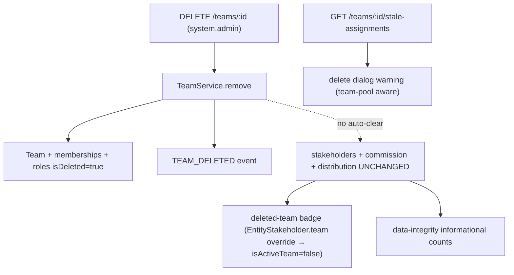

Authoritative spec for **team deletion** (`DELETE /teams/:id`) and the safety + visibility layers that bring it to parity with organization user removal.

<Note>
**Core model (unchanged):** team deletion **soft-deletes the RBAC/access layer** (team, memberships, membership-roles, custom team roles) and **retains all CRM data** (`entity_stakeholder`, `commission_payment`, distribution/escalation settings). There is **no auto-cleanup or auto-reassignment** — reassignment is manual. This spec adds a pre-delete hint, a delete-dialog warning, a deleted-team badge, and a data-integrity audit counter on top of that model.
</Note>

## What TeamService.remove() does

`TeamService.remove(teamId, organizationId, currentUserId)` runs inside `executeInOrg` and performs the following operations:

<Steps>
<Step title="Load team data">
Loads the team with `memberships`, `memberships.user`, `memberships.teamRoles`, `roles`.
</Step>

<Step title="Collect member information">
Collects active member IDs for notification purposes.
</Step>

<Step title="Soft-delete memberships">
Soft-deletes all team memberships + their roles via `TeamMembershipService.softDeleteAllMembershipsInTransaction`.
</Step>

<Step title="Soft-delete custom roles">
Soft-deletes all custom team roles (`role.isDeleted = true`).
</Step>

<Step title="Soft-delete team">
Soft-deletes the team (`team.isDeleted = true`).
</Step>

<Step title="Invalidate cache">
Invalidates the permission cache for the team.
</Step>

<Step title="Emit events">
Emits `TEAM_DELETED` (notifications to former members + `messaging-cleanup.listener` conversation cleanup).
</Step>
</Steps>

<Warning>
The service does **NOT** touch `entity_stakeholder`, `commission_payment`, or distribution/escalation rows.
</Warning>

## Data retention matrix

| Data | On team deletion | Reachability after deletion |
| --- | --- | --- |
| Team (RBAC) | Soft-deleted | — |
| Team memberships + membership roles | Soft-deleted | — |
| Custom team roles | Soft-deleted | — |
| `entity_stakeholder` **user + team** rows | **Retained** | Reachable via the named **user** stakeholder (badged "deleted team") |
| `entity_stakeholder` **team-pool** rows (`user = NULL`) | **Retained** | **Admin-only** — no active membership remains to grant access |
| `commission_payment` (`team_id` set) | **Retained** | Visible to finance/admin; reassign manually |
| Distribution / escalation settings referencing the team | **Retained** (orphan audit already covers `team_membership` / `team_distribution_settings`) | — |

## Pre-delete hint — GET /teams/:id/stale-assignments

<Info>
Mirrors `GET /users/:id/stale-assignments` with `@CheckAccess({ permissions: [SYSTEM_ADMIN] })` gate, the same as delete. **Informational only — never blocks deletion.**
</Info>

### Orchestration

The handler lives in `TeamController` (NOT `TeamService`, which stays free of CRM dependencies). It fans out to two own-module read methods in parallel and assembles `TeamStaleAssignmentsDto`:

<Tabs>
<Tab title="EntityStakeholderService">
`EntityStakeholderService.getTeamStaleAssignments(teamId, orgId)` — own `executeReadOnly`; counts active (non-deleted) leads/deals where the team is a stakeholder, and breaks out the **team-pool** subset (`user_id IS NULL`). Uses own-module raw SQL with `entity_stakeholder` + `lead`/`deal` liveness JOIN.
</Tab>

<Tab title="CommissionPaymentService">
`CommissionPaymentService.countActiveTeamCommissionPayments(teamId, orgId)` — own `executeReadOnly`; `commission_payment` is owned by the commission-payment module, so this raw count **must** live there (module-boundary rule), not in `EntityStakeholderService`.
</Tab>
</Tabs>

### TeamStaleAssignmentsDto

| Field | Meaning |
| --- | --- |
| `leadCount` / `dealCount` | Active leads/deals where the team is a stakeholder |
| `teamPoolLeadCount` / `teamPoolDealCount` | Subset owned by no named agent (`user_id IS NULL`) |
| `commissionPaymentCount` | Active commission payments attributed to the team |
| `total` | `leadCount + dealCount + commissionPaymentCount` |
| `teamPoolTotal` | `teamPoolLeadCount + teamPoolDealCount` |

## Surfacing the deleted team — isActiveTeam (Approach A)

The deleted team is surfaced via the **project-standard per-relation `{ filters: { isDeleted: false } }` override** on `EntityStakeholder.team` — NOT a side-query.

<Steps>
<Step title="Relation override">
`EntityStakeholder.team` declares `@ManyToOne(() => Team, { nullable: true, filters: { isDeleted: false } })`. The relation is nullable → **LEFT JOIN**, so there is **zero row-drop risk**; the only behavioral change is that a soft-deleted populated team now hydrates (exposing `isActiveTeam: false`) instead of nulling.
</Step>

<Step title="isActiveTeam flag">
`TeamDto` and `TeamBasicDto` expose `isActiveTeam = !team.isDeleted`. It flows automatically to lead/deal DTOs via the embedded stakeholder `TeamDto` and the denormalized `assignedTeam` (`TeamBasicDto`). The deal-service `assignedTeam` projection threads `isDeleted`.
</Step>

<Step title="No orphan warn">
`EntityStakeholderDto` does **not** call `warnIfStaleRelation` for `team`. A deleted team on a stakeholder is an **expected, supported, informational** state, not corruption. (`warnIfStaleRelation(stakeholder.user, …)` is kept — a deleted user is genuine Tier-3 corruption.)
</Step>

<Step title="Tier-2 pass-through">
`EntityStakeholder.team` is Tier-2 (like `TeamMembership.team` / `TeamDistributionSettings.team`). Per soft-delete filter standards, Tier-2 relations pass the name through; exposing the name + `isActiveTeam: false` is standard-compliant.
</Step>

<Step title="Populate-site safety">
Team-pool / team-row detection uses `s.team && !s.user` (and id-keying), never `!s.team` as "team was deleted". After the override these paths are unchanged or **improved**: a soft-deleted team-pool row now correctly classifies as team-pool instead of collapsing to "neither user nor team".
</Step>
</Steps>

## Side effect — team-pool records become admin-only

<Warning>
Deleting a team soft-deletes its memberships, so **pure team-pool stakeholders (`user = NULL, team = set`)** are reachable only by org admins / direct user stakeholders afterwards — strictly worse than user removal, where the lead keeps a named (badged) owner.
</Warning>

This is surfaced end-to-end:

- The hint breaks out `teamPoolLeadCount` / `teamPoolDealCount`
- The delete dialog raises a **stronger `danger` Alert** for team-pool records and a **softer `attention` Alert** for the user+team remainder

**Manual reassignment** is the expected recovery. A v2 reassignment worklist / soft-block is out of scope.

## Frontend

### Delete dialog (delete-team-confirmation-dialog.tsx)

Fetches `TeamApi.getStaleAssignments(team.id)` (`queryKeys.teams.staleAssignments(id)`, enabled on `open`) and renders, via `EntityConfirmDialog` `extraContent`:

<AccordionGroup>
<Accordion title="danger Alert">
When `teamPoolTotal > 0` — team-pool records become admin-only until reassigned.
</Accordion>

<Accordion title="attention Alert">
When the non-pool remainder `> 0` — user+team stakeholder rows + commission payments that keep a named owner but should be reassigned.
</Accordion>
</AccordionGroup>

<Note>
The dialog never blocks deletion (informational, matching user removal).
</Note>

### Deleted-team badge (RemovedTeamName)

`removed-from-org-badge.tsx` exports `RemovedTeamName` + `isRemovedTeam(team)` using the **team-shaped** `team.isActiveTeam === false` guard (NOT the user-centric `isRemovedFromOrgMember`). 

Features:
- Strikethrough + muted + tooltip "This team was deleted"
- Used wherever stakeholder/CRM team names render:
  - Stakeholders tab team-group header
  - Lead panel + deal panel Team field
  - Lead + deal kanban card assignee (team-pool rows)
  - Lead + deal list-table "Assigned to" column

<Info>
The frontend `TeamDto` / `TeamBasicDto` carry optional `isActiveTeam` (default `true` when omitted).
</Info>

## Data-integrity audit

`DataIntegrityAuditService` adds two **informational** counts (NOT orphans — they do not flip `totalOrphans > 0`, otherwise any team deletion would mark the audit unhealthy forever):

<CardGroup cols={2}>
<Card title="stakeholdersWithDeletedTeamsCount">
`entity_stakeholder es JOIN team t ON t.id = es.team_id WHERE t.is_deleted = true AND es.is_deleted = false` (in `auditStakeholderTransferStageHistory`)
</Card>

<Card title="commissionPaymentsWithDeletedTeamsCount">
`commission_payment cp JOIN team t ON t.id = cp.team_id WHERE t.is_deleted = true AND cp.is_deleted = false` (in `auditJunctionsCommissionDealDoc`)
</Card>
</CardGroup>

Both live in `INFORMATIONAL_COUNT_FIELDS` (precedent: `stakeholdersWithoutActiveUserOrgRoleCount` after org user removal). The pre-existing `teamMembershipsWithDeletedTeamsCount` / `teamDistributionSettingsWithDeletedTeamsCount` remain in `ORPHAN_COUNT_FIELDS` (those junctions should have been cascaded; the CRM stakeholder/commission refs are deliberately retained).

## Module wiring (bidirectional forwardRef cycle)

The stakeholder count reads CRM-owned data, so `RbacModule` must reach `EntityStakeholderService`. `EntityStakeholderModule` already imports `forwardRef(() => RbacModule)` and already exports `EntityStakeholderService`, so adding `forwardRef(() => EntityStakeholderModule)` to `RbacModule` closes a **bidirectional** cycle (same shape as `UserModule`). 

<Note>
`EntityStakeholderService` is injected into **`TeamController`** (not `TeamService`) so `TeamService` stays free of CRM dependencies.
</Note>

<Warning>
Verify with an app **boot** (not just `pnpm build`): a broken DI cycle throws only at Nest bootstrap.
</Warning>

## Out of scope (per decisions)

<Tip>
No auto-cleanup/reassignment of team-pool or user+team stakeholders, no commission reallocation, no "restore team" flow. Pending `EntityTransfer` is not blocked (v1, matches user removal).
</Tip>