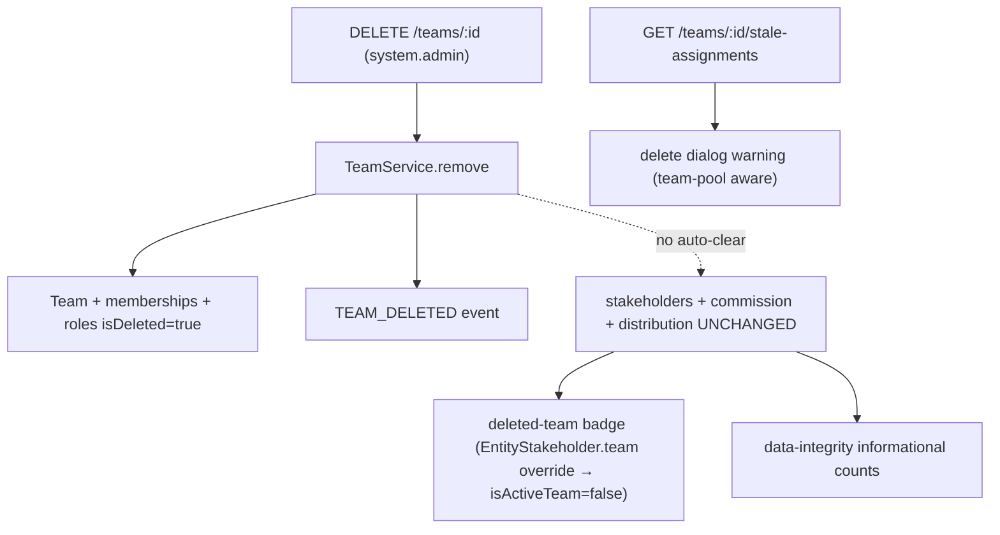

<Note>
  This specification defines the complete behavior of team deletion (`DELETE /teams/:id`), including safety layers, pre-delete hints, and data retention handling that brings it to parity with organization user removal.
</Note>

## Core Model

Team deletion **soft-deletes the RBAC/access layer** (team, memberships, membership-roles, custom team roles) and **retains all CRM data** (`entity_stakeholder`, `commission_payment`, distribution/escalation settings).

<Warning>
  There is **no auto-cleanup or auto-reassignment** — reassignment must be performed manually. This specification adds pre-delete hints, delete-dialog warnings, deleted-team badges, and data-integrity audit counters on top of the base model.
</Warning>

## TeamService.remove() Behavior

`TeamService.remove(teamId, organizationId, currentUserId)` executes within `executeInOrg` and performs the following operations:

<Steps>
  <Step title="Load Team Data">
    Loads the team with `memberships`, `memberships.user`, `memberships.teamRoles`, and `roles` relations
  </Step>
  
  <Step title="Collect Member IDs">
    Collects active member IDs for notification purposes
  </Step>
  
  <Step title="Soft-Delete Memberships">
    Soft-deletes all team memberships and their roles via `TeamMembershipService.softDeleteAllMembershipsInTransaction`
  </Step>
  
  <Step title="Soft-Delete Custom Roles">
    Soft-deletes all custom team roles by setting `role.isDeleted = true`
  </Step>
  
  <Step title="Soft-Delete Team">
    Soft-deletes the team by setting `team.isDeleted = true`
  </Step>
  
  <Step title="Invalidate Cache">
    Invalidates the permission cache for the team
  </Step>
  
  <Step title="Emit Event">
    Emits `TEAM_DELETED` event (triggers notifications to former members and `messaging-cleanup.listener` conversation cleanup)
  </Step>
</Steps>

<Info>
  The method does **NOT** modify `entity_stakeholder`, `commission_payment`, or distribution/escalation rows.
</Info>

### Deletion Flow

## Data Retention Matrix

<AccordionGroup>
  <Accordion title="RBAC Data (Soft-Deleted)">
    | Data Type | Deletion Behavior | Post-Deletion Status |
    |-----------|-------------------|---------------------|
    | Team (RBAC) | Soft-deleted | No longer accessible |
    | Team memberships + membership roles | Soft-deleted | No longer accessible |
    | Custom team roles | Soft-deleted | No longer accessible |
  </Accordion>

  <Accordion title="CRM Data (Retained)">
    | Data Type | Deletion Behavior | Reachability After Deletion |
    |-----------|-------------------|----------------------------|
    | `entity_stakeholder` **user + team** rows | **Retained** | Reachable via the named **user** stakeholder (badged "deleted team") |
    | `entity_stakeholder` **team-pool** rows (`user = NULL`) | **Retained** | **Admin-only** — no active membership remains to grant access |
    | `commission_payment` (`team_id` set) | **Retained** | Visible to finance/admin; reassign manually |
    | Distribution / escalation settings | **Retained** | Orphan audit already covers `team_membership` / `team_distribution_settings` |
  </Accordion>
</AccordionGroup>

## Pre-Delete Hint Endpoint

### GET /teams/:id/stale-assignments

Mirrors the user removal endpoint `GET /users/:id/stale-assignments`. Requires `@CheckAccess({ permissions: [SYSTEM_ADMIN] })` (same gate as deletion).

<Warning>
  This endpoint is **informational only** and never blocks deletion.
</Warning>

**Orchestration:** The handler lives in `TeamController` (NOT `TeamService`, which stays free of CRM dependencies). It fans out to two own-module read methods in parallel:

- **`EntityStakeholderService.getTeamStaleAssignments(teamId, orgId)`** — Operates in own `executeReadOnly`; counts active (non-deleted) leads/deals where the team is a stakeholder, breaking out the **team-pool** subset (`user_id IS NULL`)
- **`CommissionPaymentService.countActiveTeamCommissionPayments(teamId, orgId)`** — Operates in own `executeReadOnly`; counts active commission payments (must live in commission-payment module per module-boundary rule)

### TeamStaleAssignmentsDto

| Field | Description |
|-------|-------------|
| `leadCount` / `dealCount` | Active leads/deals where the team is a stakeholder |
| `teamPoolLeadCount` / `teamPoolDealCount` | Subset owned by no named agent (`user_id IS NULL`) |
| `commissionPaymentCount` | Active commission payments attributed to the team |
| `total` | `leadCount + dealCount + commissionPaymentCount` |
| `teamPoolTotal` | `teamPoolLeadCount + teamPoolDealCount` |

## Deleted Team Surface: isActiveTeam Flag

The deleted team is surfaced via the **project-standard per-relation `{ filters: { isDeleted: false } }` override** on `EntityStakeholder.team` — NOT a side-query.

<Steps>
  <Step title="Relation Override">
    `EntityStakeholder.team` declares `@ManyToOne(() => Team, { nullable: true, filters: { isDeleted: false } })`. The relation is nullable → **LEFT JOIN**, ensuring zero row-drop risk.
  </Step>
  
  <Step title="isActiveTeam Flag">
    `TeamDto` and `TeamBasicDto` expose `isActiveTeam = !team.isDeleted`. It flows automatically to lead/deal DTOs via the embedded stakeholder `TeamDto` and the denormalized `assignedTeam` (`TeamBasicDto`).
  </Step>
  
  <Step title="No Orphan Warning">
    `EntityStakeholderDto` does **not** call `warnIfStaleRelation` for `team`. A deleted team on a stakeholder is an **expected, supported, informational** state, not corruption.
    
    <Note>
      `warnIfStaleRelation(stakeholder.user, …)` is kept — a deleted user is genuine Tier-3 corruption.
    </Note>
  </Step>
  
  <Step title="Tier-2 Pass-Through">
    `EntityStakeholder.team` is Tier-2 (like `TeamMembership.team` / `TeamDistributionSettings.team`). Per soft-delete filter standards, Tier-2 relations pass the name through; exposing the name + `isActiveTeam: false` is standard-compliant.
  </Step>
  
  <Step title="Populate-Site Safety">
    Team-pool / team-row detection uses `s.team && !s.user` (and id-keying), never `!s.team` as "team was deleted". After the override, these paths are unchanged or improved.
  </Step>
</Steps>

## Team-Pool Records Side Effect

<Warning>
  Deleting a team soft-deletes its memberships, so **pure team-pool stakeholders (`user = NULL, team = set`)** are reachable only by org admins or direct user stakeholders afterwards.
</Warning>

This is **strictly worse** than user removal, where the lead keeps a named (badged) owner. The system surfaces this end-to-end:

- The hint breaks out `teamPoolLeadCount` / `teamPoolDealCount`
- The delete dialog raises a **stronger `danger` Alert** for team-pool records and a **softer `attention` Alert** for the user+team remainder

**Manual reassignment** is the expected recovery. A v2 reassignment worklist or soft-block is out of scope.

## Frontend Implementation

### Delete Dialog

Component: `delete-team-confirmation-dialog.tsx`

Fetches `TeamApi.getStaleAssignments(team.id)` using `queryKeys.teams.staleAssignments(id)` (enabled on `open`) and renders via `EntityConfirmDialog` `extraContent`:

<CardGroup cols={2}>
  <Card title="Danger Alert" icon="triangle-exclamation">
    Displayed when `teamPoolTotal > 0` — warns that team-pool records become admin-only until reassigned
  </Card>
  
  <Card title="Attention Alert" icon="circle-info">
    Displayed when non-pool remainder `> 0` — warns about user+team stakeholder rows and commission payments that keep a named owner but should be reassigned
  </Card>
</CardGroup>

<Info>
  The dialog never blocks deletion (informational only, matching user removal behavior).
</Info>

### Deleted-Team Badge

Component: `removed-from-org-badge.tsx`

Exports `RemovedTeamName` and `isRemovedTeam(team)` using the **team-shaped** `team.isActiveTeam === false` guard.

**Visual treatment:** Strikethrough + muted + tooltip "This team was deleted"

**Used in:**
- Stakeholders tab team-group header
- Lead panel + deal panel Team field
- Lead + deal kanban card assignee (team-pool rows)
- Lead + deal list-table "Assigned to" column

<Note>
  The frontend `TeamDto` / `TeamBasicDto` carry optional `isActiveTeam` (defaults to `true` when omitted).
</Note>

## Data Integrity Audit

`DataIntegrityAuditService` adds two **informational** counts (NOT orphans — they do not affect `totalOrphans > 0`):

<AccordionGroup>
  <Accordion title="stakeholdersWithDeletedTeamsCount">
    **Query:** `entity_stakeholder es JOIN team t ON t.id = es.team_id WHERE t.is_deleted = true AND es.is_deleted = false`
    
    **Location:** `auditStakeholderTransferStageHistory` method
  </Accordion>

  <Accordion title="commissionPaymentsWithDeletedTeamsCount">
    **Query:** `commission_payment cp JOIN team t ON t.id = cp.team_id WHERE t.is_deleted = true AND cp.is_deleted = false`
    
    **Location:** `auditJunctionsCommissionDealDoc` method
  </Accordion>
</AccordionGroup>

<Info>
  Both counts live in `INFORMATIONAL_COUNT_FIELDS` (precedent: `stakeholdersWithoutActiveUserOrgRoleCount` after org user removal).
</Info>

The pre-existing `teamMembershipsWithDeletedTeamsCount` and `teamDistributionSettingsWithDeletedTeamsCount` remain in `ORPHAN_COUNT_FIELDS` — those junctions should have been cascaded, while the CRM stakeholder/commission references are deliberately retained.

## Module Wiring

The stakeholder count reads CRM-owned data, requiring `RbacModule` to reach `EntityStakeholderService`.

<Steps>
  <Step title="Existing Import">
    `EntityStakeholderModule` already imports `forwardRef(() => RbacModule)` and exports `EntityStakeholderService`
  </Step>
  
  <Step title="Close Bidirectional Cycle">
    Adding `forwardRef(() => EntityStakeholderModule)` to `RbacModule` closes a **bidirectional** cycle (same shape as `UserModule`)
  </Step>
  
  <Step title="Injection Point">
    `EntityStakeholderService` is injected into **`TeamController`** (not `TeamService`) so `TeamService` stays free of CRM dependencies
  </Step>
</Steps>

<Warning>
  Verify with an application **boot** (not just `pnpm build`): a broken DI cycle throws only at Nest bootstrap.
</Warning>

## Out of Scope

The following features are explicitly out of scope for v1:

<CardGroup cols={2}>
  <Card title="Auto-Cleanup" icon="broom">
    No automatic cleanup or reassignment of team-pool or user+team stakeholders
  </Card>
  
  <Card title="Commission Reallocation" icon="money-bill-transfer">
    No automatic reallocation of commission payments
  </Card>
  
  <Card title="Restore Team" icon="rotate-left">
    No "restore team" flow
  </Card>
  
  <Card title="Transfer Blocking" icon="hand">
    Pending `EntityTransfer` is not blocked (matches user removal behavior)
  </Card>
</CardGroup>

<Tip>
  Manual reassignment workflows and enhanced recovery features are planned for future versions based on operational feedback.
</Tip>