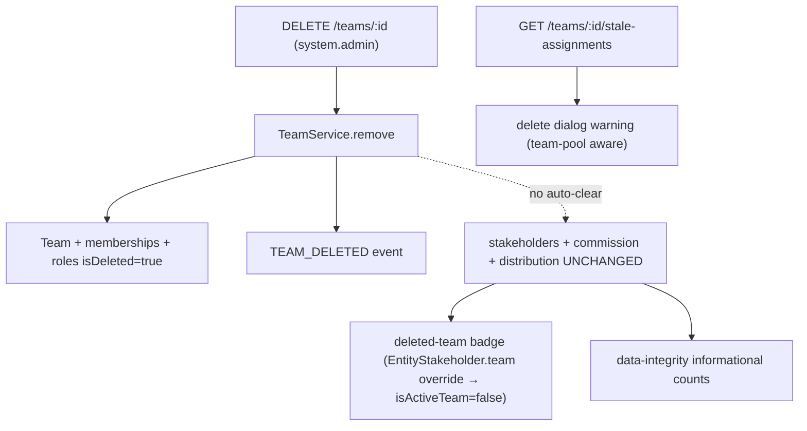

<Note>
**Core model (unchanged):** Team deletion **soft-deletes the RBAC/access layer** (team, memberships, membership-roles, custom team roles) and **retains all CRM data** (`entity_stakeholder`, `commission_payment`, distribution/escalation settings). There is **no auto-cleanup or auto-reassignment** — reassignment is manual. This spec adds a pre-delete hint, a delete-dialog warning, a deleted-team badge, and a data-integrity audit counter on top of that model.
</Note>

This specification brings team deletion to parity with organization user removal by adding comprehensive safety layers, visibility features, and audit trails while maintaining the existing soft-delete model for RBAC data and retention of CRM relationships.

## What `TeamService.remove()` does

`TeamService.remove(teamId, organizationId, currentUserId)` runs inside `executeInOrg` and performs the following operations:

<Steps>
<Step title="Load team with relationships">
Loads the team with `memberships`, `memberships.user`, `memberships.teamRoles`, and `roles`.
</Step>

<Step title="Collect active members">
Collects active member IDs for notification purposes.
</Step>

<Step title="Soft-delete memberships">
Soft-deletes all team memberships and their roles via `TeamMembershipService.softDeleteAllMembershipsInTransaction`.
</Step>

<Step title="Soft-delete custom roles">
Soft-deletes all custom team roles by setting `role.isDeleted = true`.
</Step>

<Step title="Soft-delete team">
Soft-deletes the team by setting `team.isDeleted = true`.
</Step>

<Step title="Invalidate cache">
Invalidates the permission cache for the team.
</Step>

<Step title="Emit event">
Emits `TEAM_DELETED` event for notifications to former members and `messaging-cleanup.listener` conversation cleanup.
</Step>
</Steps>

<Warning>
`TeamService.remove()` does **NOT** touch `entity_stakeholder`, `commission_payment`, or distribution/escalation rows. These relationships are intentionally retained.
</Warning>



## Data retention matrix

Understanding what data is preserved versus deleted is critical for team deletion:

| Data | On team deletion | Reachability after deletion |
|------|------------------|----------------------------|
| Team (RBAC) | Soft-deleted | — |
| Team memberships + membership roles | Soft-deleted | — |
| Custom team roles | Soft-deleted | — |
| `entity_stakeholder` **user + team** rows | **Retained** | Reachable via the named **user** stakeholder (badged "deleted team") |
| `entity_stakeholder` **team-pool** rows (`user = NULL`) | **Retained** | **Admin-only** — no active membership remains to grant access |
| `commission_payment` (`team_id` set) | **Retained** | Visible to finance/admin; reassign manually |
| Distribution / escalation settings referencing the team | **Retained** (orphan audit already covers `team_membership` / `team_distribution_settings`) | — |

<Info>
The retention of CRM data ensures no business-critical information is lost during team deletion, but manual reassignment may be required to maintain proper access and ownership.
</Info>

## Pre-delete hint endpoint

The pre-delete hint endpoint mirrors the user removal stale assignments check and provides administrators with impact assessment before deletion.

### Endpoint specification

**`GET /teams/:id/stale-assignments`**

- **Authorization:** `@CheckAccess({ permissions: [SYSTEM_ADMIN] })`
- **Purpose:** Informational only — never blocks deletion
- **Location:** `TeamController` (NOT `TeamService` to avoid CRM dependencies)

### Orchestration

The handler fans out to two own-module read methods in parallel:

<Tabs>
<Tab title="Entity Stakeholder Service">
`EntityStakeholderService.getTeamStaleAssignments(teamId, orgId)`

- Runs in own `executeReadOnly`
- Counts active (non-deleted) leads/deals where the team is a stakeholder
- Breaks out the **team-pool** subset (`user_id IS NULL`)
- Uses own-module raw SQL with `entity_stakeholder` + `lead`/`deal` liveness JOIN
- Follows `QUERY_OPTIMIZATION_PATTERNS.md §1.5` (accepted CRM-internal exception)
</Tab>

<Tab title="Commission Payment Service">
`CommissionPaymentService.countActiveTeamCommissionPayments(teamId, orgId)`

- Runs in own `executeReadOnly`
- Counts active commission payments attributed to the team
- Lives in commission-payment module per module-boundary rules
- Cannot be placed in `EntityStakeholderService` due to module ownership
</Tab>
</Tabs>

### Response DTO

`TeamStaleAssignmentsDto` provides comprehensive impact metrics:

| Field | Meaning |
|-------|---------|
| `leadCount` / `dealCount` | Active leads/deals where the team is a stakeholder |
| `teamPoolLeadCount` / `teamPoolDealCount` | Subset owned by no named agent (`user_id IS NULL`) |
| `commissionPaymentCount` | Active commission payments attributed to the team |
| `total` | `leadCount + dealCount + commissionPaymentCount` |
| `teamPoolTotal` | `teamPoolLeadCount + teamPoolDealCount` |

<CodeGroup>
```typescript TeamStaleAssignmentsDto
export class TeamStaleAssignmentsDto {
  leadCount: number;
  dealCount: number;
  teamPoolLeadCount: number;
  teamPoolDealCount: number;
  commissionPaymentCount: number;
  total: number;
  teamPoolTotal: number;
}
```

```typescript Controller usage
@Get(':id/stale-assignments')
@CheckAccess({ permissions: [SYSTEM_ADMIN] })
async getStaleAssignments(
  @Param('id') teamId: string,
  @OrganizationId() orgId: string,
): Promise<TeamStaleAssignmentsDto> {
  const [stakeholders, commissions] = await Promise.all([
    this.entityStakeholderService.getTeamStaleAssignments(teamId, orgId),
    this.commissionPaymentService.countActiveTeamCommissionPayments(teamId, orgId),
  ]);
  
  return {
    ...stakeholders,
    commissionPaymentCount: commissions,
    total: stakeholders.leadCount + stakeholders.dealCount + commissions,
  };
}
```
</CodeGroup>

## Deleted team visibility (isActiveTeam)

The deleted team is surfaced using the **project-standard per-relation `{ filters: { isDeleted: false } }` override** on `EntityStakeholder.team` — NOT a side-query.

### Implementation approach (Approach A)

<Steps>
<Step title="Relation override">
`EntityStakeholder.team` declares:

```typescript
@ManyToOne(() => Team, { 
  nullable: true,
  filters: { isDeleted: false } 
})
```

The relation is nullable → **LEFT JOIN**, ensuring **zero row-drop risk**. The only behavioral change is that a soft-deleted populated team now hydrates (exposing `isActiveTeam: false`) instead of nulling.

<Info>
This follows the documented `Lead.sourceConversation` precedent from `SOFT_DELETE_FILTER_STANDARD.md §2.1`.
</Info>
</Step>

<Step title="isActiveTeam flag">
`TeamDto` and `TeamBasicDto` expose:

```typescript
isActiveTeam = !team.isDeleted
```

This flag flows automatically to lead/deal DTOs via:
- The embedded stakeholder `TeamDto`
- The denormalized `assignedTeam` (`TeamBasicDto`)
- The deal-service `assignedTeam` projection threads `isDeleted`
</Step>

<Step title="No orphan warning">
`EntityStakeholderDto` does **not** call `warnIfStaleRelation` for `team`. A deleted team on a stakeholder is an **expected, supported, informational** state, not corruption.

<Check>
`warnIfStaleRelation(stakeholder.user, …)` is kept — a deleted user is genuine Tier-3 corruption.
</Check>
</Step>

<Step title="Tier-2 pass-through">
`EntityStakeholder.team` is Tier-2 (like `TeamMembership.team` / `TeamDistributionSettings.team`). Per `SOFT_DELETE_FILTER_STANDARD.md §3.3`, Tier-2 relations pass the name through; exposing the name + `isActiveTeam: false` is standard-compliant.

<Note>
No Strategy-A masking — that is Tier-3 only.
</Note>
</Step>

<Step title="Populate-site safety">
Team-pool / team-row detection uses `s.team && !s.user` (and id-keying), never `!s.team` as "team was deleted". After the override these paths are unchanged or **improved**: a soft-deleted team-pool row now correctly classifies as team-pool instead of collapsing to "neither user nor team".
</Step>
</Steps>

## Team-pool access implications

Deleting a team soft-deletes its memberships, creating an important access restriction:

<Warning>
**Pure team-pool stakeholders (`user = NULL, team = set`)** are reachable only by org admins / direct user stakeholders afterwards — strictly worse than user removal, where the lead keeps a named (badged) owner.
</Warning>

This limitation is surfaced end-to-end:

- The hint breaks out `teamPoolLeadCount` / `teamPoolDealCount` (see Pre-delete hint section)
- The delete dialog raises a **stronger `danger` Alert** for team-pool records
- The delete dialog raises a **softer `attention` Alert** for the user+team remainder

**Manual reassignment** is the expected recovery path. A v2 reassignment worklist / soft-block is out of scope for this specification.

## Frontend implementation

### Delete confirmation dialog

The delete dialog (`delete-team-confirmation-dialog.tsx`) provides context-aware warnings based on the stale assignments data.

<Tabs>
<Tab title="Data fetching">
```typescript
// Fetches stale assignments on dialog open
const { data: staleAssignments } = useQuery({
  queryKey: queryKeys.teams.staleAssignments(team.id),
  queryFn: () => TeamApi.getStaleAssignments(team.id),
  enabled: open,
});
```
</Tab>

<Tab title="Warning rendering">
The dialog renders warnings via `EntityConfirmDialog` `extraContent`:

```typescript
const extraContent = (
  <>
    {staleAssignments?.teamPoolTotal > 0 && (
      <Alert variant="danger">
        <AlertTitle>Team-pool records will become admin-only</AlertTitle>
        <AlertDescription>
          {staleAssignments.teamPoolTotal} leads/deals are assigned to this team 
          with no named agent. These will only be accessible to admins until reassigned.
        </AlertDescription>
      </Alert>
    )}
    
    {(staleAssignments?.total - staleAssignments?.teamPoolTotal) > 0 && (
      <Alert variant="attention">
        <AlertTitle>Active assignments exist</AlertTitle>
        <AlertDescription>
          This team has {staleAssignments.total - staleAssignments.teamPoolTotal} 
          active stakeholder assignments and commission payments that should be reassigned.
        </AlertDescription>
      </Alert>
    )}
  </>
);
```
</Tab>
</Tabs>

<Info>
The dialog never blocks deletion (informational only, matching user removal behavior).
</Info>

### Deleted team badge

The `removed-from-org-badge.tsx` component provides visual indication of deleted teams throughout the application.

<CodeGroup>
```typescript Component exports
// Exports from removed-from-org-badge.tsx
export const RemovedTeamName: React.FC<{ team: TeamBasicDto }>;
export const isRemovedTeam = (team: TeamBasicDto | TeamDto) => 
  team.isActiveTeam === false;
```

```typescript Badge implementation
export const RemovedTeamName: React.FC<{ team: TeamBasicDto }> = ({ team }) => {
  return (
    <Tooltip content="This team was deleted">
      <span className="text-muted line-through">
        {team.name}
      </span>
    </Tooltip>
  );
};
```
</CodeGroup>

**Usage locations:**
- Stakeholders tab team-group header
- Lead panel + deal panel Team field
- Lead + deal kanban card assignee (team-pool rows)
- Lead + deal list-table "Assigned to" column

<Note>
The frontend `TeamDto` / `TeamBasicDto` carry optional `isActiveTeam` (default `true` when omitted).
</Note>

## Data integrity audit

`DataIntegrityAuditService` adds two **informational** counts to track deleted team references without marking the system unhealthy.

### Informational counts

<AccordionGroup>
<Accordion title="stakeholdersWithDeletedTeamsCount">
Counts active stakeholder records referencing deleted teams.

**Query:**
```sql
SELECT COUNT(*) 
FROM entity_stakeholder es 
JOIN team t ON t.id = es.team_id 
WHERE t.is_deleted = true 
  AND es.is_deleted = false
```

**Location:** `auditStakeholderTransferStageHistory` method
</Accordion>

<Accordion title="commissionPaymentsWithDeletedTeamsCount">
Counts active commission payments attributed to deleted teams.

**Query:**
```sql
SELECT COUNT(*) 
FROM commission_payment cp 
JOIN team t ON t.id = cp.team_id 
WHERE t.is_deleted = true 
  AND cp.is_deleted = false
```

**Location:** `auditJunctionsCommissionDealDoc` method
</Accordion>
</AccordionGroup>

<Check>
Both counts live in `INFORMATIONAL_COUNT_FIELDS` following the precedent of `stakeholdersWithoutActiveUserOrgRoleCount` after org user removal.
</Check>

<Warning>
These are **NOT orphans** — they do not flip `totalOrphans > 0`. Otherwise any team deletion would mark the audit unhealthy forever.
</Warning>

### Existing orphan counts

The pre-existing orphan counts remain unchanged:

- `teamMembershipsWithDeletedTeamsCount` — remains in `ORPHAN_COUNT_FIELDS` (these junctions should have been cascaded)
- `teamDistributionSettingsWithDeletedTeamsCount` — remains in `ORPHAN_COUNT_FIELDS`

The CRM stakeholder/commission refs are deliberately retained, so they are tracked informationally rather than as orphans.

## Module wiring

The stakeholder count reads CRM-owned data, requiring careful module dependency management to avoid circular dependencies.

### Bidirectional forwardRef cycle

<Steps>
<Step title="Existing relationship">
`EntityStakeholderModule` already imports `forwardRef(() => RbacModule)` and already exports `EntityStakeholderService`.
</Step>

<Step title="New import">
Add `forwardRef(() => EntityStakeholderModule)` to `RbacModule` to close the **bidirectional** cycle.
</Step>

<Step title="Service injection">
`EntityStakeholderService` is injected into **`TeamController`** (not `TeamService`) so `TeamService` stays free of CRM dependencies.
</Step>
</Steps>

<CodeGroup>
```typescript RbacModule
@Module({
  imports: [
    forwardRef(() => EntityStakeholderModule),
    // ... other imports
  ],
  controllers: [TeamController],
  providers: [TeamService],
  exports: [TeamService],
})
export class RbacModule {}
```

```typescript TeamController
@Controller('teams')
export class TeamController {
  constructor(
    private readonly teamService: TeamService,
    @Inject(forwardRef(() => EntityStakeholderService))
    private readonly entityStakeholderService: EntityStakeholderService,
    private readonly commissionPaymentService: CommissionPaymentService,
  ) {}
  
  @Get(':id/stale-assignments')
  async getStaleAssignments(/* ... */) {
    // Implementation using entityStakeholderService
  }
}
```
</CodeGroup>

<Warning>
**Verify with an app boot** (not just `pnpm build`): a broken DI cycle throws only at Nest bootstrap.
</Warning>

<Info>
This follows the same module wiring pattern as `UserModule`, establishing a precedent for bidirectional cycles when necessary.
</Info>

## Out of scope

The following features are explicitly excluded from this specification per architectural decisions:

<CardGroup cols={2}>
<Card title="Auto-cleanup" icon="broom">
No automatic cleanup or reassignment of team-pool or user+team stakeholders
</Card>

<Card title="Commission reallocation" icon="money-bill-transfer">
No automatic reallocation of commission payments to other teams or users
</Card>

<Card title="Team restoration" icon="trash-arrow-up">
No "restore team" flow — deletion is considered permanent from RBAC perspective
</Card>

<Card title="Transfer blocking" icon="ban">
Pending `EntityTransfer` is not blocked (v1, matches user removal behavior)
</Card>
</CardGroup>

<Note>
Manual reassignment workflows and team restoration capabilities may be considered for future versions based on operational requirements.
</Note>