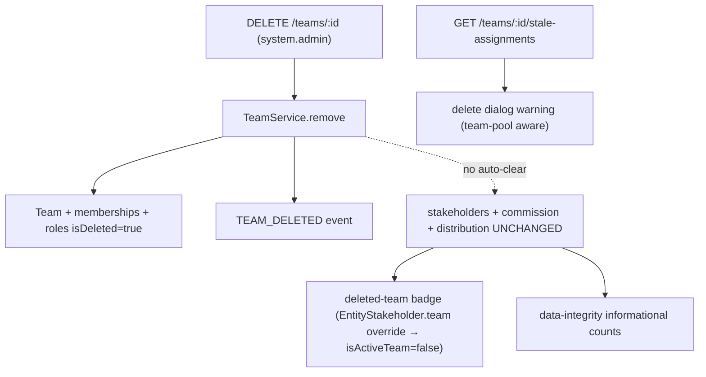

This specification defines the authoritative implementation for **team deletion** (`DELETE /teams/:id`) and the safety mechanisms that bring it to parity with organization user removal.

<Note>
The core model remains unchanged: team deletion **soft-deletes the RBAC/access layer** (team, memberships, membership-roles, custom team roles) and **retains all CRM data** (`entity_stakeholder`, `commission_payment`, distribution/escalation settings). There is **no auto-cleanup or auto-reassignment** — reassignment is manual.
</Note>

## TeamService.remove() Operation

The `TeamService.remove(teamId, organizationId, currentUserId)` method executes within `executeInOrg` and performs the following operations:

<Steps>
<Step title="Load team data">
Loads the team with `memberships`, `memberships.user`, `memberships.teamRoles`, and `roles`
</Step>

<Step title="Collect member information">
Collects active member IDs for notification purposes
</Step>

<Step title="Soft-delete memberships">
Soft-deletes all team memberships and their roles using `TeamMembershipService.softDeleteAllMembershipsInTransaction`
</Step>

<Step title="Soft-delete custom roles">
Soft-deletes all custom team roles by setting `role.isDeleted = true`
</Step>

<Step title="Soft-delete team">
Soft-deletes the team by setting `team.isDeleted = true`
</Step>

<Step title="Invalidate cache">
Invalidates the permission cache for the team
</Step>

<Step title="Emit events">
Emits `TEAM_DELETED` event for notifications to former members and conversation cleanup
</Step>
</Steps>

<Warning>
The operation does NOT touch `entity_stakeholder`, `commission_payment`, or distribution/escalation rows.
</Warning>



## Data Retention Matrix

The following table outlines what data is retained or deleted during team deletion operations:

| Data | On Team Deletion | Reachability After Deletion |
|------|------------------|----------------------------|
| Team (RBAC) | Soft-deleted | — |
| Team memberships + membership roles | Soft-deleted | — |
| Custom team roles | Soft-deleted | — |
| `entity_stakeholder` **user + team** rows | **Retained** | Reachable via the named **user** stakeholder (badged "deleted team") |
| `entity_stakeholder` **team-pool** rows (`user = NULL`) | **Retained** | **Admin-only** — no active membership remains to grant access |
| `commission_payment` (`team_id` set) | **Retained** | Visible to finance/admin; reassign manually |
| Distribution / escalation settings referencing the team | **Retained** | — |

## Pre-Delete Hint API

### GET /teams/:id/stale-assignments

<Info>
This endpoint mirrors `GET /users/:id/stale-assignments` and requires `@CheckAccess({ permissions: [SYSTEM_ADMIN] })` authorization.
</Info>

The endpoint provides informational data only and never blocks deletion. The handler lives in `TeamController` and orchestrates two parallel operations:

<Tabs>
<Tab title="Entity Stakeholder Service">
`EntityStakeholderService.getTeamStaleAssignments(teamId, orgId)` counts active (non-deleted) leads/deals where the team is a stakeholder, including the team-pool subset (`user_id IS NULL`).
</Tab>

<Tab title="Commission Payment Service">
`CommissionPaymentService.countActiveTeamCommissionPayments(teamId, orgId)` provides a raw count of active commission payments attributed to the team.
</Tab>
</Tabs>

### TeamStaleAssignmentsDto Structure

```typescript
interface TeamStaleAssignmentsDto {
  leadCount: number;              // Active leads where team is stakeholder
  dealCount: number;              // Active deals where team is stakeholder
  teamPoolLeadCount: number;      // Team-pool leads (user_id IS NULL)
  teamPoolDealCount: number;      // Team-pool deals (user_id IS NULL)
  commissionPaymentCount: number; // Active commission payments
  total: number;                  // leadCount + dealCount + commissionPaymentCount
  teamPoolTotal: number;          // teamPoolLeadCount + teamPoolDealCount
}
```

## Deleted Team Surfacing (isActiveTeam)

The deleted team is surfaced using the project-standard per-relation filter override approach:

<Steps>
<Step title="Relation override">
`EntityStakeholder.team` declares `@ManyToOne(() => Team, { nullable: true, filters: { isDeleted: false } })`. The nullable relation uses LEFT JOIN with zero row-drop risk.
</Step>

<Step title="isActiveTeam flag">
`TeamDto` and `TeamBasicDto` expose `isActiveTeam = !team.isDeleted`, which flows automatically to lead/deal DTOs via embedded stakeholder data.
</Step>

<Step title="No orphan warnings">
`EntityStakeholderDto` does not call `warnIfStaleRelation` for `team` since a deleted team on a stakeholder is an expected, supported state.
</Step>

<Step title="Tier-2 compliance">
As a Tier-2 relation, `EntityStakeholder.team` passes the name through, exposing `name` + `isActiveTeam: false` per standard compliance.
</Step>

<Step title="Populate-site safety">
Team-pool detection uses `s.team && !s.user` patterns, which remain unchanged or improved after the override.
</Step>
</Steps>

## Team-Pool Access Implications

<Warning>
Deleting a team soft-deletes its memberships, making **pure team-pool stakeholders** (`user = NULL, team = set`) reachable only by org admins or direct user stakeholders. This creates stricter access than user removal scenarios.
</Warning>

This limitation is surfaced end-to-end through:
- Pre-delete hint breakdown of `teamPoolLeadCount` / `teamPoolDealCount`
- Enhanced delete dialog warnings with stronger alerts for team-pool records

Manual reassignment is the expected recovery method.

## Frontend Implementation

### Delete Confirmation Dialog

The `delete-team-confirmation-dialog.tsx` component:

<Steps>
<Step title="Fetch stale assignments">
Calls `TeamApi.getStaleAssignments(team.id)` when dialog opens
</Step>

<Step title="Display alerts">
Renders contextual alerts via `EntityConfirmDialog` `extraContent`:
- **`danger` Alert** when `teamPoolTotal > 0` - team-pool records become admin-only
- **`attention` Alert** when non-pool remainder `> 0` - user+team stakeholders need reassignment
</Step>

<Step title="Allow deletion">
Dialog never blocks deletion (informational only, matching user removal pattern)
</Step>
</Steps>

### Deleted Team Badge

The `removed-from-org-badge.tsx` exports `RemovedTeamName` component and `isRemovedTeam(team)` utility:

<CodeGroup>
```typescript Guard Function
function isRemovedTeam(team) {
  return team.isActiveTeam === false;
}
```

```jsx Component Usage
<RemovedTeamName team={team} />
// Renders: strikethrough + muted + tooltip "This team was deleted"
```
</CodeGroup>

Used in stakeholder tabs, lead/deal panels, kanban cards, and list-table "Assigned to" columns.

## Data Integrity Audit

`DataIntegrityAuditService` includes two **informational** counts (not orphans):

<AccordionGroup>
<Accordion title="stakeholdersWithDeletedTeamsCount">
```sql
SELECT COUNT(*) FROM entity_stakeholder es 
JOIN team t ON t.id = es.team_id 
WHERE t.is_deleted = true AND es.is_deleted = false
```
Located in `auditStakeholderTransferStageHistory`
</Accordion>

<Accordion title="commissionPaymentsWithDeletedTeamsCount">
```sql
SELECT COUNT(*) FROM commission_payment cp 
JOIN team t ON t.id = cp.team_id 
WHERE t.is_deleted = true AND cp.is_deleted = false
```
Located in `auditJunctionsCommissionDealDoc`
</Accordion>
</AccordionGroup>

<Note>
Both counts live in `INFORMATIONAL_COUNT_FIELDS` and do not affect `totalOrphans > 0` health checks, following the precedent of `stakeholdersWithoutActiveUserOrgRoleCount`.
</Note>

## Module Dependencies

The implementation requires a **bidirectional forwardRef cycle** between modules:

<Steps>
<Step title="Existing setup">
`EntityStakeholderModule` already imports `forwardRef(() => RbacModule)` and exports `EntityStakeholderService`
</Step>

<Step title="Add reverse dependency">
`RbacModule` adds `forwardRef(() => EntityStakeholderModule)` to close the bidirectional cycle
</Step>

<Step title="Service injection">
`EntityStakeholderService` is injected into `TeamController` (not `TeamService`) to keep `TeamService` free of CRM dependencies
</Step>
</Steps>

<Warning>
Verify the setup with application **boot** (not just `pnpm build`) since broken DI cycles only throw during Nest bootstrap.
</Warning>

## Out of Scope

The following features are explicitly excluded from this specification:

<CardGroup cols={2}>
<Card title="Auto-cleanup" icon="ban">
No automatic cleanup or reassignment of team-pool or user+team stakeholders
</Card>

<Card title="Commission Reallocation" icon="ban">
No automatic reallocation of commission payments
</Card>

<Card title="Team Restoration" icon="ban">
No "restore team" functionality
</Card>

<Card title="EntityTransfer Blocking" icon="ban">
Pending EntityTransfer operations are not blocked (matches user removal behavior)
</Card>
</CardGroup>