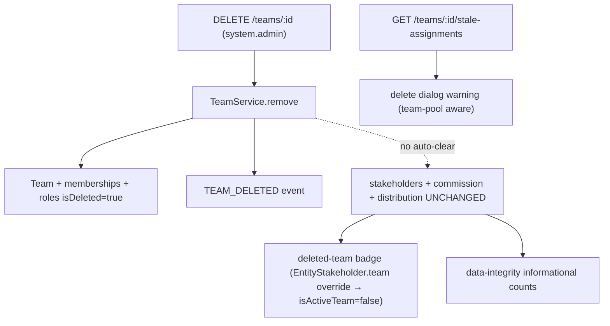

Authoritative specification for **team deletion** (`DELETE /teams/:id`) and the safety + visibility layers that bring it to parity with organization user removal.

<Note>
**Core model (unchanged):** team deletion **soft-deletes the RBAC/access layer** (team, memberships, membership-roles, custom team roles) and **retains all CRM data** (`entity_stakeholder`, `commission_payment`, distribution/escalation settings). There is **no auto-cleanup or auto-reassignment** — reassignment is manual.
</Note>

This specification adds a pre-delete hint, a delete-dialog warning, a deleted-team badge, and a data-integrity audit counter on top of the core model.

## Team deletion process

`TeamService.remove(teamId, organizationId, currentUserId)` runs inside `executeInOrg` and performs the following operations:

<Steps>
<Step title="Load team data">
Loads the team with `memberships`, `memberships.user`, `memberships.teamRoles`, and `roles`.
</Step>

<Step title="Collect member information">
Collects active member IDs for notification purposes.
</Step>

<Step title="Soft-delete memberships">
Soft-deletes all team memberships and their roles using `TeamMembershipService.softDeleteAllMembershipsInTransaction`.
</Step>

<Step title="Soft-delete custom roles">
Soft-deletes all custom team roles by setting `role.isDeleted = true`.
</Step>

<Step title="Soft-delete team">
Soft-deletes the team by setting `team.isDeleted = true`.
</Step>

<Step title="Invalidate cache">
Invalidates the permission cache for the team.
</Step>

<Step title="Emit events">
Emits `TEAM_DELETED` event for notifications to former members and conversation cleanup via `messaging-cleanup.listener`.
</Step>
</Steps>

<Warning>
The deletion process does **NOT** touch `entity_stakeholder`, `commission_payment`, or distribution/escalation rows.
</Warning>



## Data retention matrix

<AccordionGroup>
<Accordion title="Data retention breakdown">

| Data | On team deletion | Reachability after deletion |
| --- | --- | --- |
| Team (RBAC) | Soft-deleted | — |
| Team memberships + membership roles | Soft-deleted | — |
| Custom team roles | Soft-deleted | — |
| `entity_stakeholder` **user + team** rows | **Retained** | Reachable via the named **user** stakeholder (badged "deleted team") |
| `entity_stakeholder` **team-pool** rows (`user = NULL`) | **Retained** | **Admin-only** — no active membership remains to grant access |
| `commission_payment` (`team_id` set) | **Retained** | Visible to finance/admin; reassign manually |
| Distribution / escalation settings referencing the team | **Retained** (orphan audit already covers `team_membership` / `team_distribution_settings`) | — |

</Accordion>
</AccordionGroup>

## Pre-delete hint endpoint

The `GET /teams/:id/stale-assignments` endpoint mirrors `GET /users/:id/stale-assignments` functionality.

<Check>
**Access control:** `@CheckAccess({ permissions: [SYSTEM_ADMIN] })` - same gate as delete operation
</Check>

<Info>
This endpoint is **informational only** and never blocks deletion.
</Info>

### Orchestration

The handler lives in `TeamController` (NOT `TeamService`, which stays free of CRM dependencies). It fans out to two module read methods in parallel:

- `EntityStakeholderService.getTeamStaleAssignments(teamId, orgId)` — counts active (non-deleted) leads/deals where the team is a stakeholder
- `CommissionPaymentService.countActiveTeamCommissionPayments(teamId, orgId)` — counts active commission payments

### TeamStaleAssignmentsDto

| Field | Meaning |
| --- | --- |
| `leadCount` / `dealCount` | Active leads/deals where the team is a stakeholder |
| `teamPoolLeadCount` / `teamPoolDealCount` | Subset owned by no named agent (`user_id IS NULL`) |
| `commissionPaymentCount` | Active commission payments attributed to the team |
| `total` | `leadCount + dealCount + commissionPaymentCount` |
| `teamPoolTotal` | `teamPoolLeadCount + teamPoolDealCount` |

## Deleted team visibility

The deleted team is surfaced via the **project-standard per-relation `{ filters: { isDeleted: false } }` override** on `EntityStakeholder.team`.

<Steps>
<Step title="Relation override">
`EntityStakeholder.team` declares `@ManyToOne(() => Team, { nullable: true, filters: { isDeleted: false } })`. The relation is nullable → **LEFT JOIN**, ensuring zero row-drop risk.
</Step>

<Step title="isActiveTeam flag">
`TeamDto` and `TeamBasicDto` expose `isActiveTeam = !team.isDeleted`. This flows automatically to lead/deal DTOs via embedded stakeholder `TeamDto` and denormalized `assignedTeam`.
</Step>

<Step title="No orphan warning">
`EntityStakeholderDto` does **not** call `warnIfStaleRelation` for `team`. A deleted team on a stakeholder is an expected, supported, informational state.
</Step>

<Step title="Tier-2 pass-through">
`EntityStakeholder.team` is Tier-2. Per standard, Tier-2 relations pass the name through, exposing the name + `isActiveTeam: false`.
</Step>

<Step title="Populate-site safety">
Team-pool detection uses `s.team && !s.user`, never `!s.team` as "team was deleted". A soft-deleted team-pool row now correctly classifies as team-pool.
</Step>
</Steps>

## Team-pool access restriction

<Warning>
Deleting a team soft-deletes its memberships, so **pure team-pool stakeholders (`user = NULL, team = set`)** become reachable only by org admins after deletion.
</Warning>

This side effect is surfaced end-to-end:
- The hint breaks out `teamPoolLeadCount` / `teamPoolDealCount`
- The delete dialog raises a **stronger `danger` Alert** for team-pool records

**Manual reassignment** is the expected recovery method.

## Frontend implementation

### Delete confirmation dialog

The `delete-team-confirmation-dialog.tsx` component:

- Fetches `TeamApi.getStaleAssignments(team.id)` when dialog opens
- Renders via `EntityConfirmDialog` `extraContent`:
  - **`danger` Alert** when `teamPoolTotal > 0` — team-pool records become admin-only
  - **`attention` Alert** when non-pool remainder `> 0` — user+team stakeholders need reassignment

<Note>
The dialog never blocks deletion (informational only, matching user removal behavior).
</Note>

### Deleted team badge

`removed-from-org-badge.tsx` exports `RemovedTeamName` + `isRemovedTeam(team)` components:

- Uses **team-shaped** `team.isActiveTeam === false` guard
- Displays strikethrough + muted styling + tooltip "This team was deleted"
- Used in stakeholder tabs, lead/deal panels, kanban cards, and list tables

<CodeGroup>

```typescript Frontend DTO
interface TeamDto {
  id: string;
  name: string;
  isActiveTeam?: boolean; // default true when omitted
  // ... other fields
}

interface TeamBasicDto {
  id: string;
  name: string;
  isActiveTeam?: boolean;
}
```

</CodeGroup>

## Data integrity audit

`DataIntegrityAuditService` adds two **informational** counts (NOT orphans):

<Tabs>
<Tab title="Stakeholder count">
`stakeholdersWithDeletedTeamsCount` — counts `entity_stakeholder` rows with soft-deleted teams

```sql
SELECT COUNT(*) FROM entity_stakeholder es 
JOIN team t ON t.id = es.team_id 
WHERE t.is_deleted = true AND es.is_deleted = false
```
</Tab>

<Tab title="Commission count">
`commissionPaymentsWithDeletedTeamsCount` — counts `commission_payment` rows with soft-deleted teams

```sql
SELECT COUNT(*) FROM commission_payment cp 
JOIN team t ON t.id = cp.team_id 
WHERE t.is_deleted = true AND cp.is_deleted = false
```
</Tab>
</Tabs>

<Info>
Both counts live in `INFORMATIONAL_COUNT_FIELDS` and do not affect audit health status. Pre-existing team junction orphan counts remain in `ORPHAN_COUNT_FIELDS`.
</Info>

## Module wiring

The implementation requires a **bidirectional forwardRef cycle** between modules:

- `RbacModule` adds `forwardRef(() => EntityStakeholderModule)` 
- `EntityStakeholderModule` already imports `forwardRef(() => RbacModule)`
- `EntityStakeholderService` is injected into **`TeamController`** (not `TeamService`)

<Warning>
Verify with an app **boot** (not just `pnpm build`): a broken DI cycle throws only at Nest bootstrap.
</Warning>

## Out of scope

The following features are explicitly excluded from this specification:

<CardGroup cols={2}>
<Card title="Auto-cleanup" icon="robot">
No automatic cleanup or reassignment of team-pool or user+team stakeholders
</Card>

<Card title="Commission reallocation" icon="dollar-sign">
No automatic reallocation of commission payments
</Card>

<Card title="Team restoration" icon="arrow-rotate-left">
No "restore team" functionality
</Card>

<Card title="Transfer blocking" icon="ban">
Pending `EntityTransfer` operations are not blocked (matches user removal behavior)
</Card>
</CardGroup>