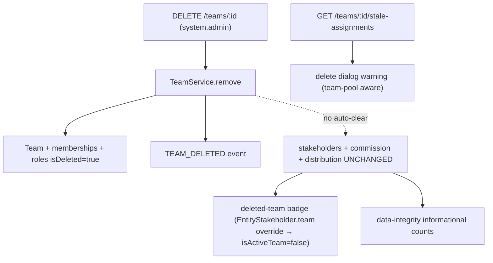

This page provides the authoritative specification for team deletion (`DELETE /teams/:id`) and the safety and visibility layers that bring it to parity with organization user removal.

<Note>
**Core model (unchanged):** Team deletion **soft-deletes the RBAC/access layer** (team, memberships, membership-roles, custom team roles) and **retains all CRM data** (`entity_stakeholder`, `commission_payment`, distribution/escalation settings). There is **no auto-cleanup or auto-reassignment** — reassignment is manual.
</Note>

## What TeamService.remove() does

`TeamService.remove(teamId, organizationId, currentUserId)` runs inside `executeInOrg` and performs the following operations:

<Steps>
<Step title="Load team data">
Loads the team with `memberships`, `memberships.user`, `memberships.teamRoles`, and `roles`
</Step>

<Step title="Collect member IDs">
Collects active member IDs for notification purposes
</Step>

<Step title="Soft-delete memberships">
Soft-deletes all team memberships and their roles using `TeamMembershipService.softDeleteAllMembershipsInTransaction`
</Step>

<Step title="Soft-delete custom roles">
Soft-deletes all custom team roles by setting `role.isDeleted = true`
</Step>

<Step title="Soft-delete team">
Soft-deletes the team by setting `team.isDeleted = true`
</Step>

<Step title="Clear cache">
Invalidates the permission cache for the team
</Step>

<Step title="Emit event">
Emits `TEAM_DELETED` event for notifications to former members and messaging cleanup
</Step>
</Steps>

<Warning>
Team deletion does **NOT** touch `entity_stakeholder`, `commission_payment`, or distribution/escalation rows.
</Warning>



## Data retention matrix

The following table shows what happens to different types of data when a team is deleted:

| Data | On team deletion | Reachability after deletion |
| --- | --- | --- |
| Team (RBAC) | Soft-deleted | — |
| Team memberships + membership roles | Soft-deleted | — |
| Custom team roles | Soft-deleted | — |
| `entity_stakeholder` **user + team** rows | **Retained** | Reachable via the named **user** stakeholder (badged "deleted team") |
| `entity_stakeholder` **team-pool** rows (`user = NULL`) | **Retained** | **Admin-only** — no active membership remains to grant access |
| `commission_payment` (`team_id` set) | **Retained** | Visible to finance/admin; reassign manually |
| Distribution / escalation settings referencing the team | **Retained** | — |

## Pre-delete hint

### GET /teams/:id/stale-assignments

<Info>
This endpoint mirrors `GET /users/:id/stale-assignments` and requires `@CheckAccess({ permissions: [SYSTEM_ADMIN] })` permission.
</Info>

This endpoint is **informational only** and never blocks deletion. The handler lives in `TeamController` and fans out to two read methods:

- `EntityStakeholderService.getTeamStaleAssignments(teamId, orgId)` — counts active leads/deals where the team is a stakeholder
- `CommissionPaymentService.countActiveTeamCommissionPayments(teamId, orgId)` — counts active commission payments

### TeamStaleAssignmentsDto

| Field | Meaning |
| --- | --- |
| `leadCount` / `dealCount` | Active leads/deals where the team is a stakeholder |
| `teamPoolLeadCount` / `teamPoolDealCount` | Subset owned by no named agent (`user_id IS NULL`) |
| `commissionPaymentCount` | Active commission payments attributed to the team |
| `total` | `leadCount + dealCount + commissionPaymentCount` |
| `teamPoolTotal` | `teamPoolLeadCount + teamPoolDealCount` |

## Surfacing deleted teams

### isActiveTeam implementation

The deleted team is surfaced via the project-standard per-relation `{ filters: { isDeleted: false } }` override on `EntityStakeholder.team`:

<Steps>
<Step title="Relation override">
`EntityStakeholder.team` declares `@ManyToOne(() => Team, { nullable: true, filters: { isDeleted: false } })`. The relation is nullable → **LEFT JOIN**, preventing row drops.
</Step>

<Step title="isActiveTeam flag">
`TeamDto` and `TeamBasicDto` expose `isActiveTeam = !team.isDeleted`. This flows automatically to lead/deal DTOs.
</Step>

<Step title="No orphan warnings">
`EntityStakeholderDto` does **not** call `warnIfStaleRelation` for `team` since a deleted team on a stakeholder is an expected, supported state.
</Step>

<Step title="Tier-2 pass-through">
`EntityStakeholder.team` is Tier-2, so it passes the name through with `isActiveTeam: false`.
</Step>
</Steps>

## Team-pool record implications

<Warning>
Deleting a team soft-deletes its memberships, making **pure team-pool stakeholders** (`user = NULL, team = set`) reachable only by org admins or direct user stakeholders afterwards.
</Warning>

This side effect is surfaced end-to-end:
- The hint breaks out `teamPoolLeadCount` / `teamPoolDealCount`
- The delete dialog shows stronger warnings for team-pool records

**Manual reassignment** is the expected recovery method.

## Frontend implementation

### Delete dialog

The `delete-team-confirmation-dialog.tsx` component:

<Steps>
<Step title="Fetch stale assignments">
Fetches `TeamApi.getStaleAssignments(team.id)` when dialog opens
</Step>

<Step title="Render warnings">
Shows different alert levels based on the type of assignments:
- **`danger` Alert** when `teamPoolTotal > 0` — team-pool records become admin-only
- **`attention` Alert** when non-pool remainder `> 0` — user+team stakeholders need reassignment
</Step>

<Step title="Allow deletion">
The dialog never blocks deletion (informational only)
</Step>
</Steps>

### Deleted team badge

The `RemovedTeamName` component shows strikethrough text with muted styling and a tooltip "This team was deleted" for teams where `isActiveTeam === false`.

**Usage locations:**
- Stakeholders tab team-group header
- Lead and deal panel Team fields
- Lead and deal kanban card assignees (team-pool rows)  
- Lead and deal list-table "Assigned to" column

## Data integrity audit

`DataIntegrityAuditService` adds two **informational** counts (not orphans):

<AccordionGroup>
<Accordion title="stakeholdersWithDeletedTeamsCount">
Counts `entity_stakeholder` records linked to soft-deleted teams:
```sql
entity_stakeholder es 
JOIN team t ON t.id = es.team_id 
WHERE t.is_deleted = true AND es.is_deleted = false
```
</Accordion>

<Accordion title="commissionPaymentsWithDeletedTeamsCount">
Counts `commission_payment` records linked to soft-deleted teams:
```sql
commission_payment cp 
JOIN team t ON t.id = cp.team_id 
WHERE t.is_deleted = true AND cp.is_deleted = false
```
</Accordion>
</AccordionGroup>

<Note>
Both counts live in `INFORMATIONAL_COUNT_FIELDS` and do not affect the overall audit health status.
</Note>

## Module wiring

<Warning>
The stakeholder count reads CRM-owned data, so `RbacModule` must reach `EntityStakeholderService`, creating a **bidirectional forwardRef cycle**.
</Warning>

**Implementation:**
- `EntityStakeholderModule` already imports `forwardRef(() => RbacModule)`
- `RbacModule` adds `forwardRef(() => EntityStakeholderModule)`
- `EntityStakeholderService` is injected into **`TeamController`** (not `TeamService`)

<Tip>
Verify the DI cycle works with an app **boot** (not just `pnpm build`), as broken cycles throw only at Nest bootstrap.
</Tip>

## Out of scope

The following features are explicitly **not** included in this specification:

<CardGroup cols={2}>
<Card title="Auto-cleanup" icon="broom">
No automatic cleanup or reassignment of team-pool or user+team stakeholders
</Card>

<Card title="Commission reallocation" icon="dollar-sign">
No automatic reallocation of commission payments
</Card>

<Card title="Restore functionality" icon="undo">
No "restore team" flow implementation
</Card>

<Card title="Transfer blocking" icon="ban">
Pending `EntityTransfer` operations are not blocked
</Card>
</CardGroup>