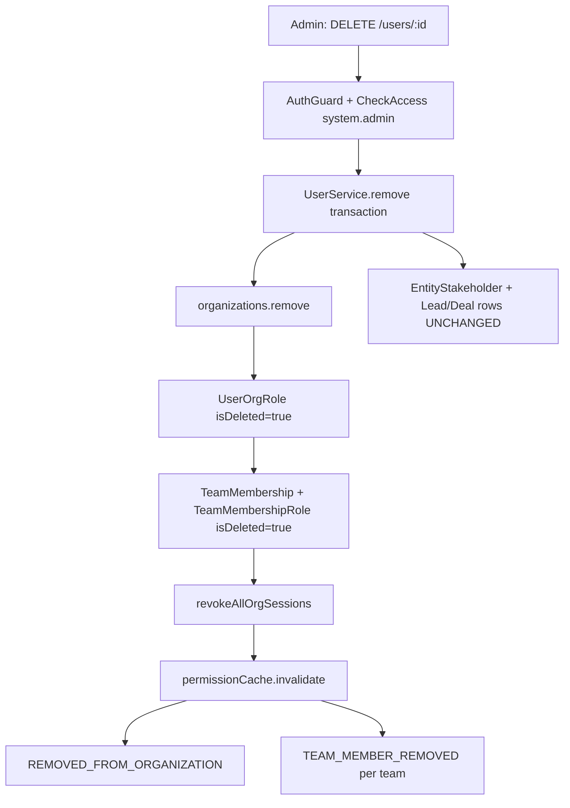

## Overview

The user removal feature enables administrators to remove users from their organization while preserving business-critical CRM data and ensuring proper access control cleanup. This implements org-scoped deactivation rather than global account deletion.

<Info>
**Core Principle**: Deactivate membership and access in one organization while retaining CRM history (leads, deals, stakeholders, commissions, activities). Managers manually reassign stale assignments; UI shows a badge on users who are no longer active org members.
</Info>

## Architecture Overview



## Key Concepts

<AccordionGroup>
<Accordion title="Terminology">

| Term | Meaning |
|------|---------|
| **Org removal** | User loses access to one organization; CRM rows stay |
| **Global user delete** | `User.isDeleted = true` — **out of scope** for this feature |
| **Active org member** | Has at least one non-deleted `UserOrgRole` for the org |
| **Removed org member** | No active `UserOrgRole` for org; may still appear on historical CRM data |

</Accordion>

<Accordion title="Critical Architectural Decision">

<Warning>
Do **not** set global `User.isDeleted` for org removal. `User` is global across orgs; `isDeleted` would remove the person everywhere and affect unique email constraints. Removal is expressed via junction soft-deletes (`UserOrgRole`, `TeamMembership`, `TeamMembershipRole`) and removing the user from the `organizations` M:N collection.
</Warning>

</Accordion>
</AccordionGroup>

## API Specification

### Endpoint

```http
DELETE /v1/users/:id
```

### Authorization

- **Authentication**: JWT with org tenant context (`organizationId` on token)
- **Permission**: `OrgPermissionKey.SYSTEM_ADMIN` via `@CheckAccess` decorator
- **Path Parameter**: `id` = target user UUID

### Authorization Matrix

| Actor | Target | Allowed? |
|-------|--------|----------|
| Any user | Self | **No** (`ForbiddenException`) |
| Admin (not Owner, not `org.owner`) | Admin or Owner | **No** |
| Admin | Non-admin, non-owner | **Yes** |
| Owner role (not `org.owner`) | Another Owner | **No** |
| `organization.owner_id` | Anyone except self | **Yes** (subject to team-leader rule) |
| User without `system.admin` | Anyone | **No** (guard) |

<Note>
**Team Leader Rule**: If target holds `team.admin` on a team and no other active member on that team holds `team.admin`, removal is blocked with `BadRequestException`.
</Note>

### Response Codes

<CodeGroup>
```json Success (200)
{
  "success": true
}
```

```json Forbidden (403)
{
  "message": "Self-removal not allowed",
  "error": "Forbidden"
}
```

```json Bad Request (400)
{
  "message": "Cannot remove last team leader from team: Engineering",
  "error": "Bad Request"
}
```

```json Not Found (404)
{
  "message": "User not found in organization",
  "error": "Not Found"
}
```
</CodeGroup>

## Implementation Details

### Transaction Flow

All operations execute within a single MikroORM transaction to ensure data consistency:

<Steps>
<Step title="Load and Validate">
Load actors (deletedByUser, target user) with organizations, orgRoles, and selectedOrganization. Validate self-removal, role hierarchy, and last team leader constraints.
</Step>

<Step title="Load Team Memberships">
Retrieve all active `TeamMembership` records where user matches target, organization matches current org, and `isDeleted: false`.
</Step>

<Step title="Update Organization Link">
Execute `user.organizations.remove(organizationToRemove)` to remove the M:N relationship.
</Step>

<Step title="Soft-Delete Org Roles">
Set `isDeleted = true` on all `UserOrgRole` records with `isDeleted: false` for the user+org combination.
</Step>

<Step title="Soft-Delete Team Memberships">
For each membership from step 2:
- Set `isDeleted = true` on all `TeamMembershipRole` records
- Set `membership.isDeleted = true`
- Collect `{teamId, teamName}` for post-commit events
</Step>

<Step title="Clear Selected Organization">
If `user.selectedOrganization.id === organizationId`, unset the selected organization.
</Step>

<Step title="Revoke Sessions">
Call `sessionService.revokeAllOrgSessions(id, organizationId)` to invalidate all org-scoped sessions.
</Step>

<Step title="Flush and Invalidate">
Execute `em.flush()` and `permissionCache.invalidate(id, organizationId)`.
</Step>
</Steps>

### Post-Transaction Events

After successful transaction completion:

1. **`REMOVED_FROM_ORGANIZATION`** event to the removed user
2. **`TEAM_MEMBER_REMOVED`** events for each team (drives WebSocket notifications)

## Data Retention

<CardGroup cols={2}>
<Card title="Preserved Data" icon="shield-check">
- User account and profile
- CRM history (leads, deals, contacts)
- EntityStakeholder relationships
- Commission percentages
- Business activity records
</Card>

<Card title="Cleaned Up Data" icon="trash">
- Organization membership
- UserOrgRole records (soft-deleted)
- TeamMembership records (soft-deleted)
- TeamMembershipRole records (soft-deleted)
- Active org sessions
</Card>
</CardGroup>

### Complete Data Retention Matrix

| Entity / Data | On Org Removal | Rationale |
|---------------|----------------|-----------|
| `User` row | **Unchanged** (`isDeleted` stays false) | Global identity; other orgs unaffected |
| `organizations` M:N | **Removed** | User no longer listed in org staff |
| `organization_users` profile | **Likely retained** | Used for display maps; historical references |
| `UserOrgRole` | **Soft-deleted** | Authoritative org membership |
| `TeamMembership` | **Soft-deleted** | Parity with team removal |
| `TeamMembershipRole` | **Soft-deleted** | Parity with team removal |
| `EntityStakeholder` | **Unchanged** | Manual reassignment; commission preserved |
| `Lead` / `Deal` / `Contact` / `Company` | **Unchanged** | Business history |
| `entity_transfer` pending | **Unchanged (v1)** | Managers resolve manually |
| `Session` (org-scoped) | **Revoked** | Security |
| `Invitation` pending | **Unchanged** | Separate flows |
| Audit `audit_log` | **New rows via triggers** | Automatic |

## Stale Assignment Detection

<Tip>
The system provides visibility into potential assignment conflicts before user removal through the stale assignments endpoint.
</Tip>

### Endpoint

```http
GET /v1/users/:id/stale-assignments
```

This endpoint uses `EntityStakeholderService.countStalePrimaryAssignmentsForUserInTransaction()` to count leads and deals where the user is the primary stakeholder.

<Note>
This is informational only and does not block removal. The system follows a manual reassignment principle where managers handle assignment redistribution after removal.
</Note>

## Side Effects by Subsystem

### Sessions
- All org sessions for target user are revoked immediately
- If removed user had this org selected, `selectedOrganization` is cleared
- Next login forces org picker without the removed organization

### Notifications
- **`REMOVED_FROM_ORGANIZATION`** sent to removed user via configured channels
- **`TEAM_MEMBER_REMOVED`** sent per team to drive WebSocket notifications

### Messaging
- Org removal triggers `messaging-cleanup.listener.ts` on `REMOVED_FROM_ORGANIZATION` event
- Team-level messaging cleanup via individual `TEAM_MEMBER_REMOVED` events

## Goals and Non-Goals

### Goals ✅

1. **Access cut-off**: Removed user cannot use org-scoped APIs or refresh org sessions
2. **RBAC cleanup**: All org roles and team roles are consistently soft-deleted
3. **Realtime/messaging cleanup**: Messaging listeners receive appropriate events
4. **CRM preservation**: No auto-unassign from leads/deals; commission data remains
5. **Discoverability**: Historical UI shows name + "Removed from org" badge
6. **Re-invite path**: Invitation accept can restore membership

### Non-Goals (v1) ❌

- Global account deletion (`User.isDeleted`)
- Auto-redistribution of leads, deals, or commission
- Bulk remove users API  
- Admin "reassignment worklist" endpoint
- Blocking removal when user has pending `EntityTransfer`
- Anonymizing PII on `User` row

## Related Systems

This feature integrates with several core systems:

- **RBAC System**: Role and permission management
- **Session System**: Org-scoped session invalidation  
- **Messaging Module**: Event-driven cleanup
- **Stakeholder System**: CRM relationship preservation
- **Soft Delete Standard**: Consistent soft-delete patterns

<Warning>
When removing users, ensure you understand the impact on business processes and have a plan for reassigning critical responsibilities before proceeding.
</Warning>