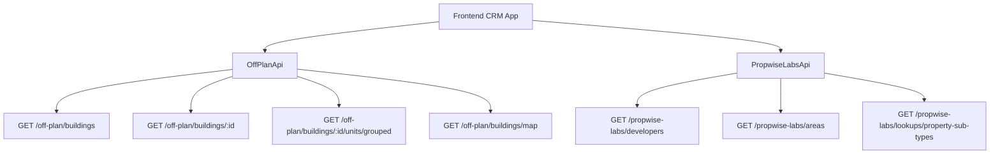

## Overview

The off-plan directory adds a new **Off-Plan** tab under the **Properties** section of the main CRM sidebar. This feature displays all published buildings from developer portal users in a card/map split view with rich filtering capabilities, 2GIS map integration, and detailed building views.

<Note>
Off-plan data is served through domain endpoints under `/off-plan/*` that read Propwise Labs catalog data and apply CRM-owned visibility from `off_plan_building_publication` with off-plan lifecycle filtering.
</Note>

## Architecture Overview

### Buildings vs Projects as Primary Entity

The implementation uses **buildings** as the primary enrichment entity because:

- Buildings have their own `coverImageUrl`, `status`, `endDate`, `completionDate`, `paymentPlans`, `images`, `documents`, `amenities`
- Buildings can override inherited fields from projects (status, area, community, description)
- The off-plan directory displays **published buildings** based on CRM `is_published` visibility

<CardGroup cols={2}>
  <Card title="List Page Endpoint" icon="list">
    `GET /off-plan/buildings` - Queries published buildings with filters
  </Card>
  <Card title="Detail Page Endpoint" icon="building">
    `GET /off-plan/buildings/:id` - Gets comprehensive building details
  </Card>
</CardGroup>

### Publication vs Lifecycle Status

<Info>
Publication is separate from Propwise Labs `building.status`. Developers publish/unpublish buildings through the developer portal, which writes to `off_plan_building_publication.is_published`.
</Info>

#### Frontend Status Mapping

| Backend `building.status` | Frontend Status | Color |
|--------------------------|-----------------|-------|
| `ACTIVE` | On Sale | Orange |
| `PENDING` | EOI | Purple |
| `FINISHED` | Out of Stock | Gray |

### Data Flow Architecture



## Implementation Guide

### 1. Sidebar Navigation

<Steps>
<Step title="Update CRM Layout">
Replace the existing real estate navigation in `src/components/layouts/CRMLayout.tsx`:

```typescript
realEstate: [
  {
    title: 'Off-Plan',
    url: '/home/properties/off-plan',
    icon: Building2,  // from lucide-react
  },
],
```
</Step>

<Step title="Update Breadcrumb System">
Replace all existing real-estate breadcrumb handling with off-plan routes:

```
Properties > Off-Plan                           (list page)
Properties > Off-Plan > {Building Name}         (detail page)
```
</Step>

<Step title="Remove Legacy Routes">
Remove breadcrumb entries for:
- `/real-estate/areas`
- `/real-estate/developments` 
- `/real-estate/units`
- `/real-estate/prospects`
</Step>
</Steps>

### 2. Route Structure

Create the following file structure:

```
src/app/home/properties/off-plan/
├── page.tsx                    # List page (grid + map toggle)
└── [id]/
    └── page.tsx                # Building detail page
```

<Warning>
Both page files should contain ONLY the page function and stay under 200 lines following the component extraction guide.
</Warning>

### 3. Component Architecture

<AccordionGroup>
<Accordion title="List Page Components">
```
src/components/pages/off-plan/
├── off-plan-building-card.tsx          # Building card for grid view
├── off-plan-filters.tsx               # Horizontal filter bar
├── off-plan-map-view.tsx              # 2GIS map with markers + popover
├── off-plan-grid-view.tsx             # Scrollable grid + infinite scroll
├── off-plan-toolbar.tsx               # View toggle, sort, saved filters
```
</Accordion>

<Accordion title="Detail Page Components">
```
├── building-detail-header.tsx          # Sticky sidebar with key info
├── building-detail-description.tsx     # Description with Read More
├── building-detail-units.tsx           # Units grouped by bedrooms
├── building-detail-unit-modal.tsx      # Unit detail popup
├── building-detail-images.tsx          # Image grid with lightbox
├── building-detail-amenities.tsx       # Features/Amenities grid
├── building-detail-location.tsx        # Location with 2GIS map
├── building-detail-info-table.tsx      # Details table
├── building-detail-payment-plan.tsx    # Payment plan visualization
├── building-detail-documents.tsx       # PDF documents & links
├── building-detail-developer.tsx       # Developer info card
```
</Accordion>
</AccordionGroup>

### 4. API Implementation

<Tabs>
<Tab title="Off-Plan API">
Create `src/services/api/off-plan.api.ts`:

```typescript
export interface OffPlanBuildingFilters {
  q?: string;
  status?: string;
  areaId?: number;
  communityId?: number;
  developerId?: number;
  developerIds?: number[];
  propertyTypeId?: number;
  propertySubTypeId?: number;
  priceMode?: 'unit' | 'sqft';
  minPrice?: number;
  maxPrice?: number;
  bedrooms?: string;
  completionBefore?: string;
  completionAfter?: string;
  maxPreHandoverPercent?: number;
  page?: number;
  limit?: number;
  sortBy?: string;
  sortOrder?: 'asc' | 'desc';
}

export class OffPlanApi {
  static async searchBuildings(filters: OffPlanBuildingFilters) {
    return apiClient.get('/off-plan/buildings', { 
      params: supportedBuildingParams(filters) 
    });
  }

  static async getBuildingDetail(id: number) {
    return apiClient.get(`/off-plan/buildings/${id}`);
  }

  static async getBuildingUnitsGrouped(buildingId: number) {
    return apiClient.get(`/off-plan/buildings/${buildingId}/units/grouped`);
  }

  static async getMapMarkers(filters?: MapMarkerFilters) {
    return apiClient.get('/off-plan/buildings/map', { 
      params: supportedMapParams(filters) 
    });
  }

  static async searchDevelopers(q?: string) {
    return apiClient.get('/propwise-labs/developers', { params: { q } });
  }

  static async searchAreas(q?: string, cityId?: number) {
    return apiClient.get('/propwise-labs/areas', { params: { q, cityId } });
  }

  static async getPropertySubTypes() {
    return apiClient.get('/propwise-labs/lookups/property-sub-types');
  }
}
```
</Tab>

<Tab title="Response Types">
```typescript
// Raw catalog types in propwise-labs.api.ts
export interface PropwiseLabsBuilding { ... }
export interface PropwiseLabsUnit { ... }
export interface PropwiseLabsUnitGroup { ... }
export interface PropwiseLabsAmenity { ... }
export interface PropwiseLabsPaymentPlan { ... }
export interface PropwiseLabsDocument { ... }

// Off-plan extensions in off-plan.api.ts
export interface OffPlanBuilding extends PropwiseLabsBuilding {
  isPublished?: boolean;
  publishedAt?: string;
  unpublishedAt?: string;
  developerContact?: PropwiseLabsDeveloperContact;
  developer?: PropwiseLabsDeveloperOption;
}
```
</Tab>
</AccordionGroup>

## Key Features

### List Page Features

<CardGroup cols={2}>
  <Card title="Grid View" icon="grid-3x3">
    Cards with cover image, status badges, handover quarter, building name, area + developer, price from, and payment plan ratio
  </Card>
  <Card title="Map View" icon="map">
    Split layout with scrollable card list on left, 2GIS interactive map on right with custom circular developer-logo markers
  </Card>
</CardGroup>

### Filter System

<Check>
Leads-style compact search input + Filters popover with dropdown buttons for:
- Developer (searchable multi-select)
- Price range
- Payment terms
- Handover timeline
- Unit type
- Bedrooms
- Status
</Check>

### Detail Page Layout

<Steps>
<Step title="Sticky Sidebar">
Right-positioned sidebar containing:
- Building name and key metrics
- Price range and unit count
- Primary payment plan
- Developer information
- CTA buttons
</Step>

<Step title="Scrollable Content">
Left content area with sections for:
- Description with Read More
- Units & availability (grouped by bedrooms)
- Parking information
- Image galleries
- Features/amenities
- Location with embedded map
- General plan
- Details table
- Payment plan visualization
- Documents & links
- Developer profile
</Step>
</Steps>

## Technical Considerations

<Warning>
The off-plan directory endpoints always enforce the off-plan lifecycle in code. Callers do not pass a `type` query parameter.
</Warning>

<Tip>
The lifecycle helper treats `ACTIVE` and `PENDING` as off-plan statuses and intentionally excludes `UNKNOWN` from off-plan. `UNKNOWN` remains secondary-eligible only on raw `/propwise-labs/*` catalog endpoints.
</Tip>

### Data Consistency

<Info>
Frontend display status is derived from `building.status` through `getOffPlanFrontendStatus()` and drives building cards, map marker colors, map legend labels, and detail table sale status consistently.
</Info>

### Map Integration

The 2GIS map integration includes:
- Custom circular markers with developer logos
- Marker border colors indicating building status
- Interactive popover previews on hover
- Synchronized filtering with the list view

## Migration Notes

<Note>
This implementation replaces the existing Areas, Developments, and Units tabs. All previous real estate navigation entries should be removed when implementing the off-plan directory.
</Note>

The new off-plan directory supersedes legacy property browsing functionality and provides a more comprehensive, developer-focused view of available properties.