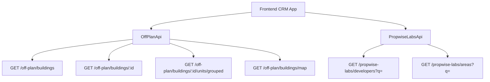

## Overview

This document specifies the implementation of the **Off-Plan** directory feature, which adds a dedicated tab under the **Properties** section of the main CRM sidebar. The feature displays all published buildings from developer portal users in a card/map split view with rich filters, 2GIS map integration, and a detailed building view.

<Note>
**Backend facade:** Off-plan data is served through domain endpoints under `/off-plan/*`. These endpoints read Propwise Labs catalog data and apply CRM-owned visibility from `off_plan_building_publication` plus the off-plan lifecycle helper, so main CRM users only receive buildings with `is_published=true` that still classify as off-plan.
</Note>

The lower-level `/propwise-labs/*` endpoints remain raw catalog access and support explicit lifecycle filtering for off-plan, secondary, or all catalog records.

---

## Reference Screenshots

The implementation follows a competitor platform design with these key visual patterns:

<AccordionGroup>
  <Accordion title="List page (grid view)">
    Cards display:
    - Cover image
    - Frontend status badges (On Sale, Out of Stock, EOI)
    - Building name
    - **Starting {price}** when `stats.startingPrice` exists (hidden otherwise)
    - Compact unit-availability row (Available / Reserved / Sold from `stats.unitsByStatus`)
    - Bottom metadata badges: handover quarter (`endDate` → `Q1 2028`), area, developer
    
    Villa-project cards render the same availability row and handover badge from project `stats.unitsByStatus` / `endDate`.
  </Accordion>

  <Accordion title="List page (map view)">
    Split layout features:
    - Scrollable card list on left
    - 2GIS interactive map on right with custom circular developer-logo markers
    - Hover popover previews anchored above each marker
    - **Bidirectional sync**: Marker hover scrolls left card list to matching building and highlights card with same status color as marker border
    - Hovering left-list card pans map to center that item's marker, highlights it, and opens mini preview card
    - When marker isn't in loaded set, map drops temporary pin from card's `lat`/`lng` and runs "Search this area"
    - Clicking marker, map preview card, or focused list card opens animated building detail panel over left list
  </Accordion>

  <Accordion title="Filters bar">
    - Leads-style compact search input + Filters popover under page title
    - Quick dropdown buttons: Developer, Price, Payments, Handover, Bedrooms, Status
    - No tabs shown on Off-Plan page
  </Accordion>

  <Accordion title="Map detail panel">
    Animated left-column overlay with:
    - Figma-matched header: building name, area, close action
    - Underline tabs: Overview, Units, Media, Contact
    - **Overview tab**:
      - Cover image with bottom-left price overlay (`stats.startingPrice` via `getOffPlanStartingPrice()` + `currency`, or **Price upon request**)
      - Description with three-line collapse and blue **Show more** control
      - Building details table
      - Construction progress from `building.percentCompleted`
      - Four-card unit availability summary (Total Units, Available, Reserved, Sold)
      - Payment plan
      - Amenities
      - Location
    - Total Units from `building.stats?.unitsCount`
    - Available/Reserved/Sold from authoritative `building.stats?.unitsByStatus` aggregate
    - No "Back to list" button; closing returns to map/list split
  </Accordion>

  <Accordion title="Building detail route">
    `/properties/off-plan/:buildingId` renders the same map-mode off-plan page and opens the building detail panel on the left. There is no separate full-page detail layout.
  </Accordion>
</AccordionGroup>

---

## Architecture Decision

### Buildings vs Projects as Primary Entity

**Buildings** are the primary enrichment entity based on the existing data model:

<CardGroup cols={2}>
  <Card title="Building-Specific Data" icon="building">
    - `coverImageUrl`
    - `status`
    - `endDate`, `completionDate`
    - `paymentPlans`
    - `images`, `documents`
    - `amenities`
  </Card>
  
  <Card title="Override Capability" icon="arrows-rotate">
    Buildings can override inherited fields from projects:
    - Status
    - Area
    - Community
    - Description
  </Card>
</CardGroup>

<Info>
The off-plan directory displays **published buildings** based on CRM `is_published` visibility, since a project may contain multiple buildings with different lifecycle statuses and pricing.
</Info>

The list page queries `GET /off-plan/buildings`, and the detail page queries `GET /off-plan/buildings/:id`.

### Publication System

Publication is separate from Propwise Labs `building.status`. Developers publish or unpublish buildings through the developer portal, which writes `off_plan_building_publication.is_published` for the Propwise Labs `building_id`.

<Steps>
  <Step title="Draft state">
    Missing publication rows are treated as draft/unpublished
  </Step>
  
  <Step title="Unpublishing">
    Unpublishing keeps the row with `unpublished_at` plus `unpublished_by_id` for audit
  </Step>
</Steps>

### Publish-Readiness Gate

<Warning>
Before flipping `is_published=true`, the publish endpoints (`PATCH /developer-portal/buildings/:id/publication` and `PATCH /developer-portal/projects/:id/publication`) re-validate the persisted entity against the required-field contract.
</Warning>

**Building requirements** (13-field "complete building" contract + `salesStatus`):
- `name`
- `buildingNumber`
- `descriptionEn`
- `floors`
- `googleMapsLink`
- `startDate`
- `coverImageUrl`
- `area.id`
- `plotSize`
- `actualArea`
- `parkingCount`
- `serviceChargePerSqft`
- ≥1 `media`
- `salesStatus`

**Villa project requirements**:
- `name`
- `descriptionEn`
- `imageUrl` cover
- `googleMapsLink`
- `area.id`
- `latitude`, `longitude`
- ≥1 `media`
- `salesStatus`

<Note>
All missing fields are aggregated into a single `400 BadRequest` so the dev-portal UI can list every missing field in one toast/banner. Unpublishing always succeeds—it bypasses the readiness gate so stale or sparse records can be pulled back to draft.
</Note>

See `Docs/REAL_ESTATE_MODULE_SPECIFICATION.md` (`OffPlanBuildingPublication` and `OffPlanProjectPublication` sections) for the canonical contract and implementing guards (`assertBuildingReadyToPublish`, `assertVillaProjectReadyToPublish`).

### Auto-Maintained Sales Status

<Info>
A building's/villa-project's `salesStatus` (`ANNOUNCED | EOI | ON_SALE | OUT_OF_STOCK`) is now auto-maintained from live unit availability by the developer portal.
</Info>

**Reconciliation rules:**

When a developer changes a unit's `salesStatus` (or creates a unit), `ProjectManagementService`:

1. Recounts the direct owner's units
2. Sets `salesStatus = OUT_OF_STOCK` once **no** units remain `AVAILABLE` (every unit `RESERVED` or `SOLD`)
3. Reverts to `ON_SALE` when an `AVAILABLE` unit reappears

<Tip>
For `Buildings`-type projects the **building** is reconciled; for `Villas`-type projects the **project** is reconciled.
</Tip>

This is the same `salesStatus` value the publish-readiness gate requires and that downstream off-plan card/map/detail surfaces read, so a sold-out building or villa project reflects "Out of Stock" in the directory without manual edit.

<Note>
This is distinct from the frontend status badge, which is derived from `building.status` (schedule-driven) via `getOffPlanFrontendStatus()`.
</Note>

See `Docs/REAL_ESTATE_MODULE_SPECIFICATION.md` → "Auto Out-of-Stock sales-status sync" for resolver rules, trigger paths, and the accepted v1 auto-revert limitation.

### Lifecycle Enforcement

Off-plan directory endpoints always enforce the off-plan lifecycle in code; callers do not pass a `type` query parameter.

<Check>
The lifecycle helper treats `ACTIVE` and `PENDING` as off-plan statuses and intentionally excludes `UNKNOWN` from off-plan.
</Check>

<Warning>
`UNKNOWN` remains secondary-eligible only on the raw `/propwise-labs/*` catalog endpoints when `type=secondary` is requested.
</Warning>

### Frontend Display Status

Frontend display status is derived from `building.status` through `getOffPlanFrontendStatus()`:

| Backend `building.status` | Frontend status | Color  |
| ------------------------- | --------------- | ------ |
| `ACTIVE`                  | On Sale         | Orange |
| `PENDING`                 | EOI             | Purple |
| `FINISHED`                | Out of Stock    | Gray   |

The same helper drives:
- Building cards
- Map marker colors
- Map legend labels
- Detail table sale status

<Info>
The map legend (`OFF_PLAN_FRONTEND_STATUS_LABELS` in `off-plan-display-utils.ts`) renders left-to-right as **Announced → EOI → On Sale → Out of Stock**.
</Info>

### Data Flow



<Tabs>
  <Tab title="Off-Plan Endpoints">
    The `/off-plan/buildings` list, detail, map, and grouped-unit endpoints enforce publication by checking `off_plan_building_publication.is_published=true` before returning building data to main CRM users.
    
    They also require the building to match the off-plan lifecycle helper; secondary and `UNKNOWN` lifecycle records are hidden from the off-plan directory even if a publication row exists.
  </Tab>
  
  <Tab title="Propwise Labs Endpoints">
    Generic lookup endpoints remain on `/propwise-labs/*` because they are global catalog data shared by off-plan, secondary, developer portal, and future property-interest flows.
  </Tab>
</Tabs>

---

## 1. Sidebar Navigation

### File: `src/components/layouts/CRMLayout.tsx`

<Steps>
  <Step title="Replace real estate array">
    **Replace** the entire `data.realEstate` array with a single "Off-Plan" entry. The existing Areas, Developments, and Units tabs are removed—the off-plan directory supersedes them.
    
    ```typescript
    realEstate: [
      {
        title: 'Off-Plan',
        url: '/properties/off-plan',
        icon: Building2,  // from lucide-react (already imported)
      },
    ],
    ```
  </Step>
  
  <Step title="Remove old sidebar entries">
    **Remove** the old sidebar entries for Areas, Developments, and Units.
  </Step>
</Steps>

### Breadcrumb

<Warning>
**Replace** all existing real-estate breadcrumb handling (areas, developments, units) with off-plan routes.
</Warning>

```
Properties > Off-Plan                           (list page)
Properties > Off-Plan > {Building Name}         (map page with open detail panel)
```

<Check>
Remove the breadcrumb entries for:
- `/real-estate/areas`
- `/real-estate/developments`
- `/real-estate/units`
- `/real-estate/prospects`
</Check>

---

## 2. Route Structure

```
src/app/(app)/properties/off-plan/
├── page.tsx                    # Map/list page; handles open building panel based on pathname
└── [id]/
    └── page.tsx                # Re-exports ../page so /:id opens same map page with panel
```

<Warning>
The `[id]/page.tsx` route must not implement a separate building detail page. It delegates to the main off-plan page so `/properties/off-plan/:buildingId` preserves the map, filters, and left-side panel behavior.
</Warning>

---

## 3. Component Structure

```
src/components/pages/off-plan/
├── index.ts                           # Barrel export
│
│   ── List Page Components ──
├── off-plan-building-card.tsx          # Building card for grid view
├── off-plan-filters.tsx               # Horizontal filter bar
├── off-plan-map-view.tsx              # 2GIS map with markers + popover
├── off-plan-grid-view.tsx             # Scrollable grid of building cards + infinite scroll
├── off-plan-building-detail-panel.tsx  # Animated map-mode detail panel with tabs
├── off-plan-toolbar.tsx               # View toggle (Grid/Map), sort, saved filters
│
│   ── Detail Page Components ──
├── building-detail-header.tsx          # Sticky sidebar: name, price, units, payment plan
├── building-detail-description.tsx     # Description section with Read More
├── building-detail-unit-summary.tsx    # Four-card unit availability summary
├── building-detail-payment-plan.tsx    # Payment plan display
├── building-detail-amenities.tsx       # Amenities grid
├── building-detail-location.tsx        # 2GIS embedded map + address
├── building-detail-progress.tsx        # Construction progress bar
│
│   ── Shared Components ──
├── off-plan-status-badge.tsx          # Frontend status badge (On Sale, EOI, Out of Stock)
├── off-plan-price-display.tsx         # Price formatter with "Starting from" or "Price upon request"
├── off-plan-unit-availability-row.tsx  # Compact availability row for cards
└── off-plan-map-marker.tsx            # Custom 2GIS marker with developer logo
```

---

## 4. API Layer

### File: `src/lib/api/off-plan-api.ts`

<CodeGroup>

```typescript New OffPlanApi Service
import { apiClient } from './client';
import type {
  OffPlanBuilding,
  OffPlanBuildingDetail,
  OffPlanBuildingsFilters,
  OffPlanMapMarker,
  GroupedUnits,
} from '@/types/off-plan';

export const offPlanApi = {
  /**
   * List published off-plan buildings with filters
   */
  async getBuildings(filters: OffPlanBuildingsFilters) {
    const params = new URLSearchParams();
    
    if (filters.search) params.set('search', filters.search);
    if (filters.developerId) params.set('developerId', filters.developerId);
    if (filters.areaId) params.set('areaId', filters.areaId);
    if (filters.minPrice) params.set('minPrice', filters.minPrice.toString());
    if (filters.maxPrice) params.set('maxPrice', filters.maxPrice.toString());
    if (filters.bedrooms?.length) params.set('bedrooms', filters.bedrooms.join(','));
    if (filters.status?.length) params.set('status', filters.status.join(','));
    if (filters.handoverQuarter) params.set('handoverQuarter', filters.handoverQuarter);
    if (filters.paymentPlan) params.set('paymentPlan', filters.paymentPlan);
    
    params.set('page', filters.page?.toString() || '1');
    params.set('limit', filters.limit?.toString() || '20');
    
    if (filters.sortBy) params.set('sortBy', filters.sortBy);
    if (filters.sortOrder) params.set('sortOrder', filters.sortOrder);
    
    return apiClient.get<{
      items: OffPlanBuilding[];
      total: number;
      page: number;
      limit: number;
    }>(`/off-plan/buildings?${params}`);
  },

  /**
   * Get single building detail
   */
  async getBuildingDetail(id: string) {
    return apiClient.get<OffPlanBuildingDetail>(`/off-plan/buildings/${id}`);
  },

  /**
   * Get map markers (lightweight data for map view)
   */
  async getMapMarkers(filters: Omit<OffPlanBuildingsFilters, 'page' | 'limit'>) {
    const params = new URLSearchParams();
    
    if (filters.search) params.set('search', filters.search);
    if (filters.developerId) params.set('developerId', filters.developerId);
    if (filters.areaId) params.set('areaId', filters.areaId);
    if (filters.minPrice) params.set('minPrice', filters.minPrice.toString());
    if (filters.maxPrice) params.set('maxPrice', filters.maxPrice.toString());
    if (filters.bedrooms?.length) params.set('bedrooms', filters.bedrooms.join(','));
    if (filters.status?.length) params.set('status', filters.status.join(','));
    if (filters.handoverQuarter) params.set('handoverQuarter', filters.handoverQuarter);
    
    return apiClient.get<OffPlanMapMarker[]>(`/off-plan/buildings/map?${params}`);
  },

  /**
   * Get grouped units for a building (for Units tab)
   */
  async getGroupedUnits(buildingId: string) {
    return apiClient.get<GroupedUnits>(`/off-plan/buildings/${buildingId}/units/grouped`);
  },
};
```

```typescript PropwiseLabsApi Extensions
// Add to existing src/lib/api/propwise-labs-api.ts

export const propwiseLabsApi = {
  // ... existing methods ...

  /**
   * Search developers (for filter dropdown)
   */
  async searchDevelopers(query: string) {
    return apiClient.get<Array<{ id: string; name: string; logoUrl?: string }>>(
      `/propwise-labs/developers?q=${encodeURIComponent(query)}`
    );
  },

  /**
   * Search areas (for filter dropdown)
   */
  async searchAreas(query: string) {
    return apiClient.get<Array<{ id: string; name: string }>>(
      `/propwise-labs/areas?q=${encodeURIComponent(query)}`
    );
  },
};
```

</CodeGroup>

---

## 5. Type Definitions

### File: `src/types/off-plan.ts`

<CodeGroup>

```typescript Core Types
export type OffPlanFrontendStatus = 'On Sale' | 'EOI' | 'Out of Stock';

export interface OffPlanBuilding {
  id: string;
  name: string;
  buildingNumber?: string;
  coverImageUrl?: string;
  area: {
    id: string;
    name: string;
  };
  developer: {
    id: string;
    name: string;
    logoUrl?: string;
  };
  project?: {
    id: string;
    name: string;
  };
  
  // Lifecycle status
  status: 'ACTIVE' | 'PENDING' | 'FINISHED';
  frontendStatus: OffPlanFrontendStatus;  // Derived
  
  // Pricing
  stats?: {
    startingPrice?: number;
    currency?: string;
    unitsCount?: number;
    unitsByStatus?: {
      available: number;
      reserved: number;
      sold: number;
    };
  };
  
  // Dates
  endDate?: string;  // ISO date for handover
  handoverQuarter?: string;  // Derived: "Q1 2028"
  
  // Location
  latitude?: number;
  longitude?: number;
  googleMapsLink?: string;
  
  // Quick metadata
  bedroomRange?: string;  // e.g., "1-3 BR"
  plotSize?: number;
}

export interface OffPlanBuildingDetail extends OffPlanBuilding {
  descriptionEn?: string;
  descriptionAr?: string;
  floors?: number;
  actualArea?: number;
  parkingCount?: number;
  serviceChargePerSqft?: number;
  percentCompleted?: number;
  
  // Rich data
  paymentPlans?: Array<{
    id: string;
    name: string;
    downPayment: number;
    duringConstruction: number;
    onHandover: number;
    postHandover?: number;
    installmentMonths?: number;
  }>;
  
  amenities?: Array<{
    id: string;
    name: string;
    iconUrl?: string;
  }>;
  
  media?: Array<{
    id: string;
    url: string;
    type: 'IMAGE' | 'VIDEO';
    caption?: string;
  }>;
  
  documents?: Array<{
    id: string;
    name: string;
    url: string;
    type: string;
  }>;
  
  // Contact
  salesContact?: {
    name: string;
    phone: string;
    email: string;
  };
}
```

```typescript Filter & Map Types
export interface OffPlanBuildingsFilters {
  search?: string;
  developerId?: string;
  areaId?: string;
  minPrice?: number;
  maxPrice?: number;
  bedrooms?: number[];
  status?: OffPlanFrontendStatus[];
  handoverQuarter?: string;
  paymentPlan?: string;
  
  page?: number;
  limit?: number;
  sortBy?: 'price' | 'handover' | 'name';
  sortOrder?: 'asc' | 'desc';
}

export interface OffPlanMapMarker {
  id: string;
  name: string;
  latitude: number;
  longitude: number;
  frontendStatus: OffPlanFrontendStatus;
  developer: {
    name: string;
    logoUrl?: string;
  };
  stats?: {
    startingPrice?: number;
    currency?: string;
  };
  coverImageUrl?: string;
}

export interface GroupedUnits {
  groups: Array<{
    bedrooms: number;
    unitType: string;
    count: number;
    availableCount: number;
    priceRange: {
      min: number;
      max: number;
      currency: string;
    };
    areaRange: {
      min: number;
      max: number;
    };
  }>;
}
```

</CodeGroup>

---

## 6. Implementation Steps

<Steps>
  <Step title="Backend foundation">
    Ensure `/off-plan/*` endpoints are implemented with:
    - Publication filtering (`is_published=true`)
    - Off-plan lifecycle enforcement
    - Grouped units endpoint
    - Map markers endpoint
  </Step>
  
  <Step title="API layer">
    Create `off-plan-api.ts` with typed methods for:
    - Building listing with pagination
    - Building detail
    - Map markers
    - Grouped units
    - Extend `propwise-labs-api.ts` for developer/area search
  </Step>
  
  <Step title="Type definitions">
    Create `src/types/off-plan.ts` with all interfaces
  </Step>
  
  <Step title="Utility functions">
    Create `src/lib/utils/off-plan-display-utils.ts` with:
    - `getOffPlanFrontendStatus()`
    - `getOffPlanStartingPrice()`
    - `formatHandoverQuarter()`
    - `OFF_PLAN_FRONTEND_STATUS_LABELS`
  </Step>
  
  <Step title="Sidebar navigation">
    Update `CRMLayout.tsx`:
    - Replace real estate array with Off-Plan entry
    - Update breadcrumb logic
  </Step>
  
  <Step title="Route structure">
    Create route files:
    - `/properties/off-plan/page.tsx`
    - `/properties/off-plan/[id]/page.tsx` (re-export parent)
  </Step>
  
  <Step title="Shared components">
    Build foundational components:
    - `off-plan-status-badge.tsx`
    - `off-plan-price-display.tsx`
    - `off-plan-unit-availability-row.tsx`
  </Step>
  
  <Step title="List view">
    Implement grid view:
    - `off-plan-building-card.tsx`
    - `off-plan-grid-view.tsx` with infinite scroll
    - `off-plan-toolbar.tsx`
  </Step>
  
  <Step title="Filters">
    Build `off-plan-filters.tsx` with all filter controls
  </Step>
  
  <Step title="Map view">
    Implement 2GIS integration:
    - `off-plan-map-view.tsx`
    - `off-plan-map-marker.tsx`
    - Bidirectional hover sync
    - Map popover previews
  </Step>
  
  <Step title="Detail panel">
    Build animated panel:
    - `off-plan-building-detail-panel.tsx` (shell with tabs)
    - Overview tab components
    - Units tab with grouped display
    - Media tab with gallery
    - Contact tab
  </Step>
  
  <Step title="Main page integration">
    Wire everything in `page.tsx`:
    - View state management
    - Filter state
    - Panel open/close logic
    - URL sync for building detail route
  </Step>
</Steps>

---

## 7. Key Features to Implement

### Bidirectional Map-List Sync

<Info>
The map and list views must maintain perfect synchronization for hover and focus states.
</Info>

**Map marker hover:**
1. Highlight marker border with status color
2. Show popover preview above marker
3. Scroll left list to matching card
4. Highlight card with same status color

**List card hover:**
1. Pan map to center on building location
2. Highlight corresponding marker
3. Open same popover preview above marker
4. If marker not loaded: drop temporary pin, trigger "Search this area"

### Frontend Status Derivation

<CodeGroup>

```typescript getOffPlanFrontendStatus()
export function getOffPlanFrontendStatus(
  status: 'ACTIVE' | 'PENDING' | 'FINISHED' | 'UNKNOWN'
): OffPlanFrontendStatus {
  switch (status) {
    case 'ACTIVE':
      return 'On Sale';
    case 'PENDING':
      return 'EOI';
    case 'FINISHED':
      return 'Out of Stock';
    default:
      return 'Out of Stock';
  }
}
```

```typescript Status Colors
export const OFF_PLAN_STATUS_COLORS: Record<OffPlanFrontendStatus, string> = {
  'On Sale': 'orange',
  'EOI': 'purple',
  'Out of Stock': 'gray',
};
```

</CodeGroup>

### Price Display Logic

<CodeGroup>

```typescript getOffPlanStartingPrice()
export function getOffPlanStartingPrice(building: OffPlanBuilding): string | null {
  if (!building.stats?.startingPrice) {
    return null;
  }
  
  const currency = building.stats.currency || 'AED';
  const formatted = new Intl.NumberFormat('en-US', {
    style: 'currency',
    currency,
    minimumFractionDigits: 0,
    maximumFractionDigits: 0,
  }).format(building.stats.startingPrice);
  
  return `Starting ${formatted}`;
}
```

```typescript Price Display Component
export function OffPlanPriceDisplay({ building }: { building: OffPlanBuilding }) {
  const priceText = getOffPlanStartingPrice(building);
  
  return (
    <div className="text-lg font-semibold">
      {priceText || 'Price upon request'}
    </div>
  );
}
```

</CodeGroup>

### Handover Quarter Formatting

<CodeGroup>

```typescript formatHandoverQuarter()
export function formatHandoverQuarter(endDate?: string): string | null {
  if (!endDate) return null;
  
  const date = new Date(endDate);
  const year = date.getFullYear();
  const month = date.getMonth() + 1;
  
  const quarter = Math.ceil(month / 3);
  
  return `Q${quarter} ${year}`;
}
```

</CodeGroup>

### Unit Availability Summary

<Tip>
Total Units comes from `building.stats?.unitsCount`. Available/Reserved/Sold come from the authoritative `building.stats?.unitsByStatus` aggregate.
</Tip>

<CodeGroup>

```typescript Unit Availability Row
export function OffPlanUnitAvailabilityRow({ building }: { building: OffPlanBuilding }) {
  const { available = 0, reserved = 0, sold = 0 } = building.stats?.unitsByStatus || {};
  
  return (
    <div className="flex gap-4 text-sm">
      <div className="flex items-center gap-1">
        <div className="h-2 w-2 rounded-full bg-green-500" />
        <span>{available} Available</span>
      </div>
      <div className="flex items-center gap-1">
        <div className="h-2 w-2 rounded-full bg-yellow-500" />
        <span>{reserved} Reserved</span>
      </div>
      <div className="flex items-center gap-1">
        <div className="h-2 w-2 rounded-full bg-gray-500" />
        <span>{sold} Sold</span>
      </div>
    </div>
  );
}
```

```typescript Four-Card Summary
export function BuildingDetailUnitSummary({ building }: Props) {
  const total = building.stats?.unitsCount || 0;
  const { available = 0, reserved = 0, sold = 0 } = building.stats?.unitsByStatus || {};
  
  return (
    <div className="grid grid-cols-4 gap-4">
      <SummaryCard label="Total Units" value={total} />
      <SummaryCard label="Available" value={available} color="green" />
      <SummaryCard label="Reserved" value={reserved} color="yellow" />
      <SummaryCard label="Sold" value={sold} color="gray" />
    </div>
  );
}
```

</CodeGroup>

<Warning>
Fall back to grouped unit `salesStatus`/`availabilityStatus` counting only when the aggregate is absent.
</Warning>

---

## 8. 2GIS Map Integration

### Map Initialization

<CodeGroup>

```typescript 2GIS Map Setup
import { useEffect, useRef } from 'react';

export function OffPlanMapView({ markers, onMarkerClick, onMarkerHover }: Props) {
  const mapRef = useRef<any>(null);
  const mapContainerRef = useRef<HTMLDivElement>(null);
  
  useEffect(() => {
    if (!mapContainerRef.current) return;
    
    // Initialize 2GIS map
    const map = window.DG.map(mapContainerRef.current, {
      center: [25.2048, 55.2708], // Dubai coordinates
      zoom: 11,
    });
    
    mapRef.current = map;
    
    return () => {
      map.remove();
    };
  }, []);
  
  // Add markers, hover handlers, etc.
  
  return <div ref={mapContainerRef} className="h-full w-full" />;
}
```

</CodeGroup>

### Custom Markers with Developer Logos

<CodeGroup>

```typescript Custom Marker Creation
function createCustomMarker(marker: OffPlanMapMarker) {
  const statusColor = OFF_PLAN_STATUS_COLORS[marker.frontendStatus];
  
  const icon = window.DG.divIcon({
    html: `
      <div class="custom-marker" style="border-color: ${statusColor}">
        ${marker.developer.logoUrl 
          ? ``
          : `<span>${marker.developer.name[0]}</span>`
        }
      </div>
    `,
    className: 'off-plan-marker',
    iconSize: [40, 40],
    iconAnchor: [20, 20],
  });
  
  return window.DG.marker([marker.latitude, marker.longitude], { icon });
}
```

```css Marker Styles
.custom-marker {
  width: 40px;
  height: 40px;
  border: 3px solid;
  border-radius: 50%;
  background: white;
  display: flex;
  align-items: center;
  justify-content: center;
  overflow: hidden;
  box-shadow: 0 2px 8px rgba(0,0,0,0.15);
}

.custom-marker img {
  width: 100%;
  height: 100%;
  object-fit: cover;
}

.custom-marker span {
  font-size: 18px;
  font-weight: 600;
  color: #333;
}
```

</CodeGroup>

### Marker Hover Popover

<Info>
The hover popover shows a mini building card with cover image, name, price, and availability. It's anchored above the marker.
</Info>

<CodeGroup>

```typescript Popover Component
export function MapMarkerPopover({ building, position }: Props) {
  const priceText = getOffPlanStartingPrice(building);
  
  return (
    <div 
      className="absolute z-50 w-64 bg-white rounded-lg shadow-xl border border-gray-200"
      style={{ 
        left: position.x, 
        top: position.y - 10,
        transform: 'translate(-50%, -100%)',
      }}
    >
      {building.coverImageUrl && (
        
      )}
      <div className="p-3">
        <h3 className="font-semibold text-sm mb-1">{building.name}</h3>
        <p className="text-xs text-gray-600 mb-2">{building.area.name}</p>
        <div className="text-sm font-medium text-primary-600">
          {priceText || 'Price upon request'}
        </div>
        <OffPlanUnitAvailabilityRow building={building} />
      </div>
      <div className="absolute -bottom-2 left-1/2 -translate-x-1/2 w-4 h-4 bg-white border-r border-b border-gray-200 rotate-45" />
    </div>
  );
}
```

</CodeGroup>

---

## 9. Animated Detail Panel

### Panel Shell with Tabs

<CodeGroup>

```typescript Detail Panel Component
export function OffPlanBuildingDetailPanel({ 
  buildingId, 
  isOpen, 
  onClose 
}: Props) {
  const [activeTab, setActiveTab] = useState<'overview' | 'units' | 'media' | 'contact'>('overview');
  const { data: building, isLoading } = useQuery({
    queryKey: ['off-plan-building', buildingId],
    queryFn: () => offPlanApi.getBuildingDetail(buildingId),
    enabled: isOpen && !!buildingId,
  });
  
  return (
    <div 
      className={cn(
        'fixed left-0 top-0 h-screen w-[480px] bg-white shadow-2xl transform transition-transform duration-300 z-50',
        isOpen ? 'translate-x-0' : '-translate-x-full'
      )}
    >
      {/* Header */}
      <div className="sticky top-0 bg-white border-b border-gray-200 z-10">
        <div className="flex items-center justify-between p-4">
          <div className="flex-1">
            <h2 className="text-xl font-semibold">{building?.name}</h2>
            <p className="text-sm text-gray-600">{building?.area.name}</p>
          </div>
          <button onClick={onClose} className="p-2 hover:bg-gray-100 rounded-lg">
            <X className="h-5 w-5" />
          </button>
        </div>
        
        {/* Tabs */}
        <div className="flex border-b border-gray-200">
          <TabButton 
            active={activeTab === 'overview'} 
            onClick={() => setActiveTab('overview')}
          >
            Overview
          </TabButton>
          <TabButton 
            active={activeTab === 'units'} 
            onClick={() => setActiveTab('units')}
          >
            Units
          </TabButton>
          <TabButton 
            active={activeTab === 'media'} 
            onClick={() => setActiveTab('media')}
          >
            Media
          </TabButton>
          <TabButton 
            active={activeTab === 'contact'} 
            onClick={() => setActiveTab('contact')}
          >
            Contact
          </TabButton>
        </div>
      </div>
      
      {/* Content */}
      <div className="overflow-y-auto h-[calc(100vh-140px)]">
        {isLoading ? (
          <div className="flex items-center justify-center h-64">
            <Loader2 className="h-8 w-8 animate-spin text-primary-600" />
          </div>
        ) : (
          <>
            {activeTab === 'overview' && <OverviewTab building={building} />}
            {activeTab === 'units' && <UnitsTab buildingId={buildingId} />}
            {activeTab === 'media' && <MediaTab building={building} />}
            {activeTab === 'contact' && <ContactTab building={building} />}
          </>
        )}
      </div>
    </div>
  );
}
```

</CodeGroup>

### Overview Tab Layout

<Steps>
  <Step title="Cover image with price overlay">
    Display cover image with bottom-left price overlay using `getOffPlanStartingPrice()` or "Price upon request"
  </Step>
  
  <Step title="Description with collapse">
    Show description with three-line truncation and blue "Show more" toggle
  </Step>
  
  <Step title="Building details table">
    Render key-value pairs: floors, area, parking, service charge, handover date
  </Step>
  
  <Step title="Construction progress">
    Progress bar from `building.percentCompleted`
  </Step>
  
  <Step title="Unit availability summary">
    Four-card layout with Total Units, Available, Reserved, Sold
  </Step>
  
  <Step title="Payment plan">
    Display payment plan breakdown if available
  </Step>
  
  <Step title="Amenities grid">
    Show amenities with icons
  </Step>
  
  <Step title="Location map">
    Embed 2GIS map centered on building coordinates
  </Step>
</Steps>

---

## 10. Testing Checklist

<AccordionGroup>
  <Accordion title="Navigation & Routing">
    <Check>Off-Plan appears in sidebar under Properties</Check>
    <Check>Clicking Off-Plan loads `/properties/off-plan`</Check>
    <Check>Opening building detail updates URL to `/properties/off-plan/:buildingId`</Check>
    <Check>Direct navigation to building URL opens map view with panel</Check>
    <Check>Breadcrumbs show correct path</Check>
  </Accordion>
  
  <Accordion title="List View">
    <Check>Building cards display all required fields</Check>
    <Check>Starting price shows when available, hidden when null</Check>
    <Check>Unit availability row shows correct counts</Check>
    <Check>Handover quarter formatted correctly (Q1 2028)</Check>
    <Check>Status badges show correct color and text</Check>
    <Check>Infinite scroll loads more buildings</Check>
    <Check>Empty state displays when no results</Check>
  </Accordion>
  
  <Accordion title="Map View">
    <Check>2GIS map loads centered on Dubai</Check>
    <Check>Markers display with developer logos</Check>
    <Check>Marker border color matches status</Check>
    <Check>Hovering marker shows popover preview</Check>
    <Check>Hovering marker scrolls left list to card</Check>
    <Check>Hovering marker highlights card with status color</Check>
    <Check>Hovering list card pans map to building</Check>
    <Check>Hovering list card highlights marker</Check>
    <Check>Hovering list card shows popover above marker</Check>
    <Check>Temporary pin drops when marker not loaded</Check>
    <Check>Clicking marker opens building detail panel</Check>
  </Accordion>
  
  <Accordion title="Filters">
    <Check>Search input filters by building name</Check>
    <Check>Developer dropdown populated from API</Check>
    <Check>Area dropdown populated from API</Check>
    <Check>Price range slider works correctly</Check>
    <Check>Bedroom multi-select filters properly</Check>
    <Check>Status multi-select includes all frontend statuses</Check>
    <Check>Handover quarter filter works</Check>
    <Check>Payment plan filter works</Check>
    <Check>Filters update URL query params</Check>
    <Check>Clear filters button resets all</Check>
  </Accordion>
  
  <Accordion title="Building Detail Panel">
    <Check>Panel animates in from left</Check>
    <Check>Header shows building name and area</Check>
    <Check>Close button returns to list/map</Check>
    <Check>Tabs switch content correctly</Check>
    <Check>Overview tab displays all sections</Check>
    <Check>Price overlay shows on cover image</Check>
    <Check>Description collapse/expand works</Check>
    <Check>Unit availability uses stats.unitsByStatus</Check>
    <Check>Construction progress bar displays</Check>
    <Check>Units tab shows grouped units</Check>
    <Check>Media tab displays gallery</Check>
    <Check>Contact tab shows sales contact</Check>
  </Accordion>
  
  <Accordion title="Data & API">
    <Check>Only published buildings displayed</Check>
    <Check>Only off-plan lifecycle buildings shown</Check>
    <Check>UNKNOWN status buildings excluded</Check>
    <Check>Frontend status derived correctly from backend status</Check>
    <Check>Price formatting uses correct currency</Check>
    <Check>Unit counts match backend aggregates</Check>
    <Check>Empty stats handled gracefully</Check>
  </Accordion>
</AccordionGroup>

---

## 11. Performance Considerations

<CardGroup cols={2}>
  <Card title="Infinite Scroll" icon="arrows-down-to-line">
    - Use intersection observer for scroll detection
    - Prefetch next page when near bottom
    - Show loading skeleton while fetching
    - Debounce scroll events
  </Card>
  
  <Card title="Map Optimization" icon="map">
    - Load markers in viewport only
    - Cluster markers when zoomed out
    - Debounce map move events
    - Use lightweight marker data
  </Card>
  
  <Card title="Image Loading" icon="image">
    - Lazy load building card images
    - Use optimized image sizes
    - Show skeleton while loading
    - Cache images in browser
  </Card>
  
  <Card title="Query Caching" icon="database">
    - Cache building list with React Query
    - Cache individual building details
    - Stale-while-revalidate strategy
    - Prefetch on hover
  </Card>
</CardGroup>

---

## 12. Migration Notes

<Warning>
This implementation **replaces** the existing Areas, Developments, and Units pages under Properties. Ensure all references to old routes are updated.
</Warning>

<Steps>
  <Step title="Remove old routes">
    Delete route files:
    - `/real-estate/areas`
    - `/real-estate/developments`
    - `/real-estate/units`
  </Step>
  
  <Step title="Update navigation">
    Replace sidebar entries with single Off-Plan entry
  </Step>
  
  <Step title="Update breadcrumbs">
    Remove old breadcrumb logic for replaced routes
  </Step>
  
  <Step title="Data migration">
    Ensure `off_plan_building_publication` table populated for existing buildings
  </Step>
  
  <Step title="Communication">
    Notify users of new off-plan directory feature and deprecated pages
  </Step>
</Steps>

---

## 13. Future Enhancements

<Tip>
These features are not part of the initial implementation but may be added later.
</Tip>

<AccordionGroup>
  <Accordion title="Saved Searches">
    - Allow users to save filter combinations
    - Email alerts for new matching buildings
    - Quick access to saved searches
  </Accordion>
  
  <Accordion title="Comparison View">
    - Select multiple buildings to compare
    - Side-by-side comparison table
    - Export comparison as PDF
  </Accordion>
  
  <Accordion title="Favorites">
    - Bookmark favorite buildings
    - Share favorites with team
    - Organize into collections
  </Accordion>
  
  <Accordion title="Advanced Analytics">
    - Market trends visualization
    - Price history charts
    - Developer performance metrics
  </Accordion>
</AccordionGroup>

---

## API Reference

### GET /off-plan/buildings

<CodeGroup>

```bash cURL
curl -X GET 'https://api.example.com/off-plan/buildings?page=1&limit=20&developerId=123'
```

```typescript TypeScript
const buildings = await offPlanApi.getBuildings({
  page: 1,
  limit: 20,
  developerId: '123',
  minPrice: 500000,
  maxPrice: 2000000,
});
```

</CodeGroup>

**Query Parameters:**

| Parameter | Type | Description |
|-----------|------|-------------|
| `search` | string | Search by building name |
| `developerId` | string | Filter by developer ID |
| `areaId` | string | Filter by area ID |
| `minPrice` | number | Minimum starting price |
| `maxPrice` | number | Maximum starting price |
| `bedrooms` | string | Comma-separated bedroom counts |
| `status` | string | Comma-separated frontend statuses |
| `handoverQuarter` | string | Filter by handover quarter (Q1 2028) |
| `paymentPlan` | string | Filter by payment plan |
| `page` | number | Page number (default: 1) |
| `limit` | number | Items per page (default: 20) |
| `sortBy` | string | Sort field: `price`, `handover`, `name` |
| `sortOrder` | string | Sort order: `asc`, `desc` |

**Response:**

```json
{
  "items": [
    {
      "id": "bld_123",
      "name": "Sky Tower",
      "buildingNumber": "B1",
      "coverImageUrl": "https://...",
      "area": {
        "id": "area_1",
        "name": "Downtown Dubai"
      },
      "developer": {
        "id": "dev_1",
        "name": "Emaar Properties",
        "logoUrl": "https://..."
      },
      "status": "ACTIVE",
      "frontendStatus": "On Sale",
      "stats": {
        "startingPrice": 850000,
        "currency": "AED",
        "unitsCount": 150,
        "unitsByStatus": {
          "available": 45,
          "reserved": 30,
          "sold": 75
        }
      },
      "endDate": "2028-03-31",
      "handoverQuarter": "Q1 2028",
      "latitude": 25.2048,
      "longitude": 55.2708
    }
  ],
  "total": 87,
  "page": 1,
  "limit": 20
}
```

### GET /off-plan/buildings/:id

<CodeGroup>

```bash cURL
curl -X GET 'https://api.example.com/off-plan/buildings/bld_123'
```

```typescript TypeScript
const building = await offPlanApi.getBuildingDetail('bld_123');
```

</CodeGroup>

**Response:** Returns `OffPlanBuildingDetail` with all rich data including description, amenities, payment plans, media, etc.

### GET /off-plan/buildings/map

<CodeGroup>

```bash cURL
curl -X GET 'https://api.example.com/off-plan/buildings/map?areaId=area_1'
```

```typescript TypeScript
const markers = await offPlanApi.getMapMarkers({
  areaId: 'area_1',
  status: ['On Sale', 'EOI'],
});
```

</CodeGroup>

**Response:**

```json
[
  {
    "id": "bld_123",
    "name": "Sky Tower",
    "latitude": 25.2048,
    "longitude": 55.2708,
    "frontendStatus": "On Sale",
    "developer": {
      "name": "Emaar Properties",
      "logoUrl": "https://..."
    },
    "stats": {
      "startingPrice": 850000,
      "currency": "AED"
    },
    "coverImageUrl": "https://..."
  }
]
```

### GET /off-plan/buildings/:id/units/grouped

<CodeGroup>

```bash cURL
curl -X GET 'https://api.example.com/off-plan/buildings/bld_123/units/grouped'
```

```typescript TypeScript
const groupedUnits = await offPlanApi.getGroupedUnits('bld_123');
```

</CodeGroup>

**Response:**

```json
{
  "groups": [
    {
      "bedrooms": 1,
      "unitType": "Apartment",
      "count": 45,
      "availableCount": 12,
      "priceRange": {
        "min": 750000,
        "max": 950000,
        "currency": "AED"
      },
      "areaRange": {
        "min": 650,
        "max": 850
      }
    }
  ]
}
```

---

## Related Documentation

<CardGroup cols={2}>
  <Card 
    title="Real Estate Module Spec" 
    icon="book"
    href="/backend/real-estate/module-specification"
  >
    Core data models and API contracts
  </Card>
  
  <Card 
    title="Developer Portal" 
    icon="building"
    href="/backend/real-estate/developer-portal"
  >
    Building management and publication
  </Card>
  
  <Card 
    title="2GIS Integration Guide" 
    icon="map-location-dot"
    href="/integrations/2gis"
  >
    Map integration documentation
  </Card>
  
  <Card 
    title="Component Library" 
    icon="puzzle-piece"
    href="/frontend/components/library"
  >
    Reusable UI components
  </Card>
</CardGroup>