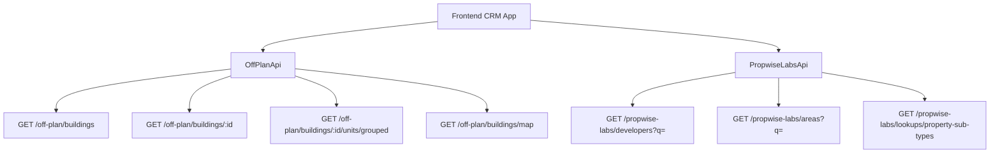

## Overview

Add an **Off-Plan** tab under the **Properties** section of the main CRM sidebar. This page displays all published buildings from developer portal users in a card/map split view with rich filters, 2GIS map integration, and a detailed building view.

<Note>
**Backend facade:** Off-plan data is served through domain endpoints under `/off-plan/*`. These endpoints read Propwise Labs catalog data and apply CRM-owned visibility from `off_plan_building_publication` plus the off-plan lifecycle helper, so main CRM users only receive buildings with `is_published=true` that still classify as off-plan.
</Note>

The lower-level `/propwise-labs/*` endpoints remain raw catalog access and support explicit lifecycle filtering for off-plan, secondary, or all catalog records.

## Reference Design Patterns

<AccordionGroup>
  <Accordion title="List Page Design">
    **Grid view**: Cards with cover image, frontend status badges (On Sale, Out of Stock, EOI), handover quarter, building name, area + developer, price from, and payment plan ratio
    
    **Map view**: Split layout — scrollable card list on left, 2GIS interactive map on right with custom circular developer-logo markers and hover popover previews
  </Accordion>

  <Accordion title="Interactive Map Behavior">
    - Marker hover scrolls the left card list to matching building and highlights that card with status color
    - Clicking marker, map preview card, or focused list card opens animated building detail panel over the left list
    - Custom circular developer-logo markers with hover popover previews anchored above each marker
  </Accordion>

  <Accordion title="Filters and Navigation">
    **Filters bar**: Leads-style compact search input + Filters popover under the page title, followed by quick dropdown buttons for Developer, Price, Payments, Handover, Unit type, Bedrooms, and Status
    
    **Building detail page**: Right-sticky sidebar with key info + scrollable left content area
  </Accordion>
</AccordionGroup>

## Architecture Decision

### Buildings vs Projects as Primary Entity

<Info>
Based on the existing data model, **buildings** are the primary enrichment entity since they have their own `coverImageUrl`, `status`, `endDate`, `completionDate`, `paymentPlans`, `images`, `documents`, and `amenities`.
</Info>

Buildings can override inherited fields from projects (status, area, community, description). The off-plan directory displays **published buildings** based on CRM `is_published` visibility, since a project may contain multiple buildings with different lifecycle statuses and pricing.

### Publication Control

Publication is separate from Propwise Labs `building.status`. Developers publish or unpublish buildings through the developer portal, which writes `off_plan_building_publication.is_published` for the Propwise Labs `building_id`.

<Warning>
Missing publication rows are treated as draft/unpublished, and unpublishing keeps the row with `unpublished_at` plus `unpublished_by_id` for audit.
</Warning>

### Frontend Status Mapping

Frontend display status is derived from `building.status` through `getOffPlanFrontendStatus()`:

| Backend `building.status` | Frontend Status | Color  |
| ------------------------- | --------------- | ------ |
| `ACTIVE`                  | On Sale         | Orange |
| `PENDING`                 | EOI             | Purple |
| `FINISHED`                | Out of Stock    | Gray   |

### Data Flow



<Check>
The `/off-plan/buildings` endpoints enforce publication by checking `off_plan_building_publication.is_published=true` and require buildings to match the off-plan lifecycle helper.
</Check>

## Implementation Steps

<Steps>
  <Step title="Update Sidebar Navigation">
    ### File: `src/components/layouts/CRMLayout.tsx`

    Replace the entire `data.realEstate` array with a single "Off-Plan" entry:

    ```typescript
    realEstate: [
      {
        title: 'Off-Plan',
        url: '/home/properties/off-plan',
        icon: Building2,  // from lucide-react
      },
    ],
    ```

    **Remove** the old sidebar entries for Areas, Developments, and Units.

    ### Breadcrumb Updates

    Replace all existing real-estate breadcrumb handling with off-plan routes:

    ```
    Properties > Off-Plan                           (list page)
    Properties > Off-Plan > {Building Name}         (detail page)
    ```
  </Step>

  <Step title="Create Route Structure">
    ```
    src/app/home/properties/off-plan/
    ├── page.tsx                    # List page (grid + map toggle)
    └── [id]/
        └── page.tsx                # Building detail page
    ```

    <Note>
    Both pages follow the component extraction guide — page files contain ONLY the page function (< 200 lines).
    </Note>
  </Step>

  <Step title="Build Component Structure">
    ```
    src/components/pages/off-plan/
    ├── index.ts                           # Barrel export
    │
    │   ── List Page Components ──
    ├── off-plan-building-card.tsx          # Building card for grid view
    ├── off-plan-filters.tsx               # Horizontal filter bar
    ├── off-plan-map-view.tsx              # 2GIS map with markers + popover
    ├── off-plan-grid-view.tsx             # Scrollable grid of building cards + infinite scroll
    ├── off-plan-building-detail-panel.tsx  # Animated detail panel over map-mode left list
    ├── off-plan-toolbar.tsx               # View toggle (Grid/Map), sort, saved filters
    │
    │   ── Detail Page Components ──
    ├── building-detail-header.tsx          # Sticky sidebar: name, price, units count, payment plan
    ├── building-detail-description.tsx     # Description section with Read More
    ├── building-detail-units.tsx           # Units & Availability (accordion grouped by bedrooms)
    ├── building-detail-unit-modal.tsx      # Unit detail popup (floor plan, specs, price)
    ├── building-detail-images.tsx          # Image grid with lightbox
    ├── building-detail-amenities.tsx       # Features/Amenities image grid
    ├── building-detail-location.tsx        # Location section with 2GIS map
    ├── building-detail-info-table.tsx      # Details table (Project Name, Developer, etc.)
    ├── building-detail-payment-plan.tsx    # Payment plan visualization (progress bar + breakdown)
    ├── building-detail-documents.tsx       # Documents & links (PDF cards)
    └── building-detail-developer.tsx       # Developer info card
    ```
  </Step>

  <Step title="Implement API Layer">
    ### New File: `src/services/api/off-plan.api.ts`

    <CodeGroup>
    ```typescript Filter Types
    export interface OffPlanBuildingFilters {
      q?: string;
      status?: string;
      areaId?: number;
      communityId?: number;
      developerId?: number; // Legacy single developer filter
      developerIds?: number[]; // Multi-select developer filter
      propertyTypeId?: number;
      propertySubTypeId?: number;
      priceMode?: 'unit' | 'sqft'; // UI-only basis for price controls
      minPrice?: number;
      maxPrice?: number;
      bedrooms?: string; // e.g., "1", "2", "3", "studio"
      completionBefore?: string; // Inclusive building.endDate upper bound
      completionAfter?: string; // Inclusive building.endDate lower bound
      maxPreHandoverPercent?: number; // Payment plan filter
      page?: number;
      limit?: number;
      sortBy?: string;
      sortOrder?: 'asc' | 'desc';
    }

    export interface MapMarkerFilters {
      q?: string;
      status?: string;
      projectId?: number;
      areaId?: number;
      communityId?: number;
      developerId?: number;
      developerIds?: number[];
      propertySubTypeId?: number;
      minPrice?: number;
      maxPrice?: number;
      completionBefore?: string;
      completionAfter?: string;
    }
    ```

    ```typescript API Class
    export class OffPlanApi {
      /** Search Propwise Labs buildings */
      static async searchBuildings(filters: OffPlanBuildingFilters) {
        return apiClient.get('/off-plan/buildings', { 
          params: supportedBuildingParams(filters) 
        });
      }

      /** Get building detail with all enrichment */
      static async getBuildingDetail(id: number) {
        return apiClient.get(`/off-plan/buildings/${id}`);
      }

      /** Get units grouped by bedroom category */
      static async getBuildingUnitsGrouped(buildingId: number) {
        return apiClient.get(`/off-plan/buildings/${buildingId}/units/grouped`);
      }

      /** Get single unit detail */
      static async getUnitDetail(unitId: number) {
        return apiClient.get(`/propwise-labs/units/${unitId}`);
      }

      /** Get map markers (lightweight building data with coordinates) */
      static async getMapMarkers(filters?: MapMarkerFilters) {
        return apiClient.get('/off-plan/buildings/map', { 
          params: supportedMapParams(filters) 
        });
      }

      /** Search developers for the searchable multi-select filter */
      static async searchDevelopers(q?: string) {
        return apiClient.get('/propwise-labs/developers', { params: { q } });
      }

      /** Search areas for filter dropdown */
      static async searchAreas(q?: string, cityId?: number) {
        return apiClient.get('/propwise-labs/areas', { params: { q, cityId } });
      }

      /** Get property subtypes for unit type filter */
      static async getPropertySubTypes() {
        return apiClient.get('/propwise-labs/lookups/property-sub-types');
      }
    }
    ```
    </CodeGroup>

    <Tip>
    This API file wraps the Propwise Labs facade endpoints and maps Propwise Labs response fields into the existing off-plan UI types. It must not call deleted `/reference/*` routes.
    </Tip>
  </Step>
</Steps>

## Key Features Implementation

<CardGroup cols={2}>
  <Card title="Map Integration" icon="map">
    2GIS map with custom circular developer-logo markers, hover popover previews, and synchronized list highlighting
  </Card>
  
  <Card title="Advanced Filtering" icon="filter">
    Comprehensive filter system including developer multi-select, price ranges, handover quarters, and payment plan filters
  </Card>
  
  <Card title="Building Details" icon="building">
    Rich building detail pages with units availability, payment plan visualization, amenities, and developer information
  </Card>
  
  <Card title="Responsive Design" icon="mobile">
    Grid/map toggle views with smooth animations and infinite scroll for optimal user experience
  </Card>
</CardGroup>

## Response Type Structure

```typescript
// src/services/api/propwise-labs.api.ts
// Raw catalog response shapes
export interface PropwiseLabsBuilding { ... }
export interface PropwiseLabsUnit { ... }
export interface PropwiseLabsUnitGroup { ... }
export interface PropwiseLabsAmenity { ... }
export interface PropwiseLabsPaymentPlan { ... }
export interface PropwiseLabsDocument { ... }

// src/services/api/off-plan.api.ts
// Off-plan types extend raw Propwise Labs shapes when /off-plan adds app-owned fields
export interface OffPlanBuilding extends PropwiseLabsBuilding {
  // Additional off-plan specific fields
}
```

<Warning>
Ensure all existing `/reference/*` route dependencies are removed and replaced with appropriate Propwise Labs catalog endpoints or off-plan facade endpoints.
</Warning>

## Migration Considerations

<Steps>
  <Step title="Remove Legacy Routes">
    Remove breadcrumb entries for:
    - `/real-estate/areas`
    - `/real-estate/developments`
    - `/real-estate/units`
    - `/real-estate/prospects`
  </Step>

  <Step title="Update Navigation">
    Replace multiple real estate tabs with single "Off-Plan" entry in sidebar navigation
  </Step>

  <Step title="Data Source Migration">
    Transition from legacy reference endpoints to new off-plan facade endpoints that enforce publication visibility and lifecycle filtering
  </Step>
</Steps>

This implementation provides a comprehensive off-plan directory that integrates seamlessly with the existing CRM while introducing modern UX patterns for property discovery and detailed building exploration.