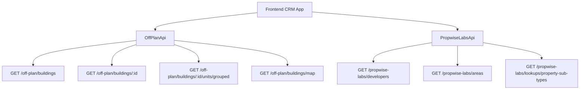

## Overview

The off-plan directory adds a comprehensive **Off-Plan** tab under the **Properties** section of the main CRM sidebar. This feature displays all published buildings from developer portal users in a sophisticated card/map split view with rich filters, 2GIS map integration, and detailed building views.

<Note>
The backend serves off-plan data through domain endpoints under `/off-plan/*`. These endpoints read Propwise Labs catalog data and apply CRM-owned visibility from `off_plan_building_publication` plus the off-plan lifecycle helper.
</Note>

## Architecture Decision

### Buildings vs Projects as Primary Entity

Based on the existing data model, **buildings** are the primary enrichment entity:

<CardGroup cols={2}>
  <Card title="Buildings Support" icon="building">
    Buildings have their own `coverImageUrl`, `status`, `endDate`, `completionDate`, `paymentPlans`, `images`, `documents`, `amenities`
  </Card>
  <Card title="Override Capability" icon="gear">
    Buildings can override inherited fields from projects (status, area, community, description)
  </Card>
</CardGroup>

The off-plan directory displays **published buildings** based on CRM `is_published` visibility, since a project may contain multiple buildings with different lifecycle statuses and pricing.

### Data Flow Architecture



<Warning>
The `/off-plan/buildings` endpoints enforce publication by checking `off_plan_building_publication.is_published=true` and require buildings to match the off-plan lifecycle helper.
</Warning>

## Frontend Status Mapping

Frontend display status is derived from `building.status` through `getOffPlanFrontendStatus()`:

| Backend `building.status` | Frontend Status | Color  |
| ------------------------- | --------------- | ------ |
| `ACTIVE`                  | On Sale         | Orange |
| `PENDING`                 | EOI             | Purple |
| `FINISHED`                | Out of Stock    | Gray   |

## Implementation Steps

<Steps>
  <Step title="Update Sidebar Navigation">
    Modify `src/components/layouts/CRMLayout.tsx` to replace existing real estate entries with a single "Off-Plan" entry.
    
    ```typescript
    realEstate: [
      {
        title: 'Off-Plan',
        url: '/home/properties/off-plan',
        icon: Building2,  // from lucide-react
      },
    ],
    ```
  </Step>

  <Step title="Create Route Structure">
    Set up the following route structure:
    
    ```
    src/app/home/properties/off-plan/
    ├── page.tsx                    # List page (grid + map toggle)
    └── [id]/
        └── page.tsx                # Building detail page
    ```
  </Step>

  <Step title="Implement API Layer">
    Create `src/services/api/off-plan.api.ts` with the OffPlanApi class and required interfaces.
  </Step>

  <Step title="Build Component Structure">
    Create all required components under `src/components/pages/off-plan/`
  </Step>
</Steps>

## Component Structure

### List Page Components

<AccordionGroup>
  <Accordion title="off-plan-building-card.tsx">
    Building card component for grid view displaying:
    - Cover image with status badge
    - Handover quarter
    - Building name and location
    - Price from and payment plan ratio
  </Accordion>

  <Accordion title="off-plan-filters.tsx">
    Horizontal filter bar with:
    - Compact search input
    - Filters popover
    - Quick dropdown buttons for Developer, Price, Payments, Handover, Unit type, Bedrooms, Status
  </Accordion>

  <Accordion title="off-plan-map-view.tsx">
    Split layout with:
    - Scrollable card list on left
    - 2GIS interactive map on right
    - Custom circular developer-logo markers
    - Hover popover previews
  </Accordion>

  <Accordion title="off-plan-grid-view.tsx">
    Scrollable grid of building cards with infinite scroll sentinel
  </Accordion>

  <Accordion title="off-plan-building-detail-panel.tsx">
    Animated detail panel opened over the map-mode left list
  </Accordion>

  <Accordion title="off-plan-toolbar.tsx">
    View toggle (Grid/Map), sort options, and saved filters
  </Accordion>
</AccordionGroup>

### Detail Page Components

<AccordionGroup>
  <Accordion title="building-detail-header.tsx">
    Sticky sidebar containing:
    - Building name and price
    - Units count
    - Payment plan summary
    - Developer information
    - CTA buttons
  </Accordion>

  <Accordion title="building-detail-description.tsx">
    Description section with expandable "Read More" functionality
  </Accordion>

  <Accordion title="building-detail-units.tsx">
    Units & Availability section with accordion grouped by bedrooms
  </Accordion>

  <Accordion title="building-detail-unit-modal.tsx">
    Unit detail popup showing floor plan, specifications, and pricing
  </Accordion>

  <Accordion title="building-detail-images.tsx">
    Image grid with lightbox functionality
  </Accordion>

  <Accordion title="building-detail-amenities.tsx">
    Features/Amenities display with image grid
  </Accordion>

  <Accordion title="building-detail-location.tsx">
    Location section with embedded 2GIS map
  </Accordion>

  <Accordion title="building-detail-info-table.tsx">
    Details table showing Project Name, Developer, Branded status, etc.
  </Accordion>

  <Accordion title="building-detail-payment-plan.tsx">
    Payment plan visualization with progress bar and breakdown
  </Accordion>

  <Accordion title="building-detail-documents.tsx">
    Documents & links section with PDF card layouts
  </Accordion>

  <Accordion title="building-detail-developer.tsx">
    Developer information card from PropwiseLabsDeveloperContact
  </Accordion>
</AccordionGroup>

## API Implementation

### Off-Plan API Service

Create `src/services/api/off-plan.api.ts` with the following structure:

<CodeGroup>
```typescript Filter Types
export interface OffPlanBuildingFilters {
  q?: string;
  status?: string;
  areaId?: number;
  communityId?: number;
  developerId?: number; // Legacy single developer filter
  developerIds?: number[]; // Multi-select developer filter
  propertyTypeId?: number;
  propertySubTypeId?: number;
  priceMode?: 'unit' | 'sqft';
  minPrice?: number;
  maxPrice?: number;
  bedrooms?: string;
  completionBefore?: string;
  completionAfter?: string;
  maxPreHandoverPercent?: number;
  page?: number;
  limit?: number;
  sortBy?: string;
  sortOrder?: 'asc' | 'desc';
}
```

```typescript API Class
export class OffPlanApi {
  /** Search Propwise Labs buildings */
  static async searchBuildings(filters: OffPlanBuildingFilters) {
    return apiClient.get('/off-plan/buildings', { 
      params: supportedBuildingParams(filters) 
    });
  }

  /** Get building detail with all enrichment */
  static async getBuildingDetail(id: number) {
    return apiClient.get(`/off-plan/buildings/${id}`);
  }

  /** Get units grouped by bedroom category */
  static async getBuildingUnitsGrouped(buildingId: number) {
    return apiClient.get(`/off-plan/buildings/${buildingId}/units/grouped`);
  }

  /** Get map markers */
  static async getMapMarkers(filters?: MapMarkerFilters) {
    return apiClient.get('/off-plan/buildings/map', { 
      params: supportedMapParams(filters) 
    });
  }

  /** Search developers for filter */
  static async searchDevelopers(q?: string) {
    return apiClient.get('/propwise-labs/developers', { params: { q } });
  }
}
```
</CodeGroup>

## Key Features

### Map Integration

<Tabs>
  <Tab title="2GIS Integration">
    - Interactive map with custom markers
    - Developer logo markers with status color borders
    - Hover popover previews anchored above markers
    - Synchronized list highlighting on marker hover
  </Tab>
  
  <Tab title="Marker Behavior">
    - Marker hover scrolls left card list to matching building
    - Highlights card with same status color as marker border
    - Click opens animated building detail panel
  </Tab>
</Tabs>

### Filter System

The filter system includes:

<Check>Compact search input with real-time results</Check>
<Check>Multi-select developer filter with search capability</Check>
<Check>Price range filters with unit/sqft toggle</Check>
<Check>Payment plan percentage filters</Check>
<Check>Handover quarter date range filters</Check>
<Check>Unit type and bedroom count filters</Check>
<Check>Status-based filtering (On Sale, EOI, Out of Stock)</Check>

### Publication System

<Info>
Publication is separate from Propwise Labs `building.status`. Developers publish or unpublish buildings through the developer portal, which writes to `off_plan_building_publication.is_published`.
</Info>

Key publication rules:

- Missing publication rows are treated as draft/unpublished
- Unpublishing keeps the row with `unpublished_at` plus `unpublished_by_id` for audit
- Off-plan directory endpoints always enforce the off-plan lifecycle in code
- `UNKNOWN` status buildings are excluded from off-plan directory

## Breadcrumb Structure

Replace all existing real-estate breadcrumb handling with off-plan routes:

```
Properties > Off-Plan                           (list page)
Properties > Off-Plan > {Building Name}         (detail page)
```

<Warning>
Remove breadcrumb entries for `/real-estate/areas`, `/real-estate/developments`, `/real-estate/units`, and `/real-estate/prospects`.
</Warning>

## Response Types

The API layer uses these key response interfaces:

- `PropwiseLabsBuilding` - Raw catalog building data
- `PropwiseLabsUnit` - Unit specifications and pricing
- `PropwiseLabsUnitGroup` - Grouped unit data by bedroom count
- `PropwiseLabsAmenity` - Building amenities and features
- `PropwiseLabsPaymentPlan` - Payment schedule information
- `PropwiseLabsDocument` - Linked documents and resources

<Tip>
Off-plan types only extend raw Propwise Labs shapes when `/off-plan` endpoints add app-owned fields like publication status or CRM-specific metadata.
</Tip>