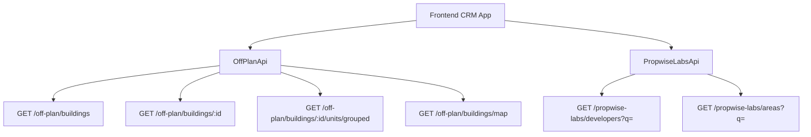

# Off-Plan Directory Implementation Specification

## Overview

This document outlines the complete implementation of an **Off-Plan** tab under the **Properties** section of the main CRM sidebar. The feature displays all published buildings from developer portal users in a card/map split view with rich filters, 2GIS map integration, and detailed building views.

<Note>
**Backend facade:** Off-plan data is served through domain endpoints under `/off-plan/*`. These endpoints read Propwise Labs catalog data and apply CRM-owned visibility from `off_plan_building_publication` plus the off-plan lifecycle helper, ensuring main CRM users only receive buildings with `is_published=true` that still classify as off-plan.
</Note>

## Architecture Decision

### Buildings vs Projects as Primary Entity

Based on the existing data model, **buildings** are the primary enrichment entity:

- Buildings have their own `coverImageUrl`, `status`, `endDate`, `completionDate`, `paymentPlans`, `images`, `documents`, `amenities`
- Buildings can override inherited fields from projects (status, area, community, description)
- The off-plan directory displays **published buildings** based on CRM `is_published` visibility

<Info>
The list page queries `GET /off-plan/buildings`, and the detail page queries `GET /off-plan/buildings/:id`.
</Info>

### Publication System

Publication is separate from Propwise Labs `building.status`. Developers publish or unpublish buildings through the developer portal, which writes `off_plan_building_publication.is_published` for the Propwise Labs `building_id`.

<Warning>
Missing publication rows are treated as draft/unpublished. Unpublishing keeps the row with `unpublished_at` plus `unpublished_by_id` for audit purposes.
</Warning>

#### Publish-Readiness Gate

Before setting `is_published=true`, publish endpoints validate entities against required-field contracts:

**Buildings Requirements:**
- 13-field "complete building" contract: `name`, `buildingNumber`, `descriptionEn`, `floors`, `googleMapsLink`, `startDate`, `coverImageUrl`, `area.id`, `plotSize`, `actualArea`, `parkingCount`, `serviceChargePerSqft`, ≥1 `media`
- Plus `salesStatus` (required at publish time)

**Villa Projects Requirements:**
- `name`, `descriptionEn`, `imageUrl` cover, `googleMapsLink`, `area.id`, `latitude`, `longitude`, ≥1 `media`, `salesStatus`

<Tip>
All missing fields are aggregated into a single `400 BadRequest` response, allowing the dev-portal UI to display every missing field in one notification.
</Tip>

#### Auto-Maintained Sales Status

A building's `salesStatus` is auto-maintained from live unit availability:

| Status | Condition |
|--------|-----------|
| `OUT_OF_STOCK` | No units remain `AVAILABLE` (all `RESERVED` or `SOLD`) |
| `ON_SALE` | At least one `AVAILABLE` unit exists |
| `ANNOUNCED` | Manual developer setting |
| `EOI` | Expression of Interest phase |

### Frontend Status Display

Frontend display status is derived from `building.status` through `getOffPlanFrontendStatus()`:

<CodeGroup>
```javascript Status Mapping
const statusMapping = {
  'ACTIVE': { label: 'On Sale', color: 'orange' },
  'PENDING': { label: 'EOI', color: 'purple' },
  'FINISHED': { label: 'Out of Stock', color: 'gray' }
};
```
</CodeGroup>

### Data Flow Architecture



<Check>
The `/off-plan/buildings` endpoints enforce publication by checking `off_plan_building_publication.is_published=true` and require buildings to match the off-plan lifecycle helper.
</Check>

## Implementation Steps

<Steps>

<Step title="Update Sidebar Navigation">
Replace the entire `data.realEstate` array in `src/components/layouts/CRMLayout.tsx`:

```typescript
realEstate: [
  {
    title: 'Off-Plan',
    url: '/properties/off-plan',
    icon: Building2,  // from lucide-react
  },
],
```

Remove existing Areas, Developments, and Units tabs.
</Step>

<Step title="Configure Route Structure">
Create the following route structure:

```
src/app/(app)/properties/off-plan/
├── page.tsx                    # Map/list page with panel handling
└── [id]/
    └── page.tsx                # Re-exports ../page for /:id routes
```

<Warning>
The `[id]/page.tsx` route must NOT implement a separate detail page. It delegates to the main off-plan page to preserve map, filters, and panel behavior.
</Warning>
</Step>

<Step title="Implement Component Architecture">
Create the component structure:

```
src/components/pages/off-plan/
├── index.ts                           # Barrel export
├── off-plan-building-card.tsx          # Building card for grid view
├── off-plan-filters.tsx               # Horizontal filter bar
├── off-plan-map-view.tsx              # 2GIS map with markers + popover
├── off-plan-grid-view.tsx             # Scrollable grid with infinite scroll
├── off-plan-building-detail-panel.tsx # Animated detail panel
├── off-plan-toolbar.tsx               # View toggle, sort, saved filters
├── building-detail-header.tsx          # Sticky sidebar header
├── building-detail-description.tsx     # Description with Read More
└── building-detail-unit-summary.tsx   # Unit availability summary
```
</Step>

<Step title="Configure Breadcrumb Navigation">
Replace existing real-estate breadcrumb handling with off-plan routes:

- `Properties > Off-Plan` (list page)
- `Properties > Off-Plan > {Building Name}` (map page with open detail panel)

Remove breadcrumbs for `/real-estate/areas`, `/real-estate/developments`, `/real-estate/units`, and `/real-estate/prospects`.
</Step>

</Steps>

## Key Features

### Map Integration

<Tabs>
<Tab title="2GIS Integration">
- Interactive map with custom circular developer-logo markers
- Hover popover previews anchored above markers
- Bidirectional sync between map markers and list cards
- Temporary pins for out-of-bounds items with "Search this area" functionality
</Tab>

<Tab title="Marker Behavior">
- Hover highlights corresponding list card with status color border
- Click opens animated building detail panel
- Map legend shows status labels left-to-right: Announced → EOI → On Sale → Out of Stock
</Tab>
</Tabs>

### Filter System

The filter bar includes:

<CardGroup cols={2}>
<Card title="Search Input" icon="magnifying-glass">
Leads-style compact search for building names and descriptions
</Card>

<Card title="Quick Filters" icon="filter">
Dropdown buttons for Developer, Price, Payments, Handover, Bedrooms, and Status
</Card>

<Card title="Developer Filter" icon="building">
Searchable multi-select using `/propwise-labs/developers?q=` endpoint
</Card>

<Card title="Area Filter" icon="map">
Dropdown using `/propwise-labs/areas?q=` endpoint
</Card>
</CardGroup>

### Building Cards

Each card displays:

- Cover image with status badge overlay
- Building name and starting price (when available)
- Unit availability row (Available / Reserved / Sold)
- Bottom metadata badges: handover quarter, area, developer

<Note>
Starting price uses `stats.startingPrice` via `getOffPlanStartingPrice()` helper, hidden when no price exists. Villa projects render the same availability and handover information from project-level stats.
</Note>

### Detail Panel

The animated detail panel features:

<AccordionGroup>
<Accordion title="Header Section">
- Building name and area
- Close action button
- Underline tabs: Overview, Units, Media, Contact
</Accordion>

<Accordion title="Overview Tab">
- Cover image with price overlay
- Collapsible description with "Show more" control
- Building details table
- Construction progress from `building.percentCompleted`
- Four-card unit availability summary
- Payment plan information
- Amenities list
- Location details
</Accordion>

<Accordion title="Unit Availability">
Total Units from `building.stats?.unitsCount`; Available/Reserved/Sold from `building.stats?.unitsByStatus` aggregate, falling back to grouped unit status counting when aggregate is absent.
</Accordion>
</AccordionGroup>

## API Endpoints

### Off-Plan Domain Endpoints

| Endpoint | Purpose | Publication Check |
|----------|---------|-------------------|
| `GET /off-plan/buildings` | Building list with filters | ✅ |
| `GET /off-plan/buildings/:id` | Building detail view | ✅ |
| `GET /off-plan/buildings/:id/units/grouped` | Unit availability | ✅ |
| `GET /off-plan/buildings/map` | Map markers data | ✅ |

### Catalog Lookup Endpoints

| Endpoint | Purpose | Global Access |
|----------|---------|---------------|
| `GET /propwise-labs/developers?q=` | Developer filter options | ✅ |
| `GET /propwise-labs/areas?q=` | Area filter options | ✅ |

<Warning>
Off-plan directory endpoints always enforce the off-plan lifecycle in code. The lifecycle helper treats `ACTIVE` and `PENDING` as off-plan statuses and intentionally excludes `UNKNOWN` from off-plan results.
</Warning>

## Best Practices

<Check>
**Publication Validation**: Always validate required fields before allowing publication
</Check>

<Check>
**Lifecycle Enforcement**: Maintain strict separation between off-plan and secondary property lifecycles
</Check>

<Check>
**Performance**: Implement infinite scroll for large building lists and optimize map marker rendering
</Check>

<Check>
**User Experience**: Ensure bidirectional sync between map and list views for seamless navigation
</Check>

<Tip>
The `UNKNOWN` status remains secondary-eligible only on raw `/propwise-labs/*` catalog endpoints when `type=secondary` is requested, maintaining clear separation between off-plan and secondary property flows.
</Tip>