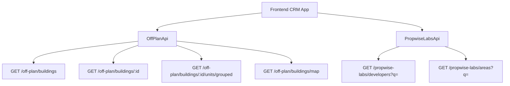

## Overview

The Off-Plan Directory adds a comprehensive **Off-Plan** tab under the **Properties** section of the main CRM sidebar. This feature displays all published buildings from developer portal users in a split card/map view with rich filtering, 2GIS map integration, and detailed building panels.

<Note>
**Backend Facade Architecture**: Off-plan data is served through domain endpoints under `/off-plan/*`. These endpoints read Propwise Labs catalog data and apply CRM-owned visibility from `off_plan_building_publication` plus the off-plan lifecycle helper, ensuring main CRM users only receive buildings with `is_published=true` that still classify as off-plan.
</Note>

The lower-level `/propwise-labs/*` endpoints remain raw catalog access and support explicit lifecycle filtering for off-plan, secondary, or all catalog records.

---

## Reference Screenshots

The implementation replicates key visual patterns from competitor platforms:

<CardGroup cols={2}>
  <Card title="Grid View" icon="grid">
    Cards with cover image, status badges (On Sale, Out of Stock, EOI), building name, **Starting {price}** when available, unit availability row (Available/Reserved/Sold), and metadata badges for handover quarter, area, and developer
  </Card>
  <Card title="Map View" icon="map">
    Split layout with scrollable card list on left and 2GIS interactive map on right with custom circular developer-logo markers and hover popover previews
  </Card>
  <Card title="Filters Bar" icon="filter">
    Compact search input + Filters popover under page title, followed by quick dropdown buttons for Developer, Price, Payments, Handover, Bedrooms, and Status
  </Card>
  <Card title="Detail Panel" icon="sidebar">
    Animated left-column overlay with Figma-matched header containing building name, area, close action, and tabs for Overview, Units, Media, and Contact
  </Card>
</CardGroup>

### Map Interaction Behavior

<Info>
**Bidirectional Sync**: Hovering a marker scrolls the left card list to the matching building and highlights that card with the same status color as the marker border. Hovering a left-list card pans the map to center that item's marker, highlights it, and opens the mini preview card above it.
</Info>

When the marker isn't in the loaded marker set, the map drops a temporary pin from the card's `lat`/`lng` and runs "Search this area" so the real marker loads. Clicking the marker, map preview card, or focused list card opens an animated building detail panel over the left list.

---

## Architecture Decision

### Buildings vs Projects as Primary Entity

Based on the existing data model, **buildings** are the primary enrichment entity:

<AccordionGroup>
  <Accordion title="Why Buildings are Primary">
    - Buildings have their own `coverImageUrl`, `status`, `endDate`, `completionDate`, `paymentPlans`, `images`, `documents`, `amenities`
    - Buildings can override inherited fields from projects (status, area, community, description)
    - A project may contain multiple buildings with different lifecycle statuses and pricing
  </Accordion>
  
  <Accordion title="Query Endpoints">
    - List page queries: `GET /off-plan/buildings`
    - Detail page queries: `GET /off-plan/buildings/:id`
    - Map markers: `GET /off-plan/buildings/map`
    - Grouped units: `GET /off-plan/buildings/:id/units/grouped`
  </Accordion>
</AccordionGroup>

### Publication System

Publication is separate from Propwise Labs `building.status`. Developers publish or unpublish buildings through the developer portal, which writes `off_plan_building_publication.is_published` for the Propwise Labs `building_id`.

<Warning>
Missing publication rows are treated as draft/unpublished. Unpublishing keeps the row with `unpublished_at` plus `unpublished_by_id` for audit.
</Warning>

#### Publish-Readiness Gate

Before flipping `is_published=true`, the publish endpoints validate the persisted entity against required-field contracts:

<Tabs>
  <Tab title="Buildings">
    **13-field "complete building" contract:**
    - `name`
    - `buildingNumber`
    - `descriptionEn`
    - `floors`
    - `googleMapsLink`
    - `startDate`
    - `coverImageUrl`
    - `area.id`
    - `plotSize`
    - `actualArea`
    - `parkingCount`
    - `serviceChargePerSqft`
    - ≥1 `media`
    - `salesStatus`
  </Tab>
  
  <Tab title="Villa Projects">
    **Required fields:**
    - `name`
    - `descriptionEn`
    - `imageUrl` (cover)
    - `googleMapsLink`
    - `area.id`
    - `latitude`
    - `longitude`
    - ≥1 `media`
    - `salesStatus`
  </Tab>
</Tabs>

<Note>
All missing fields are aggregated into a single `400 BadRequest` so the dev-portal UI can list every missing field in one toast/banner. Unpublishing always succeeds — it bypasses the readiness gate so stale or sparse records can be pulled back to draft.
</Note>

**Endpoints:**
- `PATCH /developer-portal/buildings/:id/publication`
- `PATCH /developer-portal/projects/:id/publication`

See `Docs/REAL_ESTATE_MODULE_SPECIFICATION.md` for canonical contracts and implementing guards (`assertBuildingReadyToPublish`, `assertVillaProjectReadyToPublish`).

### Auto-Maintained Sales Status

<Check>
A building's/villa-project's `salesStatus` is now auto-maintained from live unit availability by the developer portal.
</Check>

When a developer changes a unit's `salesStatus` or creates a unit, `ProjectManagementService` recounts the owner's units and:
- Sets `salesStatus = OUT_OF_STOCK` when **no** units remain `AVAILABLE`
- Reverts to `ON_SALE` when an `AVAILABLE` unit reappears

<Info>
For `Buildings`-type projects the **building** is reconciled; for `Villas`-type projects the **project** is reconciled.
</Info>

#### Sales Status Values

```typescript
enum SalesStatus {
  ANNOUNCED = 'ANNOUNCED',
  EOI = 'EOI',
  ON_SALE = 'ON_SALE',
  OUT_OF_STOCK = 'OUT_OF_STOCK'
}
```

### Frontend Display Status

Frontend display status is derived from `building.status` through `getOffPlanFrontendStatus()`:

| Backend `building.status` | Frontend Status | Color  |
| ------------------------- | --------------- | ------ |
| `ACTIVE`                  | On Sale         | Orange |
| `PENDING`                 | EOI             | Purple |
| `FINISHED`                | Out of Stock    | Gray   |

<Note>
The same helper drives building cards, map marker colors, map legend labels, and detail table sale status. The map legend renders left-to-right as **Announced → EOI → On Sale → Out of Stock**.
</Note>

### Lifecycle Filtering

<Warning>
Off-plan directory endpoints always enforce the off-plan lifecycle in code; callers do not pass a `type` query parameter.
</Warning>

The lifecycle helper:
- Treats `ACTIVE` and `PENDING` as off-plan statuses
- Intentionally excludes `UNKNOWN` from off-plan
- `UNKNOWN` remains secondary-eligible only on raw `/propwise-labs/*` catalog endpoints when `type=secondary` is requested

### Data Flow



<Info>
The `/off-plan/buildings` list, detail, map, and grouped-unit endpoints enforce publication by checking `off_plan_building_publication.is_published=true` before returning building data to main CRM users. They also require the building to match the off-plan lifecycle helper.
</Info>

Generic lookup endpoints remain on `/propwise-labs/*` because they are global catalog data shared by off-plan, secondary, developer portal, and future property-interest flows.

---

## 1. Sidebar Navigation

### Implementation Steps

<Steps>
  <Step title="Update CRMLayout.tsx">
    Replace the entire `data.realEstate` array with a single "Off-Plan" entry in `src/components/layouts/CRMLayout.tsx`
  </Step>
  
  <Step title="Remove Legacy Tabs">
    Remove the old sidebar entries for Areas, Developments, and Units
  </Step>
  
  <Step title="Update Breadcrumb">
    Replace all existing real-estate breadcrumb handling with off-plan routes
  </Step>
</Steps>

### Code Implementation

```typescript title="src/components/layouts/CRMLayout.tsx"
realEstate: [
  {
    title: 'Off-Plan',
    url: '/properties/off-plan',
    icon: Building2,  // from lucide-react (already imported)
  },
],
```

<Warning>
**Remove** the old sidebar entries for Areas, Developments, and Units.
</Warning>

### Breadcrumb Structure

```
Properties > Off-Plan                           (list page)
Properties > Off-Plan > {Building Name}         (map page with open detail panel)
```

<Note>
Remove the breadcrumb entries for `/real-estate/areas`, `/real-estate/developments`, `/real-estate/units`, and `/real-estate/prospects`.
</Note>

---

## 2. Route Structure

```
src/app/(app)/properties/off-plan/
├── page.tsx                    # Map/list page; also handles open building panel based on pathname
└── [id]/
    └── page.tsx                # Re-exports ../page so /:id opens the same map page with panel
```

<Warning>
The `[id]/page.tsx` route must **not** implement a separate building detail page. It delegates to the main off-plan page so `/properties/off-plan/:buildingId` preserves the map, filters, and left-side panel behavior.
</Warning>

### Route Behavior

<CardGroup cols={2}>
  <Card title="List Route" icon="list">
    `/properties/off-plan` - Displays map/list split view with filters
  </Card>
  <Card title="Detail Route" icon="building">
    `/properties/off-plan/:buildingId` - Same map page with detail panel opened
  </Card>
</CardGroup>

---

## 3. Component Structure

```
src/components/pages/off-plan/
├── index.ts                           # Barrel export
│
│   ── List Page Components ──
├── off-plan-building-card.tsx          # Building card for grid view
├── off-plan-filters.tsx               # Horizontal filter bar
├── off-plan-map-view.tsx              # 2GIS map with markers + popover
├── off-plan-grid-view.tsx             # Scrollable grid of building cards + infinite scroll sentinel
├── off-plan-building-detail-panel.tsx  # Animated map-mode detail panel with Figma header + Overview/Units/Media/Contact tabs
├── off-plan-toolbar.tsx               # View toggle (Grid/Map), sort, saved filters
│
│   ── Detail Page Components ──
├── building-detail-header.tsx          # Sticky sidebar: name, price, units count, payment plan, developer, CTA buttons
├── building-detail-description.tsx     # Description section with Read More
├── building-detail-unit-summary.tsx    # Unit availability summary cards
├── building-detail-amenities.tsx       # Amenities grid
├── building-detail-payment-plan.tsx    # Payment plan timeline
├── building-detail-location.tsx        # 2GIS map embed + address
├── building-detail-media.tsx           # Image gallery with lightbox
│
│   ── Shared Utilities ──
├── off-plan-display-utils.ts          # Frontend status helpers, price formatting
└── off-plan-types.ts                  # Shared TypeScript types
```

### Component Responsibilities

<AccordionGroup>
  <Accordion title="List Page Components" icon="list">
    - **off-plan-building-card.tsx**: Renders building cards with cover image, status badges, pricing, unit availability, and metadata
    - **off-plan-filters.tsx**: Horizontal filter bar with search input and filter popovers
    - **off-plan-map-view.tsx**: 2GIS map integration with custom markers and bidirectional sync
    - **off-plan-grid-view.tsx**: Scrollable grid layout with infinite scroll
    - **off-plan-building-detail-panel.tsx**: Animated slide-in panel with tabs
    - **off-plan-toolbar.tsx**: View toggle, sort options, saved filters
  </Accordion>
  
  <Accordion title="Detail Page Components" icon="building">
    - **building-detail-header.tsx**: Sticky header with name, price, CTA buttons
    - **building-detail-description.tsx**: Collapsible description with "Show more"
    - **building-detail-unit-summary.tsx**: Total/Available/Reserved/Sold cards
    - **building-detail-amenities.tsx**: Grid of amenity icons and labels
    - **building-detail-payment-plan.tsx**: Visual payment timeline
    - **building-detail-location.tsx**: Embedded map and address details
    - **building-detail-media.tsx**: Image gallery with lightbox viewer
  </Accordion>
  
  <Accordion title="Shared Utilities" icon="code">
    - **off-plan-display-utils.ts**: Helper functions for status mapping, price formatting, date formatting
    - **off-plan-types.ts**: Shared TypeScript interfaces and types
  </Accordion>
</AccordionGroup>

---

## 4. API Layer

### New API Service: `OffPlanApi`

Create `src/lib/api/off-plan-api.ts`:

```typescript title="src/lib/api/off-plan-api.ts"
import { apiClient } from './client';
import type { OffPlanBuilding, OffPlanBuildingDetail, OffPlanMapMarker, GroupedUnits } from './types';

export interface OffPlanBuildingsParams {
  page?: number;
  limit?: number;
  search?: string;
  developerIds?: string[];
  areaIds?: string[];
  minPrice?: number;
  maxPrice?: number;
  paymentPlanIds?: string[];
  handoverQuarter?: string;
  bedrooms?: number[];
  statuses?: string[];
  sortBy?: 'price' | 'handover' | 'name';
  sortOrder?: 'asc' | 'desc';
}

export const offPlanApi = {
  // List buildings with filters and pagination
  getBuildings: (params: OffPlanBuildingsParams) =>
    apiClient.get<{
      data: OffPlanBuilding[];
      total: number;
      page: number;
      limit: number;
    }>('/off-plan/buildings', { params }),

  // Get single building detail
  getBuilding: (id: string) =>
    apiClient.get<OffPlanBuildingDetail>(`/off-plan/buildings/${id}`),

  // Get map markers (lightweight payload)
  getMapMarkers: (params: Omit<OffPlanBuildingsParams, 'page' | 'limit'>) =>
    apiClient.get<OffPlanMapMarker[]>('/off-plan/buildings/map', { params }),

  // Get grouped units for building
  getGroupedUnits: (buildingId: string) =>
    apiClient.get<GroupedUnits>(`/off-plan/buildings/${buildingId}/units/grouped`),
};
```

<Note>
The API service uses the existing `apiClient` from `src/lib/api/client.ts` which handles authentication, base URL, and error handling.
</Note>

### Type Definitions

```typescript title="src/lib/api/types/off-plan.ts"
export interface OffPlanBuilding {
  id: string;
  name: string;
  coverImageUrl: string;
  area: {
    id: string;
    name: string;
  };
  developer: {
    id: string;
    name: string;
    logoUrl?: string;
  };
  status: 'ACTIVE' | 'PENDING' | 'FINISHED';
  salesStatus: 'ANNOUNCED' | 'EOI' | 'ON_SALE' | 'OUT_OF_STOCK';
  endDate?: string; // ISO date for handover
  stats: {
    startingPrice?: number;
    currency: string;
    unitsCount: number;
    unitsByStatus: {
      available: number;
      reserved: number;
      sold: number;
    };
  };
  latitude: number;
  longitude: number;
}

export interface OffPlanBuildingDetail extends OffPlanBuilding {
  buildingNumber: string;
  descriptionEn: string;
  floors: number;
  plotSize: number;
  actualArea: number;
  parkingCount: number;
  serviceChargePerSqft: number;
  percentCompleted?: number;
  googleMapsLink: string;
  paymentPlans: PaymentPlan[];
  amenities: Amenity[];
  images: MediaItem[];
  documents: Document[];
  community?: {
    id: string;
    name: string;
  };
}

export interface OffPlanMapMarker {
  id: string;
  name: string;
  latitude: number;
  longitude: number;
  status: 'ACTIVE' | 'PENDING' | 'FINISHED';
  salesStatus: 'ANNOUNCED' | 'EOI' | 'ON_SALE' | 'OUT_OF_STOCK';
  developer: {
    logoUrl?: string;
  };
  stats: {
    startingPrice?: number;
    currency: string;
  };
}

export interface GroupedUnits {
  groups: Array<{
    bedrooms: number;
    units: Array<{
      id: string;
      unitNumber: string;
      floor: number;
      price: number;
      size: number;
      salesStatus: string;
      availabilityStatus: string;
    }>;
  }>;
}
```

### Existing API Extensions

<Tabs>
  <Tab title="PropwiseLabsApi">
    Extend `src/lib/api/propwise-labs-api.ts` for searchable dropdowns:
    
    ```typescript
    export const propwiseLabsApi = {
      // Existing methods...
      
      // Searchable developer dropdown
      searchDevelopers: (query: string) =>
        apiClient.get<Developer[]>('/propwise-labs/developers', {
          params: { q: query, limit: 20 }
        }),
      
      // Searchable area dropdown
      searchAreas: (query: string) =>
        apiClient.get<Area[]>('/propwise-labs/areas', {
          params: { q: query, limit: 20 }
        }),
    };
    ```
  </Tab>
  
  <Tab title="Error Handling">
    All API methods use the existing error handling from `apiClient`:
    
    ```typescript
    try {
      const { data } = await offPlanApi.getBuildings(params);
      // Handle success
    } catch (error) {
      // Error automatically handled by apiClient interceptor
      // Shows toast notification to user
    }
    ```
  </Tab>
</Tabs>

---

## 5. Building Card Component

### Visual Structure

<CardGroup cols={2}>
  <Card title="Card Header" icon="image">
    - Cover image (16:9 aspect ratio)
    - Status badge overlay (top-right)
    - Favorite button (top-left)
  </Card>
  <Card title="Card Body" icon="text">
    - Building name (truncated at 2 lines)
    - Starting price or "Price upon request"
    - Unit availability bar
    - Metadata badges (handover, area, developer)
  </Card>
</CardGroup>

### Implementation

```typescript title="src/components/pages/off-plan/off-plan-building-card.tsx"
import React from 'react';
import { Card, CardContent } from '@/components/ui/card';
import { Badge } from '@/components/ui/badge';
import { Building2, Heart, MapPin, Calendar } from 'lucide-react';
import { formatCurrency, getOffPlanFrontendStatus, getQuarterFromDate } from './off-plan-display-utils';
import type { OffPlanBuilding } from '@/lib/api/types';

interface OffPlanBuildingCardProps {
  building: OffPlanBuilding;
  onClick: () => void;
  isHighlighted?: boolean;
}

export function OffPlanBuildingCard({ building, onClick, isHighlighted }: OffPlanBuildingCardProps) {
  const frontendStatus = getOffPlanFrontendStatus(building.status);
  const statusColor = {
    'On Sale': 'bg-orange-500',
    'EOI': 'bg-purple-500',
    'Out of Stock': 'bg-gray-500',
  }[frontendStatus];

  const startingPrice = building.stats.startingPrice
    ? `Starting ${formatCurrency(building.stats.startingPrice, building.stats.currency)}`
    : 'Price upon request';

  const handoverQuarter = building.endDate
    ? getQuarterFromDate(building.endDate)
    : null;

  const { available, reserved, sold } = building.stats.unitsByStatus;
  const total = available + reserved + sold;

  return (
    <Card
      className={`cursor-pointer transition-all hover:shadow-lg ${
        isHighlighted ? `ring-2 ring-${statusColor}` : ''
      }`}
      onClick={onClick}
    >
      <div className="relative aspect-video">
        
        <Badge className={`absolute top-2 right-2 ${statusColor} text-white`}>
          {frontendStatus}
        </Badge>
        <button
          className="absolute top-2 left-2 p-2 bg-white rounded-full hover:bg-gray-100"
          onClick={(e) => {
            e.stopPropagation();
            // Handle favorite toggle
          }}
        >
          <Heart className="h-4 w-4" />
        </button>
      </div>
      
      <CardContent className="p-4 space-y-3">
        <h3 className="font-semibold text-lg line-clamp-2">{building.name}</h3>
        
        <p className="text-sm font-medium text-primary">{startingPrice}</p>
        
        {/* Unit availability bar */}
        <div className="space-y-1">
          <div className="flex gap-1 h-2 rounded-full overflow-hidden">
            <div
              className="bg-green-500"
              style={{ width: `${(available / total) * 100}%` }}
            />
            <div
              className="bg-yellow-500"
              style={{ width: `${(reserved / total) * 100}%` }}
            />
            <div
              className="bg-gray-400"
              style={{ width: `${(sold / total) * 100}%` }}
            />
          </div>
          <div className="flex justify-between text-xs text-muted-foreground">
            <span>{available} Available</span>
            <span>{reserved} Reserved</span>
            <span>{sold} Sold</span>
          </div>
        </div>
        
        {/* Metadata badges */}
        <div className="flex flex-wrap gap-2">
          {handoverQuarter && (
            <Badge variant="outline" className="text-xs">
              <Calendar className="h-3 w-3 mr-1" />
              {handoverQuarter}
            </Badge>
          )}
          <Badge variant="outline" className="text-xs">
            <MapPin className="h-3 w-3 mr-1" />
            {building.area.name}
          </Badge>
          <Badge variant="outline" className="text-xs">
            <Building2 className="h-3 w-3 mr-1" />
            {building.developer.name}
          </Badge>
        </div>
      </CardContent>
    </Card>
  );
}
```

### Display Utilities

```typescript title="src/components/pages/off-plan/off-plan-display-utils.ts"
export function getOffPlanFrontendStatus(backendStatus: string): string {
  switch (backendStatus) {
    case 'ACTIVE':
      return 'On Sale';
    case 'PENDING':
      return 'EOI';
    case 'FINISHED':
      return 'Out of Stock';
    default:
      return 'Unknown';
  }
}

export function formatCurrency(amount: number, currency: string): string {
  return new Intl.NumberFormat('en-US', {
    style: 'currency',
    currency,
    minimumFractionDigits: 0,
    maximumFractionDigits: 0,
  }).format(amount);
}

export function getQuarterFromDate(isoDate: string): string {
  const date = new Date(isoDate);
  const quarter = Math.floor(date.getMonth() / 3) + 1;
  return `Q${quarter} ${date.getFullYear()}`;
}

export const OFF_PLAN_FRONTEND_STATUS_LABELS = [
  { label: 'Announced', color: 'bg-blue-500' },
  { label: 'EOI', color: 'bg-purple-500' },
  { label: 'On Sale', color: 'bg-orange-500' },
  { label: 'Out of Stock', color: 'bg-gray-500' },
];
```

---

## 6. Filters Component

### Filter Structure

<Steps>
  <Step title="Search Input">
    Global search across building name, area, and developer
  </Step>
  
  <Step title="Advanced Filters Popover">
    Opens a popover with additional filter options
  </Step>
  
  <Step title="Quick Filter Dropdowns">
    Developer, Price, Payments, Handover, Bedrooms, Status
  </Step>
  
  <Step title="Active Filters Display">
    Shows active filters as dismissible badges
  </Step>
</Steps>

### Implementation

```typescript title="src/components/pages/off-plan/off-plan-filters.tsx"
import React, { useState } from 'react';
import { Input } from '@/components/ui/input';
import { Button } from '@/components/ui/button';
import { Badge } from '@/components/ui/badge';
import { Popover, PopoverContent, PopoverTrigger } from '@/components/ui/popover';
import { Select, SelectContent, SelectItem, SelectTrigger, SelectValue } from '@/components/ui/select';
import { Search, Filter, X } from 'lucide-react';
import type { OffPlanBuildingsParams } from '@/lib/api/off-plan-api';

interface OffPlanFiltersProps {
  filters: OffPlanBuildingsParams;
  onFiltersChange: (filters: OffPlanBuildingsParams) => void;
}

export function OffPlanFilters({ filters, onFiltersChange }: OffPlanFiltersProps) {
  const [searchValue, setSearchValue] = useState(filters.search || '');

  const handleSearchChange = (value: string) => {
    setSearchValue(value);
    // Debounce search
    const timeoutId = setTimeout(() => {
      onFiltersChange({ ...filters, search: value, page: 1 });
    }, 300);
    return () => clearTimeout(timeoutId);
  };

  const removeFilter = (key: keyof OffPlanBuildingsParams) => {
    const newFilters = { ...filters };
    delete newFilters[key];
    onFiltersChange({ ...newFilters, page: 1 });
  };

  const activeFilterCount = Object.keys(filters).filter(
    key => !['page', 'limit', 'sortBy', 'sortOrder'].includes(key) && filters[key as keyof OffPlanBuildingsParams]
  ).length;

  return (
    <div className="space-y-4">
      <div className="flex gap-2">
        <div className="relative flex-1">
          <Search className="absolute left-3 top-1/2 -translate-y-1/2 h-4 w-4 text-muted-foreground" />
          <Input
            placeholder="Search buildings, areas, developers..."
            value={searchValue}
            onChange={(e) => handleSearchChange(e.target.value)}
            className="pl-10"
          />
        </div>
        
        <Popover>
          <PopoverTrigger asChild>
            <Button variant="outline">
              <Filter className="h-4 w-4 mr-2" />
              Filters
              {activeFilterCount > 0 && (
                <Badge className="ml-2" variant="secondary">
                  {activeFilterCount}
                </Badge>
              )}
            </Button>
          </PopoverTrigger>
          <PopoverContent className="w-80">
            <div className="space-y-4">
              <h4 className="font-medium">Advanced Filters</h4>
              {/* Add additional filter controls here */}
            </div>
          </PopoverContent>
        </Popover>
      </div>

      {/* Quick filter dropdowns */}
      <div className="flex gap-2 flex-wrap">
        <Select
          value={filters.developerIds?.join(',') || ''}
          onValueChange={(value) => {
            onFiltersChange({
              ...filters,
              developerIds: value ? [value] : undefined,
              page: 1,
            });
          }}
        >
          <SelectTrigger className="w-[180px]">
            <SelectValue placeholder="Developer" />
          </SelectTrigger>
          <SelectContent>
            {/* Populate from API */}
          </SelectContent>
        </Select>

        {/* Add other quick filter dropdowns: Price, Payments, Handover, Bedrooms, Status */}
      </div>

      {/* Active filters badges */}
      {activeFilterCount > 0 && (
        <div className="flex gap-2 flex-wrap">
          {filters.search && (
            <Badge variant="secondary">
              Search: {filters.search}
              <button
                onClick={() => removeFilter('search')}
                className="ml-2"
              >
                <X className="h-3 w-3" />
              </button>
            </Badge>
          )}
          {/* Add other active filter badges */}
        </div>
      )}
    </div>
  );
}
```

<Info>
The filters component uses debouncing for the search input to avoid excessive API calls. The debounce delay is 300ms.
</Info>

---

## 7. Map View Component

### 2GIS Integration

<Warning>
The map uses 2GIS API with custom markers for developer logos. Ensure 2GIS API key is configured in environment variables.
</Warning>

```typescript title="src/components/pages/off-plan/off-plan-map-view.tsx"
import React, { useEffect, useRef, useState } from 'react';
import { Card, CardContent } from '@/components/ui/card';
import { formatCurrency, getOffPlanFrontendStatus } from './off-plan-display-utils';
import type { OffPlanMapMarker } from '@/lib/api/types';

interface OffPlanMapViewProps {
  markers: OffPlanMapMarker[];
  hoveredBuildingId: string | null;
  onMarkerClick: (buildingId: string) => void;
  onMarkerHover: (buildingId: string | null) => void;
  onBoundsChange: (bounds: { north: number; south: number; east: number; west: number }) => void;
}

export function OffPlanMapView({
  markers,
  hoveredBuildingId,
  onMarkerClick,
  onMarkerHover,
  onBoundsChange,
}: OffPlanMapViewProps) {
  const mapRef = useRef<HTMLDivElement>(null);
  const [map, setMap] = useState<any>(null);
  const [hoveredMarker, setHoveredMarker] = useState<OffPlanMapMarker | null>(null);
  const [popoverPosition, setPopoverPosition] = useState<{ x: number; y: number } | null>(null);

  // Initialize 2GIS map
  useEffect(() => {
    if (!mapRef.current || map) return;

    // @ts-ignore - 2GIS types
    const mapInstance = DG.map(mapRef.current, {
      center: [25.2048, 55.2708], // Dubai coordinates
      zoom: 11,
    });

    setMap(mapInstance);

    // Listen to bounds changes
    mapInstance.on('moveend', () => {
      const bounds = mapInstance.getBounds();
      onBoundsChange({
        north: bounds.getNorth(),
        south: bounds.getSouth(),
        east: bounds.getEast(),
        west: bounds.getWest(),
      });
    });

    return () => {
      mapInstance.remove();
    };
  }, []);

  // Update markers
  useEffect(() => {
    if (!map) return;

    // Clear existing markers
    map.eachLayer((layer: any) => {
      if (layer instanceof DG.Marker) {
        map.removeLayer(layer);
      }
    });

    // Add new markers
    markers.forEach((marker) => {
      const frontendStatus = getOffPlanFrontendStatus(marker.status);
      const statusColor = {
        'On Sale': '#f97316',
        'EOI': '#a855f7',
        'Out of Stock': '#9ca3af',
      }[frontendStatus];

      // Create custom marker with developer logo
      const markerIcon = DG.divIcon({
        html: `
          <div class="relative">
            <div 
              class="w-12 h-12 rounded-full border-4 bg-white flex items-center justify-center overflow-hidden"
              style="border-color: ${statusColor}"
            >
              ${
                marker.developer.logoUrl
                  ? ``
                  : '<div class="w-full h-full bg-gray-200"></div>'
              }
            </div>
          </div>
        `,
        className: 'custom-marker',
        iconSize: [48, 48],
      });

      const markerInstance = DG.marker([marker.latitude, marker.longitude], {
        icon: markerIcon,
      }).addTo(map);

      // Hover events
      markerInstance.on('mouseover', (e: any) => {
        setHoveredMarker(marker);
        const point = map.latLngToContainerPoint(e.latlng);
        setPopoverPosition({ x: point.x, y: point.y - 60 });
        onMarkerHover(marker.id);
      });

      markerInstance.on('mouseout', () => {
        setHoveredMarker(null);
        setPopoverPosition(null);
        onMarkerHover(null);
      });

      // Click event
      markerInstance.on('click', () => {
        onMarkerClick(marker.id);
      });

      // Highlight hovered building
      if (hoveredBuildingId === marker.id) {
        map.setView([marker.latitude, marker.longitude], map.getZoom());
        setHoveredMarker(marker);
        const point = map.latLngToContainerPoint([marker.latitude, marker.longitude]);
        setPopoverPosition({ x: point.x, y: point.y - 60 });
      }
    });
  }, [map, markers, hoveredBuildingId]);

  return (
    <div className="relative h-full">
      <div ref={mapRef} className="w-full h-full" />

      {/* Hover popover */}
      {hoveredMarker && popoverPosition && (
        <Card
          className="absolute z-50 w-64 shadow-lg"
          style={{
            left: `${popoverPosition.x}px`,
            top: `${popoverPosition.y}px`,
            transform: 'translate(-50%, -100%)',
          }}
        >
          <CardContent className="p-3 space-y-2">
            <h4 className="font-semibold text-sm">{hoveredMarker.name}</h4>
            <p className="text-xs text-muted-foreground">
              {hoveredMarker.stats.startingPrice
                ? formatCurrency(hoveredMarker.stats.startingPrice, hoveredMarker.stats.currency)
                : 'Price upon request'}
            </p>
            <div className="flex gap-2">
              <span className="text-xs px-2 py-1 rounded bg-primary/10 text-primary">
                {getOffPlanFrontendStatus(hoveredMarker.status)}
              </span>
            </div>
          </CardContent>
        </Card>
      )}

      {/* Map legend */}
      <Card className="absolute bottom-4 left-4 z-40">
        <CardContent className="p-3">
          <div className="flex gap-4">
            <div className="flex items-center gap-2">
              <div className="w-3 h-3 rounded-full bg-blue-500" />
              <span className="text-xs">Announced</span>
            </div>
            <div className="flex items-center gap-2">
              <div className="w-3 h-3 rounded-full bg-purple-500" />
              <span className="text-xs">EOI</span>
            </div>
            <div className="flex items-center gap-2">
              <div className="w-3 h-3 rounded-full bg-orange-500" />
              <span className="text-xs">On Sale</span>
            </div>
            <div className="flex items-center gap-2">
              <div className="w-3 h-3 rounded-full bg-gray-500" />
              <span className="text-xs">Out of Stock</span>
            </div>
          </div>
        </CardContent>
      </Card>

      {/* Search this area button */}
      <Button
        className="absolute top-4 left-1/2 -translate-x-1/2 z-40"
        variant="secondary"
        onClick={() => {
          const bounds = map.getBounds();
          onBoundsChange({
            north: bounds.getNorth(),
            south: bounds.getSouth(),
            east: bounds.getEast(),
            west: bounds.getWest(),
          });
        }}
      >
        Search this area
      </Button>
    </div>
  );
}
```

<Tip>
The map implements bidirectional sync: hovering a marker scrolls the card list and highlights the card; hovering a card pans the map to the marker and shows the popover.
</Tip>

---

## 8. Building Detail Panel

### Panel Structure

<Tabs>
  <Tab title="Header">
    - Building name
    - Area name
    - Close button
    - Tab navigation (Overview, Units, Media, Contact)
  </Tab>
  
  <Tab title="Overview Tab">
    - Cover image with price overlay
    - Description with "Show more"
    - Building details table
    - Construction progress
    - Unit availability summary (4 cards)
    - Payment plan
    - Amenities
    - Location map
  </Tab>
  
  <Tab title="Units Tab">
    - Grouped units by bedroom count
    - Unit cards with floor plan, price, size, status
  </Tab>
  
  <Tab title="Media Tab">
    - Image gallery with lightbox
    - Document downloads
  </Tab>
  
  <Tab title="Contact Tab">
    - Developer contact information
    - Inquiry form
  </Tab>
</Tabs>

### Implementation

```typescript title="src/components/pages/off-plan/off-plan-building-detail-panel.tsx"
import React, { useState, useEffect } from 'react';
import { Sheet, SheetContent, SheetHeader, SheetTitle } from '@/components/ui/sheet';
import { Tabs, TabsContent, TabsList, TabsTrigger } from '@/components/ui/tabs';
import { Button } from '@/components/ui/button';
import { X } from 'lucide-react';
import { offPlanApi } from '@/lib/api/off-plan-api';
import type { OffPlanBuildingDetail } from '@/lib/api/types';

interface OffPlanBuildingDetailPanelProps {
  buildingId: string | null;
  onClose: () => void;
}

export function OffPlanBuildingDetailPanel({ buildingId, onClose }: OffPlanBuildingDetailPanelProps) {
  const [building, setBuilding] = useState<OffPlanBuildingDetail | null>(null);
  const [loading, setLoading] = useState(false);
  const [activeTab, setActiveTab] = useState('overview');

  useEffect(() => {
    if (!buildingId) {
      setBuilding(null);
      return;
    }

    setLoading(true);
    offPlanApi
      .getBuilding(buildingId)
      .then(({ data }) => setBuilding(data))
      .finally(() => setLoading(false));
  }, [buildingId]);

  if (!buildingId) return null;

  return (
    <Sheet open={!!buildingId} onOpenChange={onClose}>
      <SheetContent side="left" className="w-full sm:max-w-2xl p-0 overflow-y-auto">
        {loading ? (
          <div className="flex items-center justify-center h-full">
            <div className="animate-spin rounded-full h-8 w-8 border-b-2 border-primary" />
          </div>
        ) : building ? (
          <>
            <SheetHeader className="sticky top-0 bg-background z-10 border-b p-6">
              <div className="flex items-start justify-between">
                <div>
                  <SheetTitle className="text-2xl">{building.name}</SheetTitle>
                  <p className="text-sm text-muted-foreground">{building.area.name}</p>
                </div>
                <Button variant="ghost" size="icon" onClick={onClose}>
                  <X className="h-5 w-5" />
                </Button>
              </div>
              <Tabs value={activeTab} onValueChange={setActiveTab} className="mt-4">
                <TabsList className="grid w-full grid-cols-4">
                  <TabsTrigger value="overview">Overview</TabsTrigger>
                  <TabsTrigger value="units">Units</TabsTrigger>
                  <TabsTrigger value="media">Media</TabsTrigger>
                  <TabsTrigger value="contact">Contact</TabsTrigger>
                </TabsList>
              </Tabs>
            </SheetHeader>

            <div className="p-6">
              <Tabs value={activeTab}>
                <TabsContent value="overview" className="space-y-6">
                  {/* Cover image with price overlay */}
                  <div className="relative aspect-video rounded-lg overflow-hidden">
                    
                    <div className="absolute bottom-0 left-0 right-0 bg-gradient-to-t from-black/80 to-transparent p-4">
                      <p className="text-white text-lg font-semibold">
                        {building.stats.startingPrice
                          ? `Starting ${formatCurrency(building.stats.startingPrice, building.stats.currency)}`
                          : 'Price upon request'}
                      </p>
                    </div>
                  </div>

                  {/* Description */}
                  <BuildingDetailDescription description={building.descriptionEn} />

                  {/* Building details table */}
                  <BuildingDetailsTable building={building} />

                  {/* Construction progress */}
                  {building.percentCompleted !== undefined && (
                    <div className="space-y-2">
                      <div className="flex justify-between text-sm">
                        <span className="font-medium">Construction Progress</span>
                        <span className="text-muted-foreground">{building.percentCompleted}%</span>
                      </div>
                      <div className="w-full bg-gray-200 rounded-full h-2">
                        <div
                          className="bg-primary h-2 rounded-full transition-all"
                          style={{ width: `${building.percentCompleted}%` }}
                        />
                      </div>
                    </div>
                  )}

                  {/* Unit availability summary */}
                  <BuildingDetailUnitSummary building={building} />

                  {/* Payment plan */}
                  {building.paymentPlans.length > 0 && (
                    <BuildingDetailPaymentPlan paymentPlans={building.paymentPlans} />
                  )}

                  {/* Amenities */}
                  {building.amenities.length > 0 && (
                    <BuildingDetailAmenities amenities={building.amenities} />
                  )}

                  {/* Location */}
                  <BuildingDetailLocation building={building} />
                </TabsContent>

                <TabsContent value="units">
                  {/* Units tab content */}
                </TabsContent>

                <TabsContent value="media">
                  <BuildingDetailMedia building={building} />
                </TabsContent>

                <TabsContent value="contact">
                  {/* Contact tab content */}
                </TabsContent>
              </Tabs>
            </div>
          </>
        ) : null}
      </SheetContent>
    </Sheet>
  );
}
```

<Note>
The detail panel is implemented as a Sheet component that slides in from the left, maintaining the map view in the background. Clicking outside or pressing ESC closes the panel and returns to the map view.
</Note>

---

## 9. Main Page Component

### Page State Management

```typescript title="src/app/(app)/properties/off-plan/page.tsx"
'use client';

import React, { useState, useEffect } from 'react';
import { useRouter, usePathname, useSearchParams } from 'next/navigation';
import { PageHeader } from '@/components/ui/page-header';
import { OffPlanFilters } from '@/components/pages/off-plan/off-plan-filters';
import { OffPlanToolbar } from '@/components/pages/off-plan/off-plan-toolbar';
import { OffPlanGridView } from '@/components/pages/off-plan/off-plan-grid-view';
import { OffPlanMapView } from '@/components/pages/off-plan/off-plan-map-view';
import { OffPlanBuildingDetailPanel } from '@/components/pages/off-plan/off-plan-building-detail-panel';
import { offPlanApi } from '@/lib/api/off-plan-api';
import type { OffPlanBuildingsParams } from '@/lib/api/off-plan-api';

export default function OffPlanPage() {
  const router = useRouter();
  const pathname = usePathname();
  const searchParams = useSearchParams();
  
  // Extract buildingId from pathname if in detail route
  const buildingId = pathname.split('/').pop();
  const isDetailRoute = pathname.includes('/properties/off-plan/') && buildingId !== 'off-plan';

  const [view, setView] = useState<'grid' | 'map'>('grid');
  const [filters, setFilters] = useState<OffPlanBuildingsParams>({
    page: 1,
    limit: 20,
  });
  const [buildings, setBuildings] = useState([]);
  const [markers, setMarkers] = useState([]);
  const [total, setTotal] = useState(0);
  const [loading, setLoading] = useState(false);
  const [hoveredBuildingId, setHoveredBuildingId] = useState<string | null>(null);

  // Load buildings
  useEffect(() => {
    setLoading(true);
    offPlanApi
      .getBuildings(filters)
      .then(({ data }) => {
        setBuildings(data.data);
        setTotal(data.total);
      })
      .finally(() => setLoading(false));
  }, [filters]);

  // Load map markers when in map view
  useEffect(() => {
    if (view !== 'map') return;

    offPlanApi.getMapMarkers(filters).then(({ data }) => {
      setMarkers(data);
    });
  }, [view, filters]);

  const handleBuildingClick = (id: string) => {
    router.push(`/properties/off-plan/${id}`);
  };

  const handleCloseDetail = () => {
    router.push('/properties/off-plan');
  };

  return (
    <div className="flex flex-col h-full">
      <PageHeader
        title="Off-Plan Properties"
        description="Explore off-plan properties from verified developers"
      />

      <div className="px-6 py-4 space-y-4">
        <OffPlanFilters filters={filters} onFiltersChange={setFilters} />
        <OffPlanToolbar
          view={view}
          onViewChange={setView}
          sortBy={filters.sortBy}
          sortOrder={filters.sortOrder}
          onSortChange={(sortBy, sortOrder) => {
            setFilters({ ...filters, sortBy, sortOrder, page: 1 });
          }}
        />
      </div>

      <div className="flex-1 overflow-hidden">
        {view === 'grid' ? (
          <OffPlanGridView
            buildings={buildings}
            loading={loading}
            onBuildingClick={handleBuildingClick}
            onLoadMore={() => {
              setFilters({ ...filters, page: filters.page! + 1 });
            }}
            hasMore={buildings.length < total}
          />
        ) : (
          <div className="flex h-full">
            <div className="w-1/3 overflow-y-auto border-r">
              <OffPlanGridView
                buildings={buildings}
                loading={loading}
                onBuildingClick={handleBuildingClick}
                hoveredBuildingId={hoveredBuildingId}
                onBuildingHover={setHoveredBuildingId}
              />
            </div>
            <div className="flex-1">
              <OffPlanMapView
                markers={markers}
                hoveredBuildingId={hoveredBuildingId}
                onMarkerClick={handleBuildingClick}
                onMarkerHover={setHoveredBuildingId}
                onBoundsChange={(bounds) => {
                  // Reload markers for new bounds
                }}
              />
            </div>
          </div>
        )}
      </div>

      {/* Detail panel */}
      <OffPlanBuildingDetailPanel
        buildingId={isDetailRoute ? buildingId : null}
        onClose={handleCloseDetail}
      />
    </div>
  );
}
```

<Tip>
The page component handles both the list view (`/properties/off-plan`) and detail view (`/properties/off-plan/:id`) routes. When navigating to a detail route, the same page renders with the detail panel opened.
</Tip>

---

## 10. Backend Endpoints

### Required Endpoints

<AccordionGroup>
  <Accordion title="GET /off-plan/buildings" icon="list">
    **Purpose**: List published off-plan buildings with filtering and pagination
    
    **Query Parameters**:
    - `page` (number): Page number (default: 1)
    - `limit` (number): Items per page (default: 20)
    - `search` (string): Search query
    - `developerIds` (string[]): Filter by developer IDs
    - `areaIds` (string[]): Filter by area IDs
    - `minPrice` (number): Minimum starting price
    - `maxPrice` (number): Maximum starting price
    - `paymentPlanIds` (string[]): Filter by payment plan IDs
    - `handoverQuarter` (string): Filter by handover quarter (e.g., "Q1 2028")
    - `bedrooms` (number[]): Filter by bedroom count
    - `statuses` (string[]): Filter by frontend status
    - `sortBy` (string): Sort field (price, handover, name)
    - `sortOrder` (string): Sort direction (asc, desc)
    
    **Response**:
    ```json
    {
      "data": [...],
      "total": 150,
      "page": 1,
      "limit": 20
    }
    ```
    
    **Filters**:
    - `is_published = true` from `off_plan_building_publication`
    - Off-plan lifecycle (ACTIVE, PENDING)
    - Applied query parameters
  </Accordion>
  
  <Accordion title="GET /off-plan/buildings/:id" icon="building">
    **Purpose**: Get detailed building information
    
    **Path Parameters**:
    - `id` (string): Building ID
    
    **Response**: Full `OffPlanBuildingDetail` object
    
    **Filters**:
    - `is_published = true`
    - Off-plan lifecycle
    - Building must exist
  </Accordion>
  
  <Accordion title="GET /off-plan/buildings/map" icon="map">
    **Purpose**: Get lightweight marker data for map view
    
    **Query Parameters**: Same as list endpoint (except page/limit)
    
    **Response**: Array of `OffPlanMapMarker` objects
    
    **Optimization**: Returns only essential fields for markers (id, name, lat/lng, status, logo, starting price)
  </Accordion>
  
  <Accordion title="GET /off-plan/buildings/:id/units/grouped" icon="grid">
    **Purpose**: Get units grouped by bedroom count for building detail
    
    **Path Parameters**:
    - `id` (string): Building ID
    
    **Response**:
    ```json
    {
      "groups": [
        {
          "bedrooms": 1,
          "units": [...]
        }
      ]
    }
    ```
  </Accordion>
</AccordionGroup>

### Publication Endpoints

<Tabs>
  <Tab title="Buildings">
    **PATCH /developer-portal/buildings/:id/publication**
    
    **Request Body**:
    ```json
    {
      "is_published": true
    }
    ```
    
    **Validation**:
    - Re-validates building against 13-field contract + `salesStatus`
    - Returns 400 with all missing fields if validation fails
    - Bypasses validation when unpublishing
    
    **Response**:
    ```json
    {
      "id": "building-id",
      "is_published": true,
      "published_at": "2024-01-15T10:30:00Z",
      "published_by_id": "user-id"
    }
    ```
  </Tab>
  
  <Tab title="Villa Projects">
    **PATCH /developer-portal/projects/:id/publication**
    
    **Request Body**:
    ```json
    {
      "is_published": true
    }
    ```
    
    **Validation**:
    - Re-validates villa project against required fields + `salesStatus`
    - Returns 400 with all missing fields if validation fails
    - Bypasses validation when unpublishing
    
    **Response**: Same as buildings
  </Tab>
</Tabs>

<Warning>
When unpublishing, the endpoint sets `is_published=false`, records `unpublished_at` timestamp, and stores `unpublished_by_id` for audit purposes. The row is kept for historical tracking.
</Warning>

### Lifecycle Helper

The off-plan lifecycle helper is implemented in the backend service layer:

```typescript
function isOffPlan(building: Building): boolean {
  // Only ACTIVE and PENDING are off-plan
  // UNKNOWN is intentionally excluded
  return ['ACTIVE', 'PENDING'].includes(building.status);
}

function applyOffPlanFilter(query: QueryBuilder): QueryBuilder {
  return query.whereIn('status', ['ACTIVE', 'PENDING']);
}
```

<Check>
All `/off-plan/*` endpoints automatically apply this lifecycle filter. Callers do not pass a `type` parameter.
</Check>

---

## 11. Database Schema

### Publication Table

```sql
CREATE TABLE off_plan_building_publication (
  id UUID PRIMARY KEY DEFAULT uuid_generate_v4(),
  building_id UUID NOT NULL REFERENCES propwise_labs.buildings(id) ON DELETE CASCADE,
  is_published BOOLEAN NOT NULL DEFAULT false,
  published_at TIMESTAMP WITH TIME ZONE,
  published_by_id UUID REFERENCES users(id),
  unpublished_at TIMESTAMP WITH TIME ZONE,
  unpublished_by_id UUID REFERENCES users(id),
  created_at TIMESTAMP WITH TIME ZONE NOT NULL DEFAULT NOW(),
  updated_at TIMESTAMP WITH TIME ZONE NOT NULL DEFAULT NOW(),
  
  CONSTRAINT unique_building_publication UNIQUE (building_id)
);

CREATE INDEX idx_off_plan_building_publication_published 
  ON off_plan_building_publication(is_published) 
  WHERE is_published = true;
```

<Note>
Missing publication rows are treated as `is_published=false`. The unique constraint ensures one publication row per building.
</Note>

### Villa Project Publication

```sql
CREATE TABLE off_plan_project_publication (
  id UUID PRIMARY KEY DEFAULT uuid_generate_v4(),
  project_id UUID NOT NULL REFERENCES propwise_labs.projects(id) ON DELETE CASCADE,
  is_published BOOLEAN NOT NULL DEFAULT false,
  published_at TIMESTAMP WITH TIME ZONE,
  published_by_id UUID REFERENCES users(id),
  unpublished_at TIMESTAMP WITH TIME ZONE,
  unpublished_by_id UUID REFERENCES users(id),
  created_at TIMESTAMP WITH TIME ZONE NOT NULL DEFAULT NOW(),
  updated_at TIMESTAMP WITH TIME ZONE NOT NULL DEFAULT NOW(),
  
  CONSTRAINT unique_project_publication UNIQUE (project_id)
);

CREATE INDEX idx_off_plan_project_publication_published 
  ON off_plan_project_publication(is_published) 
  WHERE is_published = true;
```

---

## 12. Testing Strategy

### Unit Tests

<Steps>
  <Step title="API Service Tests">
    Test all API methods with mocked responses
    - `offPlanApi.getBuildings()` with various filter combinations
    - `offPlanApi.getBuilding()` with valid and invalid IDs
    - `offPlanApi.getMapMarkers()` with bounds filtering
    - `offPlanApi.getGroupedUnits()` with bedroom grouping
  </Step>
  
  <Step title="Utility Function Tests">
    Test display utilities
    - `getOffPlanFrontendStatus()` with all backend statuses
    - `formatCurrency()` with different currencies and amounts
    - `getQuarterFromDate()` with various dates
  </Step>
  
  <Step title="Component Tests">
    Test individual components in isolation
    - Building card rendering with different data states
    - Filter state management and changes
    - Map marker creation and hover behavior
    - Detail panel tab switching
  </Step>
</Steps>

### Integration Tests

<CardGroup cols={2}>
  <Card title="Filter Flow" icon="filter">
    - Apply filters and verify API calls
    - Clear filters and verify reset
    - Combine multiple filters
    - Verify URL search params sync
  </Card>
  
  <Card title="Navigation Flow" icon="route">
    - Navigate from grid to detail
    - Navigate from map marker to detail
    - Close detail panel and return to list
    - Deep link to detail route
  </Card>
  
  <Card title="Map Sync Flow" icon="sync">
    - Hover card → map pans and highlights
    - Hover marker → card scrolls and highlights
    - Click marker → detail panel opens
    - Change filters → markers update
  </Card>
  
  <Card title="Publication Flow" icon="publish">
    - Publish building with complete data
    - Attempt publish with missing fields
    - Unpublish building
    - Verify visibility in off-plan directory
  </Card>
</CardGroup>

### E2E Tests

```typescript title="tests/e2e/off-plan.spec.ts"
import { test, expect } from '@playwright/test';

test.describe('Off-Plan Directory', () => {
  test('should display published buildings in grid view', async ({ page }) => {
    await page.goto('/properties/off-plan');
    
    await expect(page.locator('[data-testid="building-card"]')).toHaveCount(20);
    await expect(page.locator('text=On Sale')).toBeVisible();
  });

  test('should filter buildings by developer', async ({ page }) => {
    await page.goto('/properties/off-plan');
    
    await page.click('[data-testid="developer-filter"]');
    await page.click('text=Emaar Properties');
    
    await expect(page).toHaveURL(/developerIds=emaar/);
    await expect(page.locator('[data-testid="building-card"]')).toContainText('Emaar');
  });

  test('should open building detail on card click', async ({ page }) => {
    await page.goto('/properties/off-plan');
    
    await page.click('[data-testid="building-card"]:first-child');
    
    await expect(page).toHaveURL(/\/properties\/off-plan\/[a-z0-9-]+/);
    await expect(page.locator('[data-testid="building-detail-panel"]')).toBeVisible();
    await expect(page.locator('text=Overview')).toBeVisible();
  });

  test('should sync map and list hover states', async ({ page }) => {
    await page.goto('/properties/off-plan');
    
    await page.click('[data-testid="view-toggle-map"]');
    
    const firstCard = page.locator('[data-testid="building-card"]').first();
    await firstCard.hover();
    
    await expect(page.locator('[data-testid="map-marker-highlighted"]')).toBeVisible();
    await expect(page.locator('[data-testid="map-popover"]')).toBeVisible();
  });
});
```

<Tip>
Use Playwright's `page.route()` to mock API responses in E2E tests for consistent test data.
</Tip>

---

## 13. Performance Optimization

### Data Loading

<AccordionGroup>
  <Accordion title="Infinite Scroll" icon="scroll">
    Implement infinite scroll for grid view:
    - Use Intersection Observer API
    - Load next page when sentinel element enters viewport
    - Show loading skeleton at bottom
    - Accumulate buildings in state (don't replace)
  </Accordion>
  
  <Accordion title="Map Marker Clustering" icon="layer-group">
    Cluster markers when zoomed out:
    - Use 2GIS marker clustering API
    - Show count badge on cluster markers
    - Expand cluster on click
    - Individual markers appear when zoomed in
  </Accordion>
  
  <Accordion title="Image Lazy Loading" icon="image">
    Optimize image loading:
    - Use Next.js `<Image>` component with `loading="lazy"`
    - Generate multiple image sizes for responsive loading
    - Implement blur-