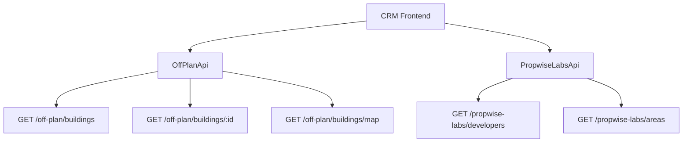

## Overview

The Off-Plan Directory replaces existing real estate sections with a unified **Off-Plan** tab under **Properties** in the main CRM sidebar. This module displays all published buildings from developer portal users in a card/map split view with rich filtering, 2GIS map integration, and detailed building views.

<Info>
The backend serves off-plan data through domain endpoints under `/off-plan/*`, which read Propwise Labs catalog data and apply CRM-owned visibility from `off_plan_building_publication` plus off-plan lifecycle filtering.
</Info>

## Architecture Overview

### Buildings vs Projects as Primary Entity

Based on the existing data model, **buildings** are the primary enrichment entity for the off-plan directory:

<CardGroup cols={2}>
  <Card title="Buildings Entity" icon="building">
    Primary entity with `coverImageUrl`, `status`, `endDate`, `paymentPlans`, `images`, `documents`, `amenities`
  </Card>
  <Card title="Publication Control" icon="eye">
    Buildings displayed based on CRM `is_published` visibility from `off_plan_building_publication` table
  </Card>
</CardGroup>

The list page queries `GET /off-plan/buildings`, and the detail page queries `GET /off-plan/buildings/:id`.

### Publication Logic

<Warning>
Publication is separate from Propwise Labs `building.status`. Developers publish/unpublish buildings through the developer portal, which writes `off_plan_building_publication.is_published`.
</Warning>

**Publish-readiness gate** validates buildings before allowing publication:

<Accordion title="Required Building Fields">
- `name`, `buildingNumber`, `descriptionEn`
- `floors`, `googleMapsLink`, `startDate`
- `coverImageUrl`, `area.id`
- `plotSize`, `actualArea`, `parkingCount`
- `serviceChargePerSqft`, `salesStatus`
- At least 1 `media` item
</Accordion>

<Accordion title="Required Villa Project Fields">
- `name`, `descriptionEn`, `imageUrl` (cover)
- `googleMapsLink`, `area.id`
- `latitude`, `longitude`, `salesStatus`
- At least 1 `media` item
</Accordion>

### Auto-Maintained Sales Status

A building's `salesStatus` is automatically maintained from live unit availability:

<Steps>
<Step title="Unit Status Change">
Developer updates a unit's `salesStatus` through the developer portal
</Step>
<Step title="Automatic Reconciliation">
`ProjectManagementService` recounts the building's units
</Step>
<Step title="Status Update">
Sets `salesStatus = OUT_OF_STOCK` when no `AVAILABLE` units remain, reverts to `ON_SALE` when available units reappear
</Step>
</Steps>

### Frontend Status Mapping

Frontend display status is derived from `building.status` through `getOffPlanFrontendStatus()`:

| Backend Status | Frontend Status | Color  |
|---------------|-----------------|--------|
| `ACTIVE`      | On Sale         | Orange |
| `PENDING`     | EOI             | Purple |
| `FINISHED`    | Out of Stock    | Gray   |

## Data Flow



<Note>
The `/off-plan/buildings` endpoints enforce publication by checking `off_plan_building_publication.is_published=true` and off-plan lifecycle requirements.
</Note>

## Navigation Implementation

### Sidebar Navigation

**File:** `src/components/layouts/CRMLayout.tsx`

Replace the entire `data.realEstate` array with a single "Off-Plan" entry:

```typescript
realEstate: [
  {
    title: 'Off-Plan',
    url: '/home/properties/off-plan',
    icon: Building2,  // from lucide-react
  },
],
```

<Warning>
Remove the old sidebar entries for Areas, Developments, and Units - the off-plan directory supersedes them.
</Warning>

### Breadcrumb Structure

```
Properties > Off-Plan                           (list page)
Properties > Off-Plan > {Building Name}         (map page with open detail panel)
```

## Route Structure

```
src/app/home/properties/off-plan/
├── page.tsx                    # Map/list page with building panel handling
└── [id]/
    └── page.tsx                # Re-exports ../page for URL consistency
```

<Important>
The `[id]/page.tsx` route must NOT implement a separate building detail page. It delegates to the main off-plan page so `/home/properties/off-plan/:buildingId` preserves the map, filters, and left-side panel behavior.
</Important>

## Component Structure

### List Page Components

```
src/components/pages/off-plan/
├── index.ts                           # Barrel export
├── off-plan-building-card.tsx          # Building card for grid view
├── off-plan-filters.tsx               # Horizontal filter bar
├── off-plan-map-view.tsx              # 2GIS map with markers + popover
├── off-plan-grid-view.tsx             # Scrollable grid with infinite scroll
├── off-plan-building-detail-panel.tsx  # Animated map-mode detail panel
└── off-plan-toolbar.tsx               # View toggle, sort, saved filters
```

### Detail Page Components

```
├── building-detail-header.tsx          # Sticky sidebar: name, price, units
├── building-detail-description.tsx     # Description with Read More
├── building-detail-unit-summary.tsx    # Unit availability cards
├── building-detail-amenities.tsx       # Amenities grid
├── building-detail-payment-plan.tsx    # Payment plan table
├── building-detail-progress.tsx        # Construction progress
└── building-detail-location.tsx        # Location and map
```

## UI Patterns

### Building Cards

<Tabs>
<Tab title="Grid View">
Cards display:
- Cover image with status badge overlay
- Building name and **Starting {price}** (when available)
- Compact availability row (Available/Reserved/Sold)
- Bottom metadata: handover quarter, area, developer
</Tab>
<Tab title="Map View">
Split layout:
- Scrollable card list (left)
- 2GIS interactive map (right) with custom markers
- Bidirectional hover sync between cards and markers
</Tab>
</Tabs>

### Map Integration

<Steps>
<Step title="Marker Interaction">
Custom circular developer-logo markers with hover popover previews
</Step>
<Step title="Bidirectional Sync">
Card hover pans map and highlights marker; marker hover highlights corresponding card
</Step>
<Step title="Detail Panel">
Clicking marker, preview card, or list card opens animated building detail panel
</Step>
</Steps>

### Detail Panel Structure

The animated left-column overlay includes:

<AccordionGroup>
<Accordion title="Header">
Building name, area, close action, and tabs (Overview, Units, Media, Contact)
</Accordion>
<Accordion title="Overview Tab">
- Cover image with price overlay
- Collapsible description (3-line with "Show more")
- Building details table
- Construction progress
- Unit availability summary (4 cards)
- Payment plan and amenities
- Location section
</Accordion>
<Accordion title="Units Tab">
Unit listings with filtering and sorting options
</Accordion>
<Accordion title="Media Tab">
Image gallery and document downloads
</Accordion>
<Accordion title="Contact Tab">
Developer contact information and inquiry form
</Accordion>
</AccordionGroup>

## Filters and Search

### Filter Bar Components

<CodeGroup>
```typescript Compact Search Input
// Leads-style search with debounced API calls
const [searchQuery, setSearchQuery] = useState('')
const debouncedSearch = useDebounce(searchQuery, 300)
```

```typescript Filter Dropdowns
// Quick dropdown buttons for:
// - Developer (searchable multi-select)
// - Price range
// - Payment options
// - Handover timeline
// - Bedroom count
// - Status (On Sale, EOI, Out of Stock)
```
</CodeGroup>

### Advanced Filtering

<Check>Filters persist in URL parameters for shareable links</Check>
<Check>Real-time filtering without page refresh</Check>
<Check>Saved filter presets for power users</Check>

## Data Requirements

### Building Data Structure

```typescript
interface OffPlanBuilding {
  id: string
  name: string
  buildingNumber?: string
  description: string
  coverImageUrl: string
  status: 'ACTIVE' | 'PENDING' | 'FINISHED'
  salesStatus: 'ANNOUNCED' | 'EOI' | 'ON_SALE' | 'OUT_OF_STOCK'
  startDate: string
  endDate?: string
  completionDate?: string
  stats: {
    startingPrice?: number
    unitsCount: number
    unitsByStatus: {
      available: number
      reserved: number
      sold: number
    }
  }
  area: AreaReference
  developer: DeveloperReference
  latitude: number
  longitude: number
  paymentPlans: PaymentPlan[]
  amenities: string[]
  images: MediaFile[]
  documents: MediaFile[]
}
```

### API Endpoints

<Tabs>
<Tab title="Building List">
```
GET /off-plan/buildings
Query: search, developer, area, priceMin, priceMax, bedrooms, status, sort, page
```
</Tab>
<Tab title="Building Detail">
```
GET /off-plan/buildings/:id
Returns: Full building data with units, media, and contact info
```
</Tab>
<Tab title="Map Markers">
```
GET /off-plan/buildings/map
Query: Same filters as list, returns optimized marker data
```
</Tab>
<Tab title="Grouped Units">
```
GET /off-plan/buildings/:id/units/grouped
Returns: Units grouped by type/bedrooms for summary display
```
</Tab>
</Tabs>

<Tip>
Use the existing `/propwise-labs/developers?q=` and `/propwise-labs/areas?q=` endpoints for filter dropdown options since they provide searchable, global catalog data.
</Tip>

## Implementation Considerations

### Performance Optimization

- Infinite scroll for building list pagination
- Lazy loading of building detail panels
- Map marker clustering for dense areas
- Image lazy loading with placeholder skeletons

### Responsive Design

- Mobile-first approach with touch-friendly interactions
- Collapsible sidebar on tablet/mobile
- Adaptive grid columns based on screen size
- Touch gestures for map navigation

### Error Handling

<Warning>
Implement comprehensive error boundaries for:
- Network failures during data loading
- Map rendering issues
- Image loading failures
- Filter API timeouts
</Warning>

### Analytics Integration

Track user interactions for optimization:
- Popular search terms and filters
- Most viewed buildings and developers
- Map vs grid view preferences
- Detail panel engagement metrics