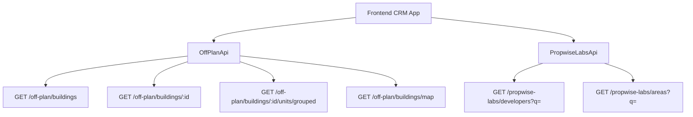

## Overview

The Off-Plan Directory adds a new **Off-Plan** tab under the **Properties** section of the main CRM sidebar. This feature displays all published buildings from developer portal users in a card/map split view with rich filters, 2GIS map integration, and detailed building views.

<Note>
The backend serves off-plan data through domain endpoints under `/off-plan/*`, which read Propwise Labs catalog data and apply CRM-owned visibility from `off_plan_building_publication` with off-plan lifecycle filtering.
</Note>

## Architecture Decision

### Buildings vs Projects as Primary Entity

Based on the existing data model, **buildings** are the primary enrichment entity:

- Buildings have their own `coverImageUrl`, `status`, `endDate`, `completionDate`, `paymentPlans`, `images`, `documents`, `amenities`
- Buildings can override inherited fields from projects (status, area, community, description)
- The off-plan directory displays **published buildings** based on CRM `is_published` visibility

<Info>
Publication is separate from Propwise Labs `building.status`. Developers publish/unpublish buildings through the developer portal, which writes `off_plan_building_publication.is_published`.
</Info>

### Publication and Readiness Gates

Before setting `is_published=true`, the publish endpoints validate the persisted entity against required field contracts:

<Steps>
<Step title="Building Requirements">
Buildings must satisfy the 13-field "complete building" contract: `name`, `buildingNumber`, `descriptionEn`, `floors`, `googleMapsLink`, `startDate`, `coverImageUrl`, `area.id`, `plotSize`, `actualArea`, `parkingCount`, `serviceChargePerSqft`, ≥1 `media`, plus `salesStatus`.
</Step>
<Step title="Villa Project Requirements">
Villa projects must satisfy: `name`, `descriptionEn`, `imageUrl` cover, `googleMapsLink`, `area.id`, `latitude`, `longitude`, ≥1 `media`, and `salesStatus`.
</Step>
<Step title="Validation Response">
All missing fields are aggregated into a single `400 BadRequest` response for comprehensive UI feedback.
</Step>
</Steps>

### Auto-Maintained Sales Status

A building's `salesStatus` is auto-maintained from live unit availability:

| Status | Description |
|--------|-------------|
| `ANNOUNCED` | Building announced but not yet available |
| `EOI` | Expression of Interest phase |
| `ON_SALE` | Active sales with available units |
| `OUT_OF_STOCK` | No available units (all reserved/sold) |

<Warning>
When no units remain `AVAILABLE`, the system automatically sets `salesStatus = OUT_OF_STOCK`. It reverts to `ON_SALE` when available units reappear.
</Warning>

### Frontend Status Mapping

Frontend display status derives from `building.status` through `getOffPlanFrontendStatus()`:

<AccordionGroup>
<Accordion title="Status Mapping Table">
| Backend Status | Frontend Status | Color |
|---------------|-----------------|-------|
| `ACTIVE` | On Sale | Orange |
| `PENDING` | EOI | Purple |
| `FINISHED` | Out of Stock | Gray |
</Accordion>
</AccordionGroup>

## Data Flow Architecture



<Check>
The `/off-plan/buildings` endpoints enforce publication by checking `off_plan_building_publication.is_published=true` and off-plan lifecycle compliance.
</Check>

## Implementation Specification

### 1. Sidebar Navigation

Update `src/components/layouts/CRMLayout.tsx` to replace the entire `data.realEstate` array:

<CodeGroup>
```typescript CRMLayout.tsx
realEstate: [
  {
    title: 'Off-Plan',
    url: '/properties/off-plan',
    icon: Building2,  // from lucide-react
  },
],
```
</CodeGroup>

<Note>
Remove the old sidebar entries for Areas, Developments, and Units as the off-plan directory supersedes them.
</Note>

### 2. Route Structure

<Steps>
<Step title="Main Route">
Create `src/app/(app)/properties/off-plan/page.tsx` for the map/list page
</Step>
<Step title="Dynamic Route">
Create `src/app/(app)/properties/off-plan/[id]/page.tsx` that re-exports the main page to preserve map behavior
</Step>
</Steps>

```
src/app/(app)/properties/off-plan/
├── page.tsx                    # Map/list page with building panel handling
└── [id]/
    └── page.tsx                # Re-exports ../page for /:id routes
```

<Warning>
The `[id]/page.tsx` route must NOT implement a separate building detail page. It delegates to maintain map, filters, and panel behavior.
</Warning>

### 3. Component Architecture

```
src/components/pages/off-plan/
├── index.ts                           # Barrel export
│
├── off-plan-building-card.tsx          # Building card for grid view
├── off-plan-filters.tsx               # Horizontal filter bar
├── off-plan-map-view.tsx              # 2GIS map with markers + popover
├── off-plan-grid-view.tsx             # Scrollable grid + infinite scroll
├── off-plan-building-detail-panel.tsx  # Animated detail panel
├── off-plan-toolbar.tsx               # View toggle, sort, saved filters
│
├── building-detail-header.tsx          # Panel header component
├── building-detail-description.tsx     # Description with Read More
├── building-detail-unit-summary.tsx    # Unit availability summary
```

### 4. Key Features

<Tabs>
<Tab title="List View">
- Card grid with cover images
- Status badges (On Sale, Out of Stock, EOI)
- Starting price display
- Unit availability summary
- Handover quarter badges
</Tab>
<Tab title="Map View">
- Split layout with scrollable cards and 2GIS map
- Custom circular developer-logo markers
- Bidirectional hover synchronization
- Marker hover opens preview popover
- Card hover centers map on marker
</Tab>
<Tab title="Detail Panel">
- Animated left-column overlay
- Tabbed interface (Overview, Units, Media, Contact)
- Cover image with price overlay
- Construction progress indicator
- Unit availability summary
- Payment plans and amenities
</Tab>
</Tabs>

### 5. Filter Implementation

The filters bar includes:

<CardGroup cols={2}>
<Card title="Search Input" icon="magnifying-glass">
Leads-style compact search for building names
</Card>
<Card title="Dropdown Filters" icon="filter">
Developer, Price, Payments, Handover, Bedrooms, Status
</Card>
</CardGroup>

### 6. Breadcrumb Updates

Replace all existing real-estate breadcrumb handling:

```
Properties > Off-Plan                           (list page)
Properties > Off-Plan > {Building Name}         (detail panel)
```

<Tip>
Remove breadcrumb entries for legacy routes: `/real-estate/areas`, `/real-estate/developments`, `/real-estate/units`, and `/real-estate/prospects`.
</Tip>

## API Endpoints

### Off-Plan Endpoints

| Endpoint | Purpose | Authentication |
|----------|---------|---------------|
| `GET /off-plan/buildings` | Card listing with filters | Required |
| `GET /off-plan/buildings/:id` | Building detail view | Required |
| `GET /off-plan/buildings/:id/units/grouped` | Unit groupings | Required |
| `GET /off-plan/buildings/map` | Map markers data | Required |

### Lookup Endpoints

| Endpoint | Purpose |
|----------|---------|
| `GET /propwise-labs/developers?q=` | Developer search options |
| `GET /propwise-labs/areas?q=` | Area filter dropdown |

<Note>
Generic lookup endpoints remain on `/propwise-labs/*` as they serve global catalog data shared across multiple features.
</Note>

## Frontend Status Legend

The map legend renders left-to-right as:

**Announced → EOI → On Sale → Out of Stock**

This order is defined in `OFF_PLAN_FRONTEND_STATUS_LABELS` within `off-plan-display-utils.ts`.

## Data Validation

<Steps>
<Step title="Publication Check">
All off-plan endpoints verify `is_published=true` in `off_plan_building_publication`
</Step>
<Step title="Lifecycle Filtering">
Buildings must match off-plan lifecycle (`ACTIVE` or `PENDING` status)
</Step>
<Step title="Exclusion Rules">
`UNKNOWN` status buildings are excluded from off-plan directory (secondary-only)
</Step>
</Steps>

<Check>
The implementation ensures only properly published, off-plan lifecycle buildings appear in the CRM directory while maintaining separation from raw catalog access.
</Check>