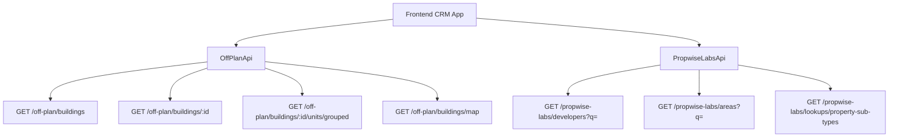

## Overview

The Off-Plan Directory adds a dedicated tab under the Properties section of the main CRM sidebar. This feature displays all published buildings from developer portal users in a card/map split view with rich filters, 2GIS map integration, and detailed building views.

<Note>
**Backend Architecture**: Off-plan data is served through domain endpoints under `/off-plan/*`. These endpoints read Propwise Labs catalog data and apply CRM-owned visibility from `off_plan_building_publication` plus the off-plan lifecycle helper, ensuring main CRM users only receive buildings with `is_published=true` that still classify as off-plan.
</Note>

## Visual Design Patterns

The implementation replicates key visual patterns from competitor platforms:

<CardGroup cols={2}>
  <Card title="List View (Grid)" icon="grid-2">
    Cards with cover image, frontend status badges (On Sale, Out of Stock, EOI), handover quarter, building name, area + developer, price from, and payment plan ratio
  </Card>
  <Card title="List View (Map)" icon="map">
    Split layout with scrollable card list on left, 2GIS interactive map on right with custom circular developer-logo markers and popover previews
  </Card>
  <Card title="Filters Bar" icon="filter">
    Leads-style compact search input + Filters popover under the page title, followed by quick dropdown buttons for Developer, Price, Payments, Handover, Unit type, Bedrooms, and Status
  </Card>
  <Card title="Building Detail" icon="building">
    Right-sticky sidebar with key info + scrollable left content area containing description, units & availability, images, features/amenities, location, payment plans, and developer info
  </Card>
</CardGroup>

## Architecture Decision

### Buildings vs Projects as Primary Entity

<Info>
**Primary Entity**: Buildings are the primary enrichment entity based on the existing data model.
</Info>

Buildings serve as the primary entity because they have their own:
- `coverImageUrl`, `status`, `endDate`, `completionDate`
- `paymentPlans`, `images`, `documents`, `amenities`
- Ability to override inherited fields from projects (status, area, community, description)

The off-plan directory displays **published buildings** based on CRM `is_published` visibility, since a project may contain multiple buildings with different lifecycle statuses and pricing.

### Frontend Status Mapping

Frontend display status is derived from `building.status` through `getOffPlanFrontendStatus()`:

| Backend `building.status` | Frontend Status | Color  |
| ------------------------- | --------------- | ------ |
| `ACTIVE`                  | On Sale         | Orange |
| `PENDING`                 | EOI             | Purple |
| `FINISHED`                | Out of Stock    | Gray   |

### Data Flow Architecture



<Warning>
The `/off-plan/buildings` endpoints enforce publication by checking `off_plan_building_publication.is_published=true` and require buildings to match the off-plan lifecycle helper. Secondary and `UNKNOWN` lifecycle records are hidden from the off-plan directory.
</Warning>

## Implementation Guide

### 1. Sidebar Navigation

<Steps>
<Step title="Update CRMLayout.tsx">
Replace the entire `data.realEstate` array in `src/components/layouts/CRMLayout.tsx`:

```typescript
realEstate: [
  {
    title: 'Off-Plan',
    url: '/home/properties/off-plan',
    icon: Building2,  // from lucide-react (already imported)
  },
],
```

Remove the old sidebar entries for Areas, Developments, and Units.
</Step>

<Step title="Update Breadcrumb Handling">
Replace all existing real-estate breadcrumb handling with off-plan routes:

```
Properties > Off-Plan                           (list page)
Properties > Off-Plan > {Building Name}         (detail page)
```

Remove breadcrumb entries for `/real-estate/areas`, `/real-estate/developments`, `/real-estate/units`, and `/real-estate/prospects`.
</Step>
</Steps>

### 2. Route Structure

```
src/app/home/properties/off-plan/
├── page.tsx                    # List page (grid + map toggle)
└── [id]/
    └── page.tsx                # Building detail page
```

<Tip>
Both pages follow the component extraction guide — page files contain ONLY the page function (< 200 lines).
</Tip>

### 3. Component Structure

<AccordionGroup>
<Accordion title="List Page Components">
```
src/components/pages/off-plan/
├── off-plan-building-card.tsx          # Building card for grid view
├── off-plan-filters.tsx               # Horizontal filter bar
├── off-plan-map-view.tsx              # 2GIS map with markers + popover
├── off-plan-grid-view.tsx             # Scrollable grid of building cards + infinite scroll
├── off-plan-toolbar.tsx               # View toggle (Grid/Map), sort, saved filters
```
</Accordion>

<Accordion title="Detail Page Components">
```
├── building-detail-header.tsx          # Sticky sidebar: name, price, units count, payment plan
├── building-detail-description.tsx     # Description section with Read More
├── building-detail-units.tsx           # Units & Availability (accordion grouped by bedrooms)
├── building-detail-unit-modal.tsx      # Unit detail popup (floor plan, specs, price)
├── building-detail-images.tsx          # Image grid with lightbox
├── building-detail-amenities.tsx       # Features/Amenities image grid
├── building-detail-location.tsx        # Location section with 2GIS map
├── building-detail-info-table.tsx      # Details table (Project Name, Developer, etc.)
├── building-detail-payment-plan.tsx    # Payment plan visualization (progress bar)
├── building-detail-documents.tsx       # Documents & links (PDF cards)
├── building-detail-developer.tsx       # Developer info card
```
</Accordion>
</AccordionGroup>

### 4. API Layer

Create a new API service file: `src/services/api/off-plan.api.ts`

<CodeGroup>
```typescript Filter Types
export interface OffPlanBuildingFilters {
  q?: string;
  status?: string;
  areaId?: number;
  communityId?: number;
  developerId?: number; // Legacy single developer filter
  developerIds?: number[]; // Multi-select developer filter
  propertyTypeId?: number;
  propertySubTypeId?: number;
  priceMode?: 'unit' | 'sqft'; // UI-only basis for minPrice/maxPrice controls
  minPrice?: number;
  maxPrice?: number;
  bedrooms?: string; // e.g., "1", "2", "3", "studio"
  completionBefore?: string; // Inclusive building.endDate upper bound
  completionAfter?: string; // Inclusive building.endDate lower bound
  maxPreHandoverPercent?: number; // Payment plan filter
  page?: number;
  limit?: number;
  sortBy?: string;
  sortOrder?: 'asc' | 'desc';
}

export interface MapMarkerFilters {
  q?: string;
  status?: string;
  projectId?: number;
  areaId?: number;
  communityId?: number;
  developerId?: number;
  developerIds?: number[];
  propertySubTypeId?: number;
  minPrice?: number;
  maxPrice?: number;
  completionBefore?: string;
  completionAfter?: string;
}
```

```typescript API Class
export class OffPlanApi {
  /** Search Propwise Labs buildings */
  static async searchBuildings(filters: OffPlanBuildingFilters) {
    return apiClient.get('/off-plan/buildings', { 
      params: supportedBuildingParams(filters) 
    });
  }

  /** Get building detail with all enrichment */
  static async getBuildingDetail(id: number) {
    return apiClient.get(`/off-plan/buildings/${id}`);
  }

  /** Get units grouped by bedroom category */
  static async getBuildingUnitsGrouped(buildingId: number) {
    return apiClient.get(`/off-plan/buildings/${buildingId}/units/grouped`);
  }

  /** Get single unit detail */
  static async getUnitDetail(unitId: number) {
    return apiClient.get(`/propwise-labs/units/${unitId}`);
  }

  /** Get map markers (lightweight building data with coordinates) */
  static async getMapMarkers(filters?: MapMarkerFilters) {
    return apiClient.get('/off-plan/buildings/map', { 
      params: supportedMapParams(filters) 
    });
  }

  /** Search developers for the searchable multi-select filter */
  static async searchDevelopers(q?: string) {
    return apiClient.get('/propwise-labs/developers', { params: { q } });
  }

  /** Search areas for filter dropdown */
  static async searchAreas(q?: string, cityId?: number) {
    return apiClient.get('/propwise-labs/areas', { params: { q, cityId } });
  }

  /** Get property subtypes for unit type filter */
  static async getPropertySubTypes() {
    return apiClient.get('/propwise-labs/lookups/property-sub-types');
  }
}
```
</CodeGroup>

### 5. Response Types

<CodeGroup>
```typescript Propwise Labs Types
// src/services/api/propwise-labs.api.ts
// Raw catalog response shapes
export interface PropwiseLabsBuilding { ... }
export interface PropwiseLabsUnit { ... }
export interface PropwiseLabsUnitGroup { ... }
export interface PropwiseLabsAmenity { ... }
export interface PropwiseLabsPaymentPlan { ... }
export interface PropwiseLabsDocument { ... }
```

```typescript Off-Plan Types
// src/services/api/off-plan.api.ts
// Off-plan types extend raw Propwise Labs shapes when /off-plan adds app-owned fields
export interface OffPlanBuilding extends PropwiseLabsBuilding {
  isPublished?: boolean;
  publishedAt?: string;
  unpublishedAt?: string;
  developerContact?: PropwiseLabsDeveloperContact;
  /** Full Propwise Labs developer profile from OffPlanBuildingPublication.developerId */
  developer?: PropwiseLabsDeveloperOption;
}
```
</CodeGroup>

## Key Features

### Map Integration

<Check>
**2GIS Integration**: The map view uses 2GIS interactive maps with custom circular developer-logo markers and popover previews. Marker border colors indicate building status.
</Check>

### Filter System

The filter system includes:
- Compact search input
- Filters popover under page title
- Quick dropdown buttons for:
  - Developer (searchable multi-select)
  - Price range
  - Payment plans
  - Handover quarter
  - Unit type
  - Bedrooms
  - Status

### Building Detail Page

<Tabs>
<Tab title="Layout">
- Right-sticky sidebar with key information
- Scrollable left content area with detailed sections
- Responsive design for mobile and desktop
</Tab>

<Tab title="Content Sections">
- Description with read more functionality
- Units & availability grouped by bedrooms
- Parking information
- Image galleries with lightbox
- Features and amenities
- Location with embedded map
- General plan visualization
- Detailed information table
- Payment plan breakdown
- Documents and links
- Developer information
</Tab>
</Tabs>

## Next Steps

<Steps>
<Step title="Backend Implementation">
Implement the `/off-plan/*` facade endpoints that read Propwise Labs catalog data and apply CRM visibility rules.
</Step>

<Step title="Frontend Components">
Create all the component files following the structure outlined above, ensuring proper TypeScript typing and responsive design.
</Step>

<Step title="Testing">
Implement comprehensive testing for both API endpoints and frontend components, including edge cases for publication status and lifecycle management.
</Step>

<Step title="Documentation">
Update user documentation to reflect the new Off-Plan Directory feature and remove references to the old Areas, Developments, and Units sections.
</Step>
</Steps>

<Warning>
Remember to remove all references to the old `/reference/*` endpoints and update any existing code that depends on the removed sidebar navigation items.
</Warning>