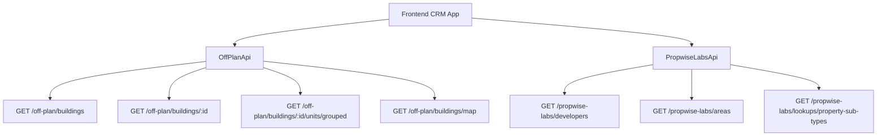

## Overview

The Off-Plan Directory adds a new **Off-Plan** tab under the **Properties** section of the main CRM sidebar. This feature displays all published buildings from developer portal users in a card/map split view with rich filters, 2GIS map integration, and a detailed building view.

<Note>
Off-plan data is served through domain endpoints under `/off-plan/*`. These endpoints read Propwise Labs catalog data and apply CRM-owned visibility from `off_plan_building_publication` plus the off-plan lifecycle helper, so main CRM users only receive buildings with `is_published=true` that still classify as off-plan.
</Note>

## Architecture Decision

### Buildings vs Projects as Primary Entity

Based on the existing data model, **buildings** are the primary enrichment entity:

- Buildings have their own `coverImageUrl`, `status`, `endDate`, `completionDate`, `paymentPlans`, `images`, `documents`, `amenities`
- Buildings can override inherited fields from projects (status, area, community, description)
- The off-plan directory displays **published buildings** based on CRM `is_published` visibility

<Info>
Publication is separate from Propwise Labs `building.status`. Developers publish or unpublish a building through the developer portal, which writes `off_plan_building_publication.is_published` for the Propwise Labs `building_id`.
</Info>

### Frontend Status Mapping

Frontend display status is derived from `building.status` through `getOffPlanFrontendStatus()`:

| Backend `building.status` | Frontend Status | Color  |
|--------------------------|----------------|--------|
| `ACTIVE`                 | On Sale        | Orange |
| `PENDING`                | EOI            | Purple |
| `FINISHED`               | Out of Stock   | Gray   |

### Data Flow



## Implementation Steps

<Steps>
<Step title="Update Sidebar Navigation">
Replace the existing real estate navigation in `src/components/layouts/CRMLayout.tsx`:

```typescript
realEstate: [
  {
    title: 'Off-Plan',
    url: '/home/properties/off-plan',
    icon: Building2,
  },
],
```

Remove the old sidebar entries for Areas, Developments, and Units.
</Step>

<Step title="Create Route Structure">
Set up the new route structure:

```
src/app/home/properties/off-plan/
├── page.tsx                    # List page (grid + map toggle)
└── [id]/
    └── page.tsx                # Building detail page
```
</Step>

<Step title="Implement API Layer">
Create the new API service in `src/services/api/off-plan.api.ts`:

```typescript
export interface OffPlanBuildingFilters {
  q?: string;
  status?: string;
  areaId?: number;
  communityId?: number;
  developerId?: number;
  developerIds?: number[];
  propertyTypeId?: number;
  propertySubTypeId?: number;
  priceMode?: 'unit' | 'sqft';
  minPrice?: number;
  maxPrice?: number;
  bedrooms?: string;
  completionBefore?: string;
  completionAfter?: string;
  maxPreHandoverPercent?: number;
  page?: number;
  limit?: number;
  sortBy?: string;
  sortOrder?: 'asc' | 'desc';
}

export class OffPlanApi {
  static async searchBuildings(filters: OffPlanBuildingFilters) {
    return apiClient.get('/off-plan/buildings', { params: supportedBuildingParams(filters) });
  }

  static async getBuildingDetail(id: number) {
    return apiClient.get(`/off-plan/buildings/${id}`);
  }

  static async getBuildingUnitsGrouped(buildingId: number) {
    return apiClient.get(`/off-plan/buildings/${buildingId}/units/grouped`);
  }

  static async getMapMarkers(filters?: MapMarkerFilters) {
    return apiClient.get('/off-plan/buildings/map', { params: supportedMapParams(filters) });
  }

  static async searchDevelopers(q?: string) {
    return apiClient.get('/propwise-labs/developers', { params: { q } });
  }

  static async searchAreas(q?: string, cityId?: number) {
    return apiClient.get('/propwise-labs/areas', { params: { q, cityId } });
  }

  static async getPropertySubTypes() {
    return apiClient.get('/propwise-labs/lookups/property-sub-types');
  }
}
```
</Step>

<Step title="Build Component Structure">
Create the component structure in `src/components/pages/off-plan/`:

<Tabs>
<Tab title="List Page Components">
- `off-plan-building-card.tsx` - Building card for grid view
- `off-plan-filters.tsx` - Horizontal filter bar
- `off-plan-map-view.tsx` - 2GIS map with markers + popover
- `off-plan-grid-view.tsx` - Scrollable grid of building cards
- `off-plan-toolbar.tsx` - View toggle, sort, saved filters
</Tab>

<Tab title="Detail Page Components">
- `building-detail-header.tsx` - Sticky sidebar with key info
- `building-detail-description.tsx` - Description with Read More
- `building-detail-units.tsx` - Units grouped by bedrooms
- `building-detail-unit-modal.tsx` - Unit detail popup
- `building-detail-images.tsx` - Image grid with lightbox
- `building-detail-amenities.tsx` - Features/Amenities grid
- `building-detail-location.tsx` - Location with 2GIS map
- `building-detail-info-table.tsx` - Details table
- `building-detail-payment-plan.tsx` - Payment plan visualization
- `building-detail-documents.tsx` - Documents & links
- `building-detail-developer.tsx` - Developer info card
</Tab>
</Tabs>
</Step>
</Steps>

## Component Specifications

### List Page Features

<CardGroup cols={2}>
<Card title="Grid View" icon="grid">
Cards with cover image, status badges, handover quarter, building name, area + developer, price from, and payment plan ratio
</Card>

<Card title="Map View" icon="map">
Split layout with scrollable card list on left and 2GIS interactive map on right with custom circular developer-logo markers
</Card>

<Card title="Filters Bar" icon="filter">
Compact search input + Filters popover with dropdowns for Developer, Price, Payments, Handover, Unit type, Bedrooms, and Status
</Card>

<Card title="Infinite Scroll" icon="arrows-down">
Automatic loading of additional buildings as user scrolls through the grid
</Card>
</CardGroup>

### Detail Page Layout

<Warning>
The building detail page uses a **right-sticky sidebar** with key info and a **scrollable left content area** containing all building details.
</Warning>

The detail page includes these sections in order:

1. **Description** - Building overview with Read More functionality
2. **Units & Availability** - Grouped by bedrooms in accordion format
3. **Parking Info** - If available
4. **Images** - Grid with lightbox functionality
5. **Features/Amenities** - Image grid of building amenities
6. **Location** - Interactive 2GIS map showing building location
7. **General Plan** - Building layout if available
8. **Details Table** - Structured information (Project Name, Developer, etc.)
9. **Payment Plan** - Visual breakdown with progress indicators
10. **Documents & Links** - PDF cards and external links
11. **Developer Info** - Contact and company details

## Response Types

<AccordionGroup>
<Accordion title="OffPlanBuilding Interface">
```typescript
export interface OffPlanBuilding extends PropwiseLabsBuilding {
  isPublished?: boolean;
  publishedAt?: string;
  unpublishedAt?: string;
  developerContact?: PropwiseLabsDeveloperContact;
  developer?: PropwiseLabsDeveloperOption;
}
```
</Accordion>

<Accordion title="MapMarkerFilters Interface">
```typescript
export interface MapMarkerFilters {
  q?: string;
  status?: string;
  projectId?: number;
  areaId?: number;
  communityId?: number;
  developerId?: number;
  developerIds?: number[];
  propertySubTypeId?: number;
  minPrice?: number;
  maxPrice?: number;
  completionBefore?: string;
  completionAfter?: string;
}
```
</Accordion>
</AccordionGroup>

## Key Design Patterns

<Tip>
The implementation replicates visual patterns from competitor platforms, focusing on:
- **Card-based layouts** for building listings
- **Split view navigation** between grid and map modes
- **Rich filtering** with multiple criteria
- **Interactive maps** with custom markers and popover previews
- **Detailed building views** with comprehensive information display
</Tip>

## Data Validation

<Check>
All off-plan directory endpoints enforce publication by checking `off_plan_building_publication.is_published=true` and require buildings to match the off-plan lifecycle helper.
</Check>

The system intentionally excludes `UNKNOWN` status buildings from off-plan listings, keeping them available only for secondary market queries on raw `/propwise-labs/*` endpoints.