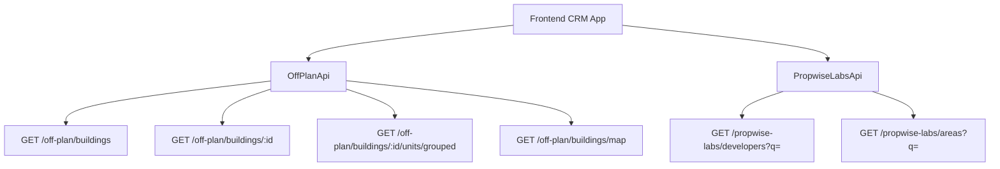

## Overview

The Off-Plan Directory adds a new **Off-Plan** tab under the **Properties** section of the main CRM sidebar. This feature displays all published buildings from developer portal users in a card/map split view with rich filters, 2GIS map integration, and detailed building views.

<Note>
Off-plan data is served through domain endpoints under `/off-plan/*`. These endpoints read Propwise Labs catalog data and apply CRM-owned visibility from `off_plan_building_publication` plus the off-plan lifecycle helper, so main CRM users only receive buildings with `is_published=true` that still classify as off-plan.
</Note>

## Architecture Decision

### Buildings vs Projects as Primary Entity

Based on the existing data model, **buildings** are the primary enrichment entity:

- Buildings have their own `coverImageUrl`, `status`, `endDate`, `completionDate`, `paymentPlans`, `images`, `documents`, `amenities`
- Buildings can override inherited fields from projects (status, area, community, description)
- The off-plan directory displays **published buildings** based on CRM `is_published` visibility

<Info>
The list page queries `GET /off-plan/buildings`, and the detail page queries `GET /off-plan/buildings/:id`.
</Info>

### Publication System

Publication is separate from Propwise Labs `building.status`. Developers publish or unpublish buildings through the developer portal, which writes `off_plan_building_publication.is_published` for the Propwise Labs `building_id`.

<Warning>
Missing publication rows are treated as draft/unpublished. Unpublishing keeps the row with `unpublished_at` plus `unpublished_by_id` for audit.
</Warning>

#### Publish-Readiness Gate

Before setting `is_published=true`, publish endpoints validate the persisted entity against required fields:

**Buildings must satisfy:**
- 13-field "complete building" contract: `name`, `buildingNumber`, `descriptionEn`, `floors`, `googleMapsLink`, `startDate`, `coverImageUrl`, `area.id`, `plotSize`, `actualArea`, `parkingCount`, `serviceChargePerSqft`, ≥1 `media`
- `salesStatus` (required at publish)

**Villa projects must satisfy:**
- `name`, `descriptionEn`, `imageUrl` cover, `googleMapsLink`, `area.id`, `latitude`, `longitude`, ≥1 `media`, `salesStatus`

<Tip>
All missing fields are aggregated into a single `400 BadRequest` so the dev-portal UI can list every missing field in one response.
</Tip>

#### Auto-Maintained Sales Status

A building's `salesStatus` (`ANNOUNCED | EOI | ON_SALE | OUT_OF_STOCK`) is auto-maintained from live unit availability:

- Sets `salesStatus = OUT_OF_STOCK` when **no** units remain `AVAILABLE`
- Reverts to `ON_SALE` when an `AVAILABLE` unit reappears
- For `Buildings`-type projects: the **building** is reconciled
- For `Villas`-type projects: the **project** is reconciled

### Frontend Status Display

Frontend display status is derived from `building.status` through `getOffPlanFrontendStatus()`:

| Backend `building.status` | Frontend Status | Color  |
| ------------------------- | --------------- | ------ |
| `ACTIVE`                  | On Sale         | Orange |
| `PENDING`                 | EOI             | Purple |
| `FINISHED`                | Out of Stock    | Gray   |

### Data Flow



<Note>
The `/off-plan/buildings` endpoints enforce publication by checking `off_plan_building_publication.is_published=true` and require buildings to match the off-plan lifecycle helper.
</Note>

## Implementation Steps

<Steps>
<Step title="Update Sidebar Navigation">
Replace the entire `data.realEstate` array in `src/components/layouts/CRMLayout.tsx` with a single "Off-Plan" entry:

```typescript
realEstate: [
  {
    title: 'Off-Plan',
    url: '/properties/off-plan',
    icon: Building2,  // from lucide-react
  },
],
```

Remove old sidebar entries for Areas, Developments, and Units.
</Step>

<Step title="Configure Route Structure">
Create the following route structure:

```
src/app/(app)/properties/off-plan/
├── page.tsx                    # Map/list page with building panel handling
└── [id]/
    └── page.tsx                # Re-exports ../page for consistent behavior
```

<Warning>
The `[id]/page.tsx` route must not implement a separate building detail page. It delegates to the main off-plan page so `/properties/off-plan/:buildingId` preserves the map, filters, and left-side panel behavior.
</Warning>
</Step>

<Step title="Implement Component Structure">
Create the following component hierarchy:

```
src/components/pages/off-plan/
├── index.ts                           # Barrel export
│
│   ── List Page Components ──
├── off-plan-building-card.tsx          # Building card for grid view
├── off-plan-filters.tsx               # Horizontal filter bar
├── off-plan-map-view.tsx              # 2GIS map with markers + popover
├── off-plan-grid-view.tsx             # Scrollable grid + infinite scroll
├── off-plan-building-detail-panel.tsx  # Animated detail panel
├── off-plan-toolbar.tsx               # View toggle, sort, saved filters
│
│   ── Detail Components ──
├── building-detail-header.tsx          # Sticky sidebar header
├── building-detail-description.tsx     # Description with Read More
├── building-detail-unit-summary.tsx    # Unit availability summary
```
</Step>

<Step title="Update Breadcrumb Handling">
Replace all existing real-estate breadcrumb handling with off-plan routes:

```
Properties > Off-Plan                           (list page)
Properties > Off-Plan > {Building Name}         (detail panel)
```

Remove breadcrumb entries for `/real-estate/areas`, `/real-estate/developments`, `/real-estate/units`, and `/real-estate/prospects`.
</Step>
</Steps>

## Key Features

### List Page (Grid View)
Cards display:
- Cover image with status badges (On Sale, Out of Stock, EOI)
- Building name
- **Starting {price}** when `stats.startingPrice` exists (hidden otherwise)
- Compact unit availability (Available/Reserved/Sold from `stats.unitsByStatus`)
- Bottom metadata badges for handover quarter (`endDate` → `Q1 2028`), area, and developer

### List Page (Map View)
Split layout features:
- Scrollable card list on left
- 2GIS interactive map on right with custom circular developer-logo markers
- Hover popover previews anchored above each marker
- **Bidirectional sync**: hovering cards pans map to marker, hovering markers scrolls to matching card

<Check>
Map sync includes temporary pin dropping for out-of-view markers with "Search this area" functionality.
</Check>

### Filters Bar
Compact interface includes:
- Leads-style search input
- Filters popover under page title
- Quick dropdown buttons for Developer, Price, Payments, Handover, Bedrooms, and Status

### Map Detail Panel
Animated left-column overlay with:
- Figma-matched header (building name, area, close action)
- Underline tabs for Overview, Units, Media, and Contact
- Cover image with bottom-left price overlay
- Description with three-line collapse and "Show more" control
- Building details table and construction progress
- Four-card unit availability summary
- Payment plan, amenities, and location information

<Info>
Total Units comes from `building.stats?.unitsCount`. Available/Reserved/Sold come from `building.stats?.unitsByStatus` aggregate, falling back to grouped unit status counting when aggregate is absent.
</Info>

### Building Detail Route
`/properties/off-plan/:buildingId` renders the same map-mode off-plan page and opens the building detail panel on the left. There is no separate full-page detail layout.

## Reference Implementation

<Tabs>
<Tab title="TypeScript Types">
```typescript
interface OffPlanBuilding {
  id: string;
  name: string;
  status: 'ACTIVE' | 'PENDING' | 'FINISHED';
  salesStatus: 'ANNOUNCED' | 'EOI' | 'ON_SALE' | 'OUT_OF_STOCK';
  coverImageUrl?: string;
  stats: {
    startingPrice?: number;
    unitsCount?: number;
    unitsByStatus: {
      available: number;
      reserved: number;
      sold: number;
    };
  };
  area: {
    id: string;
    name: string;
  };
  developer: {
    id: string;
    name: string;
    logo?: string;
  };
  endDate?: string;
  lat?: number;
  lng?: number;
}
```
</Tab>

<Tab title="API Endpoints">
```typescript
// List buildings
GET /off-plan/buildings
  ?page=1
  &limit=20
  &search=query
  &developerId=uuid
  &areaId=uuid
  &status=ON_SALE
  &priceMin=100000
  &priceMax=1000000
  &bedrooms=2,3
  &handoverQuarter=Q1_2025

// Get building details
GET /off-plan/buildings/:id

// Get map markers
GET /off-plan/buildings/map
  ?bounds=lat1,lng1,lat2,lng2

// Get grouped units
GET /off-plan/buildings/:id/units/grouped
```
</Tab>

<Tab title="Status Helper">
```typescript
export function getOffPlanFrontendStatus(
  status: string
): { label: string; color: string } {
  switch (status) {
    case 'ACTIVE':
      return { label: 'On Sale', color: 'orange' };
    case 'PENDING':
      return { label: 'EOI', color: 'purple' };
    case 'FINISHED':
      return { label: 'Out of Stock', color: 'gray' };
    default:
      return { label: 'Unknown', color: 'gray' };
  }
}
```
</Tab>
</Tabs>

<CardGroup cols={2}>
<Card title="API Reference" href="/api/off-plan">
Complete Off-Plan API documentation
</Card>
<Card title="Component Library" href="/components/off-plan">
Off-Plan component specifications
</Card>
<Card title="Developer Portal Integration" href="/developer-portal/off-plan">
Publication workflow documentation
</Card>
<Card title="Map Integration Guide" href="/integrations/2gis-maps">
2GIS map implementation details
</Card>
</CardGroup>