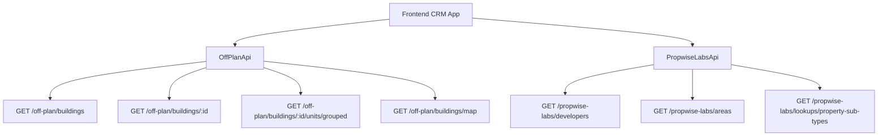

## Overview

The Off-Plan Directory adds an **Off-Plan** tab under the **Properties** section of the main CRM sidebar. This feature displays all published buildings from developer portal users in a card/map split view with rich filters, 2GIS map integration, and a detailed building view.

<Note>
Off-plan data is served through domain endpoints under `/off-plan/*`. These endpoints read Propwise Labs catalog data and apply CRM-owned visibility from `off_plan_building_publication` plus the off-plan lifecycle helper, so main CRM users only receive buildings with `is_published=true` that still classify as off-plan.
</Note>

## Architecture Decision

### Buildings vs Projects as Primary Entity

Based on the existing data model, **buildings** are the primary enrichment entity:

- Buildings have their own `coverImageUrl`, `status`, `endDate`, `completionDate`, `paymentPlans`, `images`, `documents`, `amenities`
- Buildings can override inherited fields from projects (status, area, community, description)
- The off-plan directory displays **published buildings** based on CRM `is_published` visibility

<Info>
Publication is separate from Propwise Labs `building.status`. Developers publish or unpublish a building through the developer portal, which writes `off_plan_building_publication.is_published` for the Propwise Labs `building_id`.
</Info>

### Frontend Status Mapping

Frontend display status is derived from `building.status` through `getOffPlanFrontendStatus()`:

| Backend `building.status` | Frontend Status | Color  |
| ------------------------- | --------------- | ------ |
| `ACTIVE`                  | On Sale         | Orange |
| `PENDING`                 | EOI             | Purple |
| `FINISHED`                | Out of Stock    | Gray   |

### Data Flow



<Warning>
The `/off-plan/buildings` endpoints enforce publication by checking `off_plan_building_publication.is_published=true` and require the building to match the off-plan lifecycle helper.
</Warning>

## Implementation Steps

<Steps>
<Step title="Update Sidebar Navigation">
Replace the entire `data.realEstate` array in `src/components/layouts/CRMLayout.tsx` with a single "Off-Plan" entry:

```typescript
realEstate: [
  {
    title: 'Off-Plan',
    url: '/home/properties/off-plan',
    icon: Building2,  // from lucide-react
  },
],
```

Update breadcrumb handling to support:
- `Properties > Off-Plan` (list page)
- `Properties > Off-Plan > {Building Name}` (detail page)
</Step>

<Step title="Create Route Structure">
Set up the following route structure:

```
src/app/home/properties/off-plan/
├── page.tsx                    # List page (grid + map toggle)
└── [id]/
    └── page.tsx                # Building detail page
```

<Note>
Both pages should follow the component extraction guide — page files contain ONLY the page function (< 200 lines).
</Note>
</Step>

<Step title="Build Component Structure">
Create the following components in `src/components/pages/off-plan/`:

<AccordionGroup>
<Accordion title="List Page Components">
- `off-plan-building-card.tsx` - Building card for grid view
- `off-plan-filters.tsx` - Horizontal filter bar
- `off-plan-map-view.tsx` - 2GIS map with markers + popover
- `off-plan-grid-view.tsx` - Scrollable grid with infinite scroll
- `off-plan-building-detail-panel.tsx` - Animated detail panel
- `off-plan-toolbar.tsx` - View toggle, sort, saved filters
</Accordion>

<Accordion title="Detail Page Components">
- `building-detail-header.tsx` - Sticky sidebar with key info
- `building-detail-description.tsx` - Description with Read More
- `building-detail-units.tsx` - Units grouped by bedrooms
- `building-detail-unit-modal.tsx` - Unit detail popup
- `building-detail-images.tsx` - Image grid with lightbox
- `building-detail-amenities.tsx` - Features/Amenities grid
- `building-detail-location.tsx` - Location with 2GIS map
- `building-detail-info-table.tsx` - Details table
- `building-detail-payment-plan.tsx` - Payment plan visualization
- `building-detail-documents.tsx` - Documents & links
- `building-detail-developer.tsx` - Developer info card
</Accordion>
</AccordionGroup>
</Step>

<Step title="Implement API Layer">
Create `src/services/api/off-plan.api.ts` with the following structure:

<CodeGroup>
```typescript Filter Types
export interface OffPlanBuildingFilters {
  q?: string;
  status?: string;
  areaId?: number;
  communityId?: number;
  developerId?: number;
  developerIds?: number[];
  propertyTypeId?: number;
  propertySubTypeId?: number;
  priceMode?: 'unit' | 'sqft';
  minPrice?: number;
  maxPrice?: number;
  bedrooms?: string;
  completionBefore?: string;
  completionAfter?: string;
  maxPreHandoverPercent?: number;
  page?: number;
  limit?: number;
  sortBy?: string;
  sortOrder?: 'asc' | 'desc';
}
```

```typescript API Class
export class OffPlanApi {
  static async searchBuildings(filters: OffPlanBuildingFilters) {
    return apiClient.get('/off-plan/buildings', { 
      params: supportedBuildingParams(filters) 
    });
  }

  static async getBuildingDetail(id: number) {
    return apiClient.get(`/off-plan/buildings/${id}`);
  }

  static async getBuildingUnitsGrouped(buildingId: number) {
    return apiClient.get(`/off-plan/buildings/${buildingId}/units/grouped`);
  }

  static async getMapMarkers(filters?: MapMarkerFilters) {
    return apiClient.get('/off-plan/buildings/map', { 
      params: supportedMapParams(filters) 
    });
  }

  static async searchDevelopers(q?: string) {
    return apiClient.get('/propwise-labs/developers', { params: { q } });
  }

  static async searchAreas(q?: string, cityId?: number) {
    return apiClient.get('/propwise-labs/areas', { params: { q, cityId } });
  }

  static async getPropertySubTypes() {
    return apiClient.get('/propwise-labs/lookups/property-sub-types');
  }
}
```
</CodeGroup>
</Step>
</Steps>

## Key Features Implementation

### List Page Features

<Tabs>
<Tab title="Grid View">
- Cards with cover image, status badges, handover quarter
- Building name, area + developer, price from
- Payment plan ratio display
- Infinite scroll pagination
</Tab>

<Tab title="Map View">
- Split layout with scrollable cards on left
- 2GIS interactive map on right
- Custom circular developer-logo markers
- Hover popover previews anchored above markers
- Marker hover scrolls to matching card and highlights it
</Tab>
</Tabs>

### Filter Bar Components

<CardGroup cols={2}>
<Card title="Search & Filters" icon="magnifying-glass">
Compact search input with expandable filters popover
</Card>
<Card title="Quick Filters" icon="sliders">
Dropdown buttons for Developer, Price, Payments, Handover, Unit type, Bedrooms, Status
</Card>
</CardGroup>

### Building Detail Page Layout

The building detail page uses a **right-sticky sidebar** with key info plus a **scrollable left content area** containing:

- Description with expandable text
- Units & availability grouped by bedrooms
- Parking information
- Image galleries with lightbox
- Features/amenities grid
- Location section with embedded map
- General building plan
- Detailed information table
- Payment plan visualization
- Documents & links section
- Developer information card

<Tip>
The detail page opens as an animated panel overlay when accessed from map view, or as a full page when navigated directly.
</Tip>

## Data Model Considerations

### Publication Control

<Warning>
Missing publication rows in `off_plan_building_publication` are treated as draft/unpublished. Unpublishing keeps the row with `unpublished_at` and `unpublished_by_id` for audit purposes.
</Warning>

### Lifecycle Management

The off-plan lifecycle helper treats:
- `ACTIVE` and `PENDING` as off-plan statuses
- Intentionally excludes `UNKNOWN` from off-plan
- `UNKNOWN` remains secondary-eligible only on raw `/propwise-labs/*` endpoints

### Legacy Endpoint Migration

<Check>
The new `/off-plan/*` endpoints replace the previous `/reference/*` routes, providing better separation of concerns and cleaner data access patterns.
</Check>

## Integration Points

### 2GIS Map Integration

- Custom marker styling with developer logos
- Interactive hover states with property previews
- Synchronized highlighting between map and list view
- Smooth animations for marker interactions

### Developer Portal Connection

- Buildings are published through the developer portal
- Publication status controls visibility in main CRM
- Audit trail maintained for publication changes
- Real-time updates when publication status changes

This implementation provides a comprehensive off-plan property directory that integrates seamlessly with the existing CRM while maintaining clean separation from the underlying Propwise Labs catalog system.