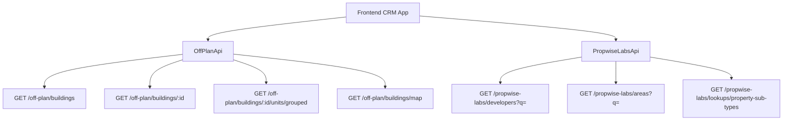

## Overview

The Off-Plan Directory adds a comprehensive **Off-Plan** tab under the **Properties** section of the main CRM sidebar. This feature displays all published buildings from developer portal users in a card/map split view with rich filters, 2GIS map integration, and detailed building views.

<Note>
Off-plan data is served through domain endpoints under `/off-plan/*`. These endpoints read Propwise Labs catalog data and apply CRM-owned visibility from `off_plan_building_publication` plus the off-plan lifecycle helper, ensuring main CRM users only receive buildings with `is_published=true` that still classify as off-plan.
</Note>

## Architecture Decision

### Buildings vs Projects as Primary Entity

Based on the existing data model, **buildings** are the primary enrichment entity:

- Buildings have their own `coverImageUrl`, `status`, `endDate`, `completionDate`, `paymentPlans`, `images`, `documents`, `amenities`
- Buildings can override inherited fields from projects (status, area, community, description)
- The off-plan directory displays **published buildings** based on CRM `is_published` visibility

<Info>
Publication is separate from Propwise Labs `building.status`. Developers publish or unpublish buildings through the developer portal, which writes `off_plan_building_publication.is_published` for the Propwise Labs `building_id`.
</Info>

### Frontend Status Mapping

Frontend display status is derived from `building.status` through `getOffPlanFrontendStatus()`:

| Backend `building.status` | Frontend Status | Color  |
| ------------------------- | --------------- | ------ |
| `ACTIVE`                  | On Sale         | Orange |
| `PENDING`                 | EOI             | Purple |
| `FINISHED`                | Out of Stock    | Gray   |

### Data Flow



## Implementation Steps

<Steps>
<Step title="Update Sidebar Navigation">
Replace the existing real estate navigation with the Off-Plan entry in `src/components/layouts/CRMLayout.tsx`:

```typescript
realEstate: [
  {
    title: 'Off-Plan',
    url: '/home/properties/off-plan',
    icon: Building2,  // from lucide-react
  },
],
```

Update breadcrumb handling to support:
- `Properties > Off-Plan` (list page)
- `Properties > Off-Plan > {Building Name}` (detail page)
</Step>

<Step title="Create Route Structure">
Set up the route structure under `src/app/home/properties/off-plan/`:

```
src/app/home/properties/off-plan/
├── page.tsx                    # List page (grid + map toggle)
└── [id]/
    └── page.tsx                # Building detail page
```

<Warning>
Both page files should contain ONLY the page function (< 200 lines) following the component extraction guide.
</Warning>
</Step>

<Step title="Build Component Architecture">
Create the component structure under `src/components/pages/off-plan/`:

<Tabs>
<Tab title="List Page Components">
```
├── off-plan-building-card.tsx          # Building card for grid view
├── off-plan-filters.tsx               # Horizontal filter bar
├── off-plan-map-view.tsx              # 2GIS map with markers + popover
├── off-plan-grid-view.tsx             # Scrollable grid + infinite scroll
├── off-plan-toolbar.tsx               # View toggle, sort, saved filters
```
</Tab>

<Tab title="Detail Page Components">
```
├── building-detail-header.tsx          # Sticky sidebar
├── building-detail-description.tsx     # Description with Read More
├── building-detail-units.tsx           # Units grouped by bedrooms
├── building-detail-unit-modal.tsx      # Unit detail popup
├── building-detail-images.tsx          # Image grid with lightbox
├── building-detail-amenities.tsx       # Features/Amenities grid
├── building-detail-location.tsx        # Location with 2GIS map
├── building-detail-info-table.tsx      # Details table
├── building-detail-payment-plan.tsx    # Payment plan visualization
├── building-detail-documents.tsx       # Documents & links
├── building-detail-developer.tsx       # Developer info card
```
</Tab>
</Tabs>
</Step>

<Step title="Implement API Layer">
Create the API service in `src/services/api/off-plan.api.ts`:

<CodeGroup>
```typescript Filter Types
export interface OffPlanBuildingFilters {
  q?: string;
  status?: string;
  areaId?: number;
  communityId?: number;
  developerId?: number; // Legacy single developer filter
  developerIds?: number[]; // Multi-select developer filter
  propertyTypeId?: number;
  propertySubTypeId?: number;
  priceMode?: 'unit' | 'sqft';
  minPrice?: number;
  maxPrice?: number;
  bedrooms?: string;
  completionBefore?: string;
  completionAfter?: string;
  maxPreHandoverPercent?: number;
  page?: number;
  limit?: number;
  sortBy?: string;
  sortOrder?: 'asc' | 'desc';
}
```

```typescript API Class
export class OffPlanApi {
  /** Search Propwise Labs buildings */
  static async searchBuildings(filters: OffPlanBuildingFilters) {
    return apiClient.get('/off-plan/buildings', { 
      params: supportedBuildingParams(filters) 
    });
  }

  /** Get building detail with all enrichment */
  static async getBuildingDetail(id: number) {
    return apiClient.get(`/off-plan/buildings/${id}`);
  }

  /** Get units grouped by bedroom category */
  static async getBuildingUnitsGrouped(buildingId: number) {
    return apiClient.get(`/off-plan/buildings/${buildingId}/units/grouped`);
  }

  /** Get map markers */
  static async getMapMarkers(filters?: MapMarkerFilters) {
    return apiClient.get('/off-plan/buildings/map', { 
      params: supportedMapParams(filters) 
    });
  }

  /** Search developers for filter */
  static async searchDevelopers(q?: string) {
    return apiClient.get('/propwise-labs/developers', { params: { q } });
  }
}
```
</CodeGroup>
</Step>
</Steps>

## Key Features

<CardGroup cols={2}>
<Card title="List View" icon="grid">
- Grid of building cards with cover images
- Status badges (On Sale, Out of Stock, EOI)
- Handover quarter, building name, area + developer
- Price from and payment plan ratio
- Infinite scroll with pagination
</Card>

<Card title="Map View" icon="map">
- Split layout with scrollable cards on left
- 2GIS interactive map on right
- Custom circular developer-logo markers
- Marker border colors indicate building status
- Popover previews on hover
</Card>

<Card title="Advanced Filters" icon="filter">
- Compact search input with leads-style design
- Quick dropdown buttons for Developer, Price, Payments
- Handover quarter, Unit type, Bedrooms, and Status filters
- Multi-select developer filter support
</Card>

<Card title="Building Detail" icon="building">
- Right-sticky sidebar with key information
- Scrollable content with description, units, images
- Payment plan visualization with progress bars
- Location integration with 2GIS maps
- Documents and developer contact information
</Card>
</CardGroup>

## Response Types

<AccordionGroup>
<Accordion title="Off-Plan Building Interface">
```typescript
export interface OffPlanBuilding extends PropwiseLabsBuilding {
  isPublished?: boolean;
  publishedAt?: string;
  unpublishedAt?: string;
  developerContact?: PropwiseLabsDeveloperContact;
  /** Full Propwise Labs developer profile */
  developer?: PropwiseLabsDeveloperOption;
}
```
</Accordion>

<Accordion title="Map Marker Filters">
```typescript
export interface MapMarkerFilters {
  q?: string;
  status?: string;
  projectId?: number;
  areaId?: number;
  communityId?: number;
  developerId?: number;
  developerIds?: number[];
  propertySubTypeId?: number;
  minPrice?: number;
  maxPrice?: number;
  completionBefore?: string;
  completionAfter?: string;
}
```
</Accordion>
</AccordionGroup>

## Integration Notes

<Tip>
The `/off-plan/buildings` list, detail, map, and grouped-unit endpoints automatically enforce publication by checking `off_plan_building_publication.is_published=true` before returning building data to main CRM users.
</Tip>

<Warning>
Generic lookup endpoints remain on `/propwise-labs/*` because they provide global catalog data shared by off-plan, secondary, developer portal, and future property-interest flows.
</Warning>

The off-plan lifecycle helper treats `ACTIVE` and `PENDING` as off-plan statuses and intentionally excludes `UNKNOWN` from off-plan. `UNKNOWN` remains secondary-eligible only on the raw `/propwise-labs/*` catalog endpoints when `type=secondary` is requested.