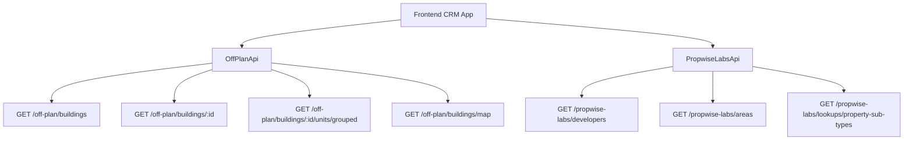

## Overview

The Off-Plan Directory adds a new **Off-Plan** tab under the **Properties** section of the main CRM sidebar. This feature displays all published buildings from developer portal users in a card/map split view with rich filters, 2GIS map integration, and detailed building views.

<Info>
Off-plan data is served through domain endpoints under `/off-plan/*` which read Propwise Labs catalog data and apply CRM-owned visibility from `off_plan_building_publication` plus the off-plan lifecycle helper.
</Info>

## Architecture Decision

### Buildings vs Projects as Primary Entity

<Note>
Based on the existing data model, **buildings** are the primary enrichment entity rather than projects.
</Note>

Buildings serve as the primary entity because they have their own:
- `coverImageUrl`, `status`, `endDate`, `completionDate`
- `paymentPlans`, `images`, `documents`, `amenities`
- Can override inherited fields from projects (status, area, community, description)

The off-plan directory displays **published buildings** based on CRM `is_published` visibility, since a project may contain multiple buildings with different lifecycle statuses and pricing.

### Data Flow Architecture



<Warning>
The `/off-plan/buildings` endpoints enforce publication by checking `off_plan_building_publication.is_published=true` and require buildings to match the off-plan lifecycle helper.
</Warning>

### Frontend Status Mapping

| Backend `building.status` | Frontend Status | Color  |
|---------------------------|-----------------|--------|
| `ACTIVE`                  | On Sale         | Orange |
| `PENDING`                 | EOI             | Purple |
| `FINISHED`                | Out of Stock    | Gray   |

## Implementation Steps

<Steps>
<Step title="Update Sidebar Navigation">
Replace the entire `data.realEstate` array in `src/components/layouts/CRMLayout.tsx`:

```typescript
realEstate: [
  {
    title: 'Off-Plan',
    url: '/home/properties/off-plan',
    icon: Building2,  // from lucide-react
  },
],
```

Remove old sidebar entries for Areas, Developments, and Units.
</Step>

<Step title="Setup Route Structure">
Create the following route structure:

```
src/app/home/properties/off-plan/
├── page.tsx                    # List page (grid + map toggle)
└── [id]/
    └── page.tsx                # Building detail page
```

<Note>
Both page files should contain ONLY the page function (< 200 lines) following the component extraction guide.
</Note>
</Step>

<Step title="Create Component Architecture">
Implement the component structure under `src/components/pages/off-plan/`:

<Tabs>
<Tab title="List Page Components">
- `off-plan-building-card.tsx` - Building card for grid view
- `off-plan-filters.tsx` - Horizontal filter bar
- `off-plan-map-view.tsx` - 2GIS map with markers + popover
- `off-plan-grid-view.tsx` - Scrollable grid with infinite scroll
- `off-plan-building-detail-panel.tsx` - Animated detail panel
- `off-plan-toolbar.tsx` - View toggle, sort, saved filters
</Tab>

<Tab title="Detail Page Components">
- `building-detail-header.tsx` - Sticky sidebar with key info
- `building-detail-description.tsx` - Description with Read More
- `building-detail-units.tsx` - Units grouped by bedrooms
- `building-detail-unit-modal.tsx` - Unit detail popup
- `building-detail-images.tsx` - Image grid with lightbox
- `building-detail-amenities.tsx` - Features/Amenities grid
- `building-detail-location.tsx` - Location with 2GIS map
- `building-detail-info-table.tsx` - Details table
- `building-detail-payment-plan.tsx` - Payment plan visualization
- `building-detail-documents.tsx` - Documents & links
- `building-detail-developer.tsx` - Developer info card
</Tab>
</Tabs>
</Step>

<Step title="Implement API Layer">
Create `src/services/api/off-plan.api.ts` with the OffPlanApi class:

```typescript
export class OffPlanApi {
  /** Search Propwise Labs buildings */
  static async searchBuildings(filters: OffPlanBuildingFilters) {
    return apiClient.get('/off-plan/buildings', { 
      params: supportedBuildingParams(filters) 
    });
  }

  /** Get building detail with all enrichment */
  static async getBuildingDetail(id: number) {
    return apiClient.get(`/off-plan/buildings/${id}`);
  }

  /** Get units grouped by bedroom category */
  static async getBuildingUnitsGrouped(buildingId: number) {
    return apiClient.get(`/off-plan/buildings/${buildingId}/units/grouped`);
  }

  /** Get map markers */
  static async getMapMarkers(filters?: MapMarkerFilters) {
    return apiClient.get('/off-plan/buildings/map', { 
      params: supportedMapParams(filters) 
    });
  }

  /** Search developers for multi-select filter */
  static async searchDevelopers(q?: string) {
    return apiClient.get('/propwise-labs/developers', { params: { q } });
  }

  /** Search areas for filter dropdown */
  static async searchAreas(q?: string, cityId?: number) {
    return apiClient.get('/propwise-labs/areas', { params: { q, cityId } });
  }

  /** Get property subtypes for unit type filter */
  static async getPropertySubTypes() {
    return apiClient.get('/propwise-labs/lookups/property-sub-types');
  }
}
```
</Step>
</Steps>

## Filter Types and Parameters

<AccordionGroup>
<Accordion title="OffPlanBuildingFilters Interface">
```typescript
export interface OffPlanBuildingFilters {
  q?: string;
  status?: string;
  areaId?: number;
  communityId?: number;
  developerId?: number; // Legacy single developer filter
  developerIds?: number[]; // Multi-select developer filter
  propertyTypeId?: number;
  propertySubTypeId?: number;
  priceMode?: 'unit' | 'sqft'; // UI-only basis for price controls
  minPrice?: number;
  maxPrice?: number;
  bedrooms?: string; // e.g., "1", "2", "3", "studio"
  completionBefore?: string; // Handover quarter filter
  completionAfter?: string;
  maxPreHandoverPercent?: number; // Payment plan filter
  page?: number;
  limit?: number;
  sortBy?: string;
  sortOrder?: 'asc' | 'desc';
}
```
</Accordion>

<Accordion title="MapMarkerFilters Interface">
```typescript
export interface MapMarkerFilters {
  q?: string;
  status?: string;
  projectId?: number;
  areaId?: number;
  communityId?: number;
  developerId?: number;
  developerIds?: number[];
  propertySubTypeId?: number;
  minPrice?: number;
  maxPrice?: number;
  completionBefore?: string;
  completionAfter?: string;
}
```
</Accordion>
</AccordionGroup>

## Key Features

<CardGroup cols={2}>
<Card title="Grid View" icon="grid">
Displays building cards with cover images, status badges, handover quarters, pricing, and payment plan ratios
</Card>

<Card title="Map View" icon="map">
Split layout with scrollable card list and 2GIS interactive map featuring custom developer-logo markers
</Card>

<Card title="Advanced Filters" icon="filter">
Comprehensive filtering by developer, price, payments, handover, unit type, bedrooms, and status
</Card>

<Card title="Building Details" icon="building">
Detailed view with description, units, amenities, location, payment plans, and developer information
</Card>
</CardGroup>

## Design Patterns

<Tip>
The implementation replicates key visual patterns from competitor platforms including:
- List page grid view with rich building cards
- Map view with interactive markers and hover previews
- Compact filter bar with quick dropdown buttons
- Detailed building view with sticky sidebar and scrollable content
</Tip>

### Breadcrumb Structure

Replace all existing real-estate breadcrumb handling with off-plan routes:

```
Properties > Off-Plan                           (list page)
Properties > Off-Plan > {Building Name}         (detail page)
```

<Warning>
Remove breadcrumb entries for `/real-estate/areas`, `/real-estate/developments`, `/real-estate/units`, and `/real-estate/prospects`.
</Warning>

## Response Types

The API layer maps Propwise Labs response fields into existing off-plan UI types:

```typescript
// Raw catalog response shapes
export interface PropwiseLabsBuilding { ... }
export interface PropwiseLabsUnit { ... }
export interface PropwiseLabsUnitGroup { ... }
export interface PropwiseLabsAmenity { ... }
export interface PropwiseLabsPaymentPlan { ... }
export interface PropwiseLabsDocument { ... }

// Off-plan extensions
export interface OffPlanBuilding extends PropwiseLabsBuilding {
  // Additional app-owned fields from /off-plan endpoints
}
```

<Check>
This implementation provides a comprehensive off-plan directory that replaces the existing real estate tabs with a unified, feature-rich interface for browsing and managing off-plan properties.
</Check>