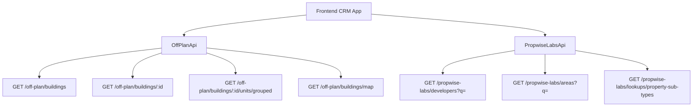

## Overview

This specification adds an **Off-Plan** tab under the **Properties** section of the main CRM sidebar. The feature displays all published buildings from developer portal users in a card/map split view with rich filters, 2GIS map integration, and detailed building views.

<Info>
**Backend Architecture:** Off-plan data is served through domain endpoints under `/off-plan/*`. These endpoints read Propwise Labs catalog data and apply CRM-owned visibility from `off_plan_building_publication` plus the off-plan lifecycle helper, ensuring main CRM users only receive buildings with `is_published=true` that classify as off-plan.
</Info>

## Architecture Decision

### Buildings vs Projects as Primary Entity

Based on the existing data model, **buildings** are the primary enrichment entity:

- Buildings have their own `coverImageUrl`, `status`, `endDate`, `completionDate`, `paymentPlans`, `images`, `documents`, `amenities`
- Buildings can override inherited fields from projects (status, area, community, description)
- The off-plan directory displays **published buildings** based on CRM `is_published` visibility

<Note>
Publication is separate from Propwise Labs `building.status`. Developers publish or unpublish buildings through the developer portal, which writes `off_plan_building_publication.is_published` for the Propwise Labs `building_id`.
</Note>

### Frontend Status Mapping

Frontend display status is derived from `building.status` through `getOffPlanFrontendStatus()`:

| Backend Status | Frontend Status | Color  |
| -------------- | --------------- | ------ |
| `ACTIVE`       | On Sale         | Orange |
| `PENDING`      | EOI             | Purple |
| `FINISHED`     | Out of Stock    | Gray   |

### Data Flow



<Warning>
The `/off-plan/buildings` endpoints enforce publication by checking `off_plan_building_publication.is_published=true` and require buildings to match the off-plan lifecycle helper. Secondary and `UNKNOWN` lifecycle records are hidden even if a publication row exists.
</Warning>

## Implementation Guide

### 1. Sidebar Navigation

<Steps>
<Step title="Update CRM Layout">
Replace the entire `data.realEstate` array in `src/components/layouts/CRMLayout.tsx`:

```typescript
realEstate: [
  {
    title: 'Off-Plan',
    url: '/home/properties/off-plan',
    icon: Building2,  // from lucide-react (already imported)
  },
],
```

Remove the old sidebar entries for Areas, Developments, and Units.
</Step>

<Step title="Update Breadcrumbs">
Replace all existing real-estate breadcrumb handling with off-plan routes:

- `Properties > Off-Plan` (list page)
- `Properties > Off-Plan > {Building Name}` (detail page)

Remove breadcrumb entries for `/real-estate/areas`, `/real-estate/developments`, `/real-estate/units`, and `/real-estate/prospects`.
</Step>
</Steps>

### 2. Route Structure

```
src/app/home/properties/off-plan/
├── page.tsx                    # List page (grid + map toggle)
└── [id]/
    └── page.tsx                # Building detail page
```

<Tip>
Both pages follow the component extraction guide — page files contain ONLY the page function (< 200 lines).
</Tip>

### 3. Component Structure

<AccordionGroup>
<Accordion title="List Page Components">
```
src/components/pages/off-plan/
├── off-plan-building-card.tsx          # Building card for grid view
├── off-plan-filters.tsx               # Horizontal filter bar
├── off-plan-map-view.tsx              # 2GIS map with markers + popover
├── off-plan-grid-view.tsx             # Scrollable grid of building cards + infinite scroll
├── off-plan-toolbar.tsx               # View toggle (Grid/Map), sort, saved filters
```
</Accordion>

<Accordion title="Detail Page Components">
```
src/components/pages/off-plan/
├── building-detail-header.tsx          # Sticky sidebar: name, price, units count, payment plan
├── building-detail-description.tsx     # Description section with Read More
├── building-detail-units.tsx           # Units & Availability (accordion grouped by bedrooms)
├── building-detail-unit-modal.tsx      # Unit detail popup (floor plan, specs, price)
├── building-detail-images.tsx          # Image grid with lightbox
├── building-detail-amenities.tsx       # Features/Amenities image grid
├── building-detail-location.tsx        # Location section with 2GIS map
├── building-detail-info-table.tsx      # Details table (Project Name, Developer, etc.)
├── building-detail-payment-plan.tsx    # Payment plan visualization (progress bar + breakdown)
├── building-detail-documents.tsx       # Documents & links (PDF cards)
├── building-detail-developer.tsx       # Developer info card
```
</Accordion>
</AccordionGroup>

### 4. API Layer

Create `src/services/api/off-plan.api.ts` to wrap the Propwise Labs facade endpoints:

<CodeGroup>
```typescript Filter Types
export interface OffPlanBuildingFilters {
  q?: string;
  status?: string;
  areaId?: number;
  communityId?: number;
  developerId?: number; // Legacy single developer filter
  developerIds?: number[]; // Multi-select developer filter
  propertyTypeId?: number;
  propertySubTypeId?: number;
  priceMode?: 'unit' | 'sqft'; // UI-only basis for price controls
  minPrice?: number;
  maxPrice?: number;
  bedrooms?: string; // e.g., "1", "2", "3", "studio"
  completionBefore?: string; // Inclusive building.endDate upper bound
  completionAfter?: string; // Inclusive building.endDate lower bound
  maxPreHandoverPercent?: number; // Payment plan filter
  page?: number;
  limit?: number;
  sortBy?: string;
  sortOrder?: 'asc' | 'desc';
}
```

```typescript API Class
export class OffPlanApi {
  /** Search Propwise Labs buildings */
  static async searchBuildings(filters: OffPlanBuildingFilters) {
    return apiClient.get('/off-plan/buildings', { 
      params: supportedBuildingParams(filters) 
    });
  }

  /** Get building detail with all enrichment */
  static async getBuildingDetail(id: number) {
    return apiClient.get(`/off-plan/buildings/${id}`);
  }

  /** Get units grouped by bedroom category */
  static async getBuildingUnitsGrouped(buildingId: number) {
    return apiClient.get(`/off-plan/buildings/${buildingId}/units/grouped`);
  }

  /** Get map markers (lightweight building data with coordinates) */
  static async getMapMarkers(filters?: MapMarkerFilters) {
    return apiClient.get('/off-plan/buildings/map', { 
      params: supportedMapParams(filters) 
    });
  }

  /** Search developers for the searchable multi-select filter */
  static async searchDevelopers(q?: string) {
    return apiClient.get('/propwise-labs/developers', { params: { q } });
  }

  /** Search areas for filter dropdown */
  static async searchAreas(q?: string, cityId?: number) {
    return apiClient.get('/propwise-labs/areas', { params: { q, cityId } });
  }

  /** Get property subtypes for unit type filter */
  static async getPropertySubTypes() {
    return apiClient.get('/propwise-labs/lookups/property-sub-types');
  }
}
```
</CodeGroup>

### 5. Key Features Implementation

<Tabs>
<Tab title="Grid View">
The grid view displays building cards with:
- Cover image
- Frontend status badges (On Sale, Out of Stock, EOI)
- Handover quarter
- Building name, area + developer
- Price from and payment plan ratio

Implement infinite scroll using intersection observer for performance.
</Tab>

<Tab title="Map View">
Split layout with:
- Scrollable card list on the left
- 2GIS interactive map on the right
- Custom circular developer-logo markers
- Popover previews on marker hover
- Marker border color indicates building status
</Tab>

<Tab title="Filters">
Compact search input + Filters popover including:
- Developer (searchable multi-select)
- Price range
- Payment plans
- Handover quarter
- Unit type
- Bedrooms
- Status

No tabs are shown on the Off-Plan page.
</Tab>

<Tab title="Building Detail">
Right-sticky sidebar with key info plus scrollable left content:
- Description with Read More
- Units & availability (grouped by bedrooms)
- Parking information
- Image gallery
- Features/amenities
- Location with embedded map
- General plan
- Details table
- Payment plan visualization
- Documents & links
- Developer information
</Tab>
</Tabs>

### 6. Response Types

<CodeGroup>
```typescript Off-Plan Types
// Off-plan types extend raw Propwise Labs shapes when /off-plan adds app-owned fields
export interface OffPlanBuilding extends PropwiseLabsBuilding {
  isPublished?: boolean;
  publishedAt?: string;
  unpublishedAt?: string;
  developerContact?: PropwiseLabsDeveloperContact;
  /** Full Propwise Labs developer profile */
  developer?: PropwiseLabsDeveloperOption;
}
```

```typescript Propwise Labs Types
// Raw catalog response shapes live with the raw Propwise Labs API client
export interface PropwiseLabsBuilding {
  id: number;
  name: string;
  status: string;
  coverImageUrl?: string;
  endDate?: string;
  completionDate?: string;
  // ... other fields
}

export interface PropwiseLabsUnit {
  id: number;
  unitNumber: string;
  bedrooms: number;
  price: number;
  // ... other fields
}
```
</CodeGroup>

## Visual Design Reference

The implementation should replicate key visual patterns from the reference screenshots:

<CardGroup cols={2}>
<Card title="List View" icon="grid-2x2">
Cards with cover image, status badges, handover quarter, building name, area + developer, price from, and payment plan ratio
</Card>
<Card title="Map View" icon="map">
Split layout with scrollable card list and 2GIS interactive map with custom circular developer-logo markers
</Card>
<Card title="Filters" icon="filter">
Leads-style compact search input + Filters popover with dropdown buttons for various criteria
</Card>
<Card title="Detail Page" icon="building">
Right-sticky sidebar with key info + scrollable left content area containing comprehensive building information
</Card>
</CardGroup>

<Check>
The off-plan directory supersedes the existing Areas, Developments, and Units tabs, providing a unified building-focused experience for off-plan properties.
</Check>