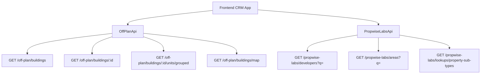

## Overview

The Off-Plan Directory adds a new **Off-Plan** tab under the **Properties** section of the main CRM sidebar. This feature displays all published buildings from developer portal users in a card/map split view with rich filters, 2GIS map integration, and a detailed building view.

<Note>
Off-plan data is served through domain endpoints under `/off-plan/*`. These endpoints read Propwise Labs catalog data and apply CRM-owned visibility from `off_plan_building_publication` plus the off-plan lifecycle helper, so main CRM users only receive buildings with `is_published=true` that still classify as off-plan.
</Note>

## Reference Design

The implementation replicates key visual patterns from the target design:

<CardGroup cols={2}>
  <Card title="List View (Grid)" icon="grid-3x3">
    Cards with cover image, status badges (On Sale, Out of Stock, EOI), handover quarter, building name, area + developer, price from, and payment plan ratio
  </Card>
  <Card title="List View (Map)" icon="map">
    Split layout with scrollable card list on left, 2GIS interactive map on right with custom circular developer-logo markers and popover previews
  </Card>
  <Card title="Filters Bar" icon="filter">
    Leads-style compact search input + Filters popover under page title, followed by quick dropdown buttons for Developer, Price, Payments, Handover, Unit type, Bedrooms, and Status
  </Card>
  <Card title="Building Detail" icon="building">
    Right-sticky sidebar with key info + scrollable left content area containing description, units & availability, images, features/amenities, location, payment plan, documents, and developer info
  </Card>
</CardGroup>

## Architecture Decision

### Buildings vs Projects as Primary Entity

<Info>
Based on the existing data model, **buildings** are the primary enrichment entity rather than projects.
</Info>

Buildings are chosen as the primary entity because:

- Buildings have their own `coverImageUrl`, `status`, `endDate`, `completionDate`, `paymentPlans`, `images`, `documents`, `amenities`
- Buildings can override inherited fields from projects (status, area, community, description)
- A project may contain multiple buildings with different lifecycle statuses and pricing

<Check>
The list page queries `GET /off-plan/buildings`, and the detail page queries `GET /off-plan/buildings/:id`
</Check>

### Publication vs Lifecycle Status

Publication is separate from Propwise Labs `building.status`. Developers publish or unpublish buildings through the developer portal, which writes `off_plan_building_publication.is_published` for the Propwise Labs `building_id`.

<Warning>
Missing publication rows are treated as draft/unpublished. Unpublishing keeps the row with `unpublished_at` plus `unpublished_by_id` for audit.
</Warning>

### Frontend Status Mapping

Frontend display status is derived from `building.status` through `getOffPlanFrontendStatus()`:

| Backend `building.status` | Frontend Status | Color  |
| ------------------------- | --------------- | ------ |
| `ACTIVE`                  | On Sale         | Orange |
| `PENDING`                 | EOI             | Purple |
| `FINISHED`                | Out of Stock    | Gray   |

### Data Flow



<Tip>
The `/off-plan/buildings` endpoints enforce publication by checking `off_plan_building_publication.is_published=true` and require the building to match the off-plan lifecycle helper.
</Tip>

## Sidebar Navigation

### File: `src/components/layouts/CRMLayout.tsx`

<Steps>
<Step title="Replace Real Estate Array">
Replace the entire `data.realEstate` array with a single "Off-Plan" entry:

```typescript
realEstate: [
  {
    title: 'Off-Plan',
    url: '/home/properties/off-plan',
    icon: Building2,  // from lucide-react (already imported)
  },
],
```
</Step>

<Step title="Remove Old Sidebar Entries">
Remove the old sidebar entries for Areas, Developments, and Units.
</Step>

<Step title="Update Breadcrumbs">
Replace all existing real-estate breadcrumb handling with off-plan routes:

```
Properties > Off-Plan                           (list page)
Properties > Off-Plan > {Building Name}         (detail page)
```
</Step>
</Steps>

## Route Structure

```
src/app/home/properties/off-plan/
├── page.tsx                    # List page (grid + map toggle)
└── [id]/
    └── page.tsx                # Building detail page
```

<Note>
Both pages follow the component extraction guide — page files contain ONLY the page function (< 200 lines).
</Note>

## Component Structure

<AccordionGroup>
<Accordion title="List Page Components">
```
src/components/pages/off-plan/
├── off-plan-building-card.tsx          # Building card for grid view
├── off-plan-filters.tsx               # Horizontal filter bar
├── off-plan-map-view.tsx              # 2GIS map with markers + popover
├── off-plan-grid-view.tsx             # Scrollable grid of building cards + infinite scroll
├── off-plan-toolbar.tsx               # View toggle (Grid/Map), sort, saved filters
```
</Accordion>

<Accordion title="Detail Page Components">
```
src/components/pages/off-plan/
├── building-detail-header.tsx          # Sticky sidebar: name, price, units count, payment plan, developer, CTA buttons
├── building-detail-description.tsx     # Description section with Read More
├── building-detail-units.tsx           # Units & Availability (accordion grouped by bedrooms)
├── building-detail-unit-modal.tsx      # Unit detail popup (floor plan, specs, price)
├── building-detail-images.tsx          # Image grid with lightbox
├── building-detail-amenities.tsx       # Features/Amenities image grid
├── building-detail-location.tsx        # Location section with 2GIS map
├── building-detail-info-table.tsx      # Details table (Project Name, Developer, Branded, etc.)
├── building-detail-payment-plan.tsx    # Payment plan visualization (progress bar + breakdown)
├── building-detail-documents.tsx       # Documents & links (PDF cards)
├── building-detail-developer.tsx       # Developer info card
```
</Accordion>
</AccordionGroup>

## API Layer

### New File: `src/services/api/off-plan.api.ts`

<Warning>
This API file wraps the Propwise Labs facade endpoints and maps Propwise Labs response fields into the existing off-plan UI types. It must not call deleted `/reference/*` routes.
</Warning>

<Tabs>
<Tab title="Filter Types">
```typescript
export interface OffPlanBuildingFilters {
  q?: string;
  status?: string;
  areaId?: number;
  communityId?: number;
  developerId?: number; // Legacy single developer filter
  developerIds?: number[]; // Multi-select developer filter
  propertyTypeId?: number;
  propertySubTypeId?: number;
  priceMode?: 'unit' | 'sqft'; // UI-only basis for minPrice/maxPrice controls
  minPrice?: number;
  maxPrice?: number;
  bedrooms?: string; // e.g., "1", "2", "3", "studio"
  completionBefore?: string; // Inclusive building.endDate upper bound
  completionAfter?: string; // Inclusive building.endDate lower bound
  maxPreHandoverPercent?: number; // Payment plan filter
  page?: number;
  limit?: number;
  sortBy?: string;
  sortOrder?: 'asc' | 'desc';
}

export interface MapMarkerFilters {
  q?: string;
  status?: string;
  projectId?: number;
  areaId?: number;
  communityId?: number;
  developerId?: number;
  developerIds?: number[];
  propertySubTypeId?: number;
  minPrice?: number;
  maxPrice?: number;
  completionBefore?: string;
  completionAfter?: string;
}
```
</Tab>

<Tab title="API Class">
```typescript
export class OffPlanApi {
  /** Search Propwise Labs buildings. Unsupported legacy filters are omitted client-side. */
  static async searchBuildings(filters: OffPlanBuildingFilters) {
    return apiClient.get('/off-plan/buildings', { params: supportedBuildingParams(filters) });
  }

  /** Get building detail with all enrichment */
  static async getBuildingDetail(id: number) {
    return apiClient.get(`/off-plan/buildings/${id}`);
  }

  /** Get units grouped by bedroom category */
  static async getBuildingUnitsGrouped(buildingId: number) {
    return apiClient.get(`/off-plan/buildings/${buildingId}/units/grouped`);
  }

  /** Get single unit detail */
  static async getUnitDetail(unitId: number) {
    return apiClient.get(`/propwise-labs/units/${unitId}`);
  }

  /** Get map markers (lightweight building data with coordinates) */
  static async getMapMarkers(filters?: MapMarkerFilters) {
    return apiClient.get('/off-plan/buildings/map', { params: supportedMapParams(filters) });
  }

  /** Search developers for the searchable multi-select filter */
  static async searchDevelopers(q?: string) {
    return apiClient.get('/propwise-labs/developers', { params: { q } });
  }

  /** Search areas for filter dropdown */
  static async searchAreas(q?: string, cityId?: number) {
    return apiClient.get('/propwise-labs/areas', { params: { q, cityId } });
  }

  /** Get property subtypes for unit type filter */
  static async getPropertySubTypes() {
    return apiClient.get('/propwise-labs/lookups/property-sub-types');
  }
}
```
</Tab>
</Tabs>

### Response Types

<CodeGroup>
```typescript src/services/api/propwise-labs.api.ts
// Raw catalog response shapes live with the raw Propwise Labs API client
export interface PropwiseLabsBuilding { ... }
export interface PropwiseLabsUnit { ... }
export interface PropwiseLabsUnitGroup { ... }
export interface PropwiseLabsAmenity { ... }
export interface PropwiseLabsPaymentPlan { ... }
export interface PropwiseLabsDocument { ... }
```

```typescript src/services/api/off-plan.api.ts
// Off-plan types only extend raw Propwise Labs shapes when /off-plan adds app-owned fields
export interface OffPlanBuilding extends PropwiseLabsBuilding {
  isPublished?: boolean;
  publishedAt?: string;
  unpublishedAt?: string;
  developerContact?: PropwiseLabsDeveloperContact;
  /** Full Propwise Labs developer profile from OffPlanBuildingPublication.developerId. */
  developer?: PropwiseLabsDeveloperOption;
}
```
</CodeGroup>

<Check>
Generic shared API infrastructure stays in the shared types file for reusability across different modules.
</Check>