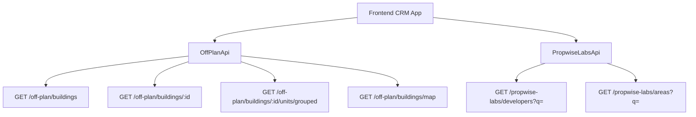

## Overview

The Off-Plan directory adds a new **Off-Plan** tab under the **Properties** section of the main CRM sidebar. This page displays all published buildings from developer portal users in a card/map split view with rich filters, 2GIS map integration, and detailed building views.

<Note>
**Backend Facade:** Off-plan data is served through domain endpoints under `/off-plan/*`. These endpoints read Propwise Labs catalog data and apply CRM-owned visibility from `off_plan_building_publication` plus the off-plan lifecycle helper, so main CRM users only receive buildings with `is_published=true` that still classify as off-plan.
</Note>

The lower-level `/propwise-labs/*` endpoints remain raw catalog access and support explicit lifecycle filtering for off-plan, secondary, or all catalog records.

---

## Architecture Decision

### Buildings vs Projects as Primary Entity

Based on the existing data model, **buildings** are the primary enrichment entity:

<CardGroup cols={2}>
  <Card title="Building-Level Data" icon="building">
    Buildings have their own `coverImageUrl`, `status`, `endDate`, `completionDate`, `paymentPlans`, `images`, `documents`, and `amenities`
  </Card>
  <Card title="Override Capability" icon="wrench">
    Buildings can override inherited fields from projects (status, area, community, description)
  </Card>
</CardGroup>

The off-plan directory displays **published buildings** based on CRM `is_published` visibility, since a project may contain multiple buildings with different lifecycle statuses and pricing.

<Info>
**Key Endpoints:**
- List page queries: `GET /off-plan/buildings`
- Detail page queries: `GET /off-plan/buildings/:id`
</Info>

### Publication System

Publication is separate from Propwise Labs `building.status`. Developers publish or unpublish a building through the developer portal, which writes `off_plan_building_publication.is_published` for the Propwise Labs `building_id`.

<Warning>
Missing publication rows are treated as draft/unpublished. Unpublishing keeps the row with `unpublished_at` plus `unpublished_by_id` for audit.
</Warning>

#### Publish-Readiness Gate

Before flipping `is_published=true`, the publish endpoints re-validate the persisted entity against required-field contracts:

<AccordionGroup>
  <Accordion title="Building Requirements (13 fields + salesStatus)">
    - `name`
    - `buildingNumber`
    - `descriptionEn`
    - `floors`
    - `googleMapsLink`
    - `startDate`
    - `coverImageUrl`
    - `area.id`
    - `plotSize`
    - `actualArea`
    - `parkingCount`
    - `serviceChargePerSqft`
    - ≥1 `media` item
    - `salesStatus` (required at publish)
  </Accordion>
  
  <Accordion title="Villa Project Requirements">
    - `name`
    - `descriptionEn`
    - `imageUrl` (cover)
    - `googleMapsLink`
    - `area.id`
    - `latitude`
    - `longitude`
    - ≥1 `media` item
    - `salesStatus`
  </Accordion>
</AccordionGroup>

<Tip>
All missing fields are aggregated into a single `400 BadRequest` so the dev-portal UI can list every missing field in one toast/banner. Unpublishing always succeeds and bypasses the readiness gate.
</Tip>

**Reference:** See `Docs/REAL_ESTATE_MODULE_SPECIFICATION.md` (`OffPlanBuildingPublication` and `OffPlanProjectPublication` sections) for canonical contracts and implementing guards (`assertBuildingReadyToPublish`, `assertVillaProjectReadyToPublish`).

### Auto-Maintained Sales Status

A building's or villa-project's `salesStatus` (`ANNOUNCED | EOI | ON_SALE | OUT_OF_STOCK`) is auto-maintained from live unit availability by the developer portal.

<Steps>
  <Step title="Unit Status Change">
    When a developer changes a unit's `salesStatus` or creates a unit, `ProjectManagementService` recounts the direct owner's units
  </Step>
  
  <Step title="Out of Stock Detection">
    Sets `salesStatus = OUT_OF_STOCK` once **no** units remain `AVAILABLE` (every unit `RESERVED` or `SOLD`)
  </Step>
  
  <Step title="Revert to On Sale">
    Reverts to `ON_SALE` when an `AVAILABLE` unit reappears
  </Step>
</Steps>

<Note>
- For `Buildings`-type projects: the **building** is reconciled
- For `Villas`-type projects: the **project** is reconciled
- `RESERVED` counts as unavailable
</Note>

This `salesStatus` value is required by the publish-readiness gate and surfaces on off-plan cards, maps, and details, so a sold-out building reflects "Out of Stock" without manual editing.

<Info>
This is distinct from the frontend status badge (derived from `building.status` via `getOffPlanFrontendStatus()`). See `Docs/REAL_ESTATE_MODULE_SPECIFICATION.md` → "Auto Out-of-Stock sales-status sync" for resolver rules and trigger paths.
</Info>

### Lifecycle Management

Off-plan directory endpoints always enforce the off-plan lifecycle in code; callers do not pass a `type` query parameter.

<Check>
The lifecycle helper treats `ACTIVE` and `PENDING` as off-plan statuses and intentionally excludes `UNKNOWN` from off-plan. `UNKNOWN` remains secondary-eligible only on raw `/propwise-labs/*` catalog endpoints when `type=secondary` is requested.
</Check>

#### Frontend Display Status

Frontend display status is derived from `building.status` through `getOffPlanFrontendStatus()`:

| Backend `building.status` | Frontend Status | Color  |
| ------------------------- | --------------- | ------ |
| `ACTIVE`                  | On Sale         | Orange |
| `PENDING`                 | EOI             | Purple |
| `FINISHED`                | Out of Stock    | Gray   |

The same helper drives:
- Building cards
- Map marker colors
- Map legend labels
- Detail table sale status

<Tip>
The map legend (`OFF_PLAN_FRONTEND_STATUS_LABELS` in `off-plan-display-utils.ts`) renders left-to-right as: **Announced → EOI → On Sale → Out of Stock**
</Tip>

### Data Flow



<CodeGroup>
```typescript Card Listing
// Frontend → OffPlanApi
GET /off-plan/buildings
```

```typescript Detail View
// Frontend → OffPlanApi
GET /off-plan/buildings/:id
```

```typescript Map Markers
// Frontend → OffPlanApi
GET /off-plan/buildings/map
```

```typescript Developer Options
// Frontend → PropwiseLabsApi
GET /propwise-labs/developers?q=
```
</CodeGroup>

<Warning>
The `/off-plan/buildings` endpoints enforce publication by checking `off_plan_building_publication.is_published=true` and require buildings to match the off-plan lifecycle helper. Secondary and `UNKNOWN` lifecycle records are hidden even if a publication row exists.
</Warning>

Generic lookup endpoints remain on `/propwise-labs/*` because they are global catalog data shared by off-plan, secondary, developer portal, and future property-interest flows.

---

## Sidebar Navigation

### Implementation

**File:** `src/components/layouts/CRMLayout.tsx`

Replace the entire `data.realEstate` array with a single "Off-Plan" entry. The existing Areas, Developments, and Units tabs are removed — the off-plan directory supersedes them.

```typescript
realEstate: [
  {
    title: 'Off-Plan',
    url: '/properties/off-plan',
    icon: Building2,  // from lucide-react (already imported)
  },
],
```

<Warning>
**Remove** the old sidebar entries for Areas, Developments, and Units.
</Warning>

### Breadcrumb Configuration

Replace all existing real-estate breadcrumb handling with off-plan routes:

<Tabs>
  <Tab title="List Page">
    ```
    Properties > Off-Plan
    ```
  </Tab>
  <Tab title="Detail Panel">
    ```
    Properties > Off-Plan > {Building Name}
    ```
  </Tab>
</Tabs>

<Note>
Remove breadcrumb entries for `/real-estate/areas`, `/real-estate/developments`, `/real-estate/units`, and `/real-estate/prospects`.
</Note>

---

## Route Structure

```
src/app/(app)/properties/off-plan/
├── page.tsx                    # Map/list page; handles open building panel based on pathname
└── [id]/
    └── page.tsx                # Re-exports ../page so /:id opens same map page with panel
```

<Warning>
The `[id]/page.tsx` route must not implement a separate building detail page. It delegates to the main off-plan page so `/properties/off-plan/:buildingId` preserves the map, filters, and left-side panel behavior.
</Warning>

---

## Component Structure

```
src/components/pages/off-plan/
├── index.ts                                # Barrel export
│
├── ─── List Page Components ───
├── off-plan-building-card.tsx              # Building card for grid view
├── off-plan-filters.tsx                    # Horizontal filter bar
├── off-plan-map-view.tsx                   # 2GIS map with markers + popover
├── off-plan-grid-view.tsx                  # Scrollable grid + infinite scroll
├── off-plan-building-detail-panel.tsx      # Animated map-mode detail panel
├── off-plan-toolbar.tsx                    # View toggle, sort, saved filters
│
├── ─── Detail Page Components ───
├── building-detail-header.tsx              # Sticky sidebar: name, price, units
├── building-detail-description.tsx         # Description with Read More
├── building-detail-unit-summary.tsx        # Unit availability cards
├── building-detail-amenities.tsx           # Amenities grid
├── building-detail-payment-plan.tsx        # Payment schedule table
├── building-detail-location.tsx            # Embedded map + address
├── building-detail-media-gallery.tsx       # Image/video gallery
├── building-detail-documents.tsx           # Downloadable documents
├── building-detail-contact-form.tsx        # Inquiry form
│
├── ─── Shared Components ───
├── off-plan-price-display.tsx              # Starting price or "Price upon request"
├── off-plan-status-badge.tsx               # Frontend status badge component
├── off-plan-unit-availability-row.tsx      # Compact Available/Reserved/Sold row
├── off-plan-handover-badge.tsx             # Q1 2028 badge from endDate
└── off-plan-map-marker.tsx                 # Custom circular developer-logo marker
```

---

## Reference Screenshots — Visual Patterns

The implementation replicates these key visual patterns:

<AccordionGroup>
  <Accordion title="Grid View Cards" icon="grid">
    Cards display:
    - Cover image
    - Frontend status badges (On Sale, Out of Stock, EOI)
    - Building name
    - **Starting {price}** when `stats.startingPrice` exists (hidden otherwise)
    - Compact unit-availability row (Available / Reserved / Sold from `stats.unitsByStatus`)
    - Bottom metadata badges: handover quarter (`endDate` → `Q1 2028`), area, developer
    
    Villa-project cards render the same availability row and handover badge from project `stats.unitsByStatus` / `endDate`.
  </Accordion>
  
  <Accordion title="Map View Layout" icon="map">
    Split layout features:
    - Scrollable card list on left
    - 2GIS interactive map on right
    - Custom circular developer-logo markers
    - Hover popover previews anchored above each marker
    - Marker hover scrolls left card list to matching building
    - Card highlight with same status color as marker border
    
    <Tip>
    **Bidirectional Sync:** Hovering a left-list card:
    - Pans map to center that item's marker
    - Highlights the marker
    - Opens mini preview card above it
    - When marker isn't loaded, drops temporary pin from card's `lat`/`lng` and runs "Search this area"
    </Tip>
  </Accordion>
  
  <Accordion title="Filters Bar" icon="filter">
    Leads-style compact design:
    - Search input
    - Filters popover under page title
    - Quick dropdown buttons: Developer, Price, Payments, Handover, Bedrooms, Status
    - No tabs shown on Off-Plan page
  </Accordion>
  
  <Accordion title="Map Detail Panel" icon="sidebar">
    Animated left-column overlay with:
    - Figma-matched header: building name, area, close action
    - Underline tabs: Overview, Units, Media, Contact
    
    **Overview Tab Contents:**
    - Cover image with bottom-left price overlay (`stats.startingPrice` via `getOffPlanStartingPrice()` + `currency`, or **Price upon request**)
    - Description with three-line collapse and blue **Show more** control
    - Building details table
    - Construction progress from `building.percentCompleted`
    - Four-card unit availability summary (Total Units, Available, Reserved, Sold)
    - Payment plan
    - Amenities
    - Location
    
    <Info>
    **Unit Counts:**
    - Total Units: `building.stats?.unitsCount`
    - Available/Reserved/Sold: `building.stats?.unitsByStatus` (authoritative source, same as directory cards)
    - Fallback: Grouped unit `salesStatus` / `availabilityStatus` counting only when aggregate is absent
    </Info>
    
    <Note>
    The old "Back to list" text button is not shown; closing returns to map/list split.
    </Note>
  </Accordion>
  
  <Accordion title="Building Detail Route" icon="route">
    `/properties/off-plan/:buildingId` renders the same map-mode off-plan page and opens the building detail panel on the left.
    
    <Warning>
    There is no separate full-page detail layout.
    </Warning>
  </Accordion>
</AccordionGroup>

---

## API Endpoints

### Off-Plan Domain Endpoints

<CodeGroup>
```typescript List Buildings
GET /off-plan/buildings
Query: filters, pagination, sort
Response: { buildings: Building[], total: number }
```

```typescript Get Building Detail
GET /off-plan/buildings/:id
Response: Building (full detail)
```

```typescript Get Grouped Units
GET /off-plan/buildings/:id/units/grouped
Response: { grouped: UnitGroup[] }
```

```typescript Get Map Markers
GET /off-plan/buildings/map
Query: bounds, filters
Response: { markers: MapMarker[] }
```
</CodeGroup>

<Check>
All endpoints enforce `is_published=true` and off-plan lifecycle requirements.
</Check>

### Propwise Labs Catalog Endpoints

<CodeGroup>
```typescript Search Developers
GET /propwise-labs/developers?q={search}
Response: { developers: Developer[] }
```

```typescript Get Areas
GET /propwise-labs/areas?q={search}
Response: { areas: Area[] }
```
</CodeGroup>

<Info>
These remain on `/propwise-labs/*` as they are global catalog data shared across off-plan, secondary, developer portal, and future features.
</Info>

---

## Frontend Components

### Off-Plan Building Card

**File:** `src/components/pages/off-plan/off-plan-building-card.tsx`

<Tabs>
  <Tab title="Card Structure">
    ```typescript
    interface BuildingCardProps {
      building: Building;
      onHover?: () => void;
      isHighlighted?: boolean;
    }
    ```
    
    **Display Elements:**
    - Cover image
    - Status badge (via `getOffPlanFrontendStatus()`)
    - Building name
    - Starting price (conditional on `stats.startingPrice`)
    - Unit availability row
    - Metadata badges (handover, area, developer)
  </Tab>
  
  <Tab title="Price Display">
    ```typescript
    {building.stats?.startingPrice ? (
      <div className="text-lg font-semibold">
        Starting {formatPrice(building.stats.startingPrice, building.currency)}
      </div>
    ) : null}
    ```
    
    <Note>
    Price is hidden when `stats.startingPrice` doesn't exist, not replaced with "Price upon request" (that pattern is only for the detail view).
    </Note>
  </Tab>
  
  <Tab title="Availability Row">
    ```typescript
    <OffPlanUnitAvailabilityRow
      available={building.stats?.unitsByStatus?.available || 0}
      reserved={building.stats?.unitsByStatus?.reserved || 0}
      sold={building.stats?.unitsByStatus?.sold || 0}
    />
    ```
  </Tab>
</Tabs>

### Off-Plan Map View

**File:** `src/components/pages/off-plan/off-plan-map-view.tsx`

<Steps>
  <Step title="Initialize 2GIS Map">
    Load 2GIS map library with API key
  </Step>
  
  <Step title="Render Custom Markers">
    Create circular developer-logo markers for each building
  </Step>
  
  <Step title="Implement Hover Logic">
    Show popover preview above marker on hover
  </Step>
  
  <Step title="Sync with Card List">
    Implement bidirectional sync:
    - Marker hover scrolls left list to matching card
    - Card hover pans map to marker
    - Drop temporary pin when marker not loaded
  </Step>
  
  <Step title="Handle Click Events">
    Open building detail panel on marker/card click
  </Step>
</Steps>

<Warning>
When a card is hovered and its marker isn't in the loaded marker set, the map must drop a temporary pin from the card's `lat`/`lng` and trigger "Search this area" to load the real marker.
</Warning>

### Building Detail Panel

**File:** `src/components/pages/off-plan/off-plan-building-detail-panel.tsx`

<Tabs>
  <Tab title="Panel Structure">
    ```typescript
    interface BuildingDetailPanelProps {
      buildingId: string;
      isOpen: boolean;
      onClose: () => void;
    }
    ```
    
    **Sections:**
    - Figma-matched header with name, area, close action
    - Tab navigation: Overview, Units, Media, Contact
    - Animated slide-in from left
  </Tab>
  
  <Tab title="Overview Tab">
    <Steps>
      <Step title="Cover Image">
        Display with bottom-left price overlay
      </Step>
      
      <Step title="Description">
        Three-line truncation with "Show more" control
      </Step>
      
      <Step title="Building Details">
        Table with key specifications
      </Step>
      
      <Step title="Construction Progress">
        From `building.percentCompleted`
      </Step>
      
      <Step title="Unit Summary">
        Four-card layout: Total, Available, Reserved, Sold
      </Step>
      
      <Step title="Payment Plan">
        Payment schedule table
      </Step>
      
      <Step title="Amenities">
        Grid display
      </Step>
      
      <Step title="Location">
        Embedded map + address
      </Step>
    </Steps>
  </Tab>
  
  <Tab title="Price Overlay">
    ```typescript
    <div className="absolute bottom-4 left-4 bg-white/90 p-3 rounded">
      {building.stats?.startingPrice ? (
        <div>
          <span className="text-sm text-gray-600">Starting from</span>
          <div className="text-xl font-bold">
            {formatPrice(
              getOffPlanStartingPrice(building),
              building.currency
            )}
          </div>
        </div>
      ) : (
        <div className="text-lg font-semibold">Price upon request</div>
      )}
    </div>
    ```
  </Tab>
</Tabs>

<Info>
No "Back to list" button is shown. Closing the panel returns to the map/list split view.
</Info>

---

## Filters Implementation

### Off-Plan Filters Bar

**File:** `src/components/pages/off-plan/off-plan-filters.tsx`

<CardGroup cols={2}>
  <Card title="Search Input" icon="magnifying-glass">
    Leads-style compact search for building names
  </Card>
  <Card title="Filters Popover" icon="sliders">
    Advanced filters panel under page title
  </Card>
</CardGroup>

**Quick Filter Dropdowns:**

<Tabs>
  <Tab title="Developer">
    Multi-select dropdown using `GET /propwise-labs/developers?q=`
  </Tab>
  
  <Tab title="Price">
    Min/max range inputs
  </Tab>
  
  <Tab title="Payments">
    Payment plan filter options
  </Tab>
  
  <Tab title="Handover">
    Quarter/year selection from `endDate` values
  </Tab>
  
  <Tab title="Bedrooms">
    Multi-select: Studio, 1BR, 2BR, 3BR, 4BR+
  </Tab>
  
  <Tab title="Status">
    Multi-select: Announced, EOI, On Sale, Out of Stock
  </Tab>
</Tabs>

---

## Display Utilities

### Frontend Status Helper

**File:** `src/utils/off-plan-display-utils.ts`

```typescript
export function getOffPlanFrontendStatus(
  buildingStatus: BuildingStatus
): OffPlanFrontendStatus {
  switch (buildingStatus) {
    case 'ACTIVE':
      return { label: 'On Sale', color: 'orange' };
    case 'PENDING':
      return { label: 'EOI', color: 'purple' };
    case 'FINISHED':
      return { label: 'Out of Stock', color: 'gray' };
    default:
      return { label: 'Unknown', color: 'gray' };
  }
}

export const OFF_PLAN_FRONTEND_STATUS_LABELS = [
  'Announced',
  'EOI',
  'On Sale',
  'Out of Stock',
] as const;
```

<Check>
This helper drives building cards, map marker colors, map legend labels, and detail table sale status.
</Check>

### Price Display Helper

```typescript
export function getOffPlanStartingPrice(building: Building): number | null {
  return building.stats?.startingPrice ?? null;
}

export function formatOffPlanPrice(
  price: number | null,
  currency: string
): string {
  if (price === null) return 'Price upon request';
  return formatCurrency(price, currency);
}
```

---

## Map Integration

### 2GIS Map Implementation

<Steps>
  <Step title="Load 2GIS SDK">
    ```typescript
    import { load } from '@2gis/mapgl';
    
    const map = await load().then((mapgl) =>
      new mapgl.Map('map-container', {
        center: [55.2708, 25.2048], // Dubai coordinates
        zoom: 11,
        key: process.env.NEXT_PUBLIC_2GIS_API_KEY,
      })
    );
    ```
  </Step>
  
  <Step title="Create Custom Markers">
    ```typescript
    const marker = new mapgl.Marker(map, {
      coordinates: [building.longitude, building.latitude],
      icon: {
        type: 'html',
        html: `
          <div class="custom-marker">
            
          </div>
        `,
      },
    });
    ```
  </Step>
  
  <Step title="Add Hover Popovers">
    ```typescript
    marker.on('mouseenter', () => {
      showPopover(building);
      scrollToCard(building.id);
      highlightCard(building.id);
    });
    ```
  </Step>
  
  <Step title="Implement Card-to-Map Sync">
    ```typescript
    function onCardHover(buildingId: string) {
      const building = buildings.find(b => b.id === buildingId);
      map.setCenter([building.longitude, building.latitude]);
      
      const marker = markers.get(buildingId);
      if (!marker) {
        // Drop temporary pin and trigger area search
        dropTemporaryPin(building);
        searchMapArea();
      } else {
        highlightMarker(marker);
        showPopover(building);
      }
    }
    ```
  </Step>
</Steps>

<Warning>
The bidirectional sync is critical: hovering a card must pan the map, highlight the marker, and show the popover. If the marker isn't loaded, drop a temporary pin and trigger "Search this area".
</Warning>

### Map Legend

```typescript
<div className="map-legend">
  {OFF_PLAN_FRONTEND_STATUS_LABELS.map((label) => (
    <div key={label} className="legend-item">
      <div className={`legend-dot ${getLegendColor(label)}`} />
      <span>{label}</span>
    </div>
  ))}
</div>
```

<Note>
Legend renders left-to-right as: **Announced → EOI → On Sale → Out of Stock**
</Note>

---

## Unit Availability Display

### Unit Summary Cards

**File:** `src/components/pages/off-plan/building-detail-unit-summary.tsx`

<Tabs>
  <Tab title="Data Source">
    ```typescript
    // Primary source: building.stats.unitsByStatus (authoritative aggregate)
    const totalUnits = building.stats?.unitsCount || 0;
    const available = building.stats?.unitsByStatus?.available || 0;
    const reserved = building.stats?.unitsByStatus?.reserved || 0;
    const sold = building.stats?.unitsByStatus?.sold || 0;
    
    // Fallback: Count from grouped units (only when aggregate absent)
    const fallbackCounts = groupedUnits.reduce((acc, group) => {
      acc.available += countByStatus(group, 'AVAILABLE');
      acc.reserved += countByStatus(group, 'RESERVED');
      acc.sold += countByStatus(group, 'SOLD');
      return acc;
    }, { available: 0, reserved: 0, sold: 0 });
    ```
  </Tab>
  
  <Tab title="Card Layout">
    ```typescript
    <div className="grid grid-cols-4 gap-4">
      <Card>
        <div className="text-3xl font-bold">{totalUnits}</div>
        <div className="text-gray-600">Total Units</div>
      </Card>
      <Card>
        <div className="text-3xl font-bold text-green-600">{available}</div>
        <div className="text-gray-600">Available</div>
      </Card>
      <Card>
        <div className="text-3xl font-bold text-yellow-600">{reserved}</div>
        <div className="text-gray-600">Reserved</div>
      </Card>
      <Card>
        <div className="text-3xl font-bold text-gray-600">{sold}</div>
        <div className="text-gray-600">Sold</div>
      </Card>
    </div>
    ```
  </Tab>
</Tabs>

<Info>
The same `building.stats.unitsByStatus` source drives both the directory card availability row and the detail panel unit summary cards.
</Info>

### Compact Availability Row

**File:** `src/components/pages/off-plan/off-plan-unit-availability-row.tsx`

```typescript
interface AvailabilityRowProps {
  available: number;
  reserved: number;
  sold: number;
}

export function OffPlanUnitAvailabilityRow({
  available,
  reserved,
  sold,
}: AvailabilityRowProps) {
  return (
    <div className="flex gap-4 text-sm">
      <div className="flex items-center gap-1">
        <div className="w-2 h-2 rounded-full bg-green-500" />
        <span>{available} Available</span>
      </div>
      <div className="flex items-center gap-1">
        <div className="w-2 h-2 rounded-full bg-yellow-500" />
        <span>{reserved} Reserved</span>
      </div>
      <div className="flex items-center gap-1">
        <div className="w-2 h-2 rounded-full bg-gray-400" />
        <span>{sold} Sold</span>
      </div>
    </div>
  );
}
```

---

## Handover Date Display

### Quarter Badge Component

**File:** `src/components/pages/off-plan/off-plan-handover-badge.tsx`

```typescript
export function getHandoverQuarter(endDate: string): string {
  const date = new Date(endDate);
  const quarter = Math.floor(date.getMonth() / 3) + 1;
  const year = date.getFullYear();
  return `Q${quarter} ${year}`;
}

interface HandoverBadgeProps {
  endDate: string;
}

export function OffPlanHandoverBadge({ endDate }: HandoverBadgeProps) {
  return (
    <div className="inline-flex items-center gap-1 px-2 py-1 bg-blue-50 text-blue-700 rounded text-sm">
      <CalendarIcon className="w-4 h-4" />
      <span>{getHandoverQuarter(endDate)}</span>
    </div>
  );
}
```

<Tip>
The handover badge appears on both building cards and villa-project cards, derived from the respective `endDate` field.
</Tip>

---

## Construction Progress

### Progress Bar Component

**File:** `src/components/pages/off-plan/building-detail-construction-progress.tsx`

```typescript
interface ConstructionProgressProps {
  percentCompleted: number;
}

export function BuildingDetailConstructionProgress({
  percentCompleted,
}: ConstructionProgressProps) {
  return (
    <div className="space-y-2">
      <div className="flex justify-between text-sm">
        <span className="font-medium">Construction Progress</span>
        <span className="text-gray-600">{percentCompleted}% Complete</span>
      </div>
      <div className="w-full bg-gray-200 rounded-full h-2">
        <div
          className="bg-blue-600 h-2 rounded-full transition-all"
          style={{ width: `${percentCompleted}%` }}
        />
      </div>
    </div>
  );
}
```

---

## Page-Level Implementation

### Main Off-Plan Page

**File:** `src/app/(app)/properties/off-plan/page.tsx`

<Tabs>
  <Tab title="Page Structure">
    ```typescript
    export default function OffPlanPage() {
      const [viewMode, setViewMode] = useState<'grid' | 'map'>('grid');
      const [selectedBuilding, setSelectedBuilding] = useState<string | null>(null);
      const [filters, setFilters] = useState<OffPlanFilters>({});
      const pathname = usePathname();
      
      // Open detail panel if URL contains building ID
      useEffect(() => {
        const match = pathname.match(/\/properties\/off-plan\/([^/]+)/);
        if (match) {
          setSelectedBuilding(match[1]);
          setViewMode('map'); // Always show map when opening detail
        }
      }, [pathname]);
      
      return (
        <div className="flex flex-col h-full">
          <OffPlanToolbar
            viewMode={viewMode}
            onViewModeChange={setViewMode}
            filters={filters}
          />
          
          <OffPlanFilters
            filters={filters}
            onFiltersChange={setFilters}
          />
          
          {viewMode === 'grid' ? (
            <OffPlanGridView
              filters={filters}
              onBuildingClick={setSelectedBuilding}
            />
          ) : (
            <OffPlanMapView
              filters={filters}
              selectedBuilding={selectedBuilding}
              onBuildingClick={setSelectedBuilding}
            />
          )}
          
          <OffPlanBuildingDetailPanel
            buildingId={selectedBuilding}
            isOpen={selectedBuilding !== null}
            onClose={() => {
              setSelectedBuilding(null);
              router.push('/properties/off-plan');
            }}
          />
        </div>
      );
    }
    ```
  </Tab>
  
  <Tab title="Route Delegation">
    **File:** `src/app/(app)/properties/off-plan/[id]/page.tsx`
    
    ```typescript
    // Re-export parent page to preserve map/list behavior
    export { default } from '../page';
    ```
    
    <Warning>
    This ensures `/properties/off-plan/:buildingId` renders the same map page with the detail panel open, not a separate full-page layout.
    </Warning>
  </Tab>
</Tabs>

---

## Testing Checklist

<Steps>
  <Step title="Sidebar Navigation">
    <Check>Off-Plan tab appears under Properties section</Check>
    <Check>Old Areas/Developments/Units tabs removed</Check>
    <Check>Breadcrumbs update correctly</Check>
  </Step>
  
  <Step title="Grid View">
    <Check>Cards display all required elements</Check>
    <Check>Starting price shown only when `stats.startingPrice` exists</Check>
    <Check>Unit availability row uses `stats.unitsByStatus`</Check>
    <Check>Handover quarter badge formatted correctly</Check>
    <Check>Infinite scroll loads more buildings</Check>
  </Step>
  
  <Step title="Map View">
    <Check>2GIS map loads with custom markers</Check>
    <Check>Marker hover shows popover preview</Check>
    <Check>Marker hover scrolls card list</Check>
    <Check>Card hover pans map to marker</Check>
    <Check>Temporary pin drops when marker not loaded</Check>
    <Check>Map legend displays all status types</Check>
  </Step>
  
  <Step title="Filters">
    <Check>All filter dropdowns populate correctly</Check>
    <Check>Developer search uses PropwiseLabsApi</Check>
    <Check>Filter combinations work as expected</Check>
    <Check>URL state syncs with filters</Check>
  </Step>
  
  <Step title="Detail Panel">
    <Check>Panel animates in from left</Check>
    <Check>Cover image shows price overlay or "Price upon request"</Check>
    <Check>Description truncates with "Show more"</Check>
    <Check>Unit summary uses `stats.unitsByStatus` primary source</Check>
    <Check>Construction progress renders correctly</Check>
    <Check>Close button returns to map/list view</Check>
    <Check>All tabs (Overview, Units, Media, Contact) work</Check>
  </Step>
  
  <Step title="Routing">
    <Check>`/properties/off-plan` shows grid/map view</Check>
    <Check>`/properties/off-plan/:id` opens detail panel over map</Check>
    <Check>No separate full-page detail layout exists</Check>
    <Check>Browser back button closes panel correctly</Check>
  </Step>
  
  <Step title="Data Flow">
    <Check>Only published buildings appear (`is_published=true`)</Check>
    <Check>Only off-plan lifecycle buildings shown</Check>
    <Check>`UNKNOWN` status buildings excluded</Check>
    <Check>Frontend status labels match backend `building.status`</Check>
    <Check>Auto-maintained `salesStatus` reflects in cards</Check>
  </Step>
</Steps>

---

## Related Documentation

<CardGroup cols={2}>
  <Card title="Real Estate Module" href="/backend/real-estate/real-estate-module-specification" icon="book">
    Full specification for off-plan publication contracts and auto-maintained sales status
  </Card>
  <Card title="Developer Portal" href="/backend/real-estate/developer-portal" icon="building">
    Developer-facing portal for managing off-plan buildings and projects
  </Card>
  <Card title="Propwise Labs API" href="/backend/api/propwise-labs" icon="database">
    Raw catalog access endpoints for areas, developers, and buildings
  </Card>
  <Card title="2GIS Integration" href="/integrations/2gis-maps" icon="map">
    Map integration guide for custom markers and interactive features
  </Card>
</CardGroup>