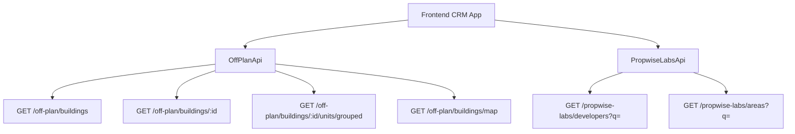

## Overview

Add an **Off-Plan** tab under the **Properties** section of the main CRM sidebar. This page displays all published buildings from developer portal users in a card/map split view with rich filters, 2GIS map integration, and a detailed building view.

<Info>
**Backend facade:** Off-plan data is served through domain endpoints under `/off-plan/*`. These endpoints read Propwise Labs catalog data and apply CRM-owned visibility from `off_plan_building_publication` plus the off-plan lifecycle helper, so main CRM users only receive buildings with `is_published=true` that still classify as off-plan.
</Info>

---

## Reference Screenshots

The target design replicates key visual patterns from competitor platforms:

<Accordion title="List page (grid view)">
Cards with cover image, frontend status badges (On Sale, Out of Stock, EOI), building name, **Starting {price}** when `stats.startingPrice` exists (hidden otherwise), a compact unit-availability row (Available / Reserved / Sold from `stats.unitsByStatus`), and bottom metadata badges for handover quarter (`endDate` → `Q1 2028`), area, and developer.
</Accordion>

<Accordion title="List page (map view)">
Split layout — scrollable card list on left, 2GIS interactive map on right with custom circular developer-logo markers and hover popover previews anchored above each marker. Marker hover also scrolls the left card list to the matching building and highlights that card with the same status color as the marker border.
</Accordion>

<Accordion title="Filters bar">
Leads-style compact search input + Filters popover under the page title, followed by quick dropdown buttons for Developer, Price, Payments, Handover, Bedrooms, and Status.
</Accordion>

<Accordion title="Map detail panel">
Animated left-column overlay with a Figma-matched header containing the building name, area, close action, and underline tabs for Overview, Units, Media, and Contact.
</Accordion>

<Accordion title="Building detail route">
`/home/properties/off-plan/:buildingId` renders the same map-mode off-plan page and opens the building detail panel on the left. There is no separate full-page detail layout.
</Accordion>

---

## Architecture Decision

### Buildings vs Projects as Primary Entity

<Note>
Based on the existing data model, **buildings** are the primary enrichment entity. Buildings have their own `coverImageUrl`, `status`, `endDate`, `completionDate`, `paymentPlans`, `images`, `documents`, `amenities`.
</Note>

The list page queries `GET /off-plan/buildings`, and the detail page queries `GET /off-plan/buildings/:id`.

Publication is separate from Propwise Labs `building.status`. Developers publish or unpublish a building through the developer portal, which writes `off_plan_building_publication.is_published` for the Propwise Labs `building_id`.

#### Publish-readiness Gate

<Warning>
Before flipping `is_published=true`, the publish endpoints re-validate the persisted entity against required-field contracts. Buildings must satisfy the 13-field "complete building" contract plus `salesStatus`. All missing fields are aggregated into a single `400 BadRequest`.
</Warning>

Required fields for buildings:
- `name`, `buildingNumber`, `descriptionEn`, `floors`
- `googleMapsLink`, `startDate`, `coverImageUrl`
- `area.id`, `plotSize`, `actualArea`, `parkingCount`
- `serviceChargePerSqft`, ≥1 `media`, `salesStatus`

Required fields for villa projects:
- `name`, `descriptionEn`, `imageUrl` cover
- `googleMapsLink`, `area.id`, `latitude`, `longitude`
- ≥1 `media`, `salesStatus`

#### Auto-maintained Sales Status

<Check>
A building's/villa-project's `salesStatus` (`ANNOUNCED | EOI | ON_SALE | OUT_OF_STOCK`) is auto-maintained from live unit availability by the developer portal. When no units remain `AVAILABLE`, status becomes `OUT_OF_STOCK`.
</Check>

#### Frontend Status Mapping

Frontend display status is derived from `building.status` through `getOffPlanFrontendStatus()`:

| Backend `building.status` | Frontend status | Color  |
| ------------------------- | --------------- | ------ |
| `ACTIVE`                  | On Sale         | Orange |
| `PENDING`                 | EOI             | Purple |
| `FINISHED`                | Out of Stock    | Gray   |

### Data Flow



<Info>
The `/off-plan/buildings` endpoints enforce publication by checking `off_plan_building_publication.is_published=true` and require the building to match the off-plan lifecycle helper.
</Info>

---

## Implementation Steps

<Steps>
<Step title="Update sidebar navigation">
Replace the entire `data.realEstate` array in `src/components/layouts/CRMLayout.tsx` with a single "Off-Plan" entry.

```typescript
realEstate: [
  {
    title: 'Off-Plan',
    url: '/home/properties/off-plan',
    icon: Building2,  // from lucide-react
  },
],
```

Remove old sidebar entries for Areas, Developments, and Units.
</Step>

<Step title="Set up route structure">
Create the following route structure:

```
src/app/home/properties/off-plan/
├── page.tsx                    # Map/list page with building panel handling
└── [id]/
    └── page.tsx                # Re-exports ../page for /:id routes
```

<Warning>
The `[id]/page.tsx` route must not implement a separate building detail page. It delegates to the main off-plan page so `/home/properties/off-plan/:buildingId` preserves the map, filters, and left-side panel behavior.
</Warning>
</Step>

<Step title="Create component structure">
Implement the following component hierarchy:

```
src/components/pages/off-plan/
├── index.ts                           # Barrel export
├── off-plan-building-card.tsx          # Building card for grid view
├── off-plan-filters.tsx               # Horizontal filter bar
├── off-plan-map-view.tsx              # 2GIS map with markers + popover
├── off-plan-grid-view.tsx             # Scrollable grid with infinite scroll
├── off-plan-building-detail-panel.tsx # Animated detail panel
├── off-plan-toolbar.tsx               # View toggle, sort, saved filters
├── building-detail-header.tsx          # Sticky sidebar header
├── building-detail-description.tsx     # Description with Read More
└── building-detail-unit-summary.tsx    # Unit availability summary
```
</Step>

<Step title="Update breadcrumb handling">
Replace all existing real-estate breadcrumb handling with off-plan routes:

```
Properties > Off-Plan                           (list page)
Properties > Off-Plan > {Building Name}         (detail panel)
```

Remove breadcrumb entries for `/real-estate/areas`, `/real-estate/developments`, `/real-estate/units`, and `/real-estate/prospects`.
</Step>
</Steps>

---

## API Integration

### Off-Plan Endpoints

<CodeGroup>

```typescript List Buildings
const { data } = await offPlanApi.getBuildings({
  page: 1,
  limit: 20,
  search: 'tower',
  developerId: 123,
  areaId: 456,
  priceRange: [500000, 2000000],
  bedrooms: [1, 2, 3],
  status: ['ACTIVE', 'PENDING'],
  handoverQuarter: 'Q1-2025'
});
```

```typescript Get Building Details
const building = await offPlanApi.getBuilding(buildingId);
```

```typescript Get Map Markers
const markers = await offPlanApi.getBuildingsMap({
  bounds: { ne: { lat: 25.3, lng: 55.4 }, sw: { lat: 25.2, lng: 55.3 } }
});
```

```typescript Get Grouped Units
const units = await offPlanApi.getBuildingUnitsGrouped(buildingId);
```

</CodeGroup>

### Filter Options

<CodeGroup>

```typescript Developers
const developers = await propwiseLabsApi.getDevelopers({
  q: 'emaar',
  limit: 10
});
```

```typescript Areas
const areas = await propwiseLabsApi.getAreas({
  q: 'downtown',
  limit: 10
});
```

</CodeGroup>

---

## Component Specifications

### Building Card

<Tabs>
<Tab title="Card Layout">
- Cover image with status badge overlay
- Building name and starting price
- Unit availability row (Available/Reserved/Sold)
- Bottom metadata: handover quarter, area, developer
</Tab>

<Tab title="Status Badges">
- **On Sale** (Orange): `building.status === 'ACTIVE'`
- **EOI** (Purple): `building.status === 'PENDING'` 
- **Out of Stock** (Gray): `building.status === 'FINISHED'`
</Tab>
</Tabs>

### Map Integration

<Note>
2GIS map with custom circular developer-logo markers. Bidirectional sync between map markers and left card list - hovering either highlights the corresponding item.
</Note>

Key features:
- Custom marker styling with developer logos
- Hover popover previews above markers
- Bidirectional highlighting between map and list
- "Search this area" for out-of-bounds markers

### Detail Panel

<Accordion title="Panel Structure">
Animated left-column overlay with tabs:
- **Overview**: Cover image, description, details table, progress, amenities
- **Units**: Grouped unit listings with availability
- **Media**: Image gallery and documents
- **Contact**: Developer contact information
</Accordion>

<Accordion title="Overview Tab Content">
- Cover image with price overlay or "Price upon request"
- Collapsible description (3-line with "Show more")
- Building details table
- Construction progress from `building.percentCompleted`
- Four-card unit availability summary
- Payment plan information
- Amenities list
- Location details
</Accordion>

---

## Data Models

### Building Response

```typescript
interface OffPlanBuilding {
  id: number;
  name: string;
  buildingNumber?: string;
  description?: string;
  coverImageUrl?: string;
  status: 'ACTIVE' | 'PENDING' | 'FINISHED';
  salesStatus: 'ANNOUNCED' | 'EOI' | 'ON_SALE' | 'OUT_OF_STOCK';
  startDate: string;
  endDate?: string;
  completionDate?: string;
  percentCompleted?: number;
  latitude?: number;
  longitude?: number;
  area: {
    id: number;
    name: string;
  };
  developer: {
    id: number;
    name: string;
    logoUrl?: string;
  };
  stats: {
    startingPrice?: number;
    currency?: string;
    unitsCount?: number;
    unitsByStatus?: {
      available: number;
      reserved: number;
      sold: number;
    };
  };
  paymentPlans?: PaymentPlan[];
  amenities?: string[];
  media?: MediaItem[];
}
```

### Filter Parameters

```typescript
interface OffPlanFilters {
  search?: string;
  developerId?: number;
  areaId?: number;
  priceRange?: [number, number];
  bedrooms?: number[];
  status?: BuildingStatus[];
  handoverQuarter?: string;
  sortBy?: 'name' | 'price' | 'handover' | 'created_at';
  sortOrder?: 'asc' | 'desc';
}
```

---

## Frontend Status Utilities

<CodeGroup>

```typescript getOffPlanFrontendStatus
export function getOffPlanFrontendStatus(status: BuildingStatus): {
  label: string;
  color: string;
} {
  switch (status) {
    case 'ACTIVE':
      return { label: 'On Sale', color: 'orange' };
    case 'PENDING':
      return { label: 'EOI', color: 'purple' };
    case 'FINISHED':
      return { label: 'Out of Stock', color: 'gray' };
    default:
      return { label: 'Unknown', color: 'gray' };
  }
}
```

```typescript getOffPlanStartingPrice
export function getOffPlanStartingPrice(building: OffPlanBuilding): string {
  const { stats } = building;
  if (!stats?.startingPrice) {
    return 'Price upon request';
  }
  
  const currency = stats.currency || 'AED';
  const formatted = new Intl.NumberFormat('en-AE', {
    style: 'currency',
    currency,
    minimumFractionDigits: 0,
  }).format(stats.startingPrice);
  
  return `Starting ${formatted}`;
}
```

</CodeGroup>

---

## Testing Strategy

<Steps>
<Step title="Unit tests">
- Component rendering with mock data
- Filter logic and state management
- API response handling
- Status badge rendering
</Step>

<Step title="Integration tests">
- Map marker interactions
- Panel animations
- Filter combinations
- Route navigation
</Step>

<Step title="E2E tests">
- Complete user flow from list to detail
- Map/grid view switching
- Building detail panel functionality
- Filter persistence
</Step>
</Steps>

---

## Performance Considerations

<Tip>
**Infinite Scroll**: Implement virtual scrolling for large building lists to maintain performance with hundreds of results.
</Tip>

<Tip>
**Map Clustering**: Use marker clustering when many buildings are in close proximity to prevent UI clutter.
</Tip>

<Warning>
**Image Optimization**: Implement lazy loading and responsive images for building cards and detail panels to minimize initial load time.
</Warning>

Key optimizations:
- Debounced search and filter inputs
- Cached developer and area lookup data
- Optimized map marker rendering
- Progressive image loading
- Virtual scrolling for large lists