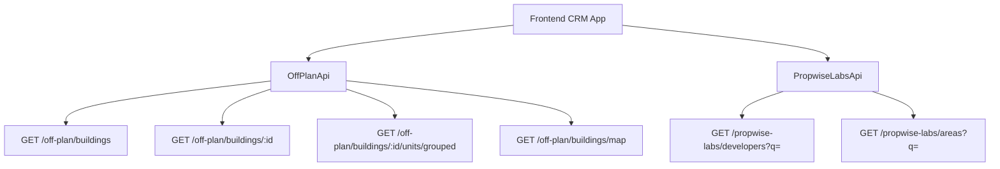

<Note>
This specification outlines the complete implementation of the Off-Plan Directory feature, including backend architecture, publication lifecycle, and frontend integration patterns.
</Note>

## Overview

The Off-Plan Directory adds a new **Off-Plan** tab under the **Properties** section of the main CRM sidebar. This page displays all published buildings from developer portal users in a card/map split view with rich filters, 2GIS map integration, and a detailed building view.

### Backend Architecture

Off-plan data is served through domain endpoints under `/off-plan/*`. These endpoints read Propwise Labs catalog data and apply CRM-owned visibility from `off_plan_building_publication` plus the off-plan lifecycle helper, ensuring main CRM users only receive buildings with `is_published=true` that still classify as off-plan.

<Info>
The lower-level `/propwise-labs/*` endpoints remain raw catalog access and support explicit lifecycle filtering for off-plan, secondary, or all catalog records.
</Info>

## Reference Design Patterns

The implementation follows key visual patterns from competitor platforms:

<AccordionGroup>
<Accordion title="List page (grid view)">
Cards display cover image, frontend status badges (On Sale, Out of Stock, EOI), building name, **Starting {price}** when `stats.startingPrice` exists, compact unit-availability row (Available/Reserved/Sold from `stats.unitsByStatus`), and bottom metadata badges for handover quarter, area, and developer.
</Accordion>

<Accordion title="List page (map view)">
Split layout with scrollable card list on left, 2GIS interactive map on right with custom circular developer-logo markers and hover popover previews. Bidirectional sync between card hover and marker highlighting.
</Accordion>

<Accordion title="Filters bar">
Compact search input + Filters popover under page title, followed by quick dropdown buttons for Developer, Price, Payments, Handover, Bedrooms, and Status.
</Accordion>

<Accordion title="Map detail panel">
Animated left-column overlay with building name, area, close action, and tabs for Overview, Units, Media, and Contact. Overview shows cover image with price overlay, description, building details, construction progress, unit availability summary, payment plan, amenities, and location.
</Accordion>
</AccordionGroup>

## Architecture Decisions

### Buildings vs Projects as Primary Entity

<Check>
**Buildings** are the primary enrichment entity based on the existing data model.
</Check>

Buildings have their own:
- `coverImageUrl`, `status`, `endDate`, `completionDate`
- `paymentPlans`, `images`, `documents`, `amenities`
- Can override inherited fields from projects (status, area, community, description)

The off-plan directory displays **published buildings** based on CRM `is_published` visibility, since a project may contain multiple buildings with different lifecycle statuses and pricing.

### Publication System

<Steps>
<Step title="Publication Logic">
Publication is separate from Propwise Labs `building.status`. Developers publish/unpublish buildings through the developer portal, which writes `off_plan_building_publication.is_published` for the Propwise Labs `building_id`.
</Step>

<Step title="Missing Records">
Missing publication rows are treated as draft/unpublished. Unpublishing keeps the row with `unpublished_at` plus `unpublished_by_id` for audit.
</Step>

<Step title="Publish-Readiness Gate">
Before setting `is_published=true`, publish endpoints validate the persisted entity against required-field contracts plus `salesStatus`.
</Step>
</Steps>

### Required Fields for Publication

<Tabs>
<Tab title="Buildings">
Must satisfy 13-field "complete building" contract:
- `name`, `buildingNumber`, `descriptionEn`, `floors`
- `googleMapsLink`, `startDate`, `coverImageUrl`
- `area.id`, `plotSize`, `actualArea`, `parkingCount`
- `serviceChargePerSqft`, ≥1 `media`, `salesStatus`
</Tab>

<Tab title="Villa Projects">
Must satisfy:
- `name`, `descriptionEn`, `imageUrl` cover
- `googleMapsLink`, `area.id`, `latitude`, `longitude`
- ≥1 `media`, `salesStatus`
</Tab>
</Tabs>

<Warning>
All missing fields are aggregated into a single `400 BadRequest` so the dev-portal UI can list every missing field in one toast/banner.
</Warning>

### Auto-Maintained Sales Status

A building's/villa-project's `salesStatus` is auto-maintained from live unit availability:

<CodeGroup>
```typescript salesStatus Logic
// When developer changes unit salesStatus
salesStatus = noUnitsAvailable ? 'OUT_OF_STOCK' : 'ON_SALE'

// Status mapping
ANNOUNCED | EOI | ON_SALE | OUT_OF_STOCK
```

```typescript Frontend Status Mapping
const getOffPlanFrontendStatus = (status: string) => {
  switch (status) {
    case 'ACTIVE': return { label: 'On Sale', color: 'orange' }
    case 'PENDING': return { label: 'EOI', color: 'purple' }
    case 'FINISHED': return { label: 'Out of Stock', color: 'gray' }
  }
}
```
</CodeGroup>

### Data Flow Architecture



<Tip>
The `/off-plan/buildings` endpoints enforce publication by checking `off_plan_building_publication.is_published=true` and off-plan lifecycle requirements.
</Tip>

## Implementation Structure

### 1. Sidebar Navigation

<Steps>
<Step title="Update CRM Layout">
Replace the entire `data.realEstate` array in `src/components/layouts/CRMLayout.tsx`:

```typescript
realEstate: [
  {
    title: 'Off-Plan',
    url: '/properties/off-plan',
    icon: Building2,  // from lucide-react
  },
],
```
</Step>

<Step title="Remove Old Entries">
Remove existing sidebar entries for Areas, Developments, and Units.
</Step>

<Step title="Update Breadcrumbs">
Replace real-estate breadcrumb handling:
- `Properties > Off-Plan` (list page)
- `Properties > Off-Plan > {Building Name}` (detail panel)
</Step>
</Steps>

### 2. Route Structure

```
src/app/(app)/properties/off-plan/
├── page.tsx                    # Map/list page + building panel handler
└── [id]/
    └── page.tsx               # Re-exports ../page for panel mode
```

<Note>
The `[id]/page.tsx` route delegates to the main off-plan page so `/properties/off-plan/:buildingId` preserves the map, filters, and panel behavior.
</Note>

### 3. Component Architecture

<CardGroup cols={2}>
<Card title="List Page Components" icon="list">
- `off-plan-building-card.tsx`
- `off-plan-filters.tsx`
- `off-plan-map-view.tsx`
- `off-plan-grid-view.tsx`
- `off-plan-toolbar.tsx`
</Card>

<Card title="Detail Components" icon="window">
- `off-plan-building-detail-panel.tsx`
- `building-detail-header.tsx`
- `building-detail-description.tsx`
- `building-detail-unit-summary.tsx`
</Card>
</CardGroup>

### 4. API Integration Patterns

<CodeGroup>
```typescript Building List
const { data: buildings } = useQuery({
  queryKey: ['off-plan-buildings', filters],
  queryFn: () => offPlanApi.getBuildings(filters)
})
```

```typescript Building Detail
const { data: building } = useQuery({
  queryKey: ['off-plan-building', buildingId],
  queryFn: () => offPlanApi.getBuilding(buildingId)
})
```

```typescript Map Markers
const { data: markers } = useQuery({
  queryKey: ['off-plan-map', bounds],
  queryFn: () => offPlanApi.getBuildingsMap(bounds)
})
```
</CodeGroup>

## Lifecycle Management

### Off-Plan Classification

The lifecycle helper treats these statuses as off-plan:
- `ACTIVE` → On Sale (Orange)
- `PENDING` → EOI (Purple)

<Warning>
`UNKNOWN` status is intentionally excluded from off-plan and remains secondary-eligible only.
</Warning>

### Publication Workflow

<Steps>
<Step title="Draft State">
New buildings start unpublished (missing publication row or `is_published=false`)
</Step>

<Step title="Validation">
Publish action validates all required fields and aggregates missing items
</Step>

<Step title="Publication">
Success sets `is_published=true` and makes building visible in off-plan directory
</Step>

<Step title="Unpublication">
Always succeeds, bypasses readiness gate for pulling stale records back to draft
</Step>
</Steps>

## Frontend Integration Points

### Filter System
- Compact search input with Filters popover
- Quick dropdown buttons for Developer, Price, Payments, Handover, Bedrooms, Status
- Saved filter functionality

### Map Integration
- 2GIS interactive map with custom markers
- Bidirectional sync between card hover and marker highlighting
- Animated building detail panel overlay
- Search this area functionality

### Detail Panel Tabs
<Tabs>
<Tab title="Overview">
Cover image with price overlay, description, building details, construction progress, unit availability, payment plan, amenities, location
</Tab>

<Tab title="Units">
Grouped unit listings with availability and pricing
</Tab>

<Tab title="Media">
Image gallery and document downloads
</Tab>

<Tab title="Contact">
Developer contact information and inquiry forms
</Tab>
</Tabs>

<Check>
This implementation replaces the existing Areas, Developments, and Units sections with a unified Off-Plan Directory that provides comprehensive building discovery and detailed information access.
</Check>