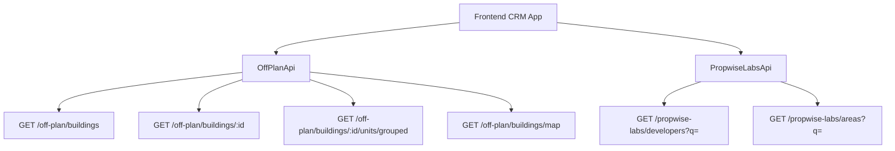

## Overview

Add an **Off-Plan** tab under the **Properties** section of the main CRM sidebar. This page displays all published buildings from developer portal users in a card/map split view with rich filters, 2GIS map integration, and a detailed building view.

<Note>
**Backend facade:** Off-plan data is served through domain endpoints under `/off-plan/*`. These endpoints read Propwise Labs catalog data and apply CRM-owned visibility from `off_plan_building_publication` plus the off-plan lifecycle helper, so main CRM users only receive buildings with `is_published=true` that still classify as off-plan.
</Note>

The lower-level `/propwise-labs/*` endpoints remain raw catalog access and support explicit lifecycle filtering for off-plan, secondary, or all catalog records.

---

## Reference Screenshots

The screenshots provided (images 1–12) show the target design from a competitor platform. Key visual patterns to replicate:

<AccordionGroup>
  <Accordion title="List page (grid view)">
    Cards with cover image, frontend status badges (On Sale, Out of Stock, EOI), building name, **Starting {price}** when `stats.startingPrice` exists (hidden otherwise), a compact unit-availability row (Available / Reserved / Sold from `stats.unitsByStatus`), and bottom metadata badges for handover quarter (`endDate` → `Q1 2028`), area, and developer. Villa-project cards render the same availability row and the handover badge from the project `stats.unitsByStatus` / `endDate`.
  </Accordion>

  <Accordion title="List page (map view)">
    Split layout — scrollable card list on left, 2GIS interactive map on right with custom circular developer-logo markers and hover popover previews anchored above each marker. Marker hover also scrolls the left card list to the matching building and highlights that card with the same status color as the marker border.
    
    The sync is **bidirectional**: hovering a left-list card pans the map to center that item's marker, highlights it, and opens the same mini preview card above it (just like hovering the marker directly) — and when the marker isn't in the loaded marker set, the map drops a temporary pin from the card's `lat`/`lng` and runs "Search this area" so the real marker loads. Clicking the marker, map preview card, or focused list card opens an animated building detail panel over the left list.
  </Accordion>

  <Accordion title="Filters bar">
    Leads-style compact search input + Filters popover under the page title, followed by quick dropdown buttons for Developer, Price, Payments, Handover, Bedrooms, and Status. No tabs are shown on the Off-Plan page.
  </Accordion>

  <Accordion title="Map detail panel">
    Animated left-column overlay with a Figma-matched header containing the building name, area, close action, and underline tabs for Overview, Units, Media, and Contact. The Overview tab shows the cover image with a bottom-left price overlay (`stats.startingPrice` via `getOffPlanStartingPrice()` + `currency`, or **Price upon request** when no price exists), description directly below the cover image with a three-line collapse and blue **Show more** control when needed, building details table, construction progress from `building.percentCompleted`, a four-card unit availability summary (Total Units, Available, Reserved, Sold), payment plan, amenities, and location.
    
    Total Units comes from `building.stats?.unitsCount`; Available / Reserved / Sold come from the authoritative `building.stats?.unitsByStatus` aggregate (same source as the directory cards), falling back to grouped unit `salesStatus` / `availabilityStatus` counting only when the aggregate is absent. The old "Back to list" text button is not shown; closing returns to the map/list split.
  </Accordion>

  <Accordion title="Building detail route">
    `/properties/off-plan/:buildingId` renders the same map-mode off-plan page and opens the building detail panel on the left. There is no separate full-page detail layout.
  </Accordion>
</AccordionGroup>

---

## Architecture Decision

### Buildings vs Projects as Primary Entity

Based on the existing data model, **buildings** are the primary enrichment entity:

- Buildings have their own `coverImageUrl`, `status`, `endDate`, `completionDate`, `paymentPlans`, `images`, `documents`, `amenities`
- Buildings can override inherited fields from projects (status, area, community, description)
- The off-plan directory should display **published buildings** based on CRM `is_published` visibility, since a project may contain multiple buildings with different lifecycle statuses and pricing

<Info>
The list page queries `GET /off-plan/buildings`, and the detail page queries `GET /off-plan/buildings/:id`.
</Info>

#### Publication System

Publication is separate from Propwise Labs `building.status`. Developers publish or unpublish a building through the developer portal, which writes `off_plan_building_publication.is_published` for the Propwise Labs `building_id`. Missing publication rows are treated as draft/unpublished, and unpublishing keeps the row with `unpublished_at` plus `unpublished_by_id` for audit.

<Warning>
**Publish-readiness gate.** Before flipping `is_published=true`, the publish endpoints (`PATCH /developer-portal/buildings/:id/publication` and `PATCH /developer-portal/projects/:id/publication`) re-validate the persisted entity against the same required-field contract enforced at create / update time, plus `salesStatus` (which is optional on the create/update DTOs but required at publish so the public off-plan card / detail does not render with a missing label).
</Warning>

Buildings must satisfy the 13-field "complete building" contract:
- `name`
- `buildingNumber`
- `descriptionEn`
- `floors`
- `googleMapsLink`
- `startDate`
- `coverImageUrl`
- `area.id`
- `plotSize`
- `actualArea`
- `parkingCount`
- `serviceChargePerSqft`
- ≥1 `media`
- `salesStatus`

Villa projects must satisfy:
- `name`
- `descriptionEn`
- `imageUrl` cover
- `googleMapsLink`
- `area.id`
- `latitude`
- `longitude`
- ≥1 `media`
- `salesStatus`

All missing fields are aggregated into a single `400 BadRequest` so the dev-portal UI can list every missing field in one toast / banner. Unpublishing always succeeds — it bypasses the readiness gate so stale or sparse records can be pulled back to draft.

<Check>
See `Docs/REAL_ESTATE_MODULE_SPECIFICATION.md` (`OffPlanBuildingPublication` and `OffPlanProjectPublication` sections) for the canonical contract and the implementing guards (`assertBuildingReadyToPublish`, `assertVillaProjectReadyToPublish`).
</Check>

#### Auto-maintained Sales Status

**Auto-maintained `salesStatus`.** A building's / villa-project's `salesStatus` (`ANNOUNCED | EOI | ON_SALE | OUT_OF_STOCK`) is now auto-maintained from live unit availability by the developer portal: when a developer changes a unit's `salesStatus` (or directly creates a unit), `ProjectManagementService` recounts the direct owner's units and sets `salesStatus = OUT_OF_STOCK` once **no** units remain `AVAILABLE` (every unit `RESERVED` or `SOLD` — `RESERVED` counts as unavailable), reverting to `ON_SALE` when an `AVAILABLE` unit reappears.

For `Buildings`-type projects the **building** is reconciled; for `Villas`-type projects the **project** is. This is the same `salesStatus` value the publish-readiness gate requires and that downstream off-plan card / map / detail surfaces read, so a sold-out building or villa project reflects "Out of Stock" in the directory without a manual edit.

<Note>
Note this is distinct from the frontend status badge below, which is derived from `building.status` (schedule-driven) via `getOffPlanFrontendStatus()`. See `Docs/REAL_ESTATE_MODULE_SPECIFICATION.md` → "Auto Out-of-Stock sales-status sync" for the resolver rules, trigger paths, and the accepted v1 auto-revert limitation.
</Note>

Off-plan directory endpoints always enforce the off-plan lifecycle in code; callers do not pass a `type` query parameter. The lifecycle helper treats `ACTIVE` and `PENDING` as off-plan statuses and intentionally excludes `UNKNOWN` from off-plan. `UNKNOWN` remains secondary-eligible only on the raw `/propwise-labs/*` catalog endpoints when `type=secondary` is requested.

#### Frontend Display Status

Frontend display status is derived from `building.status` through `getOffPlanFrontendStatus()`:

| Backend `building.status` | Frontend status | Color  |
| ------------------------- | --------------- | ------ |
| `ACTIVE`                  | On Sale         | Orange |
| `PENDING`                 | EOI             | Purple |
| `FINISHED`                | Out of Stock    | Gray   |

The same helper drives building cards, map marker colors, map legend labels, and detail table sale status. The map legend (`OFF_PLAN_FRONTEND_STATUS_LABELS` in `off-plan-display-utils.ts`) renders left-to-right as **Announced → EOI → On Sale → Out of Stock**.

### Data Flow



<Info>
The `/off-plan/buildings` list, detail, map, and grouped-unit endpoints enforce publication by checking `off_plan_building_publication.is_published=true` before returning building data to main CRM users. They also require the building to match the off-plan lifecycle helper; secondary and `UNKNOWN` lifecycle records are hidden from the off-plan directory even if a publication row exists.
</Info>

Generic lookup endpoints remain on `/propwise-labs/*` because they are global catalog data shared by off-plan, secondary, developer portal, and future property-interest flows.

---

## Sidebar Navigation

### File: `src/components/layouts/CRMLayout.tsx`

**Replace** the entire `data.realEstate` array with a single "Off-Plan" entry. The existing Areas, Developments, and Units tabs are removed — the off-plan directory supersedes them.

```typescript
realEstate: [
  {
    title: 'Off-Plan',
    url: '/properties/off-plan',
    icon: Building2,  // from lucide-react (already imported)
  },
],
```

<Warning>
**Remove** the old sidebar entries for Areas, Developments, and Units.
</Warning>

### Breadcrumb

**Replace** all existing real-estate breadcrumb handling (areas, developments, units) with off-plan routes:

```
Properties > Off-Plan                           (list page)
Properties > Off-Plan > {Building Name}         (map page with open detail panel)
```

Remove the breadcrumb entries for `/real-estate/areas`, `/real-estate/developments`, `/real-estate/units`, and `/real-estate/prospects`.

---

## Route Structure

```
src/app/(app)/properties/off-plan/
├── page.tsx                    # Map/list page; also handles open building panel based on pathname
└── [id]/
    └── page.tsx                # Re-exports ../page so /:id opens the same map page with panel
```

<Warning>
The `[id]/page.tsx` route must not implement a separate building detail page. It delegates to the main off-plan page so `/properties/off-plan/:buildingId` preserves the map, filters, and left-side panel behavior.
</Warning>

---

## Component Structure

```
src/components/pages/off-plan/
├── index.ts                               # Barrel export
│
│   ── List Page Components ──
├── off-plan-building-card.tsx             # Building card for grid view
├── off-plan-filters.tsx                   # Horizontal filter bar
├── off-plan-map-view.tsx                  # 2GIS map with markers + popover
├── off-plan-grid-view.tsx                 # Scrollable grid of building cards + infinite scroll sentinel
├── off-plan-building-detail-panel.tsx     # Animated map-mode detail panel with Figma header + Overview/Units/Media/Contact tabs
├── off-plan-toolbar.tsx                   # View toggle (Grid/Map), sort, saved filters
│
│   ── Detail Page Components ──
├── building-detail-header.tsx             # Sticky sidebar: name, price, units count, payment plan, developer, CTA buttons
├── building-detail-description.tsx        # Description section with Read More
├── building-detail-unit-summary.tsx       # Four-card availability summary
├── building-detail-amenities.tsx          # Amenities grid
├── building-detail-location.tsx           # 2GIS embedded map + address
├── building-detail-construction-progress.tsx  # Progress bar from percentCompleted
├── building-detail-payment-plan.tsx       # Payment plan table
├── building-detail-media-gallery.tsx      # Image/video gallery
├── building-detail-contact-section.tsx    # Developer contact info + inquiry form
│
│   ── Shared Components ──
├── off-plan-status-badge.tsx              # Frontend status badge (On Sale / EOI / Out of Stock)
├── off-plan-price-display.tsx             # Starting price formatter with currency
├── off-plan-unit-availability-row.tsx     # Compact Available/Reserved/Sold row
└── off-plan-map-marker.tsx                # Custom circular marker with developer logo
```

---

## Implementation Steps

<Steps>
  <Step title="Backend API Endpoints">
    Create the domain-level `/off-plan/*` endpoints that wrap Propwise Labs catalog data with publication and lifecycle filtering.

    ### Endpoints to Create

    <CodeGroup>
    ```typescript GET /off-plan/buildings
    // List buildings with publication + lifecycle filtering
    interface OffPlanBuildingListParams {
      page?: number;
      limit?: number;
      search?: string;
      developerId?: string[];
      areaId?: string[];
      minPrice?: number;
      maxPrice?: number;
      bedrooms?: number[];
      status?: ('ACTIVE' | 'PENDING' | 'FINISHED')[];
      handoverQuarter?: string[];  // e.g., "Q1-2028"
      paymentPlan?: string[];
      sortBy?: 'price' | 'handover' | 'name' | 'createdAt';
      sortOrder?: 'asc' | 'desc';
    }

    interface OffPlanBuildingListResponse {
      data: OffPlanBuilding[];
      meta: {
        total: number;
        page: number;
        limit: number;
        hasMore: boolean;
      };
    }
    ```

    ```typescript GET /off-plan/buildings/:id
    // Get single building detail with publication check
    interface OffPlanBuildingDetailResponse {
      id: string;
      name: string;
      buildingNumber: string;
      description: string;
      coverImageUrl: string;
      status: BuildingStatus;
      salesStatus: SalesStatus;
      startDate: string;
      endDate: string;
      completionDate: string;
      percentCompleted: number;
      stats: {
        startingPrice?: number;
        currency: string;
        unitsCount: number;
        unitsByStatus: {
          AVAILABLE: number;
          RESERVED: number;
          SOLD: number;
        };
      };
      area: Area;
      community?: Community;
      developer: Developer;
      project: {
        id: string;
        name: string;
        type: 'Buildings' | 'Villas';
      };
      paymentPlans: PaymentPlan[];
      amenities: Amenity[];
      media: Media[];
      documents: Document[];
      location: {
        latitude: number;
        longitude: number;
        googleMapsLink: string;
      };
    }
    ```

    ```typescript GET /off-plan/buildings/:id/units/grouped
    // Get units grouped by bedroom count
    interface GroupedUnitsResponse {
      groups: {
        bedrooms: number;
        units: UnitSummary[];
        stats: {
          minPrice: number;
          maxPrice: number;
          currency: string;
          available: number;
          reserved: number;
          sold: number;
        };
      }[];
    }
    ```

    ```typescript GET /off-plan/buildings/map
    // Get buildings for map markers (lighter payload)
    interface MapBuildingParams {
      bounds?: {
        north: number;
        south: number;
        east: number;
        west: number;
      };
      // ... same filters as list endpoint
    }

    interface MapBuildingResponse {
      data: {
        id: string;
        name: string;
        status: BuildingStatus;
        salesStatus: SalesStatus;
        location: {
          latitude: number;
          longitude: number;
        };
        stats: {
          startingPrice?: number;
          currency: string;
          unitsByStatus: {
            AVAILABLE: number;
            RESERVED: number;
            SOLD: number;
          };
        };
        developer: {
          id: string;
          name: string;
          logoUrl?: string;
        };
        coverImageUrl: string;
        area: {
          id: string;
          name: string;
        };
      }[];
    }
    ```
    </CodeGroup>

    ### Publication Filter Logic

    ```typescript
    // Apply in all /off-plan/* endpoints
    const publishedBuildings = await db.query(`
      SELECT b.*, pub.is_published
      FROM propwise_labs.buildings b
      LEFT JOIN off_plan_building_publication pub 
        ON pub.building_id = b.id
      WHERE pub.is_published = true
        AND b.status IN ('ACTIVE', 'PENDING')
        AND b.deleted_at IS NULL
    `);
    ```
  </Step>

  <Step title="Frontend API Client">
    Create the TypeScript API client for off-plan endpoints.

    ### File: `src/lib/api/off-plan-api.ts`

    ```typescript
    import { apiClient } from './client';
    import type {
      OffPlanBuildingListParams,
      OffPlanBuildingListResponse,
      OffPlanBuildingDetailResponse,
      GroupedUnitsResponse,
      MapBuildingResponse,
    } from './types/off-plan';

    export const offPlanApi = {
      // List buildings
      getBuildings: (params: OffPlanBuildingListParams) =>
        apiClient.get<OffPlanBuildingListResponse>('/off-plan/buildings', { params }),

      // Get building detail
      getBuilding: (id: string) =>
        apiClient.get<OffPlanBuildingDetailResponse>(`/off-plan/buildings/${id}`),

      // Get grouped units
      getGroupedUnits: (buildingId: string) =>
        apiClient.get<GroupedUnitsResponse>(`/off-plan/buildings/${buildingId}/units/grouped`),

      // Get map markers
      getMapBuildings: (params: MapBuildingParams) =>
        apiClient.get<MapBuildingResponse>('/off-plan/buildings/map', { params }),
    };
    ```

    ### Reuse Existing Lookup APIs

    ```typescript
    // Already exists - reuse for filter dropdowns
    import { propwiseLabsApi } from './propwise-labs-api';

    // Developer search for multi-select
    propwiseLabsApi.getDevelopers({ q: searchTerm });

    // Area dropdown
    propwiseLabsApi.getAreas({ q: searchTerm });
    ```
  </Step>

  <Step title="State Management">
    Create Zustand stores for off-plan list and detail state.

    ### File: `src/stores/off-plan-store.ts`

    ```typescript
    import { create } from 'zustand';
    import type { OffPlanBuilding, OffPlanFilters } from '@/lib/api/types/off-plan';

    interface OffPlanStore {
      // View state
      viewMode: 'grid' | 'map';
      setViewMode: (mode: 'grid' | 'map') => void;

      // Filters
      filters: OffPlanFilters;
      setFilters: (filters: Partial<OffPlanFilters>) => void;
      resetFilters: () => void;

      // List state
      buildings: OffPlanBuilding[];
      isLoading: boolean;
      hasMore: boolean;
      page: number;
      
      // Map state
      selectedBuildingId: string | null;
      hoveredBuildingId: string | null;
      mapCenter: [number, number] | null;
      mapBounds: MapBounds | null;

      // Actions
      setSelectedBuilding: (id: string | null) => void;
      setHoveredBuilding: (id: string | null) => void;
      setMapCenter: (center: [number, number]) => void;
      setMapBounds: (bounds: MapBounds) => void;
    }

    const defaultFilters: OffPlanFilters = {
      search: '',
      developerId: [],
      areaId: [],
      minPrice: undefined,
      maxPrice: undefined,
      bedrooms: [],
      status: [],
      handoverQuarter: [],
      paymentPlan: [],
      sortBy: 'createdAt',
      sortOrder: 'desc',
    };

    export const useOffPlanStore = create<OffPlanStore>((set) => ({
      viewMode: 'map',
      setViewMode: (mode) => set({ viewMode: mode }),

      filters: defaultFilters,
      setFilters: (newFilters) =>
        set((state) => ({ filters: { ...state.filters, ...newFilters } })),
      resetFilters: () => set({ filters: defaultFilters }),

      buildings: [],
      isLoading: false,
      hasMore: true,
      page: 1,

      selectedBuildingId: null,
      hoveredBuildingId: null,
      mapCenter: null,
      mapBounds: null,

      setSelectedBuilding: (id) => set({ selectedBuildingId: id }),
      setHoveredBuilding: (id) => set({ hoveredBuildingId: id }),
      setMapCenter: (center) => set({ mapCenter: center }),
      setMapBounds: (bounds) => set({ mapBounds: bounds }),
    }));
    ```
  </Step>

  <Step title="Main Off-Plan Page">
    Create the main page that handles both list and detail routes.

    ### File: `src/app/(app)/properties/off-plan/page.tsx`

    ```typescript
    'use client';

    import { useEffect } from 'react';
    import { usePathname, useRouter, useSearchParams } from 'next/navigation';
    import { useQuery } from '@tanstack/react-query';
    import { offPlanApi } from '@/lib/api/off-plan-api';
    import { useOffPlanStore } from '@/stores/off-plan-store';
    import {
      OffPlanToolbar,
      OffPlanFilters,
      OffPlanGridView,
      OffPlanMapView,
      OffPlanBuildingDetailPanel,
    } from '@/components/pages/off-plan';

    export default function OffPlanPage() {
      const pathname = usePathname();
      const router = useRouter();
      const searchParams = useSearchParams();
      
      const {
        viewMode,
        filters,
        selectedBuildingId,
        setSelectedBuilding,
      } = useOffPlanStore();

      // Extract building ID from pathname if present
      const buildingIdFromPath = pathname.match(/\/properties\/off-plan\/([^/]+)/)?.[1];

      // Sync URL to store
      useEffect(() => {
        if (buildingIdFromPath && buildingIdFromPath !== selectedBuildingId) {
          setSelectedBuilding(buildingIdFromPath);
        }
      }, [buildingIdFromPath, selectedBuildingId, setSelectedBuilding]);

      // Fetch buildings list
      const { data: buildingsData, isLoading } = useQuery({
        queryKey: ['off-plan-buildings', filters, viewMode],
        queryFn: () =>
          viewMode === 'map'
            ? offPlanApi.getMapBuildings(filters)
            : offPlanApi.getBuildings(filters),
      });

      // Fetch detail if building selected
      const { data: buildingDetail } = useQuery({
        queryKey: ['off-plan-building', selectedBuildingId],
        queryFn: () => offPlanApi.getBuilding(selectedBuildingId!),
        enabled: !!selectedBuildingId,
      });

      const handleCloseDetail = () => {
        setSelectedBuilding(null);
        router.push('/properties/off-plan');
      };

      return (
        <div className="flex h-full flex-col">
          {/* Header */}
          <div className="border-b bg-white px-6 py-4">
            <h1 className="text-2xl font-semibold text-gray-900">Off-Plan</h1>
            <p className="text-sm text-gray-500">
              Browse available off-plan properties
            </p>
          </div>

          {/* Filters */}
          <OffPlanFilters />

          {/* Toolbar */}
          <OffPlanToolbar />

          {/* Content */}
          <div className="relative flex-1 overflow-hidden">
            {viewMode === 'grid' ? (
              <OffPlanGridView
                buildings={buildingsData?.data ?? []}
                isLoading={isLoading}
                onBuildingClick={(id) => {
                  setSelectedBuilding(id);
                  router.push(`/properties/off-plan/${id}`);
                }}
              />
            ) : (
              <OffPlanMapView
                buildings={buildingsData?.data ?? []}
                isLoading={isLoading}
                onBuildingClick={(id) => {
                  setSelectedBuilding(id);
                  router.push(`/properties/off-plan/${id}`);
                }}
              />
            )}

            {/* Detail Panel Overlay */}
            {selectedBuildingId && buildingDetail && (
              <OffPlanBuildingDetailPanel
                building={buildingDetail}
                onClose={handleCloseDetail}
              />
            )}
          </div>
        </div>
      );
    }
    ```

    ### File: `src/app/(app)/properties/off-plan/[id]/page.tsx`

    ```typescript
    // Re-export parent page to preserve map/list view
    export { default } from '../page';
    ```
  </Step>

  <Step title="Building Card Component">
    Create the building card for grid view.

    ### File: `src/components/pages/off-plan/off-plan-building-card.tsx`

    ```typescript
    import { Building2, Calendar, MapPin } from 'lucide-react';
    import Image from 'next/image';
    import { Card } from '@/components/ui/card';
    import { Badge } from '@/components/ui/badge';
    import { OffPlanStatusBadge } from './off-plan-status-badge';
    import { OffPlanPriceDisplay } from './off-plan-price-display';
    import { OffPlanUnitAvailabilityRow } from './off-plan-unit-availability-row';
    import { getOffPlanFrontendStatus, formatHandoverQuarter } from '@/lib/utils/off-plan-display-utils';
    import type { OffPlanBuilding } from '@/lib/api/types/off-plan';

    interface OffPlanBuildingCardProps {
      building: OffPlanBuilding;
      isHovered?: boolean;
      onClick: () => void;
      onMouseEnter?: () => void;
      onMouseLeave?: () => void;
    }

    export function OffPlanBuildingCard({
      building,
      isHovered,
      onClick,
      onMouseEnter,
      onMouseLeave,
    }: OffPlanBuildingCardProps) {
      const frontendStatus = getOffPlanFrontendStatus(building.status);
      const handoverQuarter = building.endDate 
        ? formatHandoverQuarter(building.endDate)
        : null;

      return (
        <Card
          className={cn(
            'group cursor-pointer overflow-hidden transition-all hover:shadow-lg',
            isHovered && 'ring-2',
            frontendStatus.color === 'orange' && isHovered && 'ring-orange-500',
            frontendStatus.color === 'purple' && isHovered && 'ring-purple-500',
            frontendStatus.color === 'gray' && isHovered && 'ring-gray-500'
          )}
          onClick={onClick}
          onMouseEnter={onMouseEnter}
          onMouseLeave={onMouseLeave}
        >
          {/* Cover Image */}
          <div className="relative aspect-[4/3] overflow-hidden">
            <Image
              src={building.coverImageUrl}
              alt={building.name}
              fill
              className="object-cover transition-transform group-hover:scale-105"
            />
            {/* Status Badge */}
            <div className="absolute left-3 top-3">
              <OffPlanStatusBadge status={building.status} />
            </div>
          </div>

          {/* Content */}
          <div className="p-4">
            {/* Name */}
            <h3 className="mb-1 text-lg font-semibold text-gray-900">
              {building.name}
            </h3>

            {/* Price - Only show if startingPrice exists */}
            {building.stats.startingPrice && (
              <OffPlanPriceDisplay
                price={building.stats.startingPrice}
                currency={building.stats.currency}
                prefix="Starting"
                className="mb-3"
              />
            )}

            {/* Unit Availability */}
            <OffPlanUnitAvailabilityRow
              available={building.stats.unitsByStatus.AVAILABLE}
              reserved={building.stats.unitsByStatus.RESERVED}
              sold={building.stats.unitsByStatus.SOLD}
              className="mb-4"
            />

            {/* Metadata Badges */}
            <div className="flex flex-wrap gap-2">
              {handoverQuarter && (
                <Badge variant="secondary" className="gap-1">
                  <Calendar className="h-3 w-3" />
                  {handoverQuarter}
                </Badge>
              )}
              <Badge variant="secondary" className="gap-1">
                <MapPin className="h-3 w-3" />
                {building.area.name}
              </Badge>
              <Badge variant="secondary" className="gap-1">
                <Building2 className="h-3 w-3" />
                {building.developer.name}
              </Badge>
            </div>
          </div>
        </Card>
      );
    }
    ```
  </Step>

  <Step title="Map View Component">
    Create the split-layout map view with 2GIS integration.

    ### File: `src/components/pages/off-plan/off-plan-map-view.tsx`

    ```typescript
    'use client';

    import { useEffect, useRef, useState } from 'react';
    import { useOffPlanStore } from '@/stores/off-plan-store';
    import { OffPlanBuildingCard } from './off-plan-building-card';
    import { OffPlanMapMarker } from './off-plan-map-marker';
    import { load2GisMap } from '@/lib/utils/2gis-map-loader';
    import { getOffPlanFrontendStatus } from '@/lib/utils/off-plan-display-utils';
    import type { OffPlanBuilding } from '@/lib/api/types/off-plan';

    interface OffPlanMapViewProps {
      buildings: OffPlanBuilding[];
      isLoading: boolean;
      onBuildingClick: (id: string) => void;
    }

    export function OffPlanMapView({
      buildings,
      isLoading,
      onBuildingClick,
    }: OffPlanMapViewProps) {
      const mapRef = useRef<HTMLDivElement>(null);
      const [map, setMap] = useState<any>(null);
      const [markers, setMarkers] = useState<Map<string, any>>(new Map());
      const [hoveredMarkerId, setHoveredMarkerId] = useState<string | null>(null);

      const {
        hoveredBuildingId,
        setHoveredBuilding,
        mapCenter,
        setMapCenter,
        mapBounds,
        setMapBounds,
      } = useOffPlanStore();

      // Initialize 2GIS map
      useEffect(() => {
        if (!mapRef.current || map) return;

        load2GisMap().then((mapInstance) => {
          const newMap = mapInstance.map(mapRef.current!, {
            center: [55.2708, 25.2048], // Dubai coordinates
            zoom: 11,
          });
          setMap(newMap);

          // Update bounds on move
          newMap.on('moveend', () => {
            const bounds = newMap.getBounds();
            setMapBounds(bounds);
            setMapCenter(newMap.getCenter());
          });
        });

        return () => {
          map?.destroy();
        };
      }, []);

      // Create/update markers
      useEffect(() => {
        if (!map || !buildings.length) return;

        const newMarkers = new Map();

        buildings.forEach((building) => {
          const frontendStatus = getOffPlanFrontendStatus(building.status);
          
          const marker = (window as any).DG.marker(
            [building.location.latitude, building.location.longitude],
            {
              icon: (window as any).DG.divIcon({
                html: `
                  <div class="relative">
                    <div class="flex h-12 w-12 items-center justify-center rounded-full border-2 bg-white shadow-lg ${
                      hoveredMarkerId === building.id
                        ? `border-${frontendStatus.color}-500`
                        : 'border-gray-300'
                    }">
                      ${
                        building.developer.logoUrl
                          ? ``
                          : `<span class="text-xs font-medium">${building.developer.name[0]}</span>`
                      }
                    </div>
                  </div>
                `,
                className: 'bg-transparent border-none',
              }),
            }
          ).addTo(map);

          // Hover event
          marker.on('mouseover', () => {
            setHoveredMarkerId(building.id);
            setHoveredBuilding(building.id);
          });

          marker.on('mouseout', () => {
            setHoveredMarkerId(null);
            setHoveredBuilding(null);
          });

          // Click event
          marker.on('click', () => {
            onBuildingClick(building.id);
          });

          newMarkers.set(building.id, marker);
        });

        // Remove old markers
        markers.forEach((marker, id) => {
          if (!newMarkers.has(id)) {
            map.removeLayer(marker);
          }
        });

        setMarkers(newMarkers);

        return () => {
          newMarkers.forEach((marker) => map.removeLayer(marker));
        };
      }, [map, buildings, hoveredMarkerId]);

      // Sync list hover to map
      useEffect(() => {
        if (!map || !hoveredBuildingId) return;

        const building = buildings.find((b) => b.id === hoveredBuildingId);
        if (!building) return;

        // Pan to building
        map.setView(
          [building.location.latitude, building.location.longitude],
          map.getZoom()
        );

        // If marker not in current markers, create temporary pin
        if (!markers.has(hoveredBuildingId)) {
          // Trigger "Search this area" - not implemented in this snippet
        }
      }, [hoveredBuildingId, map, markers, buildings]);

      return (
        <div className="flex h-full">
          {/* Left List */}
          <div className="h-full w-96 overflow-y-auto border-r bg-gray-50 p-4">
            <div className="space-y-4">
              {isLoading ? (
                <div>Loading...</div>
              ) : (
                buildings.map((building) => (
                  <OffPlanBuildingCard
                    key={building.id}
                    building={building}
                    isHovered={hoveredBuildingId === building.id}
                    onClick={() => onBuildingClick(building.id)}
                    onMouseEnter={() => setHoveredBuilding(building.id)}
                    onMouseLeave={() => setHoveredBuilding(null)}
                  />
                ))
              )}
            </div>
          </div>

          {/* Right Map */}
          <div ref={mapRef} className="flex-1" />
        </div>
      );
    }
    ```
  </Step>

  <Step title="Building Detail Panel">
    Create the animated detail panel with tabs.

    ### File: `src/components/pages/off-plan/off-plan-building-detail-panel.tsx`

    ```typescript
    'use client';

    import { useState } from 'react';
    import { X } from 'lucide-react';
    import { motion, AnimatePresence } from 'framer-motion';
    import { Tabs, TabsList, TabsTrigger, TabsContent } from '@/components/ui/tabs';
    import { Button } from '@/components/ui/button';
    import { BuildingDetailOverview } from './building-detail-overview';
    import { BuildingDetailUnits } from './building-detail-units';
    import { BuildingDetailMedia } from './building-detail-media';
    import { BuildingDetailContact } from './building-detail-contact';
    import type { OffPlanBuildingDetailResponse } from '@/lib/api/types/off-plan';

    interface OffPlanBuildingDetailPanelProps {
      building: OffPlanBuildingDetailResponse;
      onClose: () => void;
    }

    export function OffPlanBuildingDetailPanel({
      building,
      onClose,
    }: OffPlanBuildingDetailPanelProps) {
      const [activeTab, setActiveTab] = useState('overview');

      return (
        <AnimatePresence>
          <motion.div
            initial={{ x: '-100%' }}
            animate={{ x: 0 }}
            exit={{ x: '-100%' }}
            transition={{ type: 'spring', damping: 25, stiffness: 200 }}
            className="absolute inset-y-0 left-0 z-50 w-[480px] border-r bg-white shadow-xl"
          >
            {/* Header */}
            <div className="border-b bg-white px-6 py-4">
              <div className="flex items-start justify-between">
                <div className="flex-1">
                  <h2 className="text-xl font-semibold text-gray-900">
                    {building.name}
                  </h2>
                  <p className="text-sm text-gray-500">{building.area.name}</p>
                </div>
                <Button
                  variant="ghost"
                  size="sm"
                  onClick={onClose}
                  className="text-gray-400 hover:text-gray-600"
                >
                  <X className="h-5 w-5" />
                </Button>
              </div>

              {/* Tabs */}
              <Tabs value={activeTab} onValueChange={setActiveTab} className="mt-4">
                <TabsList className="grid w-full grid-cols-4">
                  <TabsTrigger value="overview">Overview</TabsTrigger>
                  <TabsTrigger value="units">Units</TabsTrigger>
                  <TabsTrigger value="media">Media</TabsTrigger>
                  <TabsTrigger value="contact">Contact</TabsTrigger>
                </TabsList>
              </Tabs>
            </div>

            {/* Content */}
            <div className="h-[calc(100%-140px)] overflow-y-auto">
              <Tabs value={activeTab}>
                <TabsContent value="overview" className="mt-0">
                  <BuildingDetailOverview building={building} />
                </TabsContent>
                <TabsContent value="units" className="mt-0">
                  <BuildingDetailUnits buildingId={building.id} />
                </TabsContent>
                <TabsContent value="media" className="mt-0">
                  <BuildingDetailMedia media={building.media} />
                </TabsContent>
                <TabsContent value="contact" className="mt-0">
                  <BuildingDetailContact
                    developer={building.developer}
                    buildingId={building.id}
                  />
                </TabsContent>
              </Tabs>
            </div>
          </motion.div>
        </AnimatePresence>
      );
    }
    ```
  </Step>

  <Step title="Overview Tab Content">
    Create the Overview tab content with all building details.

    ### File: `src/components/pages/off-plan/building-detail-overview.tsx`

    ```typescript
    import { useState } from 'react';
    import Image from 'next/image';
    import { ChevronDown } from 'lucide-react';
    import { Button } from '@/components/ui/button';
    import { OffPlanPriceDisplay } from './off-plan-price-display';
    import { BuildingDetailUnitSummary } from './building-detail-unit-summary';
    import { BuildingDetailConstructionProgress } from './building-detail-construction-progress';
    import { BuildingDetailPaymentPlan } from './building-detail-payment-plan';
    import { BuildingDetailAmenities } from './building-detail-amenities';
    import { BuildingDetailLocation } from './building-detail-location';
    import { getOffPlanStartingPrice } from '@/lib/utils/off-plan-display-utils';
    import type { OffPlanBuildingDetailResponse } from '@/lib/api/types/off-plan';

    interface BuildingDetailOverviewProps {
      building: OffPlanBuildingDetailResponse;
    }

    export function BuildingDetailOverview({ building }: BuildingDetailOverviewProps) {
      const [isDescriptionExpanded, setIsDescriptionExpanded] = useState(false);
      const startingPrice = getOffPlanStartingPrice(building);
      const shouldTruncate = building.description.length > 200;

      return (
        <div className="space-y-6 p-6">
          {/* Cover Image with Price Overlay */}
          <div className="relative aspect-[16/9] overflow-hidden rounded-lg">
            <Image
              src={building.coverImageUrl}
              alt={building.name}
              fill
              className="object-cover"
            />
            <div className="absolute bottom-4 left-4 rounded-lg bg-white/95 px-4 py-2 backdrop-blur-sm">
              {startingPrice ? (
                <OffPlanPriceDisplay
                  price={startingPrice}
                  currency={building.stats.currency}
                  prefix="Starting"
                />
              ) : (
                <p className="text-sm font-medium text-gray-600">
                  Price upon request
                </p>
              )}
            </div>
          </div>

          {/* Description */}
          <div>
            <p
              className={cn(
                'text-sm text-gray-600',
                !isDescriptionExpanded && shouldTruncate && 'line-clamp-3'
              )}
            >
              {building.description}
            </p>
            {shouldTruncate && (
              <Button
                variant="link"
                size="sm"
                onClick={() => setIsDescriptionExpanded(!isDescriptionExpanded)}
                className="mt-2 h-auto p-0 text-blue-600"
              >
                {isDescriptionExpanded ? 'Show less' : 'Show more'}
                <ChevronDown
                  className={cn(
                    'ml-1 h-4 w-4 transition-transform',
                    isDescriptionExpanded && 'rotate-180'
                  )}
                />
              </Button>
            )}
          </div>

          {/* Building Details Table */}
          <div className="rounded-lg border">
            <table className="w-full text-sm">
              <tbody className="divide-y">
                <tr>
                  <td className="px-4 py-3 text-gray-500">Status</td>
                  <td className="px-4 py-3 font-medium">
                    {getOffPlanFrontendStatus(building.status).label}
                  </td>
                </tr>
                <tr>
                  <td className="px-4 py-3 text-gray-500">Developer</td>
                  <td className="px-4 py-3 font-medium">
                    {building.developer.name}
                  </td>
                </tr>
                <tr>
                  <td className="px-4 py-3 text-gray-500">Location</td>
                  <td className="px-4 py-3 font-medium">
                    {building.area.name}
                    {building.community && `, ${building.community.name}`}
                  </td>
                </tr>
                <tr>
                  <td className="px-4 py-3 text-gray-500">Handover</td>
                  <td className="px-4 py-3 font-medium">
                    {formatHandoverQuarter(building.endDate)}
                  </td>
                </tr>
                <tr>
                  <td className="px-4 py-3 text-gray-500">Floors</td>
                  <td className="px-4 py-3 font-medium">{building.floors}</td>
                </tr>
              </tbody>
            </table>
          </div>

          {/* Construction Progress */}
          <BuildingDetailConstructionProgress
            percentCompleted={building.percentCompleted}
          />

          {/* Unit Summary Cards */}
          <BuildingDetailUnitSummary
            total={building.stats.unitsCount}
            available={building.stats.unitsByStatus.AVAILABLE}
            reserved={building.stats.unitsByStatus.RESERVED}
            sold={building.stats.unitsByStatus.SOLD}
          />

          {/* Payment Plan */}
          {building.paymentPlans.length > 0 && (
            <BuildingDetailPaymentPlan paymentPlans={building.paymentPlans} />
          )}

          {/* Amenities */}
          {building.amenities.length > 0 && (
            <BuildingDetailAmenities amenities={building.amenities} />
          )}

          {/* Location */}
          <BuildingDetailLocation
            latitude={building.location.latitude}
            longitude={building.location.longitude}
            googleMapsLink={building.location.googleMapsLink}
            address={`${building.area.name}${
              building.community ? `, ${building.community.name}` : ''
            }`}
          />
        </div>
      );
    }
    ```
  </Step>

  <Step title="Utility Functions">
    Create helper functions for status display and formatting.

    ### File: `src/lib/utils/off-plan-display-utils.ts`

    ```typescript
    import type { BuildingStatus } from '@/lib/api/types/propwise-labs';

    export interface FrontendStatus {
      label: string;
      color: 'orange' | 'purple' | 'gray';
      variant: 'default' | 'secondary' | 'outline';
    }

    /**
     * Convert backend building.status to frontend display status
     */
    export function getOffPlanFrontendStatus(
      status: BuildingStatus
    ): FrontendStatus {
      switch (status) {
        case 'ACTIVE':
          return {
            label: 'On Sale',
            color: 'orange',
            variant: 'default',
          };
        case 'PENDING':
          return {
            label: 'EOI',
            color: 'purple',
            variant: 'default',
          };
        case 'FINISHED':
          return {
            label: 'Out of Stock',
            color: 'gray',
            variant: 'secondary',
          };
        default:
          return {
            label: 'Unknown',
            color: 'gray',
            variant: 'outline',
          };
      }
    }

    /**
     * Map legend labels (left to right order)
     */
    export const OFF_PLAN_FRONTEND_STATUS_LABELS = [
      'Announced',
      'EOI',
      'On Sale',
      'Out of Stock',
    ];

    /**
     * Extract starting price from building stats
     */
    export function getOffPlanStartingPrice(
      building: { stats: { startingPrice?: number } }
    ): number | null {
      return building.stats.startingPrice ?? null;
    }

    /**
     * Format endDate to quarter format (Q1 2028)
     */
    export function formatHandoverQuarter(endDate: string): string {
      const date = new Date(endDate);
      const quarter = Math.floor(date.getMonth() / 3) + 1;
      const year = date.getFullYear();
      return `Q${quarter} ${year}`;
    }

    /**
     * Format price with currency
     */
    export function formatPrice(price: number, currency: string): string {
      return new Intl.NumberFormat('en-AE', {
        style: 'currency',
        currency: currency,
        minimumFractionDigits: 0,
        maximumFractionDigits: 0,
      }).format(price);
    }
    ```
  </Step>

  <Step title="Filter Components">
    Create the filter bar with search and dropdowns.

    ### File: `src/components/pages/off-plan/off-plan-filters.tsx`

    ```typescript
    'use client';

    import { useState } from 'react';
    import { Search, SlidersHorizontal } from 'lucide-react';
    import { Input } from '@/components/ui/input';
    import { Button } from '@/components/ui/button';
    import {
      Popover,
      PopoverContent,
      PopoverTrigger,
    } from '@/components/ui/popover';
    import { useOffPlanStore } from '@/stores/off-plan-store';
    import { DeveloperMultiSelect } from './filters/developer-multi-select';
    import { PriceRangeFilter } from './filters/price-range-filter';
    import { PaymentPlanFilter } from './filters/payment-plan-filter';
    import { HandoverFilter } from './filters/handover-filter';
    import { BedroomsFilter } from './filters/bedrooms-filter';
    import { StatusFilter } from './filters/status-filter';

    export function OffPlanFilters() {
      const { filters, setFilters, resetFilters } = useOffPlanStore();
      const [searchValue, setSearchValue] = useState(filters.search);

      const handleSearchChange = (value: string) => {
        setSearchValue(value);
        setFilters({ search: value });
      };

      const activeFilterCount = [
        filters.developerId.length,
        filters.minPrice ? 1 : 0,
        filters.maxPrice ? 1 : 0,
        filters.bedrooms.length,
        filters.status.length,
        filters.handoverQuarter.length,
        filters.paymentPlan.length,
      ].reduce((sum, count) => sum + count, 0);

      return (
        <div className="border-b bg-white px-6 py-3">
          <div className="flex items-center gap-3">
            {/* Search */}
            <div className="relative flex-1 max-w-md">
              <Search className="absolute left-3 top-1/2 h-4 w-4 -translate-y-1/2 text-gray-400" />
              <Input
                placeholder="Search by building name, area, or developer..."
                value={searchValue}
                onChange={(e) => handleSearchChange(e.target.value)}
                className="pl-9"
              />
            </div>

            {/* All Filters Popover */}
            <Popover>
              <PopoverTrigger asChild>
                <Button variant="outline" className="gap-2">
                  <SlidersHorizontal className="h-4 w-4" />
                  Filters
                  {activeFilterCount > 0 && (
                    <span className="ml-1 rounded-full bg-blue-100 px-2 py-0.5 text-xs font-medium text-blue-700">
                      {activeFilterCount}
                    </span>
                  )}
                </Button>
              </PopoverTrigger>
              <PopoverContent className="w-96" align="start">
                <div className="space-y-4">
                  <div className="flex items-center justify-between">
                    <h3 className="font-semibold">Filters</h3>
                    <Button
                      variant="ghost"
                      size="sm"
                      onClick={resetFilters}
                      className="text-blue-600"
                    >
                      Reset all
                    </Button>
                  </div>
                  <div className="space-y-3">
                    <DeveloperMultiSelect />
                    <PriceRangeFilter />
                    <PaymentPlanFilter />
                    <HandoverFilter />
                    <BedroomsFilter />
                    <StatusFilter />
                  </div>
                </div>
              </PopoverContent>
            </Popover>

            {/* Quick Filter Buttons */}
            <DeveloperMultiSelect compact />
            <PriceRangeFilter compact />
            <PaymentPlanFilter compact />
            <HandoverFilter compact />
            <BedroomsFilter compact />
            <StatusFilter compact />
          </div>
        </div>
      );
    }
    ```
  </Step>

  <Step title="Testing Checklist">
    Verify all functionality before deployment.

    <Tabs>
      <TabsList>
        <TabsTrigger value="list">List View</TabsTrigger>
        <TabsTrigger value="map">Map View</TabsTrigger>
        <TabsTrigger value="detail">Detail Panel</TabsTrigger>
        <TabsTrigger value="filters">Filters</TabsTrigger>
      </TabsList>

      <TabsContent value="list">
        - [ ] Building cards display cover image, status badge, name, starting price (when exists)
        - [ ] Unit availability row shows correct counts from `stats.unitsByStatus`
        - [ ] Handover badge formats `endDate` as quarter (Q1 2028)
        - [ ] Area and developer badges display correctly
        - [ ] Clicking card navigates to `/properties/off-plan/:id`
        - [ ] Infinite scroll loads more buildings
        - [ ] Loading states show skeleton cards
        - [ ] Empty state when no results
      </TabsContent>

      <TabsContent value="map">
        - [ ] 2GIS map loads with Dubai center
        - [ ] Circular markers show developer logos or initials
        - [ ] Marker borders match frontend status colors
        - [ ] Hovering marker scrolls left list to matching card
        - [ ] Hovering marker highlights matching card with status color
        - [ ] Hovering left card pans map to marker
        - [ ] Hovering left card opens mini preview above marker
        - [ ] When marker not loaded, temporary pin drops and triggers "Search this area"
        - [ ] Clicking marker opens detail panel
        - [ ] Map legend shows Announced → EOI → On Sale → Out of Stock
        - [ ] Bidirectional sync works smoothly
      </TabsContent>

      <TabsContent value="detail">
        - [ ] Panel animates in from left
        - [ ] Header shows building name, area, close button
        - [ ] Tabs render: Overview, Units, Media, Contact
        - [ ] Overview cover image shows price overlay or "Price upon request"
        - [ ] Description collapses to 3 lines with "Show more" button
        - [ ] Building details table shows all fields
        - [ ] Construction progress bar displays `percentCompleted`
        - [ ] Four-card unit summary shows Total / Available / Reserved / Sold
        - [ ] Unit counts come from `stats.unitsByStatus` (authoritative)
        - [ ] Payment plan table displays correctly
        - [ ] Amenities grid renders
        - [ ] Location section shows 2GIS embed + address
        - [ ] Units tab groups by bedroom count
        - [ ] Media tab shows image/video gallery
        - [ ] Contact tab shows developer info + inquiry form
        - [ ] Closing panel returns to map/list split
        - [ ] URL updates to `/properties/off-plan/:id` when opened
      </TabsContent>

      <TabsContent value="filters">
        - [ ] Search input filters by name, area, developer
        - [ ] Filters popover shows all filter controls
        - [ ] Active filter count badge displays correctly
        - [ ] Developer multi-select searches `/propwise-labs/developers?q=`
        - [ ] Price range slider works
        - [ ] Payment plan dropdown filters correctly
        - [ ] Handover quarter picker filters by quarter
        - [ ] Bedrooms multi-select works
        - [ ] Status filter shows On Sale / EOI / Out of Stock options
        - [ ] Reset all clears all filters
        - [ ] Compact filter buttons work in toolbar
        - [ ] Filters persist in URL query params
        - [ ] Filters trigger list/map refresh
      </TabsContent>
    </Tabs>
  </Step>
</Steps>

---

## API Endpoints Reference

<AccordionGroup>
  <Accordion title="GET /off-plan/buildings">
    **Description:** List published off-plan buildings with filters and pagination.

    **Query Parameters:**
    - `page` (number, default: 1)
    - `limit` (number, default: 20)
    - `search` (string): Search by name, area, developer
    - `developerId` (string[]): Filter by developer IDs
    - `areaId` (string[]): Filter by area IDs
    - `minPrice` (number): Minimum starting price
    - `maxPrice` (number): Maximum starting price
    - `bedrooms` (number[]): Filter by bedroom counts
    - `status` (string[]): Filter by building status (ACTIVE, PENDING, FINISHED)
    - `handoverQuarter` (string[]): Filter by handover quarter (Q1-2028)
    - `paymentPlan` (string[]): Filter by payment plan type
    - `sortBy` (string): Sort field (price, handover, name, createdAt)
    - `sortOrder` (string): Sort direction (asc, desc)

    **Response:**
    ```json
    {
      "data": [
        {
          "id": "bld_123",
          "name": "Marina Heights",
          "coverImageUrl": "https://...",
          "status": "ACTIVE",
          "salesStatus": "ON_SALE",
          "stats": {
            "startingPrice": 850000,
            "currency": "AED",
            "unitsCount": 120,
            "unitsByStatus": {
              "AVAILABLE": 85,
              "RESERVED": 20,
              "SOLD": 15
            }
          },
          "area": { "id": "area_1", "name": "Dubai Marina" },
          "developer": { "id": "dev_1", "name": "Emaar" },
          "endDate": "2028-03-31"
        }
      ],
      "meta": {
        "total": 150,
        "page": 1,
        "limit": 20,
        "hasMore": true
      }
    }
    ```

    **Authorization:** Bearer token required

    **Publication Filter:** Only buildings with `is_published=true` in `off_plan_building_publication` table and matching off-plan lifecycle helper.
  </Accordion>

  <Accordion title="GET /off-plan/buildings/:id">
    **Description:** Get detailed information for a single off-plan building.

    **Path Parameters:**
    - `id` (string, required): Building ID

    **Response:**
    ```json
    {
      "id": "bld_123",
      "name": "Marina Heights",
      "buildingNumber": "12",
      "description": "Luxury waterfront living...",
      "coverImageUrl": "https://...",
      "status": "ACTIVE",
      "salesStatus": "ON_SALE",
      "startDate": "2024-01-15",
      "endDate": "2028-03-31",
      "completionDate": "2028-06-30",
      "percentCompleted": 35,
      "floors": 40,
      "stats": {
        "startingPrice": 850000,
        "currency": "AED",
        "unitsCount": 120,
        "unitsByStatus": {
          "AVAILABLE": 85,
          "RESERVED": 20,
          "SOLD": 15
        }
      },
      "area": { "id": "area_1", "name": "Dubai Marina" },
      "community": { "id": "comm_1", "name": "Marina Gate" },
      "developer": {
        "id": "dev_1",
        "name": "Emaar",
        "logoUrl": "https://...",
        "contactEmail": "sales@emaar.ae"
      },
      "project": {
        "id": "proj_1",
        "name": "Marina Heights Development",
        "type": "Buildings"
      },
      "paymentPlans": [...],
      "amenities": [...],
      "media": [...],
      "documents": [...],
      "location": {
        "latitude": 25.0657,
        "longitude": 55.1391,
        "googleMapsLink": "https://maps.google.com/..."
      }
    }
    ```

    **Authorization:** Bearer token required

    **Publication Check:** Returns 404 if building not published or doesn't match off-plan lifecycle.
  </Accordion>

  <Accordion title="GET /off-plan/buildings/:id/units/grouped">
    **Description:** Get units grouped by bedroom count for a building.

    **Path Parameters:**
    - `id` (string, required): Building ID

    **Response:**
    ```json
    {
      "groups": [
        {
          "bedrooms": 1,
          "units": [
            {
              "id": "unit_1",
              "unitNumber": "101",
              "price": 850000,
              "size": 650,
              "salesStatus": "AVAILABLE"
            }
          ],
          "stats": {
            "minPrice": 850000,
            "maxPrice": 950000,
            "currency": "AED",
            "available": 25,
            "reserved": 8,
            "sold": 2
          }
        },
        {
          "bedrooms": 2,
          "units": [...],
          "stats": {...}
        }
      ]
    }
    ```

    **Authorization:** Bearer token required
  </Accordion>

  <Accordion title="GET /off-plan/buildings/map">
    **Description:** Get lightweight building data for map markers.

    **Query Parameters:**
    - `bounds` (object): Map viewport bounds
      - `north` (number)
      - `south` (number)
      - `east` (number)
      - `west` (number)
    - All filters from `/off-plan