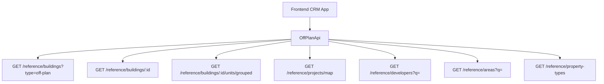

## Overview

Add an **Off-Plan** tab under the **Real Estate** section of the main CRM sidebar. This page displays all published buildings from developer portal users in a card grid view with rich filters, 2GIS map integration, and a detailed building view.

<Note>
**Minimal backend changes required.** Most API endpoints already exist under `/reference/buildings`, `/reference/projects`, and `/reference/units`. The frontend consumes these with the `?type=off-plan` filter parameter.
</Note>

The only backend addition needed is a `maxPreHandoverPercent` query parameter on the buildings search endpoint to support the payment plan filter.

## Architecture Decision

### Buildings vs Projects as Primary Entity

Based on the existing data model, **buildings** are the primary enrichment entity:

- Buildings have their own `isPublished`, `priceFrom`, `coverImageUrl`, `status`, `completionDate`, `tags`, `paymentPlans`, `gallery`, `documents`, `amenities`
- Buildings can override inherited fields from projects (status, area, community, description)
- The off-plan directory displays **published buildings**, since a project may contain multiple buildings with different statuses and pricing

<Info>
The list page queries `GET /reference/buildings?type=off-plan`, and the detail page queries `GET /reference/buildings/:id`.
</Info>

### Data Flow



## Implementation Steps

<Steps>

<Step title="Update Sidebar Navigation">
Replace the existing Real Estate sidebar entries with a single Off-Plan entry.

**File: `src/components/layouts/CRMLayout.tsx`**

Replace the entire `data.realEstate` array:

```typescript
realEstate: [
  {
    title: 'Off-Plan',
    url: '/home/real-estate/off-plan',
    icon: Building2,  // from lucide-react (already imported)
  },
],
```

<Warning>
Remove the old sidebar entries for Areas, Developments, and Units. The off-plan directory supersedes them.
</Warning>
</Step>

<Step title="Create Route Structure">
Set up the route hierarchy for the off-plan directory:

```
src/app/home/real-estate/off-plan/
├── page.tsx                    # List page (grid + map toggle)
└── [id]/
    └── page.tsx                # Building detail page
```

Both pages follow the component extraction guide — page files contain ONLY the page function (< 200 lines).
</Step>

<Step title="Build Component Structure">
Create the component architecture for the off-plan module:

```
src/components/pages/off-plan/
├── index.ts                           # Barrel export
│
│   ── List Page Components ──
├── off-plan-building-card.tsx          # Building card for grid view
├── off-plan-filters.tsx               # Horizontal filter bar
├── off-plan-map-view.tsx              # 2GIS map with markers + popover
├── off-plan-grid-view.tsx             # Grid of building cards + pagination
├── off-plan-toolbar.tsx               # View toggle (Grid/Map), sort, saved filters
│
│   ── Detail Page Components ──
├── building-detail-header.tsx          # Sticky sidebar with key info
├── building-detail-description.tsx     # Description section with Read More
├── building-detail-units.tsx           # Units & Availability grouped by bedrooms
├── building-detail-unit-modal.tsx      # Unit detail popup
├── building-detail-gallery.tsx         # Gallery grid with lightbox
├── building-detail-amenities.tsx       # Features/Amenities image grid
├── building-detail-location.tsx        # Location section with 2GIS map
├── building-detail-info-table.tsx      # Details table
├── building-detail-payment-plan.tsx    # Payment plan visualization
├── building-detail-documents.tsx       # Documents & links
├── building-detail-developer.tsx       # Developer info card
```
</Step>

<Step title="Implement API Layer">
Create the off-plan API service that wraps existing reference endpoints.

**File: `src/services/api/off-plan.api.ts`**

```typescript
export interface OffPlanBuildingFilters {
  q?: string;
  status?: string;
  areaId?: number;
  communityId?: number;
  developerId?: number;
  propertyTypeId?: number;
  propertySubTypeId?: number;
  minPrice?: number;
  maxPrice?: number;
  bedrooms?: string;
  completionBefore?: string;
  completionAfter?: string;
  maxPreHandoverPercent?: number;
  page?: number;
  limit?: number;
  sortBy?: string;
  sortOrder?: 'asc' | 'desc';
}

export class OffPlanApi {
  static async searchBuildings(filters: OffPlanBuildingFilters) {
    return apiClient.get('/reference/buildings', {
      params: { ...filters, type: 'off-plan' },
    });
  }

  static async getBuildingDetail(id: number) {
    return apiClient.get(`/reference/buildings/${id}`);
  }

  static async getBuildingUnitsGrouped(buildingId: number) {
    return apiClient.get(`/reference/buildings/${buildingId}/units/grouped`);
  }

  static async getMapMarkers(filters?: MapMarkerFilters) {
    return apiClient.get('/reference/projects/map', { params: filters });
  }

  static async searchDevelopers(q?: string) {
    return apiClient.get('/reference/developers', { params: { q } });
  }

  static async searchAreas(q?: string, cityId?: number) {
    return apiClient.get('/reference/areas', { params: { q, cityId } });
  }

  static async getPropertyTypes() {
    return apiClient.get('/reference/property-types');
  }
}
```
</Step>

<Step title="Add Response Types">
Define shared response types in `src/services/api/types.ts`:

```typescript
export interface RefBuildingDto {
  id: number;
  name?: string;
  buildingNumber?: string;
  projectId?: number;
  projectName?: string;
  developerName?: string;
  developerId?: number;
  areaName?: string;
  areaId?: number;
  communityName?: string;
  communityId?: number;
  status?: string;
  percentCompleted?: number;
  latitude?: number;
  longitude?: number;
  priceFrom?: number;
  currency?: string;
  coverImageUrl?: string;
  completionDate?: string;
  unitCount?: number;
  isBranded?: boolean;
  isFurnished?: boolean;
  tags?: string[];
  isPublished?: boolean;
  gallery?: RefGalleryImageDto[];
  paymentPlans?: RefPaymentPlanDto[];
  documents?: RefDocumentDto[];
  amenities?: RefAmenityDto[];
  units?: RefUnitDto[];
  developerContact?: DeveloperContactDto;
}

export interface RefUnitDto {
  id: number;
  unitNumber?: string;
  floor?: string;
  rooms?: number;
  actualArea?: number;
  price?: number;
  pricePerSqft?: number;
  availabilityStatus?: string;
  floorPlanUrl?: string;
  isFurnished?: boolean;
  bedroomCategory?: string;
  bedroomsCount?: number;
  bathroomsCount?: number;
  buildingId?: number;
  projectName?: string;
  propertySubTypeName?: string;
}
```
</Step>

<Step title="Set up Query Keys">
Add query key patterns in `src/lib/query-keys.ts`:

```typescript
offPlan: {
  all: ['off-plan'] as const,
  buildings: {
    all: ['off-plan', 'buildings'] as const,
    list: (filters: OffPlanBuildingFilters) => 
      ['off-plan', 'buildings', 'list', filters] as const,
    detail: (id: number) => 
      ['off-plan', 'buildings', 'detail', id] as const,
    units: (buildingId: number) => 
      ['off-plan', 'buildings', 'units', buildingId] as const,
  },
  map: {
    markers: (filters?: MapMarkerFilters) => 
      ['off-plan', 'map', 'markers', filters] as const,
  },
  filters: {
    developers: (q?: string) => 
      ['off-plan', 'filters', 'developers', q] as const,
    areas: (q?: string, cityId?: number) => 
      ['off-plan', 'filters', 'areas', q, cityId] as const,
    propertyTypes: () => 
      ['off-plan', 'filters', 'property-types'] as const,
  },
},
```
</Step>

</Steps>

## Key Features

### List Page Features

<CardGroup cols={2}>
<Card title="Grid View" icon="grid">
Card-based layout with building cover images, status badges, pricing, and key details
</Card>

<Card title="Map View" icon="map">
Split layout with 2GIS interactive map and synchronized building markers
</Card>

<Card title="Advanced Filters" icon="filter">
Horizontal filter bar with search, developer, price, payments, handover, unit type, bedrooms, and status
</Card>

<Card title="View Controls" icon="toggle-on">
Grid/Map toggle, sorting options, and saved filter presets
</Card>
</CardGroup>

### Detail Page Features

<Tabs>
<Tab title="Building Overview">
- Sticky sidebar with pricing, units count, payment plans, and developer info
- Comprehensive building description with expandable content
- Key building statistics and completion timeline
</Tab>

<Tab title="Units & Availability">
- Units grouped by bedroom categories (Studio, 1BR, 2BR, etc.)
- Interactive unit cards with floor plans and pricing
- Availability status and unit comparison features
</Tab>

<Tab title="Visual Content">
- Image gallery with lightbox functionality
- Amenities showcase with categorized images
- Location integration with 2GIS mapping
</Tab>

<Tab title="Documentation">
- Payment plan visualization with progress indicators
- Downloadable documents and brochures
- Developer contact information and communication tools
</Tab>
</Tabs>

## Visual Design Patterns

The implementation replicates key visual patterns from the reference screenshots:

<AccordionGroup>
<Accordion title="Building Cards">
- Cover image with overlay status badges (EOI, On Sale, Announced)
- Handover quarter display
- Building name and location hierarchy
- Price from with payment plan ratios
- Developer branding integration
</Accordion>

<Accordion title="Filter Interface">
- Horizontal pill-style filters
- Multi-select capability with clear indicators
- Real-time result counting
- Saved filter presets for quick access
</Accordion>

<Accordion title="Map Integration">
- 2GIS embedded mapping with custom markers
- Building popover previews on marker hover
- Synchronized filtering between list and map views
- Location-based search radius controls
</Accordion>

<Accordion title="Detail Layout">
- Right-sticky sidebar with key actions
- Left scrollable content with organized sections
- Tabbed unit availability with bedroom groupings
- Rich media galleries with category organization
</Accordion>
</AccordionGroup>

## Backend Integration

<Note>
The implementation primarily uses existing backend endpoints with minimal additions.
</Note>

### Required Backend Addition

Add support for the `maxPreHandoverPercent` query parameter to the buildings search endpoint:

```http
GET /reference/buildings?type=off-plan&maxPreHandoverPercent=30
```

This enables filtering buildings by payment plan structure, showing only properties with pre-handover payments below the specified percentage.

### Existing Endpoints Used

- `GET /reference/buildings` - Building search and listing
- `GET /reference/buildings/:id` - Building detail with enrichment
- `GET /reference/buildings/:id/units/grouped` - Units grouped by bedrooms
- `GET /reference/projects/map` - Map markers and coordinates
- `GET /reference/developers` - Developer filter options
- `GET /reference/areas` - Area and location filters
- `GET /reference/property-types` - Unit type classifications

## Error Handling

<Warning>
Implement comprehensive error handling for all API interactions, including network failures, data validation errors, and empty state management.
</Warning>

Key error scenarios to handle:

- Building not found or unpublished
- Map service unavailability
- Filter option loading failures
- Image gallery loading errors
- Unit availability data inconsistencies