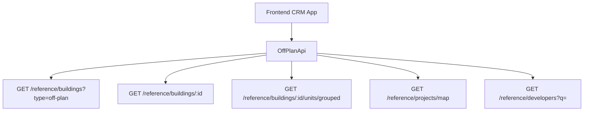

# Off-Plan Directory Implementation

This document provides a comprehensive implementation specification for adding an Off-Plan Directory feature to the CRM system. The feature displays published buildings from developer portal users in a card grid view with rich filters, 2GIS map integration, and detailed building views.

<Note>
Minimal backend changes are required. Most API endpoints already exist under `/reference/buildings`, `/reference/projects`, and `/reference/units`. The frontend consumes these with the `?type=off-plan` filter parameter.
</Note>

## Overview

The Off-Plan Directory adds a new **Off-Plan** tab under the **Real Estate** section of the main CRM sidebar. This feature provides:

- Card grid view of published buildings
- Interactive 2GIS map integration
- Rich filtering capabilities
- Detailed building view with comprehensive information

### Key Features

- **List View**: Grid of building cards with cover images, status badges, pricing, and payment plans
- **Map View**: Split layout with scrollable cards and interactive map with project markers
- **Filter Bar**: Horizontal filter pills for search, developer, price, payments, handover, unit type, bedrooms, and status
- **Detail Page**: Comprehensive building information with sticky sidebar and scrollable content sections

## Architecture Decision

### Buildings vs Projects as Primary Entity

<Info>
Buildings are chosen as the primary enrichment entity because they have their own `isPublished`, `priceFrom`, `coverImageUrl`, `status`, `completionDate`, and other essential fields.
</Info>

Buildings can override inherited fields from projects and provide the granular control needed for off-plan listings. The off-plan directory displays **published buildings** since a project may contain multiple buildings with different statuses and pricing.

### Data Flow



## Implementation Steps

<Steps>
<Step title="Update Sidebar Navigation">
Replace the existing Real Estate navigation items with a single Off-Plan entry in the CRM sidebar.
</Step>

<Step title="Create Route Structure">
Set up the page routes for the list and detail views under the off-plan directory.
</Step>

<Step title="Build Component Architecture">
Create the component structure for both list and detail page functionalities.
</Step>

<Step title="Implement API Layer">
Create the API service layer that wraps existing reference data endpoints.
</Step>

<Step title="Add Query Management">
Set up React Query keys and hooks for data fetching and caching.
</Step>
</Steps>

## 1. Sidebar Navigation

### File: `src/components/layouts/CRMLayout.tsx`

Replace the entire `data.realEstate` array with a single "Off-Plan" entry:

```typescript
realEstate: [
  {
    title: 'Off-Plan',
    url: '/home/real-estate/off-plan',
    icon: Building2,  // from lucide-react
  },
],
```

<Warning>
Remove the old sidebar entries for Areas, Developments, and Units as the off-plan directory supersedes them.
</Warning>

### Breadcrumb Structure

Replace all existing real-estate breadcrumb handling with off-plan routes:

- `Real Estate > Off-Plan` (list page)
- `Real Estate > Off-Plan > {Building Name}` (detail page)

## 2. Route Structure

```
src/app/home/real-estate/off-plan/
├── page.tsx                    # List page (grid + map toggle)
└── [id]/
    └── page.tsx                # Building detail page
```

<Tip>
Both pages follow the component extraction guide — page files contain ONLY the page function (< 200 lines).
</Tip>

## 3. Component Structure

<Tabs>
<Tab title="List Page Components">
```
src/components/pages/off-plan/
├── off-plan-building-card.tsx          # Building card for grid view
├── off-plan-filters.tsx               # Horizontal filter bar
├── off-plan-map-view.tsx              # 2GIS map with markers
├── off-plan-grid-view.tsx             # Grid of building cards
├── off-plan-toolbar.tsx               # View toggle and controls
```
</Tab>

<Tab title="Detail Page Components">
```
src/components/pages/off-plan/
├── building-detail-header.tsx          # Sticky sidebar info
├── building-detail-description.tsx     # Description with Read More
├── building-detail-units.tsx           # Units grouped by bedrooms
├── building-detail-gallery.tsx         # Gallery with lightbox
├── building-detail-amenities.tsx       # Features/Amenities grid
├── building-detail-location.tsx        # Location with 2GIS map
├── building-detail-payment-plan.tsx    # Payment plan visualization
├── building-detail-documents.tsx       # PDF documents
├── building-detail-developer.tsx       # Developer info card
```
</Tab>
</Tabs>

## 4. API Layer

### New File: `src/services/api/off-plan.api.ts`

This API file wraps the existing reference data endpoints with off-plan-specific defaults:

```typescript
export interface OffPlanBuildingFilters {
  q?: string;
  status?: string;
  areaId?: number;
  communityId?: number;
  developerId?: number;
  propertyTypeId?: number;
  propertySubTypeId?: number;
  minPrice?: number;
  maxPrice?: number;
  bedrooms?: string;
  completionBefore?: string;
  completionAfter?: string;
  maxPreHandoverPercent?: number;
  page?: number;
  limit?: number;
  sortBy?: string;
  sortOrder?: 'asc' | 'desc';
}

export class OffPlanApi {
  /** Search published off-plan buildings */
  static async searchBuildings(filters: OffPlanBuildingFilters) {
    return apiClient.get('/reference/buildings', {
      params: { ...filters, type: 'off-plan' },
    });
  }

  /** Get building detail with all enrichment */
  static async getBuildingDetail(id: number) {
    return apiClient.get(`/reference/buildings/${id}`);
  }

  /** Get units grouped by bedroom category */
  static async getBuildingUnitsGrouped(buildingId: number) {
    return apiClient.get(`/reference/buildings/${buildingId}/units/grouped`);
  }

  /** Get map markers for project locations */
  static async getMapMarkers(filters?: MapMarkerFilters) {
    return apiClient.get('/reference/projects/map', { params: filters });
  }
}
```

## 5. Response Types

Add reference data response types in `src/services/api/types.ts`:

<CodeGroup>
```typescript Building DTO
export interface RefBuildingDto {
  id: number;
  name?: string;
  buildingNumber?: string;
  floors?: string;
  rooms?: string;
  projectId?: number;
  projectName?: string;
  developerName?: string;
  developerId?: number;
  areaName?: string;
  areaId?: number;
  communityName?: string;
  communityId?: number;
  status?: string;
  percentCompleted?: number;
  startDate?: string;
  endDate?: string;
  descriptionEn?: string;
  latitude?: number;
  longitude?: number;
  priceFrom?: number;
  currency?: string;
  coverImageUrl?: string;
  completionDate?: string;
  unitCount?: number;
  isBranded?: boolean;
  isFurnished?: boolean;
  serviceChargePerSqft?: number;
  tags?: string[];
  isPublished?: boolean;
  gallery?: RefGalleryImageDto[];
  paymentPlans?: RefPaymentPlanDto[];
  documents?: RefDocumentDto[];
  amenities?: RefAmenityDto[];
  units?: RefUnitDto[];
  developerContact?: DeveloperContactDto;
}
```

```typescript Unit DTO
export interface RefUnitDto {
  id: number;
  unitNumber?: string;
  floor?: string;
  rooms?: number;
  actualArea?: number;
  actualCommonArea?: number;
  balconyArea?: number;
  price?: number;
  pricePerSqft?: number;
  availabilityStatus?: string;
  floorPlanUrl?: string;
  isFurnished?: boolean;
  bedroomCategory?: string;
  bedroomsCount?: number;
  bathroomsCount?: number;
  buildingId?: number;
  buildingName?: string;
  projectId?: number;
  projectName?: string;
  propertySubTypeName?: string;
}
```

```typescript Payment Plan DTO
export interface RefPaymentPlanDto {
  id: number;
  title?: string;
  onBookingPercentage?: number;
  constructionPercentage?: number;
  handoverPercentage?: number;
  postHandoverPercentage?: number;
}
```
</CodeGroup>

## 6. Query Keys

Add a new `offPlan` section in `src/lib/query-keys.ts`:

```typescript
offPlan: {
  all: ['off-plan'] as const,
  buildings: {
    all: ['off-plan', 'buildings'] as const,
    search: (filters: OffPlanBuildingFilters) => 
      ['off-plan', 'buildings', 'search', filters] as const,
    detail: (id: number) => 
      ['off-plan', 'buildings', 'detail', id] as const,
    units: (buildingId: number) => 
      ['off-plan', 'buildings', 'units', buildingId] as const,
  },
  map: {
    all: ['off-plan', 'map'] as const,
    markers: (filters: MapMarkerFilters) => 
      ['off-plan', 'map', 'markers', filters] as const,
  },
}
```

## 7. Hooks Implementation

Create React Query hooks in `src/hooks/use-off-plan.ts`:

```typescript
export const useOffPlanBuildings = (filters: OffPlanBuildingFilters) => {
  return useQuery({
    queryKey: queryKeys.offPlan.buildings.search(filters),
    queryFn: () => OffPlanApi.searchBuildings(filters),
    keepPreviousData: true,
  });
};

export const useBuildingDetail = (id: number) => {
  return useQuery({
    queryKey: queryKeys.offPlan.buildings.detail(id),
    queryFn: () => OffPlanApi.getBuildingDetail(id),
    enabled: !!id,
  });
};

export const useBuildingUnits = (buildingId: number) => {
  return useQuery({
    queryKey: queryKeys.offPlan.buildings.units(buildingId),
    queryFn: () => OffPlanApi.getBuildingUnitsGrouped(buildingId),
    enabled: !!buildingId,
  });
};
```

## 8. Filter Components

### Horizontal Filter Bar

The filter bar contains these filter types:

<CardGroup cols={2}>
<Card title="Text Filters">
- Search (building/project name)
- Developer dropdown with search
</Card>

<Card title="Range Filters">
- Price range slider
- Handover date range
</Card>

<Card title="Category Filters">
- Unit type (Property Sub Type)
- Bedroom count
- Project status
</Card>

<Card title="Advanced Filters">
- Payment plan (max pre-handover %)
- Area/Community selection
</Card>
</CardGroup>

## 9. Map Integration

### 2GIS Map View

<Info>
The map view uses a split layout with scrollable building cards on the left and an interactive 2GIS map on the right showing project markers.
</Info>

Key features:
- Project markers with hover popovers
- Marker clustering for dense areas
- Sync between card selection and map markers
- Custom marker styles based on project status

## 10. Detail Page Layout

The building detail page uses a sticky sidebar layout:

<Tabs>
<Tab title="Sticky Sidebar Content">
- Building name and status badge
- Price from and currency
- Unit count summary
- Payment plan summary
- Developer information
- Contact CTA buttons
</Tab>

<Tab title="Main Content Sections">
- Description with Read More
- Units & Availability (grouped by bedrooms)
- Image Gallery with categories
- Features & Amenities grid
- Location with embedded map
- General building information table
- Payment plan visualization
- Documents & links
- Developer profile
</Tab>
</Tabs>

## Backend Requirements

<Note>
The only new backend requirement is adding a `maxPreHandoverPercent` query parameter to the buildings search endpoint for payment plan filtering.
</Note>

### Required Backend Changes

1. **Payment Plan Filter**: Add `maxPreHandoverPercent` parameter to `/reference/buildings` endpoint
2. **Building Enrichment**: Ensure all building detail fields are properly populated
3. **Units Grouping**: Implement `/reference/buildings/:id/units/grouped` endpoint for bedroom-based unit grouping

### Existing Endpoints Used

- `GET /reference/buildings?type=off-plan` - Building search
- `GET /reference/buildings/:id` - Building detail
- `GET /reference/projects/map` - Map markers
- `GET /reference/developers` - Developer filter options
- `GET /reference/areas` - Area filter options
- `GET /reference/property-types` - Unit type filters

<Check>
All other required endpoints already exist and return the necessary data for the off-plan directory implementation.
</Check>