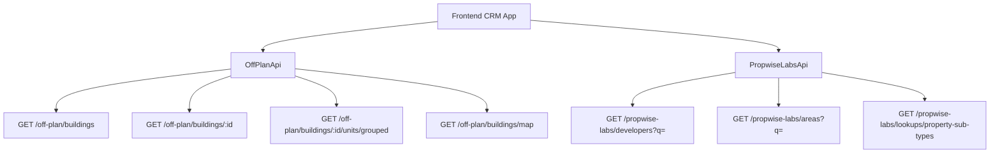

## Overview

The Off-Plan Directory adds a new **Off-Plan** tab under the **Properties** section of the main CRM sidebar. This feature displays all published buildings from developer portal users in a card/map split view with rich filters, 2GIS map integration, and detailed building views.

<Note>
Off-plan data is served through domain endpoints under `/off-plan/*`. These endpoints read Propwise Labs catalog data and apply CRM-owned visibility from `off_plan_building_publication` plus the off-plan lifecycle helper, so main CRM users only receive buildings with `is_published=true` that still classify as off-plan.
</Note>

## Architecture Decision

### Buildings vs Projects as Primary Entity

Based on the existing data model, **buildings** are the primary enrichment entity:

- Buildings have their own `coverImageUrl`, `status`, `endDate`, `completionDate`, `paymentPlans`, `images`, `documents`, `amenities`
- Buildings can override inherited fields from projects (status, area, community, description)
- The off-plan directory displays **published buildings** based on CRM `is_published` visibility

<Info>
Publication is separate from Propwise Labs `building.status`. Developers publish or unpublish a building through the developer portal, which writes `off_plan_building_publication.is_published` for the Propwise Labs `building_id`.
</Info>

### Frontend Status Mapping

Frontend display status is derived from `building.status` through `getOffPlanFrontendStatus()`:

| Backend `building.status` | Frontend Status | Color  |
|---------------------------|-----------------|--------|
| `ACTIVE`                  | On Sale         | Orange |
| `PENDING`                 | EOI             | Purple |
| `FINISHED`                | Out of Stock    | Gray   |

### Data Flow



## Navigation Updates

### Sidebar Configuration

<Steps>
<Step title="Update CRM Layout">
Replace the entire `data.realEstate` array in `src/components/layouts/CRMLayout.tsx`:

```typescript
realEstate: [
  {
    title: 'Off-Plan',
    url: '/home/properties/off-plan',
    icon: Building2,  // from lucide-react
  },
],
```
</Step>

<Step title="Remove Legacy Entries">
Remove the old sidebar entries for Areas, Developments, and Units.
</Step>

<Step title="Update Breadcrumbs">
Replace all existing real-estate breadcrumb handling with off-plan routes:

```
Properties > Off-Plan                           (list page)
Properties > Off-Plan > {Building Name}         (detail page)
```
</Step>
</Steps>

## Route Structure

```
src/app/home/properties/off-plan/
├── page.tsx                    # List page (grid + map toggle)
└── [id]/
    └── page.tsx                # Building detail page
```

<Warning>
Both pages follow the component extraction guide — page files contain ONLY the page function (< 200 lines).
</Warning>

## Component Architecture

### List Page Components

<AccordionGroup>
<Accordion title="Core Components">
```
src/components/pages/off-plan/
├── index.ts                           # Barrel export
├── off-plan-building-card.tsx          # Building card for grid view
├── off-plan-filters.tsx               # Horizontal filter bar
├── off-plan-map-view.tsx              # 2GIS map with markers + popover
├── off-plan-grid-view.tsx             # Scrollable grid of building cards
├── off-plan-building-detail-panel.tsx  # Animated detail panel
├── off-plan-toolbar.tsx               # View toggle, sort, saved filters
```
</Accordion>

<Accordion title="Detail Page Components">
```
├── building-detail-header.tsx          # Sticky sidebar with key info
├── building-detail-description.tsx     # Description with Read More
├── building-detail-units.tsx           # Units grouped by bedrooms
├── building-detail-unit-modal.tsx      # Unit detail popup
├── building-detail-images.tsx          # Image grid with lightbox
├── building-detail-amenities.tsx       # Features/Amenities grid
├── building-detail-location.tsx        # Location with 2GIS map
├── building-detail-info-table.tsx      # Details table
├── building-detail-payment-plan.tsx    # Payment plan visualization
├── building-detail-documents.tsx       # Documents & links
├── building-detail-developer.tsx       # Developer info card
```
</Accordion>
</AccordionGroup>

## API Implementation

### Off-Plan API Service

Create a new file: `src/services/api/off-plan.api.ts`

<CodeGroup>

```typescript Filter Types
export interface OffPlanBuildingFilters {
  q?: string;
  status?: string;
  areaId?: number;
  communityId?: number;
  developerId?: number; // Legacy single developer filter
  developerIds?: number[]; // Multi-select developer filter
  propertyTypeId?: number;
  propertySubTypeId?: number;
  priceMode?: 'unit' | 'sqft'; // UI-only basis for price controls
  minPrice?: number;
  maxPrice?: number;
  bedrooms?: string; // e.g., "1", "2", "3", "studio"
  completionBefore?: string; // Handover quarter filter
  completionAfter?: string; 
  maxPreHandoverPercent?: number; // Payment plan filter
  page?: number;
  limit?: number;
  sortBy?: string;
  sortOrder?: 'asc' | 'desc';
}

export interface MapMarkerFilters {
  q?: string;
  status?: string;
  projectId?: number;
  areaId?: number;
  communityId?: number;
  developerId?: number;
  developerIds?: number[];
  propertySubTypeId?: number;
  minPrice?: number;
  maxPrice?: number;
  completionBefore?: string;
  completionAfter?: string;
}
```

```typescript API Class
export class OffPlanApi {
  /** Search Propwise Labs buildings */
  static async searchBuildings(filters: OffPlanBuildingFilters) {
    return apiClient.get('/off-plan/buildings', { 
      params: supportedBuildingParams(filters) 
    });
  }

  /** Get building detail with all enrichment */
  static async getBuildingDetail(id: number) {
    return apiClient.get(`/off-plan/buildings/${id}`);
  }

  /** Get units grouped by bedroom category */
  static async getBuildingUnitsGrouped(buildingId: number) {
    return apiClient.get(`/off-plan/buildings/${buildingId}/units/grouped`);
  }

  /** Get single unit detail */
  static async getUnitDetail(unitId: number) {
    return apiClient.get(`/propwise-labs/units/${unitId}`);
  }

  /** Get map markers (lightweight building data) */
  static async getMapMarkers(filters?: MapMarkerFilters) {
    return apiClient.get('/off-plan/buildings/map', { 
      params: supportedMapParams(filters) 
    });
  }

  /** Search developers for multi-select filter */
  static async searchDevelopers(q?: string) {
    return apiClient.get('/propwise-labs/developers', { params: { q } });
  }

  /** Search areas for filter dropdown */
  static async searchAreas(q?: string, cityId?: number) {
    return apiClient.get('/propwise-labs/areas', { params: { q, cityId } });
  }

  /** Get property subtypes for unit type filter */
  static async getPropertySubTypes() {
    return apiClient.get('/propwise-labs/lookups/property-sub-types');
  }
}
```

</CodeGroup>

### Response Types

<Tabs>
<Tab title="Propwise Labs Types">
```typescript
// src/services/api/propwise-labs.api.ts
// Raw catalog response shapes
export interface PropwiseLabsBuilding { 
  id: number;
  name: string;
  status: string;
  coverImageUrl?: string;
  // ... other fields
}

export interface PropwiseLabsUnit { 
  id: number;
  buildingId: number;
  bedrooms: number;
  // ... other fields
}

export interface PropwiseLabsUnitGroup {
  bedrooms: string;
  units: PropwiseLabsUnit[];
  minPrice: number;
  maxPrice: number;
}
```
</Tab>

<Tab title="Off-Plan Types">
```typescript
// src/services/api/off-plan.api.ts
// Off-plan types extend raw Propwise Labs shapes
export interface OffPlanBuilding extends PropwiseLabsBuilding {
  frontendStatus: 'On Sale' | 'EOI' | 'Out of Stock';
  isPublished: boolean;
  // Additional off-plan specific fields
}

export interface OffPlanMapMarker {
  id: number;
  name: string;
  latitude: number;
  longitude: number;
  frontendStatus: string;
  coverImageUrl?: string;
  minPrice?: number;
  developer: {
    id: number;
    name: string;
    logoUrl?: string;
  };
}
```
</Tab>
</Tabs>

## Key Features

### Map Integration

<CardGroup cols={2}>
<Card title="2GIS Integration" icon="map">
Interactive map with custom circular developer-logo markers and hover popover previews
</Card>
<Card title="Marker Interaction" icon="mouse-pointer">
Marker hover scrolls the left card list to matching building and highlights card with status color
</Card>
</CardGroup>

### Filter System

The filter bar includes:
- **Search input**: Leads-style compact search
- **Quick filters**: Developer, Price, Payments, Handover, Unit type, Bedrooms, Status
- **Advanced filters**: Accessible through Filters popover

<Tip>
All filters support real-time updates with debounced search and URL state management for shareable links.
</Tip>

### Building Detail Page

<Steps>
<Step title="Layout Structure">
Right-sticky sidebar with key information plus scrollable left content area
</Step>

<Step title="Content Sections">
- Description with Read More functionality
- Units & Availability grouped by bedrooms
- Parking information
- Image gallery with lightbox
- Features/Amenities grid
- Location with embedded 2GIS map
- General plan and floor plans
- Detailed specifications table
- Payment plan visualization
- Documents & links (PDF cards)
- Developer information card
</Step>

<Step title="Interactive Elements">
- Unit detail modals with floor plans and specifications
- Image lightbox for galleries
- Expandable payment plan breakdown
- Downloadable documents and brochures
</Step>
</Steps>

## Data Models

### Publication Management

<Note>
The `off_plan_building_publication` table manages visibility:
- `building_id`: Foreign key to Propwise Labs building
- `is_published`: Boolean visibility flag
- `published_at`: Timestamp when published
- `published_by_id`: User who published
- `unpublished_at`: Timestamp when unpublished (for audit)
- `unpublished_by_id`: User who unpublished (for audit)
</Note>

### Lifecycle Management

Off-plan lifecycle helper treats:
- `ACTIVE` and `PENDING` as off-plan statuses
- `FINISHED` as out of stock but still off-plan
- `UNKNOWN` remains secondary-eligible only (excluded from off-plan)

<Warning>
The `/off-plan/*` endpoints always enforce the off-plan lifecycle in code. Callers do not pass a `type` query parameter.
</Warning>

## Implementation Checklist

<Check>Update sidebar navigation in CRMLayout.tsx</Check>
<Check>Create route structure for list and detail pages</Check>
<Check>Implement Off-Plan API service</Check>
<Check>Build component architecture for list page</Check>
<Check>Build component architecture for detail page</Check>
<Check>Integrate 2GIS map with custom markers</Check>
<Check>Implement filter system with URL state</Check>
<Check>Add infinite scroll for building cards</Check>
<Check>Create animated detail panel for map mode</Check>
<Check>Build unit detail modals with floor plans</Check>
<Check>Implement payment plan visualization</Check>
<Check>Add document management and downloads</Check>
<Check>Integrate developer information display</Check>
<Check>Add responsive design for mobile/tablet</Check>
<Check>Implement error handling and loading states</Check>