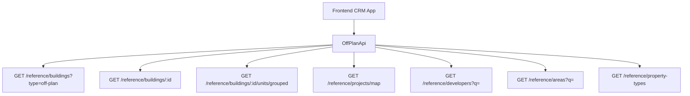

## Overview

Add an **Off-Plan** tab under the **Real Estate** section of the main CRM sidebar. This page displays all published buildings from developer portal users in a card grid view with rich filters, 2GIS map integration, and a detailed building view.

<Note>
Minimal backend changes required. Most API endpoints already exist under `/reference/buildings`, `/reference/projects`, and `/reference/units`. The frontend consumes these with the `?type=off-plan` filter parameter.
</Note>

The only backend addition is a `maxPreHandoverPercent` query parameter on the buildings search endpoint to support the payment plan filter.

## Reference Screenshots

The provided screenshots show the target design from a competitor platform. Key visual patterns to replicate:

<CardGroup cols={2}>
  <Card title="List Page (Grid View)" icon="grid">
    Cards with cover image, status badges (EOI, On Sale, Announced), handover quarter, building name, area + developer, price from, and payment plan ratio
  </Card>
  <Card title="List Page (Map View)" icon="map">
    Split layout — scrollable card list on left, 2GIS interactive map on right with project markers and popover previews
  </Card>
  <Card title="Filters Bar" icon="filter">
    Horizontal filter pills — Search, Developer, Price, Payments, Handover, Unit type, Bedrooms, Status
  </Card>
  <Card title="Building Detail Page" icon="building">
    Right-sticky sidebar with key info + scrollable left content area
  </Card>
</CardGroup>

## Architecture Decision

### Buildings vs Projects as Primary Entity

Based on the existing data model, **buildings** are the primary enrichment entity:

<Check>
- Buildings have their own `isPublished`, `priceFrom`, `coverImageUrl`, `status`, `completionDate`, `tags`, `paymentPlans`, `gallery`, `documents`, `amenities`
- Buildings can override inherited fields from projects (status, area, community, description)
- The off-plan directory should display **published buildings**, since a project may contain multiple buildings with different statuses and pricing
</Check>

The list page queries `GET /reference/buildings?type=off-plan`, and the detail page queries `GET /reference/buildings/:id`.

### Data Flow



## Sidebar Navigation

### File: `src/components/layouts/CRMLayout.tsx`

**Replace** the entire `data.realEstate` array with a single "Off-Plan" entry. The existing Areas, Developments, and Units tabs are removed — the off-plan directory supersedes them.

```typescript
realEstate: [
  {
    title: 'Off-Plan',
    url: '/home/real-estate/off-plan',
    icon: Building2,  // from lucide-react (already imported)
  },
],
```

<Warning>
Remove the old sidebar entries for Areas, Developments, and Units.
</Warning>

### Breadcrumb

**Replace** all existing real-estate breadcrumb handling (areas, developments, units) with off-plan routes:

```
Real Estate > Off-Plan                           (list page)
Real Estate > Off-Plan > {Building Name}         (detail page)
```

Remove the breadcrumb entries for `/real-estate/areas`, `/real-estate/developments`, `/real-estate/units`, and `/real-estate/prospects`.

## Route Structure

```
src/app/home/real-estate/off-plan/
├── page.tsx                    # List page (grid + map toggle)
└── [id]/
    └── page.tsx                # Building detail page
```

<Info>
Both pages follow the component extraction guide — page files contain ONLY the page function (< 200 lines).
</Info>

## Component Structure

```
src/components/pages/off-plan/
├── index.ts                           # Barrel export
│
│   ── List Page Components ──
├── off-plan-building-card.tsx          # Building card for grid view
├── off-plan-filters.tsx               # Horizontal filter bar
├── off-plan-map-view.tsx              # 2GIS map with markers + popover
├── off-plan-grid-view.tsx             # Grid of building cards + pagination
├── off-plan-toolbar.tsx               # View toggle (Grid/Map), sort, saved filters
│
│   ── Detail Page Components ──
├── building-detail-header.tsx          # Sticky sidebar
├── building-detail-description.tsx     # Description section with Read More
├── building-detail-units.tsx           # Units & Availability (accordion)
├── building-detail-unit-modal.tsx      # Unit detail popup
├── building-detail-gallery.tsx         # Gallery grid with lightbox
├── building-detail-amenities.tsx       # Features/Amenities image grid
├── building-detail-location.tsx        # Location section with 2GIS map
├── building-detail-info-table.tsx      # Details table
├── building-detail-payment-plan.tsx    # Payment plan visualization
├── building-detail-documents.tsx       # Documents & links (PDF cards)
├── building-detail-developer.tsx       # Developer info card
```

## API Layer

### New File: `src/services/api/off-plan.api.ts`

This API file wraps the existing reference data endpoints with off-plan-specific defaults.

<CodeGroup>

```typescript Filter Types
// ── Filter/Query Types (module-specific, stay in this file) ──

export interface OffPlanBuildingFilters {
  q?: string;
  status?: string;
  areaId?: number;
  communityId?: number;
  developerId?: number; // Filter by developer (joined through project→developer)
  propertyTypeId?: number;
  propertySubTypeId?: number;
  minPrice?: number;
  maxPrice?: number;
  bedrooms?: string; // e.g., "1", "2", "3", "studio"
  completionBefore?: string; // ISO date — handover filter
  completionAfter?: string; // ISO date — handover filter
  maxPreHandoverPercent?: number; // Payment plan filter (backend filter)
  page?: number;
  limit?: number;
  sortBy?: string;
  sortOrder?: 'asc' | 'desc';
}

export interface MapMarkerFilters {
  type?: string;
  areaId?: number;
  developerId?: number;
  minPrice?: number;
  maxPrice?: number;
}
```

```typescript API Class
// ── API Class ──

export class OffPlanApi {
  /** Search published off-plan buildings */
  static async searchBuildings(filters: OffPlanBuildingFilters) {
    return apiClient.get('/reference/buildings', {
      params: { ...filters, type: 'off-plan' },
    });
  }

  /** Get building detail with all enrichment */
  static async getBuildingDetail(id: number) {
    return apiClient.get(`/reference/buildings/${id}`);
  }

  /** Get units grouped by bedroom category */
  static async getBuildingUnitsGrouped(buildingId: number) {
    return apiClient.get(`/reference/buildings/${buildingId}/units/grouped`);
  }

  /** Get single unit detail */
  static async getUnitDetail(unitId: number) {
    return apiClient.get(`/reference/units/${unitId}`);
  }

  /** Get map markers (lightweight project data with coordinates) */
  static async getMapMarkers(filters?: MapMarkerFilters) {
    return apiClient.get('/reference/projects/map', { params: filters });
  }

  /** Search developers for filter dropdown */
  static async searchDevelopers(q?: string) {
    return apiClient.get('/reference/developers', { params: { q } });
  }

  /** Search areas for filter dropdown */
  static async searchAreas(q?: string, cityId?: number) {
    return apiClient.get('/reference/areas', { params: { q, cityId } });
  }

  /** Get property types for unit type filter */
  static async getPropertyTypes() {
    return apiClient.get('/reference/property-types');
  }
}
```

</CodeGroup>

### Response Types in `src/services/api/types.ts`

Add reference data response types that will be shared (used in off-plan, property-interest, and potentially other modules):

<Tabs>
  <Tab title="Building & Unit Types">
    ```typescript
    // ── Reference Data Types (shared across off-plan, property-interest) ──

    export interface RefBuildingDto {
      id: number;
      name?: string;
      buildingNumber?: string;
      floors?: string;
      rooms?: string;
      projectId?: number;
      projectName?: string;
      developerName?: string;
      developerId?: number;
      areaName?: string;
      areaId?: number;
      communityName?: string;
      communityId?: number;
      // Overridable inherited
      status?: string;
      percentCompleted?: number;
      startDate?: string;
      endDate?: string;
      descriptionEn?: string;
      // Enrichment
      latitude?: number;
      longitude?: number;
      priceFrom?: number;
      currency?: string;
      coverImageUrl?: string;
      completionDate?: string;
      unitCount?: number;
      isBranded?: boolean;
      isFurnished?: boolean;
      serviceChargePerSqft?: number;
      tags?: string[];
      isPublished?: boolean;
      // Collections (populated on detail)
      gallery?: RefGalleryImageDto[];
      paymentPlans?: RefPaymentPlanDto[];
      documents?: RefDocumentDto[];
      amenities?: RefAmenityDto[];
      units?: RefUnitDto[];
      // Developer contact (populated on detail)
      developerContact?: DeveloperContactDto;
    }

    export interface RefUnitDto {
      id: number;
      unitNumber?: string;
      floor?: string;
      rooms?: number;
      actualArea?: number;
      actualCommonArea?: number;
      balconyArea?: number;
      price?: number;
      pricePerSqft?: number;
      availabilityStatus?: string;
      floorPlanUrl?: string;
      isFurnished?: boolean;
      bedroomCategory?: string;
      bedroomsCount?: number;
      bathroomsCount?: number;
      buildingId?: number;
      buildingName?: string;
      projectId?: number;
      projectName?: string;
      propertySubTypeName?: string;
    }

    export interface RefUnitGroupDto {
      bedroomCategory: string;
      unitCount: number;
      minArea: number;
      maxArea: number;
      minPrice: number;
      maxPrice: number;
      units: RefUnitDto[];
    }
    ```
  </Tab>
  <Tab title="Media & Reference Types">
    ```typescript
    export interface RefGalleryImageDto {
      id: number;
      url: string;
      category: string;
      caption?: string;
      sortOrder: number;
    }

    export interface RefPaymentPlanDto {
      id: number;
      title?: string;
      onBookingPercentage?: number;
      constructionPercentage?: number;
      handoverPercentage?: number;
      postHandoverPercentage?: number;
    }

    export interface RefDocumentDto {
      id: number;
      name: string;
      type: string;
      url: string;
    }

    export interface RefAmenityDto {
      id: number;
      name: string;
      imageUrl?: string;
    }

    export interface RefDeveloperDto {
      id: number;
      nameEn?: string;
      nameAr?: string;
      developerNumber?: string;
      webpage?: string;
      phone?: string;
    }

    export interface DeveloperContactDto {
      name: string;
      email?: string;
      phone?: string;
      whatsappNumber?: string;
      languages?: string[];
      avatarUrl?: string;
    }

    export interface RefMapProjectDto {
      id: number;
      name?: string;
      latitude?: number;
      longitude?: number;
      priceFrom?: number;
      coverImageUrl?: string;
      developerName?: string;
      status?: string;
      completionDate?: string;
    }

    export interface PaginatedRefResponse<T> {
      data: T[];
      total: number;
      page: number;
      limit: number;
      totalPages: number;
    }
    ```
  </Tab>
</Tabs>

## Query Keys

### File: `src/lib/query-keys.ts`

Add a new `offPlan` section:

```typescript
// ============================================
// OFF-PLAN DIRECTORY
// ============================================
offPlan: {
  all: ['off-plan'] as const,
  buildings: {
    all: ['off-plan', 'buildings'] as const,
    search: (filters: OffPlanBuildingFilters) => 
      ['off-plan', 'buildings', 'search', filters] as const,
    detail: (id: number) => ['off-plan', 'buildings', 'detail', id] as const,
    units: (buildingId: number) => 
      ['off-plan', 'buildings', 'units', buildingId] as const,
  },
  map: {
    all: ['off-plan', 'map'] as const,
    markers: (filters?: MapMarkerFilters) => 
      ['off-plan', 'map', 'markers', filters] as const,
  },
  filters: {
    developers: (q?: string) => ['off-plan', 'filters', 'developers', q] as const,
    areas: (q?: string, cityId?: number) => 
      ['off-plan', 'filters', 'areas', q, cityId] as const,
    propertyTypes: ['off-plan', 'filters', 'property-types'] as const,
  },
},
```

## Implementation Steps

<Steps>
  <Step title="Update Navigation">
    - Modify `CRMLayout.tsx` to replace existing real estate navigation with Off-Plan tab
    - Update breadcrumb handling for new routes
  </Step>
  
  <Step title="Create API Layer">
    - Implement `off-plan.api.ts` with all required endpoints
    - Add response types to `types.ts`
    - Define query keys in `query-keys.ts`
  </Step>
  
  <Step title="Build List Page Components">
    - Create building card component with all required data fields
    - Implement horizontal filters bar with all filter types
    - Build grid view with pagination
    - Integrate 2GIS map view with markers and popover
    - Add toolbar with view toggle and sorting
  </Step>
  
  <Step title="Build Detail Page Components">
    - Create sticky sidebar with key building information
    - Implement scrollable content sections (description, units, gallery, etc.)
    - Add unit detail modal with floor plans and specifications
    - Integrate 2GIS map for location display
    - Build payment plan visualization
  </Step>
  
  <Step title="Create Route Pages">
    - Implement list page (`/off-plan/page.tsx`) 
    - Implement detail page (`/off-plan/[id]/page.tsx`)
    - Ensure pages follow component extraction guidelines
  </Step>
</Steps>

<Note>
Remember to maintain consistency with existing CRM design patterns and ensure all components are responsive and accessible.
</Note>

## Backend Requirements

The only new backend requirement is adding the `maxPreHandoverPercent` query parameter to the buildings search endpoint:

```typescript
// Add to existing buildings search endpoint
GET /reference/buildings?maxPreHandoverPercent=30&type=off-plan
```

This parameter filters buildings where the pre-handover payment percentage (sum of `onBookingPercentage` + `constructionPercentage`) is less than or equal to the specified value.

<Warning>
Ensure all existing `/reference/*` endpoints properly handle the `type=off-plan` filter to only return published off-plan buildings and related data.
</Warning>