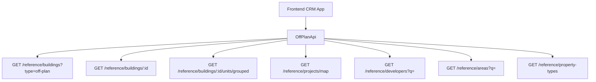

## Overview

Add an **Off-Plan** tab under the **Real Estate** section of the main CRM sidebar. This page displays all published buildings from developer portal users in a card grid view with rich filters, 2GIS map integration, and a detailed building view.

<Note>
Minimal backend changes required. Most API endpoints already exist under `/reference/buildings`, `/reference/projects`, and `/reference/units`. The frontend consumes these with the `?type=off-plan` filter parameter.
</Note>

The only backend addition is a `maxPreHandoverPercent` query parameter on the buildings search endpoint to support the payment plan filter.

## Architecture Decision

### Buildings vs Projects as Primary Entity

Based on the existing data model, **buildings** are the primary enrichment entity:

- Buildings have their own `isPublished`, `priceFrom`, `coverImageUrl`, `status`, `completionDate`, `tags`, `paymentPlans`, `gallery`, `documents`, `amenities`
- Buildings can override inherited fields from projects (status, area, community, description)
- The off-plan directory displays **published buildings**, since a project may contain multiple buildings with different statuses and pricing

<Info>
The list page queries `GET /reference/buildings?type=off-plan`, and the detail page queries `GET /reference/buildings/:id`.
</Info>

### Data Flow



## Implementation Steps

<Steps>
<Step title="Update Sidebar Navigation">
Replace the entire `realEstate` array in `src/components/layouts/CRMLayout.tsx` with a single "Off-Plan" entry.

```typescript
realEstate: [
  {
    title: 'Off-Plan',
    url: '/home/real-estate/off-plan',
    icon: Building2,  // from lucide-react
  },
],
```

Remove the old sidebar entries for Areas, Developments, and Units.
</Step>

<Step title="Create Route Structure">
Set up the route structure:

```
src/app/home/real-estate/off-plan/
├── page.tsx                    # List page (grid + map toggle)
└── [id]/
    └── page.tsx                # Building detail page
```

<Note>
Both pages follow the component extraction guide — page files contain ONLY the page function (< 200 lines).
</Note>
</Step>

<Step title="Build Component Structure">
Create the component structure:

```
src/components/pages/off-plan/
├── index.ts                           # Barrel export
│
│   ── List Page Components ──
├── off-plan-building-card.tsx          # Building card for grid view
├── off-plan-filters.tsx               # Horizontal filter bar
├── off-plan-map-view.tsx              # 2GIS map with markers + popover
├── off-plan-grid-view.tsx             # Grid of building cards + pagination
├── off-plan-toolbar.tsx               # View toggle (Grid/Map), sort, saved filters
│
│   ── Detail Page Components ──
├── building-detail-header.tsx          # Sticky sidebar
├── building-detail-description.tsx     # Description section
├── building-detail-units.tsx           # Units & Availability
├── building-detail-unit-modal.tsx      # Unit detail popup
├── building-detail-gallery.tsx         # Gallery grid with lightbox
├── building-detail-amenities.tsx       # Features/Amenities image grid
├── building-detail-location.tsx        # Location section with 2GIS map
├── building-detail-info-table.tsx      # Details table
├── building-detail-payment-plan.tsx    # Payment plan visualization
├── building-detail-documents.tsx       # Documents & links
├── building-detail-developer.tsx       # Developer info card
```
</Step>

<Step title="Implement API Layer">
Create `src/services/api/off-plan.api.ts` that wraps existing reference data endpoints with off-plan-specific defaults.
</Step>
</Steps>

## API Implementation

### Off-Plan API Class

```typescript
export class OffPlanApi {
  /** Search published off-plan buildings */
  static async searchBuildings(filters: OffPlanBuildingFilters) {
    return apiClient.get('/reference/buildings', {
      params: { ...filters, type: 'off-plan' },
    });
  }

  /** Get building detail with all enrichment */
  static async getBuildingDetail(id: number) {
    return apiClient.get(`/reference/buildings/${id}`);
  }

  /** Get units grouped by bedroom category */
  static async getBuildingUnitsGrouped(buildingId: number) {
    return apiClient.get(`/reference/buildings/${buildingId}/units/grouped`);
  }

  /** Get map markers (lightweight project data with coordinates) */
  static async getMapMarkers(filters?: MapMarkerFilters) {
    return apiClient.get('/reference/projects/map', { params: filters });
  }

  /** Search developers for filter dropdown */
  static async searchDevelopers(q?: string) {
    return apiClient.get('/reference/developers', { params: { q } });
  }

  /** Search areas for filter dropdown */
  static async searchAreas(q?: string, cityId?: number) {
    return apiClient.get('/reference/areas', { params: { q, cityId } });
  }

  /** Get property types for unit type filter */
  static async getPropertyTypes() {
    return apiClient.get('/reference/property-types');
  }
}
```

### Filter Interface

<CodeGroup>
```typescript Filter Types
export interface OffPlanBuildingFilters {
  q?: string;
  status?: string;
  areaId?: number;
  communityId?: number;
  developerId?: number;
  propertyTypeId?: number;
  propertySubTypeId?: number;
  minPrice?: number;
  maxPrice?: number;
  bedrooms?: string;
  completionBefore?: string;
  completionAfter?: string;
  maxPreHandoverPercent?: number;
  page?: number;
  limit?: number;
  sortBy?: string;
  sortOrder?: 'asc' | 'desc';
}
```

```typescript Map Marker Filters
export interface MapMarkerFilters {
  type?: string;
  areaId?: number;
  developerId?: number;
  minPrice?: number;
  maxPrice?: number;
}
```
</CodeGroup>

## Response Types

Add reference data response types in `src/services/api/types.ts`:

<AccordionGroup>
<Accordion title="RefBuildingDto">
```typescript
export interface RefBuildingDto {
  id: number;
  name?: string;
  buildingNumber?: string;
  floors?: string;
  rooms?: string;
  projectId?: number;
  projectName?: string;
  developerName?: string;
  developerId?: number;
  areaName?: string;
  areaId?: number;
  communityName?: string;
  communityId?: number;
  // Overridable inherited
  status?: string;
  percentCompleted?: number;
  startDate?: string;
  endDate?: string;
  descriptionEn?: string;
  // Enrichment
  latitude?: number;
  longitude?: number;
  priceFrom?: number;
  currency?: string;
  coverImageUrl?: string;
  completionDate?: string;
  unitCount?: number;
  isBranded?: boolean;
  isFurnished?: boolean;
  serviceChargePerSqft?: number;
  tags?: string[];
  isPublished?: boolean;
  // Collections (populated on detail)
  gallery?: RefGalleryImageDto[];
  paymentPlans?: RefPaymentPlanDto[];
  documents?: RefDocumentDto[];
  amenities?: RefAmenityDto[];
  units?: RefUnitDto[];
  // Developer contact (populated on detail)
  developerContact?: DeveloperContactDto;
}
```
</Accordion>

<Accordion title="RefUnitDto">
```typescript
export interface RefUnitDto {
  id: number;
  unitNumber?: string;
  floor?: string;
  rooms?: number;
  actualArea?: number;
  actualCommonArea?: number;
  balconyArea?: number;
  price?: number;
  pricePerSqft?: number;
  availabilityStatus?: string;
  floorPlanUrl?: string;
  isFurnished?: boolean;
  bedroomCategory?: string;
  bedroomsCount?: number;
  bathroomsCount?: number;
  buildingId?: number;
  buildingName?: string;
  projectId?: number;
  projectName?: string;
  propertySubTypeName?: string;
}
```
</Accordion>

<Accordion title="Supporting Types">
```typescript
export interface RefUnitGroupDto {
  bedroomCategory: string;
  unitCount: number;
  minArea: number;
  maxArea: number;
  minPrice: number;
  maxPrice: number;
  units: RefUnitDto[];
}

export interface RefGalleryImageDto {
  id: number;
  url: string;
  category: string;
  caption?: string;
  sortOrder: number;
}

export interface RefPaymentPlanDto {
  id: number;
  title?: string;
  onBookingPercentage?: number;
  constructionPercentage?: number;
  handoverPercentage?: number;
  postHandoverPercentage?: number;
}

export interface DeveloperContactDto {
  name: string;
  email?: string;
  phone?: string;
  whatsappNumber?: string;
  languages?: string[];
  avatarUrl?: string;
}
```
</Accordion>
</AccordionGroup>

## Query Keys

Add a new `offPlan` section in `src/lib/query-keys.ts`:

```typescript
// ============================================
// OFF-PLAN DIRECTORY
// ============================================
offPlan: {
  all: ['off-plan'] as const,
  buildings: (filters?: OffPlanBuildingFilters) => 
    ['off-plan', 'buildings', filters] as const,
  buildingDetail: (id: number) => 
    ['off-plan', 'building', id] as const,
  buildingUnits: (buildingId: number) => 
    ['off-plan', 'building', buildingId, 'units'] as const,
  mapMarkers: (filters?: MapMarkerFilters) => 
    ['off-plan', 'map-markers', filters] as const,
  developers: (q?: string) => 
    ['off-plan', 'developers', q] as const,
  areas: (q?: string, cityId?: number) => 
    ['off-plan', 'areas', q, cityId] as const,
  propertyTypes: () => 
    ['off-plan', 'property-types'] as const,
},
```

## Key Features

### List Page Features

<CardGroup cols={2}>
<Card title="Grid View" icon="grid">
Cards with cover image, status badges, handover quarter, building name, area + developer, price from, and payment plan ratio
</Card>
<Card title="Map View" icon="map">
Split layout with scrollable card list on left, 2GIS interactive map on right with project markers and popover previews
</Card>
<Card title="Filters" icon="filter">
Horizontal filter pills for Search, Developer, Price, Payments, Handover, Unit type, Bedrooms, Status
</Card>
<Card title="Toolbar" icon="wrench">
View toggle (Grid/Map), sort options, and saved filters functionality
</Card>
</CardGroup>

### Detail Page Features

<Tabs>
<Tab title="Layout">
Right-sticky sidebar with key info and scrollable left content area containing all building details
</Tab>
<Tab title="Sections">
- Description with Read More
- Units & availability (grouped by bedrooms)
- Parking information
- Gallery with lightbox
- Features/amenities
- Location with 2GIS map
- General plan
- Details table
- Payment plan visualization
- Documents & links
- Developer information
</Tab>
</Tabs>

## Backend Requirements

<Warning>
The only backend addition required is a `maxPreHandoverPercent` query parameter on the buildings search endpoint to support the payment plan filter.
</Warning>

All other endpoints already exist:
- `/reference/buildings` for building listings
- `/reference/buildings/:id` for building details
- `/reference/buildings/:id/units/grouped` for unit groupings
- `/reference/projects/map` for map markers
- `/reference/developers` for developer filter
- `/reference/areas` for area filter
- `/reference/property-types` for property type filter

## Breadcrumb Updates

Replace all existing real-estate breadcrumb handling with off-plan routes:

```
Real Estate > Off-Plan                           (list page)
Real Estate > Off-Plan > {Building Name}         (detail page)
```

<Tip>
Remove the breadcrumb entries for `/real-estate/areas`, `/real-estate/developments`, `/real-estate/units`, and `/real-estate/prospects`.
</Tip>