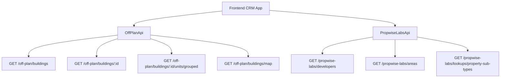

## Overview

The Off-Plan Directory adds a dedicated **Off-Plan** tab under the **Properties** section of the main CRM sidebar. This feature displays all published buildings from developer portal users in a card/map split view with rich filters, 2GIS map integration, and a detailed building view.

<Info>
Backend facade: Off-plan data is served through domain endpoints under `/off-plan/*`. These endpoints read Propwise Labs catalog data and apply CRM-owned visibility from `off_plan_building_publication` plus the off-plan lifecycle helper, so main CRM users only receive buildings with `is_published=true` that still classify as off-plan.
</Info>

## Architecture Decision

### Buildings vs Projects as Primary Entity

Based on the existing data model, **buildings** are the primary enrichment entity:

- Buildings have their own `coverImageUrl`, `status`, `endDate`, `completionDate`, `paymentPlans`, `images`, `documents`, `amenities`
- Buildings can override inherited fields from projects (status, area, community, description)
- The off-plan directory displays **published buildings** based on CRM `is_published` visibility

<Note>
Publication is separate from Propwise Labs `building.status`. Developers publish or unpublish buildings through the developer portal, which writes `off_plan_building_publication.is_published` for the Propwise Labs `building_id`.
</Note>

### Frontend Status Mapping

Frontend display status is derived from `building.status` through `getOffPlanFrontendStatus()`:

| Backend Status | Frontend Status | Color  |
|---------------|----------------|--------|
| `ACTIVE`      | On Sale        | Orange |
| `PENDING`     | EOI           | Purple |
| `FINISHED`    | Out of Stock   | Gray   |

### Data Flow



## Implementation Steps

<Steps>
<Step title="Update Sidebar Navigation">
Replace the existing real estate menu items with a single "Off-Plan" entry in `src/components/layouts/CRMLayout.tsx`:

```typescript
realEstate: [
  {
    title: 'Off-Plan',
    url: '/home/properties/off-plan',
    icon: Building2,
  },
],
```
</Step>

<Step title="Create Route Structure">
Set up the route structure for list and detail pages:

```
src/app/home/properties/off-plan/
├── page.tsx                    # List page (grid + map toggle)
└── [id]/
    └── page.tsx                # Building detail page
```
</Step>

<Step title="Implement API Layer">
Create the new API service at `src/services/api/off-plan.api.ts` with proper type definitions and endpoint wrappers.
</Step>

<Step title="Build Component Structure">
Create all necessary components following the component extraction guide where page files contain only the page function (< 200 lines).
</Step>
</Steps>

## Component Structure

### List Page Components

<AccordionGroup>
<Accordion title="Core List Components">
- `off-plan-building-card.tsx` - Building card for grid view
- `off-plan-filters.tsx` - Horizontal filter bar
- `off-plan-map-view.tsx` - 2GIS map with markers + popover
- `off-plan-grid-view.tsx` - Scrollable grid with infinite scroll
- `off-plan-toolbar.tsx` - View toggle, sort, saved filters
</Accordion>

<Accordion title="Detail Page Components">
- `building-detail-header.tsx` - Sticky sidebar with key info
- `building-detail-description.tsx` - Description with Read More
- `building-detail-units.tsx` - Units grouped by bedrooms
- `building-detail-unit-modal.tsx` - Unit detail popup
- `building-detail-images.tsx` - Image grid with lightbox
- `building-detail-amenities.tsx` - Features/amenities grid
- `building-detail-location.tsx` - Location with 2GIS map
- `building-detail-info-table.tsx` - Details table
- `building-detail-payment-plan.tsx` - Payment visualization
- `building-detail-documents.tsx` - PDF documents
- `building-detail-developer.tsx` - Developer info card
</Accordion>
</AccordionGroup>

## API Implementation

### Filter Types

<CodeGroup>
```typescript OffPlanBuildingFilters
export interface OffPlanBuildingFilters {
  q?: string;
  status?: string;
  areaId?: number;
  communityId?: number;
  developerId?: number;
  developerIds?: number[];
  propertyTypeId?: number;
  propertySubTypeId?: number;
  priceMode?: 'unit' | 'sqft';
  minPrice?: number;
  maxPrice?: number;
  bedrooms?: string;
  completionBefore?: string;
  completionAfter?: string;
  maxPreHandoverPercent?: number;
  page?: number;
  limit?: number;
  sortBy?: string;
  sortOrder?: 'asc' | 'desc';
}
```

```typescript MapMarkerFilters
export interface MapMarkerFilters {
  q?: string;
  status?: string;
  projectId?: number;
  areaId?: number;
  communityId?: number;
  developerId?: number;
  developerIds?: number[];
  propertySubTypeId?: number;
  minPrice?: number;
  maxPrice?: number;
  completionBefore?: string;
  completionAfter?: string;
}
```
</CodeGroup>

### API Class Methods

<Tabs>
<Tab title="Building Operations">
```typescript
export class OffPlanApi {
  /** Search Propwise Labs buildings */
  static async searchBuildings(filters: OffPlanBuildingFilters) {
    return apiClient.get('/off-plan/buildings', { 
      params: supportedBuildingParams(filters) 
    });
  }

  /** Get building detail with all enrichment */
  static async getBuildingDetail(id: number) {
    return apiClient.get(`/off-plan/buildings/${id}`);
  }

  /** Get units grouped by bedroom category */
  static async getBuildingUnitsGrouped(buildingId: number) {
    return apiClient.get(`/off-plan/buildings/${buildingId}/units/grouped`);
  }
}
```
</Tab>

<Tab title="Map Operations">
```typescript
export class OffPlanApi {
  /** Get map markers (lightweight building data) */
  static async getMapMarkers(filters?: MapMarkerFilters) {
    return apiClient.get('/off-plan/buildings/map', { 
      params: supportedMapParams(filters) 
    });
  }
}
```
</Tab>

<Tab title="Lookup Operations">
```typescript
export class OffPlanApi {
  /** Search developers for multi-select filter */
  static async searchDevelopers(q?: string) {
    return apiClient.get('/propwise-labs/developers', { 
      params: { q } 
    });
  }

  /** Search areas for filter dropdown */
  static async searchAreas(q?: string, cityId?: number) {
    return apiClient.get('/propwise-labs/areas', { 
      params: { q, cityId } 
    });
  }

  /** Get property subtypes for unit type filter */
  static async getPropertySubTypes() {
    return apiClient.get('/propwise-labs/lookups/property-sub-types');
  }
}
```
</Tab>
</Tabs>

## Response Types

### Core Building Type

```typescript
export interface OffPlanBuilding extends PropwiseLabsBuilding {
  isPublished?: boolean;
  publishedAt?: string;
  unpublishedAt?: string;
  developerContact?: PropwiseLabsDeveloperContact;
  developer?: PropwiseLabsDeveloperOption;
}
```

<Warning>
Raw catalog response shapes live with the raw Propwise Labs API client. Off-plan types only extend raw Propwise Labs shapes when `/off-plan` adds app-owned fields.
</Warning>

## Key Features

<CardGroup cols={2}>
<Card title="List View" icon="grid-3x3">
Cards with cover image, status badges, handover quarter, building name, area + developer, price from, and payment plan ratio
</Card>

<Card title="Map View" icon="map">
Split layout with scrollable cards and 2GIS interactive map featuring custom circular developer-logo markers and popover previews
</Card>

<Card title="Rich Filters" icon="filter">
Compact search input plus filters for Developer, Price, Payments, Handover, Unit type, Bedrooms, and Status
</Card>

<Card title="Building Detail" icon="building">
Comprehensive building information with sticky sidebar, units grouped by bedrooms, payment plans, and developer contact
</Card>
</CardGroup>

## Breadcrumb Structure

Replace all existing real-estate breadcrumb handling with off-plan routes:

- `Properties > Off-Plan` (list page)
- `Properties > Off-Plan > {Building Name}` (detail page)

<Check>
Remove breadcrumb entries for `/real-estate/areas`, `/real-estate/developments`, `/real-estate/units`, and `/real-estate/prospects`.
</Check>

## Data Visibility Rules

<Tip>
The `/off-plan/buildings` endpoints enforce publication by checking `off_plan_building_publication.is_published=true` and require buildings to match the off-plan lifecycle helper. Secondary and `UNKNOWN` lifecycle records are hidden even if a publication row exists.
</Tip>