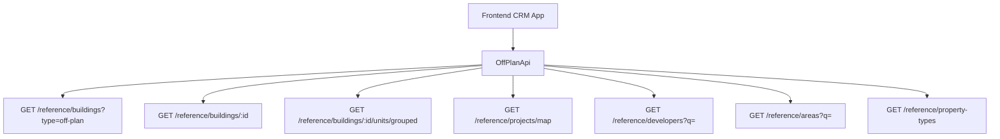

## Overview

Add an **Off-Plan** tab under the **Real Estate** section of the main CRM sidebar. This page displays all published buildings from developer portal users in a card grid view with rich filters, 2GIS map integration, and a detailed building view.

<Note>
**Minimal backend changes required.** Most API endpoints already exist under `/reference/buildings`, `/reference/projects`, and `/reference/units`. The frontend consumes these with the `?type=off-plan` filter parameter.
</Note>

The only backend addition needed is a `maxPreHandoverPercent` query parameter on the buildings search endpoint to support the payment plan filter.

## Reference Screenshots

The implementation follows a competitor platform design with these key visual patterns:

1. **List page (grid view)**: Cards with cover image, status badges (EOI, On Sale, Announced), handover quarter, building name, area + developer, price from, and payment plan ratio
2. **List page (map view)**: Split layout — scrollable card list on left, 2GIS interactive map on right with project markers and popover previews
3. **Filters bar**: Horizontal filter pills — Search, Developer, Price, Payments, Handover, Unit type, Bedrooms, Status
4. **Building detail page**: Right-sticky sidebar with key info + scrollable left content area containing: description, units & availability (grouped by bedrooms), parking info, gallery, features/amenities, location with map, general plan, details table, payment plan visualization, documents & links, developer info

## Architecture Decision

### Buildings vs Projects as Primary Entity

Based on the existing data model, **buildings** are the primary enrichment entity:

<Check>Buildings have their own `isPublished`, `priceFrom`, `coverImageUrl`, `status`, `completionDate`, `tags`, `paymentPlans`, `gallery`, `documents`, `amenities`</Check>

<Check>Buildings can override inherited fields from projects (status, area, community, description)</Check>

<Check>The off-plan directory displays **published buildings**, since a project may contain multiple buildings with different statuses and pricing</Check>

The list page queries `GET /reference/buildings?type=off-plan`, and the detail page queries `GET /reference/buildings/:id`.

### Data Flow



## Implementation Guide

### 1. Sidebar Navigation

<Steps>
<Step title="Update CRM Layout">
Update `src/components/layouts/CRMLayout.tsx` to replace the entire `data.realEstate` array:

```typescript
realEstate: [
  {
    title: 'Off-Plan',
    url: '/home/real-estate/off-plan',
    icon: Building2,  // from lucide-react (already imported)
  },
],
```

<Warning>Remove the old sidebar entries for Areas, Developments, and Units.</Warning>
</Step>

<Step title="Update Breadcrumbs">
Replace all existing real-estate breadcrumb handling with off-plan routes:

```
Real Estate > Off-Plan                           (list page)
Real Estate > Off-Plan > {Building Name}         (detail page)
```
</Step>
</Steps>

### 2. Route Structure

Create the following route structure:

```
src/app/home/real-estate/off-plan/
├── page.tsx                    # List page (grid + map toggle)
└── [id]/
    └── page.tsx                # Building detail page
```

<Tip>Both pages follow the component extraction guide — page files contain ONLY the page function (< 200 lines).</Tip>

### 3. Component Structure

<AccordionGroup>
<Accordion title="List Page Components">
```
src/components/pages/off-plan/
├── off-plan-building-card.tsx          # Building card for grid view
├── off-plan-filters.tsx               # Horizontal filter bar
├── off-plan-map-view.tsx              # 2GIS map with markers + popover
├── off-plan-grid-view.tsx             # Grid of building cards + pagination
├── off-plan-toolbar.tsx               # View toggle (Grid/Map), sort, saved filters
```
</Accordion>

<Accordion title="Detail Page Components">
```
src/components/pages/off-plan/
├── building-detail-header.tsx          # Sticky sidebar: name, price, units count, payment plan, developer, CTA buttons
├── building-detail-description.tsx     # Description section with Read More
├── building-detail-units.tsx           # Units & Availability (accordion grouped by bedrooms)
├── building-detail-unit-modal.tsx      # Unit detail popup (floor plan, specs, price)
├── building-detail-gallery.tsx         # Gallery grid with lightbox
├── building-detail-amenities.tsx       # Features/Amenities image grid
├── building-detail-location.tsx        # Location section with 2GIS map
├── building-detail-info-table.tsx      # Details table (Project Name, Developer, Branded, etc.)
├── building-detail-payment-plan.tsx    # Payment plan visualization (progress bar + breakdown)
├── building-detail-documents.tsx       # Documents & links (PDF cards)
├── building-detail-developer.tsx       # Developer info card (from DeveloperContactDto)
```
</Accordion>
</AccordionGroup>

Don't forget to create an `index.ts` barrel export file.

### 4. API Layer

Create a new file: `src/services/api/off-plan.api.ts`

<Tabs>
<Tab title="Filter Types">
```typescript
export interface OffPlanBuildingFilters {
  q?: string;
  status?: string;
  areaId?: number;
  communityId?: number;
  developerId?: number;
  propertyTypeId?: number;
  propertySubTypeId?: number;
  minPrice?: number;
  maxPrice?: number;
  bedrooms?: string;
  completionBefore?: string;
  completionAfter?: string;
  maxPreHandoverPercent?: number;
  page?: number;
  limit?: number;
  sortBy?: string;
  sortOrder?: 'asc' | 'desc';
}

export interface MapMarkerFilters {
  type?: string;
  areaId?: number;
  developerId?: number;
  minPrice?: number;
  maxPrice?: number;
}
```
</Tab>

<Tab title="API Class">
```typescript
export class OffPlanApi {
  /** Search published off-plan buildings */
  static async searchBuildings(filters: OffPlanBuildingFilters) {
    return apiClient.get('/reference/buildings', {
      params: { ...filters, type: 'off-plan' },
    });
  }

  /** Get building detail with all enrichment */
  static async getBuildingDetail(id: number) {
    return apiClient.get(`/reference/buildings/${id}`);
  }

  /** Get units grouped by bedroom category */
  static async getBuildingUnitsGrouped(buildingId: number) {
    return apiClient.get(`/reference/buildings/${buildingId}/units/grouped`);
  }

  /** Get single unit detail */
  static async getUnitDetail(unitId: number) {
    return apiClient.get(`/reference/units/${unitId}`);
  }

  /** Get map markers (lightweight project data with coordinates) */
  static async getMapMarkers(filters?: MapMarkerFilters) {
    return apiClient.get('/reference/projects/map', { params: filters });
  }

  /** Search developers for filter dropdown */
  static async searchDevelopers(q?: string) {
    return apiClient.get('/reference/developers', { params: { q } });
  }

  /** Search areas for filter dropdown */
  static async searchAreas(q?: string, cityId?: number) {
    return apiClient.get('/reference/areas', { params: { q, cityId } });
  }

  /** Get property types for unit type filter */
  static async getPropertyTypes() {
    return apiClient.get('/reference/property-types');
  }
}
```
</Tab>
</Tabs>

### 5. Response Types

Add these reference data response types to `src/services/api/types.ts`:

<CodeGroup>
```typescript Building & Unit Types
export interface RefBuildingDto {
  id: number;
  name?: string;
  buildingNumber?: string;
  floors?: string;
  rooms?: string;
  projectId?: number;
  projectName?: string;
  developerName?: string;
  developerId?: number;
  areaName?: string;
  areaId?: number;
  communityName?: string;
  communityId?: number;
  // Overridable inherited
  status?: string;
  percentCompleted?: number;
  startDate?: string;
  endDate?: string;
  descriptionEn?: string;
  // Enrichment
  latitude?: number;
  longitude?: number;
  priceFrom?: number;
  currency?: string;
  coverImageUrl?: string;
  completionDate?: string;
  unitCount?: number;
  isBranded?: boolean;
  isFurnished?: boolean;
  serviceChargePerSqft?: number;
  tags?: string[];
  isPublished?: boolean;
  // Collections (populated on detail)
  gallery?: RefGalleryImageDto[];
  paymentPlans?: RefPaymentPlanDto[];
  documents?: RefDocumentDto[];
  amenities?: RefAmenityDto[];
  units?: RefUnitDto[];
  // Developer contact (populated on detail)
  developerContact?: DeveloperContactDto;
}

export interface RefUnitDto {
  id: number;
  unitNumber?: string;
  floor?: string;
  rooms?: number;
  actualArea?: number;
  actualCommonArea?: number;
  balconyArea?: number;
  price?: number;
  pricePerSqft?: number;
  availabilityStatus?: string;
  floorPlanUrl?: string;
  isFurnished?: boolean;
  bedroomCategory?: string;
  bedroomsCount?: number;
  bathroomsCount?: number;
  buildingId?: number;
  buildingName?: string;
  projectId?: number;
  projectName?: string;
  propertySubTypeName?: string;
}

export interface RefUnitGroupDto {
  bedroomCategory: string;
  unitCount: number;
  minArea: number;
  maxArea: number;
  minPrice: number;
  maxPrice: number;
  units: RefUnitDto[];
}
```

```typescript Enrichment Types
export interface RefGalleryImageDto {
  id: number;
  url: string;
  category: string;
  caption?: string;
  sortOrder: number;
}

export interface RefPaymentPlanDto {
  id: number;
  title?: string;
  onBookingPercentage?: number;
  constructionPercentage?: number;
  handoverPercentage?: number;
  postHandoverPercentage?: number;
}

export interface RefDocumentDto {
  id: number;
  name: string;
  type: string;
  url: string;
}

export interface RefAmenityDto {
  id: number;
  name: string;
  imageUrl?: string;
}

export interface RefDeveloperDto {
  id: number;
  nameEn?: string;
  nameAr?: string;
  developerNumber?: string;
  webpage?: string;
  phone?: string;
}

export interface DeveloperContactDto {
  name: string;
  email?: string;
  phone?: string;
  whatsappNumber?: string;
  languages?: string[];
  avatarUrl?: string;
}
```

```typescript Map & Pagination Types
export interface RefMapProjectDto {
  id: number;
  name?: string;
  latitude?: number;
  longitude?: number;
  priceFrom?: number;
  coverImageUrl?: string;
  developerName?: string;
  status?: string;
  completionDate?: string;
}

export interface PaginatedRefResponse<T> {
  data: T[];
  total: number;
  page: number;
  limit: number;
  totalPages: number;
}
```
</CodeGroup>

### 6. Query Keys

Add a new `offPlan` section to `src/lib/query-keys.ts`:

```typescript
// ============================================
// OFF-PLAN DIRECTORY
// ============================================
offPlan: {
  all: ['off-plan'] as const,
  buildings: {
    all: ['off-plan', 'buildings'] as const,
    list: (filters: OffPlanBuildingFilters) => ['off-plan', 'buildings', 'list', filters] as const,
    detail: (id: number) => ['off-plan', 'buildings', 'detail', id] as const,
    units: (id: number) => ['off-plan', 'buildings', 'units', id] as const,
  },
  map: {
    all: ['off-plan', 'map'] as const,
    markers: (filters?: MapMarkerFilters) => ['off-plan', 'map', 'markers', filters] as const,
  },
  filters: {
    all: ['off-plan', 'filters'] as const,
    developers: (q?: string) => ['off-plan', 'filters', 'developers', q] as const,
    areas: (q?: string, cityId?: number) => ['off-plan', 'filters', 'areas', q, cityId] as const,
    propertyTypes: ['off-plan', 'filters', 'property-types'] as const,
  },
},
```

## Backend Changes

<Info>
Only one minor backend change is required: adding the `maxPreHandoverPercent` query parameter to the buildings search endpoint to support payment plan filtering.
</Info>

All other endpoints already exist under:
- `/reference/buildings`
- `/reference/projects`
- `/reference/units`

The frontend will consume these with the `?type=off-plan` filter parameter to get only off-plan buildings.

## Next Steps

<Steps>
<Step title="Create Route Files">
Implement the page components in `src/app/home/real-estate/off-plan/`
</Step>

<Step title="Build Components">
Create all the component files following the structure outlined above
</Step>

<Step title="Implement API Layer">
Add the `off-plan.api.ts` file and update types
</Step>

<Step title="Update Navigation">
Modify the CRM layout and breadcrumb handling
</Step>

<Step title="Add Query Keys">
Update the query keys configuration
</Step>

<Step title="Backend Integration">
Coordinate with backend team to add the `maxPreHandoverPercent` parameter
</Step>
</Steps>

<CardGroup cols={2}>
<Card title="Component Guidelines" icon="code" href="/development/component-extraction">
Follow the component extraction patterns for clean architecture
</Card>
<Card title="API Integration" icon="link" href="/api/reference-data">
Reference the existing API documentation for endpoint details
</Card>
</CardGroup>