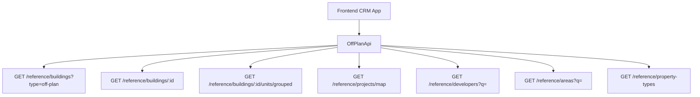

## Overview

The Off-Plan Directory is a comprehensive real estate feature that adds an **Off-Plan** tab under the **Real Estate** section of the main CRM sidebar. This page displays all published buildings from developer portal users in a card grid view with rich filters, 2GIS map integration, and detailed building views.

<Note>
This implementation requires minimal backend changes. Most API endpoints already exist under `/reference/buildings`, `/reference/projects`, and `/reference/units`. The frontend consumes these with the `?type=off-plan` filter parameter.
</Note>

The only backend addition needed is a `maxPreHandoverPercent` query parameter on the buildings search endpoint to support the payment plan filter.

## Key Features

- **Grid and map views** with toggle functionality
- **Advanced filtering** including developer, price, payment plans, handover dates, unit types, and bedrooms
- **2GIS map integration** with interactive markers and project previews
- **Detailed building pages** with comprehensive information including units, amenities, location, and payment plans
- **Rich media support** with galleries, documents, and floor plans

## Architecture Decision

### Buildings vs Projects as Primary Entity

Based on the existing data model, **buildings** are the primary enrichment entity:

- Buildings have their own `isPublished`, `priceFrom`, `coverImageUrl`, `status`, `completionDate`, `tags`, `paymentPlans`, `gallery`, `documents`, `amenities`
- Buildings can override inherited fields from projects (status, area, community, description)
- The off-plan directory displays **published buildings**, since a project may contain multiple buildings with different statuses and pricing

<Info>
The list page queries `GET /reference/buildings?type=off-plan`, and the detail page queries `GET /reference/buildings/:id`.
</Info>

### Data Flow



## Implementation Steps

<Steps>
<Step title="Update Sidebar Navigation">
Replace the existing Real Estate menu items with a single "Off-Plan" entry in the CRM layout component.
</Step>

<Step title="Create Route Structure">
Set up the page routing structure for both list and detail views under `/home/real-estate/off-plan/`.
</Step>

<Step title="Build Component Architecture">
Create all required components for list page (cards, filters, map) and detail page (sidebar, content sections).
</Step>

<Step title="Implement API Layer">
Create the OffPlanApi service to wrap existing reference data endpoints with off-plan-specific defaults.
</Step>

<Step title="Add Query Management">
Set up React Query keys and hooks for efficient data fetching and caching.
</Step>

<Step title="Integrate 2GIS Maps">
Implement map functionality with markers, clustering, and interactive popover previews.
</Step>
</Steps>

## Sidebar Navigation

### File: `src/components/layouts/CRMLayout.tsx`

Replace the entire `data.realEstate` array with a single "Off-Plan" entry:

```typescript
realEstate: [
  {
    title: 'Off-Plan',
    url: '/home/real-estate/off-plan',
    icon: Building2,  // from lucide-react
  },
],
```

<Warning>
Remove the old sidebar entries for Areas, Developments, and Units. The off-plan directory supersedes these existing tabs.
</Warning>

### Breadcrumb Structure

```
Real Estate > Off-Plan                           (list page)
Real Estate > Off-Plan > {Building Name}         (detail page)
```

## Route Structure

```
src/app/home/real-estate/off-plan/
├── page.tsx                    # List page (grid + map toggle)
└── [id]/
    └── page.tsx                # Building detail page
```

<Tip>
Both pages should follow the component extraction guide — page files contain ONLY the page function (< 200 lines).
</Tip>

## Component Architecture

<Tabs>
<Tab title="List Page Components">

```
src/components/pages/off-plan/
├── off-plan-building-card.tsx          # Building card for grid view
├── off-plan-filters.tsx               # Horizontal filter bar
├── off-plan-map-view.tsx              # 2GIS map with markers + popover
├── off-plan-grid-view.tsx             # Grid of building cards + pagination
├── off-plan-toolbar.tsx               # View toggle (Grid/Map), sort, saved filters
```

</Tab>
<Tab title="Detail Page Components">

```
src/components/pages/off-plan/
├── building-detail-header.tsx          # Sticky sidebar: name, price, units count, payment plan, developer, CTA buttons
├── building-detail-description.tsx     # Description section with Read More
├── building-detail-units.tsx           # Units & Availability (accordion grouped by bedrooms)
├── building-detail-unit-modal.tsx      # Unit detail popup (floor plan, specs, price)
├── building-detail-gallery.tsx         # Gallery grid with lightbox
├── building-detail-amenities.tsx       # Features/Amenities image grid
├── building-detail-location.tsx        # Location section with 2GIS map
├── building-detail-info-table.tsx      # Details table (Project Name, Developer, Branded, etc.)
├── building-detail-payment-plan.tsx    # Payment plan visualization (progress bar + breakdown)
├── building-detail-documents.tsx       # Documents & links (PDF cards)
├── building-detail-developer.tsx       # Developer info card (from DeveloperContactDto)
```

</Tab>
</Tabs>

## API Layer

### New File: `src/services/api/off-plan.api.ts`

<CodeGroup>
```typescript Filter Types
export interface OffPlanBuildingFilters {
  q?: string;
  status?: string;
  areaId?: number;
  communityId?: number;
  developerId?: number; // Filter by developer (joined through project→developer)
  propertyTypeId?: number;
  propertySubTypeId?: number;
  minPrice?: number;
  maxPrice?: number;
  bedrooms?: string; // e.g., "1", "2", "3", "studio"
  completionBefore?: string; // ISO date — handover filter
  completionAfter?: string; // ISO date — handover filter
  maxPreHandoverPercent?: number; // Payment plan filter (backend filter)
  page?: number;
  limit?: number;
  sortBy?: string;
  sortOrder?: 'asc' | 'desc';
}

export interface MapMarkerFilters {
  type?: string;
  areaId?: number;
  developerId?: number;
  minPrice?: number;
  maxPrice?: number;
}
```

```typescript API Methods
export class OffPlanApi {
  /** Search published off-plan buildings */
  static async searchBuildings(filters: OffPlanBuildingFilters) {
    return apiClient.get('/reference/buildings', {
      params: { ...filters, type: 'off-plan' },
    });
  }

  /** Get building detail with all enrichment */
  static async getBuildingDetail(id: number) {
    return apiClient.get(`/reference/buildings/${id}`);
  }

  /** Get units grouped by bedroom category */
  static async getBuildingUnitsGrouped(buildingId: number) {
    return apiClient.get(`/reference/buildings/${buildingId}/units/grouped`);
  }

  /** Get single unit detail */
  static async getUnitDetail(unitId: number) {
    return apiClient.get(`/reference/units/${unitId}`);
  }

  /** Get map markers (lightweight project data with coordinates) */
  static async getMapMarkers(filters?: MapMarkerFilters) {
    return apiClient.get('/reference/projects/map', { params: filters });
  }

  /** Search developers for filter dropdown */
  static async searchDevelopers(q?: string) {
    return apiClient.get('/reference/developers', { params: { q } });
  }

  /** Search areas for filter dropdown */
  static async searchAreas(q?: string, cityId?: number) {
    return apiClient.get('/reference/areas', { params: { q, cityId } });
  }

  /** Get property types for unit type filter */
  static async getPropertyTypes() {
    return apiClient.get('/reference/property-types');
  }
}
```
</CodeGroup>

## Response Types

Add these reference data response types to `src/services/api/types.ts`:

<AccordionGroup>
<Accordion title="Building and Unit DTOs">

```typescript
export interface RefBuildingDto {
  id: number;
  name?: string;
  buildingNumber?: string;
  floors?: string;
  rooms?: string;
  projectId?: number;
  projectName?: string;
  developerName?: string;
  developerId?: number;
  areaName?: string;
  areaId?: number;
  communityName?: string;
  communityId?: number;
  // Overridable inherited
  status?: string;
  percentCompleted?: number;
  startDate?: string;
  endDate?: string;
  descriptionEn?: string;
  // Enrichment
  latitude?: number;
  longitude?: number;
  priceFrom?: number;
  currency?: string;
  coverImageUrl?: string;
  completionDate?: string;
  unitCount?: number;
  isBranded?: boolean;
  isFurnished?: boolean;
  serviceChargePerSqft?: number;
  tags?: string[];
  isPublished?: boolean;
  // Collections (populated on detail)
  gallery?: RefGalleryImageDto[];
  paymentPlans?: RefPaymentPlanDto[];
  documents?: RefDocumentDto[];
  amenities?: RefAmenityDto[];
  units?: RefUnitDto[];
  // Developer contact (populated on detail)
  developerContact?: DeveloperContactDto;
}

export interface RefUnitDto {
  id: number;
  unitNumber?: string;
  floor?: string;
  rooms?: number;
  actualArea?: number;
  actualCommonArea?: number;
  balconyArea?: number;
  price?: number;
  pricePerSqft?: number;
  availabilityStatus?: string;
  floorPlanUrl?: string;
  isFurnished?: boolean;
  bedroomCategory?: string;
  bedroomsCount?: number;
  bathroomsCount?: number;
  buildingId?: number;
  buildingName?: string;
  projectId?: number;
  projectName?: string;
  propertySubTypeName?: string;
}

export interface RefUnitGroupDto {
  bedroomCategory: string;
  unitCount: number;
  minArea: number;
  maxArea: number;
  minPrice: number;
  maxPrice: number;
  units: RefUnitDto[];
}
```

</Accordion>
<Accordion title="Media and Document DTOs">

```typescript
export interface RefGalleryImageDto {
  id: number;
  url: string;
  category: string;
  caption?: string;
  sortOrder: number;
}

export interface RefPaymentPlanDto {
  id: number;
  title?: string;
  onBookingPercentage?: number;
  constructionPercentage?: number;
  handoverPercentage?: number;
  postHandoverPercentage?: number;
}

export interface RefDocumentDto {
  id: number;
  name: string;
  type: string;
  url: string;
}

export interface RefAmenityDto {
  id: number;
  name: string;
  imageUrl?: string;
}
```

</Accordion>
<Accordion title="Developer and Map DTOs">

```typescript
export interface RefDeveloperDto {
  id: number;
  nameEn?: string;
  nameAr?: string;
  developerNumber?: string;
  webpage?: string;
  phone?: string;
}

export interface DeveloperContactDto {
  name: string;
  email?: string;
  phone?: string;
  whatsappNumber?: string;
  languages?: string[];
  avatarUrl?: string;
}

export interface RefMapProjectDto {
  id: number;
  name?: string;
  latitude?: number;
  longitude?: number;
  priceFrom?: number;
  coverImageUrl?: string;
  developerName?: string;
  status?: string;
  completionDate?: string;
}

export interface PaginatedRefResponse<T> {
  data: T[];
  total: number;
  page: number;
  limit: number;
  totalPages: number;
}
```

</Accordion>
</AccordionGroup>

## Query Keys

Add to `src/lib/query-keys.ts`:

```typescript
// ============================================
// OFF-PLAN DIRECTORY
// ============================================
offPlan: {
  all: ['off-plan'] as const,
  buildings: {
    all: ['off-plan', 'buildings'] as const,
    search: (filters: OffPlanBuildingFilters) => 
      ['off-plan', 'buildings', 'search', filters] as const,
    detail: (id: number) => 
      ['off-plan', 'buildings', 'detail', id] as const,
    units: (buildingId: number) => 
      ['off-plan', 'buildings', buildingId, 'units'] as const,
  },
  map: {
    all: ['off-plan', 'map'] as const,
    markers: (filters?: MapMarkerFilters) => 
      ['off-plan', 'map', 'markers', filters] as const,
  },
  filters: {
    developers: (q?: string) => 
      ['off-plan', 'filters', 'developers', q] as const,
    areas: (q?: string, cityId?: number) => 
      ['off-plan', 'filters', 'areas', { q, cityId }] as const,
    propertyTypes: ['off-plan', 'filters', 'property-types'] as const,
  },
},
```

## Key UI Patterns

<CardGroup cols={2}>
<Card title="Building Cards" icon="rectangle-list">
Display cover image, status badges (EOI, On Sale, Announced), handover quarter, building name, area + developer, price from, and payment plan ratio
</Card>

<Card title="Map Integration" icon="map">
Split layout with scrollable card list on left, 2GIS interactive map on right with project markers and popover previews
</Card>

<Card title="Filter System" icon="filter">
Horizontal filter pills for Search, Developer, Price, Payments, Handover, Unit type, Bedrooms, and Status
</Card>

<Card title="Detail Page Layout" icon="sidebar">
Right-sticky sidebar with key info plus scrollable left content area with comprehensive building information
</Card>
</CardGroup>

## Visual Design Reference

The implementation should replicate key visual patterns from the provided competitor platform screenshots, including:

- **List page (grid view)**: Card-based layout with rich building information
- **List page (map view)**: Interactive split-screen experience
- **Filters bar**: Intuitive horizontal pill-based filtering system  
- **Building detail page**: Comprehensive information architecture with sticky sidebar navigation

<Check>
This implementation provides a complete off-plan directory solution that leverages existing backend infrastructure while delivering a rich, interactive user experience for browsing and exploring off-plan real estate properties.
</Check>