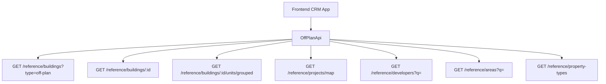

## Overview

The Off-Plan Directory adds a new **Off-Plan** tab under the **Real Estate** section of the main CRM sidebar. This page displays all published buildings from developer portal users in a card grid view with rich filters, 2GIS map integration, and a detailed building view.

<Note>
This implementation requires minimal backend changes. Most API endpoints already exist under `/reference/buildings`, `/reference/projects`, and `/reference/units`. The frontend consumes these with the `?type=off-plan` filter parameter.
</Note>

The only backend addition required is a `maxPreHandoverPercent` query parameter on the buildings search endpoint to support the payment plan filter.

## Architecture Decision

### Buildings vs Projects as Primary Entity

Based on the existing data model, **buildings** are the primary enrichment entity:

- Buildings have their own `isPublished`, `priceFrom`, `coverImageUrl`, `status`, `completionDate`, `tags`, `paymentPlans`, `gallery`, `documents`, `amenities`
- Buildings can override inherited fields from projects (status, area, community, description)
- The off-plan directory displays **published buildings**, since a project may contain multiple buildings with different statuses and pricing

<Info>
The list page queries `GET /reference/buildings?type=off-plan`, and the detail page queries `GET /reference/buildings/:id`.
</Info>

### Data Flow



## Implementation Steps

<Steps>
<Step title="Update Sidebar Navigation">
Replace the existing Real Estate section entries with a single Off-Plan tab.

**File: `src/components/layouts/CRMLayout.tsx`**

Replace the entire `data.realEstate` array:

```typescript
realEstate: [
  {
    title: 'Off-Plan',
    url: '/home/real-estate/off-plan',
    icon: Building2,  // from lucide-react
  },
],
```

<Warning>
Remove the old sidebar entries for Areas, Developments, and Units as the off-plan directory supersedes them.
</Warning>

Update breadcrumb handling to support off-plan routes:
- `Real Estate > Off-Plan` (list page)
- `Real Estate > Off-Plan > {Building Name}` (detail page)
</Step>

<Step title="Create Route Structure">
Set up the page routing structure:

```
src/app/home/real-estate/off-plan/
├── page.tsx                    # List page (grid + map toggle)
└── [id]/
    └── page.tsx                # Building detail page
```

<Note>
Both pages follow the component extraction guide — page files contain ONLY the page function (< 200 lines).
</Note>
</Step>

<Step title="Build Component Structure">
Create the component hierarchy:

```
src/components/pages/off-plan/
├── index.ts                           # Barrel export
│
│   ── List Page Components ──
├── off-plan-building-card.tsx          # Building card for grid view
├── off-plan-filters.tsx               # Horizontal filter bar
├── off-plan-map-view.tsx              # 2GIS map with markers + popover
├── off-plan-grid-view.tsx             # Grid of building cards + pagination
├── off-plan-toolbar.tsx               # View toggle, sort, saved filters
│
│   ── Detail Page Components ──
├── building-detail-header.tsx          # Sticky sidebar with key info
├── building-detail-description.tsx     # Description with Read More
├── building-detail-units.tsx           # Units grouped by bedrooms
├── building-detail-unit-modal.tsx      # Unit detail popup
├── building-detail-gallery.tsx         # Gallery with lightbox
├── building-detail-amenities.tsx       # Features/Amenities grid
├── building-detail-location.tsx        # Location with 2GIS map
├── building-detail-info-table.tsx      # Details table
├── building-detail-payment-plan.tsx    # Payment plan visualization
├── building-detail-documents.tsx       # Documents & links
├── building-detail-developer.tsx       # Developer info card
```
</Step>

<Step title="Implement API Layer">
Create the API wrapper for off-plan specific functionality.

**New File: `src/services/api/off-plan.api.ts`**

```typescript
export interface OffPlanBuildingFilters {
  q?: string;
  status?: string;
  areaId?: number;
  communityId?: number;
  developerId?: number;
  propertyTypeId?: number;
  propertySubTypeId?: number;
  minPrice?: number;
  maxPrice?: number;
  bedrooms?: string;
  completionBefore?: string;
  completionAfter?: string;
  maxPreHandoverPercent?: number;
  page?: number;
  limit?: number;
  sortBy?: string;
  sortOrder?: 'asc' | 'desc';
}

export class OffPlanApi {
  static async searchBuildings(filters: OffPlanBuildingFilters) {
    return apiClient.get('/reference/buildings', {
      params: { ...filters, type: 'off-plan' },
    });
  }

  static async getBuildingDetail(id: number) {
    return apiClient.get(`/reference/buildings/${id}`);
  }

  static async getBuildingUnitsGrouped(buildingId: number) {
    return apiClient.get(`/reference/buildings/${buildingId}/units/grouped`);
  }

  static async getMapMarkers(filters?: MapMarkerFilters) {
    return apiClient.get('/reference/projects/map', { params: filters });
  }

  // Additional helper methods...
}
```
</Step>

<Step title="Add Response Types">
Update `src/services/api/types.ts` with reference data types:

```typescript
export interface RefBuildingDto {
  id: number;
  name?: string;
  buildingNumber?: string;
  projectId?: number;
  projectName?: string;
  developerName?: string;
  status?: string;
  latitude?: number;
  longitude?: number;
  priceFrom?: number;
  currency?: string;
  coverImageUrl?: string;
  completionDate?: string;
  unitCount?: number;
  isPublished?: boolean;
  gallery?: RefGalleryImageDto[];
  paymentPlans?: RefPaymentPlanDto[];
  documents?: RefDocumentDto[];
  amenities?: RefAmenityDto[];
}

export interface RefUnitGroupDto {
  bedroomCategory: string;
  unitCount: number;
  minArea: number;
  maxArea: number;
  minPrice: number;
  maxPrice: number;
  units: RefUnitDto[];
}
```
</Step>

<Step title="Configure Query Keys">
Add query keys in `src/lib/query-keys.ts`:

```typescript
offPlan: {
  all: ['off-plan'] as const,
  buildings: {
    all: () => [...offPlan.all, 'buildings'] as const,
    search: (filters: OffPlanBuildingFilters) => 
      [...offPlan.buildings.all(), 'search', filters] as const,
    detail: (id: number) => 
      [...offPlan.buildings.all(), 'detail', id] as const,
    units: (id: number) => 
      [...offPlan.buildings.detail(id), 'units'] as const,
  },
  map: {
    markers: (filters?: MapMarkerFilters) => 
      [...offPlan.all, 'map', 'markers', filters] as const,
  },
}
```
</Step>
</Steps>

## Key Features

### List Page Features

<CardGroup cols={2}>
<Card title="Grid View" icon="grid-3x3">
Building cards with cover image, status badges, handover info, pricing
</Card>
<Card title="Map View" icon="map">
2GIS integration with project markers and popover previews
</Card>
<Card title="Advanced Filters" icon="filter">
Search, Developer, Price, Payments, Handover, Unit type filters
</Card>
<Card title="View Toggle" icon="toggle-on">
Switch between grid and map views with saved preferences
</Card>
</CardGroup>

### Detail Page Features

<Tabs>
<Tab title="Core Info">
- Right-sticky sidebar with key building information
- Price from, unit counts, payment plan summary
- Developer contact and CTA buttons
</Tab>
<Tab title="Content Sections">
- Building description with expandable text
- Units & availability grouped by bedroom count
- Photo gallery with lightbox functionality
- Amenities and features grid
</Tab>
<Tab title="Interactive Elements">
- Location section with 2GIS map integration
- Payment plan visualization with progress bars
- Document downloads and external links
- Unit detail modals with floor plans
</Tab>
</Tabs>

## Filter Implementation

The filter system supports multiple parameters with intelligent defaults:

<AccordionGroup>
<Accordion title="Search & Location Filters">
- **Text Search**: Building name, project name, developer search
- **Developer Filter**: Dropdown with developer search
- **Area/Community**: Hierarchical location selection
- **Status**: On Sale, EOI, Announced, Under Construction
</Accordion>

<Accordion title="Financial Filters">
- **Price Range**: Min/max price with preset ranges
- **Payment Plan**: Max pre-handover percentage slider
- **Unit Type**: Property type and subtype selection
</Accordion>

<Accordion title="Property Filters">
- **Bedrooms**: Studio, 1BR, 2BR, 3BR+ selection
- **Handover Date**: Completion date range picker
- **Amenities**: Feature-based filtering
</Accordion>
</AccordionGroup>

## Backend Integration

<Warning>
The implementation relies heavily on existing backend endpoints. Only one new parameter needs to be added.
</Warning>

### Required Backend Changes

Add `maxPreHandoverPercent` query parameter to the buildings search endpoint:

```sql
-- Filter buildings by payment plan pre-handover percentage
WHERE (
  :maxPreHandoverPercent IS NULL 
  OR payment_plans.pre_handover_percentage <= :maxPreHandoverPercent
)
```

### Existing Endpoints Used

- `GET /reference/buildings?type=off-plan` - Building search with filters
- `GET /reference/buildings/:id` - Building detail with enrichment
- `GET /reference/buildings/:id/units/grouped` - Units by bedroom category  
- `GET /reference/projects/map` - Map markers with coordinates
- `GET /reference/developers` - Developer search for filters
- `GET /reference/areas` - Area search for filters

## Performance Considerations

<Tip>
Implement proper caching and pagination to handle large datasets efficiently.
</Tip>

- Use React Query for intelligent data caching
- Implement virtual scrolling for large building lists
- Lazy load map markers based on viewport
- Optimize image loading with progressive enhancement
- Cache filter dropdown data with appropriate TTL

## Testing Strategy

<Check>
Comprehensive testing should cover both unit and integration levels.
</Check>

- **Unit Tests**: Component rendering, filter logic, API integration
- **Integration Tests**: End-to-end user flows, filter combinations
- **Performance Tests**: Large dataset handling, map rendering
- **Mobile Tests**: Responsive behavior, touch interactions