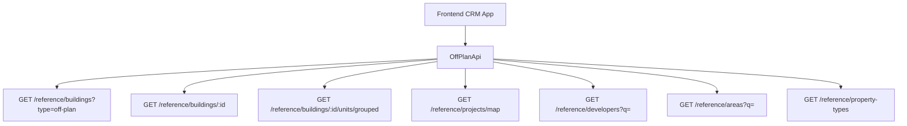

## Overview

Add an **Off-Plan** tab under the **Real Estate** section of the main CRM sidebar. This page displays all published buildings from developer portal users in a card grid view with rich filters, 2GIS map integration, and a detailed building view.

<Note>
Minimal backend changes required. Most API endpoints already exist under `/reference/buildings`, `/reference/projects`, and `/reference/units`. The frontend consumes these with the `?type=off-plan` filter parameter.
</Note>

The only backend addition is a `maxPreHandoverPercent` query parameter on the buildings search endpoint to support the payment plan filter.

## Architecture Decision

### Buildings vs Projects as Primary Entity

Based on the existing data model, **buildings** are the primary enrichment entity:

- Buildings have their own `isPublished`, `priceFrom`, `coverImageUrl`, `status`, `completionDate`, `tags`, `paymentPlans`, `gallery`, `documents`, `amenities`
- Buildings can override inherited fields from projects (status, area, community, description)
- The off-plan directory should display **published buildings**, since a project may contain multiple buildings with different statuses and pricing

<Info>
The list page queries `GET /reference/buildings?type=off-plan`, and the detail page queries `GET /reference/buildings/:id`.
</Info>

### Data Flow



## Implementation Steps

<Steps>
<Step title="Update Sidebar Navigation">
Replace the existing Real Estate menu items with the new Off-Plan tab.
</Step>

<Step title="Create Route Structure">
Set up the page routing for list and detail views.
</Step>

<Step title="Build Component Structure">
Create all necessary components for list and detail pages.
</Step>

<Step title="Implement API Layer">
Create the OffPlanApi service to wrap existing endpoints.
</Step>

<Step title="Add Query Keys">
Define React Query keys for data fetching.
</Step>

<Step title="Create Hooks">
Implement custom hooks for data management.
</Step>
</Steps>

## 1. Sidebar Navigation

### File: `src/components/layouts/CRMLayout.tsx`

<Warning>
Replace the entire `data.realEstate` array with a single "Off-Plan" entry. The existing Areas, Developments, and Units tabs are removed.
</Warning>

```typescript
realEstate: [
  {
    title: 'Off-Plan',
    url: '/home/real-estate/off-plan',
    icon: Building2,  // from lucide-react (already imported)
  },
],
```

### Breadcrumb Updates

Replace all existing real-estate breadcrumb handling with off-plan routes:

```
Real Estate > Off-Plan                           (list page)
Real Estate > Off-Plan > {Building Name}         (detail page)
```

Remove breadcrumb entries for `/real-estate/areas`, `/real-estate/developments`, `/real-estate/units`, and `/real-estate/prospects`.

## 2. Route Structure

```
src/app/home/real-estate/off-plan/
├── page.tsx                    # List page (grid + map toggle)
└── [id]/
    └── page.tsx                # Building detail page
```

<Tip>
Both pages follow the component extraction guide — page files contain ONLY the page function (< 200 lines).
</Tip>

## 3. Component Structure

<AccordionGroup>
<Accordion title="List Page Components">
```
src/components/pages/off-plan/
├── off-plan-building-card.tsx          # Building card for grid view
├── off-plan-filters.tsx               # Horizontal filter bar
├── off-plan-map-view.tsx              # 2GIS map with markers + popover
├── off-plan-grid-view.tsx             # Grid of building cards + pagination
├── off-plan-toolbar.tsx               # View toggle (Grid/Map), sort, saved filters
```
</Accordion>

<Accordion title="Detail Page Components">
```
src/components/pages/off-plan/
├── building-detail-header.tsx          # Sticky sidebar: name, price, units count, payment plan, developer, CTA buttons
├── building-detail-description.tsx     # Description section with Read More
├── building-detail-units.tsx           # Units & Availability (accordion grouped by bedrooms)
├── building-detail-unit-modal.tsx      # Unit detail popup (floor plan, specs, price)
├── building-detail-gallery.tsx         # Gallery grid with lightbox
├── building-detail-amenities.tsx       # Features/Amenities image grid
├── building-detail-location.tsx        # Location section with 2GIS map
├── building-detail-info-table.tsx      # Details table (Project Name, Developer, Branded, etc.)
├── building-detail-payment-plan.tsx    # Payment plan visualization (progress bar + breakdown)
├── building-detail-documents.tsx       # Documents & links (PDF cards)
├── building-detail-developer.tsx       # Developer info card (from DeveloperContactDto)
```
</Accordion>
</AccordionGroup>

## 4. API Layer

### New File: `src/services/api/off-plan.api.ts`

This API file wraps the existing reference data endpoints with off-plan-specific defaults.

<CodeGroup>
```typescript Filter Types
export interface OffPlanBuildingFilters {
  q?: string;
  status?: string;
  areaId?: number;
  communityId?: number;
  developerId?: number;            // Filter by developer (joined through project→developer)
  propertyTypeId?: number;
  propertySubTypeId?: number;
  minPrice?: number;
  maxPrice?: number;
  bedrooms?: string;               // e.g., "1", "2", "3", "studio"
  completionBefore?: string;       // ISO date — handover filter
  completionAfter?: string;        // ISO date — handover filter
  maxPreHandoverPercent?: number;  // Payment plan filter (backend filter)
  page?: number;
  limit?: number;
  sortBy?: string;
  sortOrder?: 'asc' | 'desc';
}

export interface MapMarkerFilters {
  type?: string;
  areaId?: number;
  developerId?: number;
  minPrice?: number;
  maxPrice?: number;
}
```

```typescript API Class
export class OffPlanApi {
  /** Search published off-plan buildings */
  static async searchBuildings(filters: OffPlanBuildingFilters) {
    return apiClient.get('/reference/buildings', {
      params: { ...filters, type: 'off-plan' },
    });
  }

  /** Get building detail with all enrichment */
  static async getBuildingDetail(id: number) {
    return apiClient.get(`/reference/buildings/${id}`);
  }

  /** Get units grouped by bedroom category */
  static async getBuildingUnitsGrouped(buildingId: number) {
    return apiClient.get(`/reference/buildings/${buildingId}/units/grouped`);
  }

  /** Get single unit detail */
  static async getUnitDetail(unitId: number) {
    return apiClient.get(`/reference/units/${unitId}`);
  }

  /** Get map markers (lightweight project data with coordinates) */
  static async getMapMarkers(filters?: MapMarkerFilters) {
    return apiClient.get('/reference/projects/map', { params: filters });
  }

  /** Search developers for filter dropdown */
  static async searchDevelopers(q?: string) {
    return apiClient.get('/reference/developers', { params: { q } });
  }

  /** Search areas for filter dropdown */
  static async searchAreas(q?: string, cityId?: number) {
    return apiClient.get('/reference/areas', { params: { q, cityId } });
  }

  /** Get property types for unit type filter */
  static async getPropertyTypes() {
    return apiClient.get('/reference/property-types');
  }
}
```
</CodeGroup>

### Response Types in `src/services/api/types.ts`

<Tabs>
<Tab title="Building & Unit Types">
```typescript
export interface RefBuildingDto {
  id: number;
  name?: string;
  buildingNumber?: string;
  floors?: string;
  rooms?: string;
  projectId?: number;
  projectName?: string;
  developerName?: string;
  developerId?: number;
  areaName?: string;
  areaId?: number;
  communityName?: string;
  communityId?: number;
  // Overridable inherited
  status?: string;
  percentCompleted?: number;
  startDate?: string;
  endDate?: string;
  descriptionEn?: string;
  // Enrichment
  latitude?: number;
  longitude?: number;
  priceFrom?: number;
  currency?: string;
  coverImageUrl?: string;
  completionDate?: string;
  unitCount?: number;
  isBranded?: boolean;
  isFurnished?: boolean;
  serviceChargePerSqft?: number;
  tags?: string[];
  isPublished?: boolean;
  // Collections (populated on detail)
  gallery?: RefGalleryImageDto[];
  paymentPlans?: RefPaymentPlanDto[];
  documents?: RefDocumentDto[];
  amenities?: RefAmenityDto[];
  units?: RefUnitDto[];
  // Developer contact (populated on detail)
  developerContact?: DeveloperContactDto;
}

export interface RefUnitDto {
  id: number;
  unitNumber?: string;
  floor?: string;
  rooms?: number;
  actualArea?: number;
  actualCommonArea?: number;
  balconyArea?: number;
  price?: number;
  pricePerSqft?: number;
  availabilityStatus?: string;
  floorPlanUrl?: string;
  isFurnished?: boolean;
  bedroomCategory?: string;
  bedroomsCount?: number;
  bathroomsCount?: number;
  buildingId?: number;
  buildingName?: string;
  projectId?: number;
  projectName?: string;
  propertySubTypeName?: string;
}

export interface RefUnitGroupDto {
  bedroomCategory: string;
  unitCount: number;
  minArea: number;
  maxArea: number;
  minPrice: number;
  maxPrice: number;
  units: RefUnitDto[];
}
```
</Tab>

<Tab title="Supporting Types">
```typescript
export interface RefGalleryImageDto {
  id: number;
  url: string;
  category: string;
  caption?: string;
  sortOrder: number;
}

export interface RefPaymentPlanDto {
  id: number;
  title?: string;
  onBookingPercentage?: number;
  constructionPercentage?: number;
  handoverPercentage?: number;
  postHandoverPercentage?: number;
}

export interface RefDocumentDto {
  id: number;
  name: string;
  type: string;
  url: string;
}

export interface RefAmenityDto {
  id: number;
  name: string;
  imageUrl?: string;
}

export interface RefDeveloperDto {
  id: number;
  nameEn?: string;
  nameAr?: string;
  developerNumber?: string;
  webpage?: string;
  phone?: string;
}

export interface DeveloperContactDto {
  name: string;
  email?: string;
  phone?: string;
  whatsappNumber?: string;
  languages?: string[];
  avatarUrl?: string;
}

export interface RefMapProjectDto {
  id: number;
  name?: string;
  latitude?: number;
  longitude?: number;
  priceFrom?: number;
  coverImageUrl?: string;
  developerName?: string;
  status?: string;
  completionDate?: string;
}

export interface PaginatedRefResponse<T> {
  data: T[];
  total: number;
  page: number;
  limit: number;
  totalPages: number;
}
```
</Tab>
</Tabs>

## 5. Query Keys

### File: `src/lib/query-keys.ts`

Add a new `offPlan` section:

```typescript
// ============================================
// OFF-PLAN DIRECTORY
// ============================================
offPlan: {
  all: ['off-plan'] as const,
  buildings: () => [...queryKeys.offPlan.all, 'buildings'] as const,
  buildingsList: (filters: OffPlanBuildingFilters) => 
    [...queryKeys.offPlan.buildings(), 'list', filters] as const,
  buildingDetail: (id: number) => 
    [...queryKeys.offPlan.buildings(), 'detail', id] as const,
  buildingUnits: (buildingId: number) => 
    [...queryKeys.offPlan.buildings(), 'units', buildingId] as const,
  mapMarkers: (filters?: MapMarkerFilters) => 
    [...queryKeys.offPlan.all, 'map', filters] as const,
  developers: (q?: string) => 
    [...queryKeys.offPlan.all, 'developers', q] as const,
  areas: (q?: string, cityId?: number) => 
    [...queryKeys.offPlan.all, 'areas', { q, cityId }] as const,
  propertyTypes: () => 
    [...queryKeys.offPlan.all, 'property-types'] as const,
},
```

## 6. Custom Hooks

### File: `src/hooks/off-plan/use-off-plan-buildings.ts`

<CodeGroup>
```typescript List Hook
export function useOffPlanBuildings(filters: OffPlanBuildingFilters) {
  return useQuery({
    queryKey: queryKeys.offPlan.buildingsList(filters),
    queryFn: () => OffPlanApi.searchBuildings(filters),
    select: (response) => response.data as PaginatedRefResponse<RefBuildingDto>,
    staleTime: 5 * 60 * 1000, // 5 minutes
  });
}
```

```typescript Detail Hook
export function useOffPlanBuildingDetail(id: number) {
  return useQuery({
    queryKey: queryKeys.offPlan.buildingDetail(id),
    queryFn: () => OffPlanApi.getBuildingDetail(id),
    select: (response) => response.data as RefBuildingDto,
    enabled: !!id,
    staleTime: 10 * 60 * 1000, // 10 minutes
  });
}
```

```typescript Units Hook
export function useOffPlanBuildingUnits(buildingId: number) {
  return useQuery({
    queryKey: queryKeys.offPlan.buildingUnits(buildingId),
    queryFn: () => OffPlanApi.getBuildingUnitsGrouped(buildingId),
    select: (response) => response.data as RefUnitGroupDto[],
    enabled: !!buildingId,
    staleTime: 10 * 60 * 1000,
  });
}
```
</CodeGroup>

## 7. Map Integration

### File: `src/hooks/off-plan/use-off-plan-map.ts`

```typescript
export function useOffPlanMapMarkers(filters?: MapMarkerFilters) {
  return useQuery({
    queryKey: queryKeys.offPlan.mapMarkers(filters),
    queryFn: () => OffPlanApi.getMapMarkers(filters),
    select: (response) => response.data as RefMapProjectDto[],
    staleTime: 5 * 60 * 1000,
  });
}
```

<Note>
The 2GIS map integration should display project markers with popover previews showing basic building information (name, developer, price from, status).
</Note>

## Key Features

<CardGroup cols={2}>
<Card title="Rich Filtering" icon="filter">
Search, Developer, Price, Payments, Handover, Unit type, Bedrooms, Status filters
</Card>

<Card title="2GIS Map View" icon="map">
Interactive map with project markers and popover previews
</Card>

<Card title="Detailed Building View" icon="building">
Comprehensive building information including units, amenities, and payment plans
</Card>

<Card title="Unit Management" icon="home">
Grouped unit display with detailed specifications and availability
</Card>
</CardGroup>

## Backend Requirements

<Check>Most endpoints already exist under `/reference/buildings`, `/reference/projects`, and `/reference/units`</Check>

The only backend addition required:

- Add `maxPreHandoverPercent` query parameter to the buildings search endpoint to support payment plan filtering

## Visual Design References

The implementation should replicate key visual patterns from the provided reference screenshots:

1. **Grid view**: Cards with cover image, status badges, handover quarter, building name, area + developer, price from, and payment plan ratio
2. **Map view**: Split layout with scrollable card list and interactive map with markers
3. **Filters**: Horizontal filter pills for all search criteria
4. **Detail page**: Right-sticky sidebar with scrollable content area containing all building information

<Tip>
Follow the existing component extraction guide to keep page files under 200 lines and maintain proper separation of concerns.
</Tip>