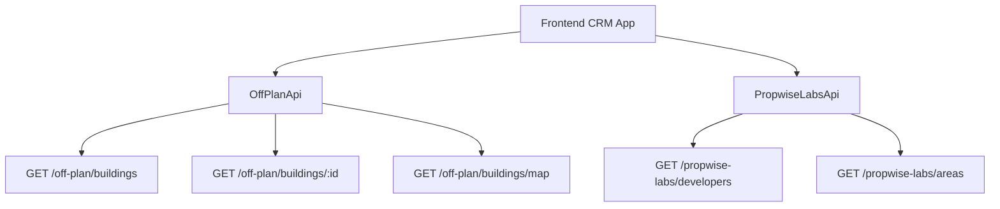

## Overview

The Off-Plan Directory adds a new **Off-Plan** tab under the **Properties** section of the main CRM sidebar. This page displays all published buildings from developer portal users in a card/map split view with rich filters, 2GIS map integration, and detailed building views.

<Note>
Off-plan data is served through domain endpoints under `/off-plan/*`. These endpoints read Propwise Labs catalog data and apply CRM-owned visibility from `off_plan_building_publication` plus the off-plan lifecycle helper, so main CRM users only receive buildings with `is_published=true` that still classify as off-plan.
</Note>

## Architecture Overview

### Buildings vs Projects as Primary Entity

Based on the existing data model, **buildings** are the primary enrichment entity:

- Buildings have their own `coverImageUrl`, `status`, `endDate`, `completionDate`, `paymentPlans`, `images`, `documents`, `amenities`
- Buildings can override inherited fields from projects (status, area, community, description)
- The off-plan directory displays **published buildings** based on CRM `is_published` visibility

<Info>
Publication is separate from Propwise Labs `building.status`. Developers publish or unpublish a building through the developer portal, which writes `off_plan_building_publication.is_published` for the Propwise Labs `building_id`.
</Info>

### Data Flow



The `/off-plan/buildings` endpoints enforce publication by checking `off_plan_building_publication.is_published=true` and require buildings to match the off-plan lifecycle helper.

## Implementation Steps

<Steps>

<Step title="Update Sidebar Navigation">
Replace the entire `data.realEstate` array in `src/components/layouts/CRMLayout.tsx` with a single "Off-Plan" entry:

```typescript
realEstate: [
  {
    title: 'Off-Plan',
    url: '/properties/off-plan',
    icon: Building2,  // from lucide-react
  },
],
```

Remove the old sidebar entries for Areas, Developments, and Units.
</Step>

<Step title="Create Route Structure">
Set up the following route structure:

```
src/app/(app)/properties/off-plan/
├── page.tsx                    # Map/list page
└── [id]/
    └── page.tsx                # Re-exports ../page
```

<Warning>
The `[id]/page.tsx` route must not implement a separate building detail page. It delegates to the main off-plan page so `/properties/off-plan/:buildingId` preserves the map, filters, and left-side panel behavior.
</Warning>
</Step>

<Step title="Build Component Structure">
Create the component hierarchy:

```
src/components/pages/off-plan/
├── index.ts                           # Barrel export
├── off-plan-building-card.tsx          # Building card for grid view
├── off-plan-filters.tsx               # Horizontal filter bar
├── off-plan-map-view.tsx              # 2GIS map with markers
├── off-plan-grid-view.tsx             # Scrollable grid of cards
├── off-plan-building-detail-panel.tsx  # Animated detail panel
└── off-plan-toolbar.tsx               # View toggle, sort, filters
```
</Step>

</Steps>

## Frontend Status Mapping

Frontend display status is derived from `building.status` through `getOffPlanFrontendStatus()`:

| Backend Status | Frontend Status | Color  |
|---------------|-----------------|--------|
| `ACTIVE`      | On Sale         | Orange |
| `PENDING`     | EOI             | Purple |
| `FINISHED`    | Out of Stock    | Gray   |

## Publication Requirements

<Accordion title="Publish-Readiness Gate">
Before setting `is_published=true`, buildings must satisfy the complete building contract:

**Required Fields:**
- `name`
- `buildingNumber` 
- `descriptionEn`
- `floors`
- `googleMapsLink`
- `startDate`
- `coverImageUrl`
- `area.id`
- `plotSize`
- `actualArea`
- `parkingCount`
- `serviceChargePerSqft`
- At least 1 `media` item
- `salesStatus`

**Villa Projects Requirements:**
- `name`
- `descriptionEn`
- `imageUrl` cover
- `googleMapsLink`
- `area.id`
- `latitude`
- `longitude`
- At least 1 `media` item
- `salesStatus`

<Note>
All missing fields are aggregated into a single `400 BadRequest` response. Unpublishing always succeeds and bypasses the readiness gate.
</Note>
</Accordion>

## Auto-Maintained Sales Status

<Info>
A building's `salesStatus` is auto-maintained from live unit availability. When a developer changes a unit's `salesStatus`, the system automatically updates the building status to `OUT_OF_STOCK` when no units remain `AVAILABLE`.
</Info>

The system follows these rules:
- `OUT_OF_STOCK`: All units are `RESERVED` or `SOLD`
- `ON_SALE`: At least one unit is `AVAILABLE`
- Auto-revert occurs when an `AVAILABLE` unit reappears

## API Endpoints

<Tabs>
<Tab title="Off-Plan Endpoints">

```typescript
// Building list with filters
GET /off-plan/buildings
Query: {
  search?: string
  developers?: string[]
  areas?: string[]
  minPrice?: number
  maxPrice?: number
  bedrooms?: number[]
  statuses?: string[]
  handover?: string
  page?: number
  limit?: number
}

// Building detail
GET /off-plan/buildings/:id

// Map markers
GET /off-plan/buildings/map
Query: {
  bounds?: {
    northeast: { lat: number, lng: number }
    southwest: { lat: number, lng: number }
  }
}

// Grouped units for detail panel
GET /off-plan/buildings/:id/units/grouped
```

</Tab>
<Tab title="Supporting Endpoints">

```typescript
// Developer options for filters
GET /propwise-labs/developers?q=searchTerm

// Area options for filters  
GET /propwise-labs/areas?q=searchTerm
```

</Tab>
</Tabs>

## Map Integration

The 2GIS map integration includes:

<CardGroup cols={2}>
<Card title="Custom Markers" icon="map-marker">
Circular developer-logo markers with hover popover previews
</Card>
<Card title="Bidirectional Sync" icon="arrows-rotate">
Hovering cards pans map to marker; hovering markers highlights cards
</Card>
<Card title="Dynamic Loading" icon="download">
"Search this area" loads markers when map bounds change
</Card>
<Card title="Status Colors" icon="palette">
Marker borders reflect frontend status colors
</Card>
</CardGroup>

## Detail Panel Features

The building detail panel includes tabbed content:

<AccordionGroup>
<Accordion title="Overview Tab">
- Cover image with price overlay
- Collapsible description with "Show more"
- Building details table
- Construction progress bar
- Unit availability summary (4 cards)
- Payment plan information
- Amenities grid
- Location details
</Accordion>

<Accordion title="Units Tab">
- Grouped unit listings by type
- Unit availability status
- Pricing information
- Floor plan previews
</Accordion>

<Accordion title="Media Tab">
- Image gallery
- Video content
- Virtual tours
- Document downloads
</Accordion>

<Accordion title="Contact Tab">
- Developer contact information
- Inquiry form
- Schedule viewing options
</Accordion>
</AccordionGroup>

<Check>
The detail panel uses an animated left-column overlay that preserves the map view and filters when opened via `/properties/off-plan/:buildingId` routes.
</Check>