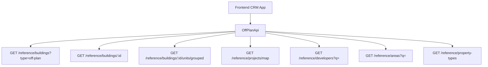

# Off-Plan Directory Implementation

## Overview

This document provides a complete implementation specification for adding an **Off-Plan** tab under the **Real Estate** section of the main CRM sidebar. The feature displays all published buildings from developer portal users in a card grid view with rich filters, 2GIS map integration, and detailed building views.

<Note>
**Minimal backend changes required.** Most API endpoints already exist under `/reference/buildings`, `/reference/projects`, and `/reference/units`. The frontend consumes these with the `?type=off-plan` filter parameter.
</Note>

The only backend addition needed is a `maxPreHandoverPercent` query parameter on the buildings search endpoint to support the payment plan filter.

## Architecture Decision

### Buildings vs Projects as Primary Entity

Based on the existing data model, **buildings** are the primary enrichment entity:

<Check>
- Buildings have their own `isPublished`, `priceFrom`, `coverImageUrl`, `status`, `completionDate`, `tags`, `paymentPlans`, `gallery`, `documents`, `amenities`
- Buildings can override inherited fields from projects (status, area, community, description)
- The off-plan directory displays **published buildings**, since a project may contain multiple buildings with different statuses and pricing
</Check>

### Data Flow Architecture



## Implementation Steps

<Steps>
<Step title="Update Sidebar Navigation">
Replace the entire `data.realEstate` array in `src/components/layouts/CRMLayout.tsx` with a single "Off-Plan" entry.

```typescript
realEstate: [
  {
    title: 'Off-Plan',
    url: '/home/real-estate/off-plan',
    icon: Building2,  // from lucide-react (already imported)
  },
],
```

Remove the old sidebar entries for Areas, Developments, and Units.
</Step>

<Step title="Set Up Route Structure">
Create the following route structure:

```
src/app/home/real-estate/off-plan/
├── page.tsx                    # List page (grid + map toggle)
└── [id]/
    └── page.tsx                # Building detail page
```

Both pages follow the component extraction guide — page files contain ONLY the page function (< 200 lines).
</Step>

<Step title="Create Component Architecture">
Establish the component structure under `src/components/pages/off-plan/`:

<Tabs>
<Tab title="List Page Components">
- `off-plan-building-card.tsx` - Building card for grid view
- `off-plan-filters.tsx` - Horizontal filter bar
- `off-plan-map-view.tsx` - 2GIS map with markers + popover
- `off-plan-grid-view.tsx` - Grid of building cards + pagination
- `off-plan-toolbar.tsx` - View toggle (Grid/Map), sort, saved filters
</Tab>
<Tab title="Detail Page Components">
- `building-detail-header.tsx` - Sticky sidebar with key info
- `building-detail-description.tsx` - Description with Read More
- `building-detail-units.tsx` - Units grouped by bedrooms
- `building-detail-unit-modal.tsx` - Unit detail popup
- `building-detail-gallery.tsx` - Gallery with lightbox
- `building-detail-amenities.tsx` - Features/Amenities grid
- `building-detail-location.tsx` - Location with 2GIS map
- `building-detail-info-table.tsx` - Details table
- `building-detail-payment-plan.tsx` - Payment plan visualization
- `building-detail-documents.tsx` - Documents & links
- `building-detail-developer.tsx` - Developer info card
</Tab>
</Tabs>
</Step>

<Step title="Implement API Layer">
Create `src/services/api/off-plan.api.ts` to wrap existing reference data endpoints.
</Step>

<Step title="Add Response Types">
Add reference data response types in `src/services/api/types.ts` for shared usage across modules.
</Step>

<Step title="Configure Query Keys">
Add off-plan query keys to `src/lib/query-keys.ts` for React Query caching.
</Step>
</Steps>

## API Layer Implementation

### Off-Plan API Service

<CodeGroup>
```typescript src/services/api/off-plan.api.ts
// ── Filter/Query Types ──
export interface OffPlanBuildingFilters {
  q?: string;
  status?: string;
  areaId?: number;
  communityId?: number;
  developerId?: number;
  propertyTypeId?: number;
  propertySubTypeId?: number;
  minPrice?: number;
  maxPrice?: number;
  bedrooms?: string;
  completionBefore?: string;
  completionAfter?: string;
  maxPreHandoverPercent?: number;
  page?: number;
  limit?: number;
  sortBy?: string;
  sortOrder?: 'asc' | 'desc';
}

export interface MapMarkerFilters {
  type?: string;
  areaId?: number;
  developerId?: number;
  minPrice?: number;
  maxPrice?: number;
}

// ── API Class ──
export class OffPlanApi {
  /** Search published off-plan buildings */
  static async searchBuildings(filters: OffPlanBuildingFilters) {
    return apiClient.get('/reference/buildings', {
      params: { ...filters, type: 'off-plan' },
    });
  }

  /** Get building detail with all enrichment */
  static async getBuildingDetail(id: number) {
    return apiClient.get(`/reference/buildings/${id}`);
  }

  /** Get units grouped by bedroom category */
  static async getBuildingUnitsGrouped(buildingId: number) {
    return apiClient.get(`/reference/buildings/${buildingId}/units/grouped`);
  }

  /** Get single unit detail */
  static async getUnitDetail(unitId: number) {
    return apiClient.get(`/reference/units/${unitId}`);
  }

  /** Get map markers */
  static async getMapMarkers(filters?: MapMarkerFilters) {
    return apiClient.get('/reference/projects/map', { params: filters });
  }

  /** Search developers for filter dropdown */
  static async searchDevelopers(q?: string) {
    return apiClient.get('/reference/developers', { params: { q } });
  }

  /** Search areas for filter dropdown */
  static async searchAreas(q?: string, cityId?: number) {
    return apiClient.get('/reference/areas', { params: { q, cityId } });
  }

  /** Get property types for unit type filter */
  static async getPropertyTypes() {
    return apiClient.get('/reference/property-types');
  }
}
```
</CodeGroup>

### Response Types

<AccordionGroup>
<Accordion title="Reference Building DTO">
```typescript
export interface RefBuildingDto {
  id: number;
  name?: string;
  buildingNumber?: string;
  floors?: string;
  rooms?: string;
  projectId?: number;
  projectName?: string;
  developerName?: string;
  developerId?: number;
  areaName?: string;
  areaId?: number;
  communityName?: string;
  communityId?: number;
  // Overridable inherited
  status?: string;
  percentCompleted?: number;
  startDate?: string;
  endDate?: string;
  descriptionEn?: string;
  // Enrichment
  latitude?: number;
  longitude?: number;
  priceFrom?: number;
  currency?: string;
  coverImageUrl?: string;
  completionDate?: string;
  unitCount?: number;
  isBranded?: boolean;
  isFurnished?: boolean;
  serviceChargePerSqft?: number;
  tags?: string[];
  isPublished?: boolean;
  // Collections
  gallery?: RefGalleryImageDto[];
  paymentPlans?: RefPaymentPlanDto[];
  documents?: RefDocumentDto[];
  amenities?: RefAmenityDto[];
  units?: RefUnitDto[];
  developerContact?: DeveloperContactDto;
}
```
</Accordion>

<Accordion title="Unit & Related DTOs">
```typescript
export interface RefUnitDto {
  id: number;
  unitNumber?: string;
  floor?: string;
  rooms?: number;
  actualArea?: number;
  actualCommonArea?: number;
  balconyArea?: number;
  price?: number;
  pricePerSqft?: number;
  availabilityStatus?: string;
  floorPlanUrl?: string;
  isFurnished?: boolean;
  bedroomCategory?: string;
  bedroomsCount?: number;
  bathroomsCount?: number;
  buildingId?: number;
  buildingName?: string;
  projectId?: number;
  projectName?: string;
  propertySubTypeName?: string;
}

export interface RefUnitGroupDto {
  bedroomCategory: string;
  unitCount: number;
  minArea: number;
  maxArea: number;
  minPrice: number;
  maxPrice: number;
  units: RefUnitDto[];
}
```
</Accordion>

<Accordion title="Media & Document DTOs">
```typescript
export interface RefGalleryImageDto {
  id: number;
  url: string;
  category: string;
  caption?: string;
  sortOrder: number;
}

export interface RefPaymentPlanDto {
  id: number;
  title?: string;
  onBookingPercentage?: number;
  constructionPercentage?: number;
  handoverPercentage?: number;
  postHandoverPercentage?: number;
}

export interface RefDocumentDto {
  id: number;
  name: string;
  type: string;
  url: string;
}

export interface RefAmenityDto {
  id: number;
  name: string;
  imageUrl?: string;
}
```
</Accordion>

<Accordion title="Developer & Map DTOs">
```typescript
export interface RefDeveloperDto {
  id: number;
  nameEn?: string;
  nameAr?: string;
  developerNumber?: string;
  webpage?: string;
  phone?: string;
}

export interface DeveloperContactDto {
  name: string;
  email?: string;
  phone?: string;
  whatsappNumber?: string;
  languages?: string[];
  avatarUrl?: string;
}

export interface RefMapProjectDto {
  id: number;
  name?: string;
  latitude?: number;
  longitude?: number;
  priceFrom?: number;
  coverImageUrl?: string;
  developerName?: string;
  status?: string;
  completionDate?: string;
}

export interface PaginatedRefResponse<T> {
  data: T[];
  total: number;
  page: number;
  limit: number;
  totalPages: number;
}
```
</Accordion>
</AccordionGroup>

## Query Keys Configuration

Add the following to `src/lib/query-keys.ts`:

```typescript
// ============================================
// OFF-PLAN DIRECTORY
// ============================================
offPlan: {
  all: ['off-plan'] as const,
  buildings: {
    all: ['off-plan', 'buildings'] as const,
    list: (filters: OffPlanBuildingFilters) => 
      ['off-plan', 'buildings', 'list', filters] as const,
    detail: (id: number) => 
      ['off-plan', 'buildings', 'detail', id] as const,
    units: (buildingId: number) => 
      ['off-plan', 'buildings', 'units', buildingId] as const,
  },
  map: {
    all: ['off-plan', 'map'] as const,
    markers: (filters: MapMarkerFilters) => 
      ['off-plan', 'map', 'markers', filters] as const,
  },
  filters: {
    developers: (q?: string) => 
      ['off-plan', 'filters', 'developers', q] as const,
    areas: (q?: string, cityId?: number) => 
      ['off-plan', 'filters', 'areas', q, cityId] as const,
    propertyTypes: () => 
      ['off-plan', 'filters', 'property-types'] as const,
  },
},
```

## Key Features

<CardGroup cols={2}>
<Card title="List View" icon="grid-3x3">
Grid layout with building cards showing cover image, status badges, handover info, pricing, and payment plans
</Card>

<Card title="Map Integration" icon="map-pin">
Interactive 2GIS map with project markers and popover previews in split-screen layout
</Card>

<Card title="Advanced Filters" icon="filter">
Horizontal filter bar with search, developer, price range, payment plans, handover dates, unit types, and bedrooms
</Card>

<Card title="Building Details" icon="building-2">
Comprehensive building pages with sticky sidebar, unit availability, gallery, amenities, location, and developer info
</Card>
</CardGroup>

## Design Patterns

<Tip>
The implementation follows the existing CRM design patterns and component architecture. All components should be extracted following the project's component extraction guide with page files containing only the page function (< 200 lines).
</Tip>

### Visual Elements

- **Status badges**: EOI, On Sale, Announced
- **Payment plan visualization**: Progress bars with percentage breakdowns
- **Unit grouping**: Accordion-style grouping by bedroom count
- **Gallery lightbox**: Full-screen image viewing with navigation
- **Map integration**: 2GIS embedded maps with custom markers

<Warning>
Remove all existing sidebar entries for Areas, Developments, and Units when implementing the off-plan directory, as this feature supersedes the old real estate sections.
</Warning>

## Breadcrumb Updates

Replace all existing real-estate breadcrumb handling with off-plan routes:

- `Real Estate > Off-Plan` (list page)
- `Real Estate > Off-Plan > {Building Name}` (detail page)

Remove breadcrumb entries for `/real-estate/areas`, `/real-estate/developments`, `/real-estate/units`, and `/real-estate/prospects`.