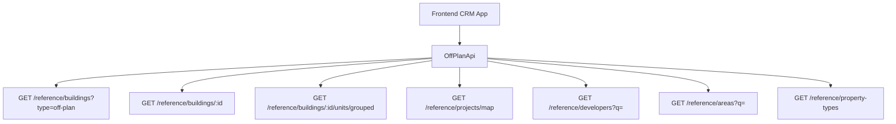

## Overview

The Off-Plan Directory adds a new **Off-Plan** tab under the **Real Estate** section of the main CRM sidebar. This page displays all published buildings from developer portal users in a card grid view with rich filters, 2GIS map integration, and a detailed building view.

<Note>
Minimal backend changes required. Most API endpoints already exist under `/reference/buildings`, `/reference/projects`, and `/reference/units`. The frontend consumes these with the `?type=off-plan` filter parameter.
</Note>

The only backend addition needed is a `maxPreHandoverPercent` query parameter on the buildings search endpoint to support the payment plan filter.

## Architecture decisions

### Buildings vs Projects as primary entity

Based on the existing data model, **buildings** are the primary enrichment entity:

- Buildings have their own `isPublished`, `priceFrom`, `coverImageUrl`, `status`, `completionDate`, `tags`, `paymentPlans`, `gallery`, `documents`, `amenities`
- Buildings can override inherited fields from projects (status, area, community, description)
- The off-plan directory should display **published buildings**, since a project may contain multiple buildings with different statuses and pricing

<Info>
The list page queries `GET /reference/buildings?type=off-plan`, and the detail page queries `GET /reference/buildings/:id`.
</Info>

### Data flow



## Sidebar navigation

### File: `src/components/layouts/CRMLayout.tsx`

<Warning>
Replace the entire `data.realEstate` array with a single "Off-Plan" entry. The existing Areas, Developments, and Units tabs are removed — the off-plan directory supersedes them.
</Warning>

```typescript
realEstate: [
  {
    title: 'Off-Plan',
    url: '/home/real-estate/off-plan',
    icon: Building2,  // from lucide-react (already imported)
  },
],
```

### Breadcrumb updates

Replace all existing real-estate breadcrumb handling (areas, developments, units) with off-plan routes:

```
Real Estate > Off-Plan                           (list page)
Real Estate > Off-Plan > {Building Name}         (detail page)
```

Remove the breadcrumb entries for `/real-estate/areas`, `/real-estate/developments`, `/real-estate/units`, and `/real-estate/prospects`.

## Route structure

```
src/app/home/real-estate/off-plan/
├── page.tsx                    # List page (grid + map toggle)
└── [id]/
    └── page.tsx                # Building detail page
```

<Tip>
Both pages follow the component extraction guide — page files contain ONLY the page function (< 200 lines).
</Tip>

## Component structure

```
src/components/pages/off-plan/
├── index.ts                           # Barrel export
│
│   ── List Page Components ──
├── off-plan-building-card.tsx          # Building card for grid view
├── off-plan-filters.tsx               # Horizontal filter bar
├── off-plan-map-view.tsx              # 2GIS map with markers + popover
├── off-plan-grid-view.tsx             # Grid of building cards + pagination
├── off-plan-toolbar.tsx               # View toggle (Grid/Map), sort, saved filters
│
│   ── Detail Page Components ──
├── building-detail-header.tsx          # Sticky sidebar: name, price, units count, payment plan, developer, CTA buttons
├── building-detail-description.tsx     # Description section with Read More
├── building-detail-units.tsx           # Units & Availability (accordion grouped by bedrooms)
├── building-detail-unit-modal.tsx      # Unit detail popup (floor plan, specs, price)
├── building-detail-gallery.tsx         # Gallery grid with lightbox
├── building-detail-amenities.tsx       # Features/Amenities image grid
├── building-detail-location.tsx        # Location section with 2GIS map
├── building-detail-info-table.tsx      # Details table (Project Name, Developer, Branded, etc.)
├── building-detail-payment-plan.tsx    # Payment plan visualization (progress bar + breakdown)
├── building-detail-documents.tsx       # Documents & links (PDF cards)
├── building-detail-developer.tsx       # Developer info card (from DeveloperContactDto)
```

## API layer

### New file: `src/services/api/off-plan.api.ts`

This API file wraps the existing reference data endpoints with off-plan-specific defaults.

<Tabs>
<Tab title="Filter types">

```typescript
export interface OffPlanBuildingFilters {
  q?: string;
  status?: string;
  areaId?: number;
  communityId?: number;
  developerId?: number; // Filter by developer (joined through project→developer)
  propertyTypeId?: number;
  propertySubTypeId?: number;
  minPrice?: number;
  maxPrice?: number;
  bedrooms?: string; // e.g., "1", "2", "3", "studio"
  completionBefore?: string; // ISO date — handover filter
  completionAfter?: string; // ISO date — handover filter
  maxPreHandoverPercent?: number; // Payment plan filter (backend filter)
  page?: number;
  limit?: number;
  sortBy?: string;
  sortOrder?: 'asc' | 'desc';
}

export interface MapMarkerFilters {
  type?: string;
  areaId?: number;
  developerId?: number;
  minPrice?: number;
  maxPrice?: number;
}
```

</Tab>
<Tab title="API class">

```typescript
export class OffPlanApi {
  /** Search published off-plan buildings */
  static async searchBuildings(filters: OffPlanBuildingFilters) {
    return apiClient.get('/reference/buildings', {
      params: { ...filters, type: 'off-plan' },
    });
  }

  /** Get building detail with all enrichment */
  static async getBuildingDetail(id: number) {
    return apiClient.get(`/reference/buildings/${id}`);
  }

  /** Get units grouped by bedroom category */
  static async getBuildingUnitsGrouped(buildingId: number) {
    return apiClient.get(`/reference/buildings/${buildingId}/units/grouped`);
  }

  /** Get single unit detail */
  static async getUnitDetail(unitId: number) {
    return apiClient.get(`/reference/units/${unitId}`);
  }

  /** Get map markers (lightweight project data with coordinates) */
  static async getMapMarkers(filters?: MapMarkerFilters) {
    return apiClient.get('/reference/projects/map', { params: filters });
  }

  /** Search developers for filter dropdown */
  static async searchDevelopers(q?: string) {
    return apiClient.get('/reference/developers', { params: { q } });
  }

  /** Search areas for filter dropdown */
  static async searchAreas(q?: string, cityId?: number) {
    return apiClient.get('/reference/areas', { params: { q, cityId } });
  }

  /** Get property types for unit type filter */
  static async getPropertyTypes() {
    return apiClient.get('/reference/property-types');
  }
}
```

</Tab>
</Tabs>

### Response types in `src/services/api/types.ts`

Add reference data response types that will be shared across off-plan, property-interest, and potentially other modules:

<AccordionGroup>
<Accordion title="Building and unit types">

```typescript
export interface RefBuildingDto {
  id: number;
  name?: string;
  buildingNumber?: string;
  floors?: string;
  rooms?: string;
  projectId?: number;
  projectName?: string;
  developerName?: string;
  developerId?: number;
  areaName?: string;
  areaId?: number;
  communityName?: string;
  communityId?: number;
  // Overridable inherited
  status?: string;
  percentCompleted?: number;
  startDate?: string;
  endDate?: string;
  descriptionEn?: string;
  // Enrichment
  latitude?: number;
  longitude?: number;
  priceFrom?: number;
  currency?: string;
  coverImageUrl?: string;
  completionDate?: string;
  unitCount?: number;
  isBranded?: boolean;
  isFurnished?: boolean;
  serviceChargePerSqft?: number;
  tags?: string[];
  isPublished?: boolean;
  // Collections (populated on detail)
  gallery?: RefGalleryImageDto[];
  paymentPlans?: RefPaymentPlanDto[];
  documents?: RefDocumentDto[];
  amenities?: RefAmenityDto[];
  units?: RefUnitDto[];
  // Developer contact (populated on detail)
  developerContact?: DeveloperContactDto;
}

export interface RefUnitDto {
  id: number;
  unitNumber?: string;
  floor?: string;
  rooms?: number;
  actualArea?: number;
  actualCommonArea?: number;
  balconyArea?: number;
  price?: number;
  pricePerSqft?: number;
  availabilityStatus?: string;
  floorPlanUrl?: string;
  isFurnished?: boolean;
  bedroomCategory?: string;
  bedroomsCount?: number;
  bathroomsCount?: number;
  buildingId?: number;
  buildingName?: string;
  projectId?: number;
  projectName?: string;
  propertySubTypeName?: string;
}

export interface RefUnitGroupDto {
  bedroomCategory: string;
  unitCount: number;
  minArea: number;
  maxArea: number;
  minPrice: number;
  maxPrice: number;
  units: RefUnitDto[];
}
```

</Accordion>
<Accordion title="Reference data types">

```typescript
export interface RefGalleryImageDto {
  id: number;
  url: string;
  category: string;
  caption?: string;
  sortOrder: number;
}

export interface RefPaymentPlanDto {
  id: number;
  title?: string;
  onBookingPercentage?: number;
  constructionPercentage?: number;
  handoverPercentage?: number;
  postHandoverPercentage?: number;
}

export interface RefDocumentDto {
  id: number;
  name: string;
  type: string;
  url: string;
}

export interface RefAmenityDto {
  id: number;
  name: string;
  imageUrl?: string;
}

export interface RefDeveloperDto {
  id: number;
  nameEn?: string;
  nameAr?: string;
  developerNumber?: string;
  webpage?: string;
  phone?: string;
}

export interface DeveloperContactDto {
  name: string;
  email?: string;
  phone?: string;
  whatsappNumber?: string;
  languages?: string[];
  avatarUrl?: string;
}

export interface RefMapProjectDto {
  id: number;
  name?: string;
  latitude?: number;
  longitude?: number;
  priceFrom?: number;
  coverImageUrl?: string;
  developerName?: string;
  status?: string;
  completionDate?: string;
}

export interface PaginatedRefResponse<T> {
  data: T[];
  total: number;
  page: number;
  limit: number;
  totalPages: number;
}
```

</Accordion>
</AccordionGroup>

## Query keys

### File: `src/lib/query-keys.ts`

Add a new `offPlan` section:

```typescript
// ============================================
// OFF-PLAN DIRECTORY
// ============================================
offPlan: {
  all: ['off-plan'] as const,
  buildings: {
    all: () => [...queryKeys.offPlan.all, 'buildings'] as const,
    list: (filters: OffPlanBuildingFilters) => 
      [...queryKeys.offPlan.buildings.all(), 'list', filters] as const,
    detail: (id: number) => 
      [...queryKeys.offPlan.buildings.all(), 'detail', id] as const,
    units: (buildingId: number) => 
      [...queryKeys.offPlan.buildings.detail(buildingId), 'units'] as const,
  },
  map: {
    all: () => [...queryKeys.offPlan.all, 'map'] as const,
    markers: (filters?: MapMarkerFilters) => 
      [...queryKeys.offPlan.map.all(), filters] as const,
  },
  filters: {
    all: () => [...queryKeys.offPlan.all, 'filters'] as const,
    developers: (q?: string) => 
      [...queryKeys.offPlan.filters.all(), 'developers', q] as const,
    areas: (q?: string, cityId?: number) => 
      [...queryKeys.offPlan.filters.all(), 'areas', q, cityId] as const,
    propertyTypes: () => 
      [...queryKeys.offPlan.filters.all(), 'property-types'] as const,
  },
}
```

## Key features

### List page features

<Steps>
<Step title="Grid view">
- Building cards with cover image, status badges, handover quarter, building name, area + developer, price from, and payment plan ratio
- Pagination support
- Responsive grid layout
</Step>

<Step title="Map view">
- Split layout with scrollable card list on left
- 2GIS interactive map on right with project markers
- Popover previews on marker hover
- Synchronized filtering between list and map
</Step>

<Step title="Filter system">
- Horizontal filter pills: Search, Developer, Price, Payments, Handover, Unit type, Bedrooms, Status
- Real-time filtering with debounced search
- Filter persistence in URL query parameters
</Step>

<Step title="Toolbar">
- View toggle (Grid/Map)
- Sort options
- Saved filter management
</Step>
</Steps>

### Detail page features

<CardGroup cols={2}>
<Card title="Sticky sidebar" icon="sidebar">
Key info including name, price, units count, payment plan, developer, and CTA buttons
</Card>

<Card title="Content sections" icon="list">
Description, units & availability, parking, gallery, features, location, payment plan, documents, developer info
</Card>

<Card title="Units display" icon="building">
Accordion grouped by bedrooms with unit details and availability status
</Card>

<Card title="Interactive elements" icon="cursor-click">
Unit detail modal, gallery lightbox, interactive map, payment plan visualization
</Card>
</CardGroup>

## Backend requirements

<Warning>
The only new backend requirement is adding a `maxPreHandoverPercent` query parameter to the buildings search endpoint for payment plan filtering.
</Warning>

All other required endpoints already exist:
- `GET /reference/buildings?type=off-plan` - Building listing
- `GET /reference/buildings/:id` - Building details
- `GET /reference/buildings/:id/units/grouped` - Grouped units
- `GET /reference/projects/map` - Map markers
- `GET /reference/developers` - Developer filter data
- `GET /reference/areas` - Area filter data
- `GET /reference/property-types` - Property type filter data

## Implementation notes

<Note>
This implementation replaces the existing Areas, Developments, and Units tabs in the Real Estate section with a unified Off-Plan Directory that provides better user experience and data visualization.
</Note>

<Tip>
Follow the existing component extraction patterns used throughout the CRM application. Keep page components minimal and extract business logic into separate service components.
</Tip>

<Check>
All API integrations use existing endpoints with minimal modifications, ensuring backward compatibility and reduced development overhead.
</Check>