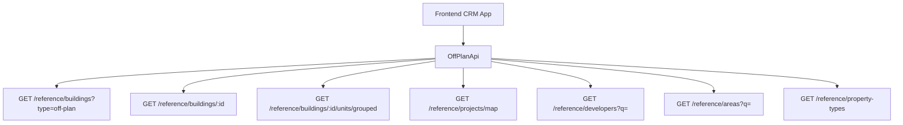

## Overview

The Off-Plan Directory adds a new **Off-Plan** tab under the **Real Estate** section of the main CRM sidebar. This feature displays all published buildings from developer portal users in a card grid view with rich filters, 2GIS map integration, and detailed building views.

<Note>
Minimal backend changes required. Most API endpoints already exist under `/reference/buildings`, `/reference/projects`, and `/reference/units`. The frontend consumes these with the `?type=off-plan` filter parameter.
</Note>

The only backend addition needed is a `maxPreHandoverPercent` query parameter on the buildings search endpoint to support the payment plan filter.

## Architecture Decision

### Buildings vs Projects as Primary Entity

Based on the existing data model, **buildings** are the primary enrichment entity:

- Buildings have their own `isPublished`, `priceFrom`, `coverImageUrl`, `status`, `completionDate`, `tags`, `paymentPlans`, `gallery`, `documents`, `amenities`
- Buildings can override inherited fields from projects (status, area, community, description)
- The off-plan directory displays **published buildings**, since a project may contain multiple buildings with different statuses and pricing

<Info>
The list page queries `GET /reference/buildings?type=off-plan`, and the detail page queries `GET /reference/buildings/:id`.
</Info>

### Data Flow



## Implementation Steps

<Steps>
<Step title="Update Sidebar Navigation">
Replace the existing Real Estate navigation with the new Off-Plan entry.

**File: `src/components/layouts/CRMLayout.tsx`**

Replace the entire `data.realEstate` array:

```typescript
realEstate: [
  {
    title: 'Off-Plan',
    url: '/home/real-estate/off-plan',
    icon: Building2,  // from lucide-react (already imported)
  },
],
```

<Warning>
Remove the old sidebar entries for Areas, Developments, and Units. The off-plan directory supersedes them.
</Warning>

Update breadcrumb handling to replace all existing real-estate breadcrumb routes:

```
Real Estate > Off-Plan                           (list page)
Real Estate > Off-Plan > {Building Name}         (detail page)
```
</Step>

<Step title="Create Route Structure">
Set up the page routing structure:

```
src/app/home/real-estate/off-plan/
├── page.tsx                    # List page (grid + map toggle)
└── [id]/
    └── page.tsx                # Building detail page
```

<Tip>
Both pages should follow the component extraction guide — page files contain ONLY the page function (< 200 lines).
</Tip>
</Step>

<Step title="Build Component Architecture">
Create the component structure for the Off-Plan Directory:

```
src/components/pages/off-plan/
├── index.ts                           # Barrel export
│
│   ── List Page Components ──
├── off-plan-building-card.tsx          # Building card for grid view
├── off-plan-filters.tsx               # Horizontal filter bar
├── off-plan-map-view.tsx              # 2GIS map with markers + popover
├── off-plan-grid-view.tsx             # Grid of building cards + pagination
├── off-plan-toolbar.tsx               # View toggle (Grid/Map), sort, saved filters
│
│   ── Detail Page Components ──
├── building-detail-header.tsx          # Sticky sidebar: name, price, units count, payment plan, developer, CTA buttons
├── building-detail-description.tsx     # Description section with Read More
├── building-detail-units.tsx           # Units & Availability (accordion grouped by bedrooms)
├── building-detail-unit-modal.tsx      # Unit detail popup (floor plan, specs, price)
├── building-detail-gallery.tsx         # Gallery grid with lightbox
├── building-detail-amenities.tsx       # Features/Amenities image grid
├── building-detail-location.tsx        # Location section with 2GIS map
├── building-detail-info-table.tsx      # Details table (Project Name, Developer, Branded, etc.)
├── building-detail-payment-plan.tsx    # Payment plan visualization (progress bar + breakdown)
├── building-detail-documents.tsx       # Documents & links (PDF cards)
├── building-detail-developer.tsx       # Developer info card (from DeveloperContactDto)
```
</Step>

<Step title="Implement API Layer">
Create the API wrapper for off-plan specific endpoints.

**File: `src/services/api/off-plan.api.ts`**

```typescript
export interface OffPlanBuildingFilters {
  q?: string;
  status?: string;
  areaId?: number;
  communityId?: number;
  developerId?: number;
  propertyTypeId?: number;
  propertySubTypeId?: number;
  minPrice?: number;
  maxPrice?: number;
  bedrooms?: string;
  completionBefore?: string;
  completionAfter?: string;
  maxPreHandoverPercent?: number;
  page?: number;
  limit?: number;
  sortBy?: string;
  sortOrder?: 'asc' | 'desc';
}

export interface MapMarkerFilters {
  type?: string;
  areaId?: number;
  developerId?: number;
  minPrice?: number;
  maxPrice?: number;
}

export class OffPlanApi {
  /** Search published off-plan buildings */
  static async searchBuildings(filters: OffPlanBuildingFilters) {
    return apiClient.get('/reference/buildings', {
      params: { ...filters, type: 'off-plan' },
    });
  }

  /** Get building detail with all enrichment */
  static async getBuildingDetail(id: number) {
    return apiClient.get(`/reference/buildings/${id}`);
  }

  /** Get units grouped by bedroom category */
  static async getBuildingUnitsGrouped(buildingId: number) {
    return apiClient.get(`/reference/buildings/${buildingId}/units/grouped`);
  }

  /** Get single unit detail */
  static async getUnitDetail(unitId: number) {
    return apiClient.get(`/reference/units/${unitId}`);
  }

  /** Get map markers (lightweight project data with coordinates) */
  static async getMapMarkers(filters?: MapMarkerFilters) {
    return apiClient.get('/reference/projects/map', { params: filters });
  }

  /** Search developers for filter dropdown */
  static async searchDevelopers(q?: string) {
    return apiClient.get('/reference/developers', { params: { q } });
  }

  /** Search areas for filter dropdown */
  static async searchAreas(q?: string, cityId?: number) {
    return apiClient.get('/reference/areas', { params: { q, cityId } });
  }

  /** Get property types for unit type filter */
  static async getPropertyTypes() {
    return apiClient.get('/reference/property-types');
  }
}
```
</Step>

<Step title="Add Response Types">
Add reference data response types in `src/services/api/types.ts`:

<CodeGroup>
```typescript Building Types
export interface RefBuildingDto {
  id: number;
  name?: string;
  buildingNumber?: string;
  floors?: string;
  rooms?: string;
  projectId?: number;
  projectName?: string;
  developerName?: string;
  developerId?: number;
  areaName?: string;
  areaId?: number;
  communityName?: string;
  communityId?: number;
  // Overridable inherited
  status?: string;
  percentCompleted?: number;
  startDate?: string;
  endDate?: string;
  descriptionEn?: string;
  // Enrichment
  latitude?: number;
  longitude?: number;
  priceFrom?: number;
  currency?: string;
  coverImageUrl?: string;
  completionDate?: string;
  unitCount?: number;
  isBranded?: boolean;
  isFurnished?: boolean;
  serviceChargePerSqft?: number;
  tags?: string[];
  isPublished?: boolean;
  // Collections (populated on detail)
  gallery?: RefGalleryImageDto[];
  paymentPlans?: RefPaymentPlanDto[];
  documents?: RefDocumentDto[];
  amenities?: RefAmenityDto[];
  units?: RefUnitDto[];
  // Developer contact (populated on detail)
  developerContact?: DeveloperContactDto;
}
```

```typescript Unit Types
export interface RefUnitDto {
  id: number;
  unitNumber?: string;
  floor?: string;
  rooms?: number;
  actualArea?: number;
  actualCommonArea?: number;
  balconyArea?: number;
  price?: number;
  pricePerSqft?: number;
  availabilityStatus?: string;
  floorPlanUrl?: string;
  isFurnished?: boolean;
  bedroomCategory?: string;
  bedroomsCount?: number;
  bathroomsCount?: number;
  buildingId?: number;
  buildingName?: string;
  projectId?: number;
  projectName?: string;
  propertySubTypeName?: string;
}

export interface RefUnitGroupDto {
  bedroomCategory: string;
  unitCount: number;
  minArea: number;
  maxArea: number;
  minPrice: number;
  maxPrice: number;
  units: RefUnitDto[];
}
```

```typescript Supporting Types
export interface RefGalleryImageDto {
  id: number;
  url: string;
  category: string;
  caption?: string;
  sortOrder: number;
}

export interface RefPaymentPlanDto {
  id: number;
  title?: string;
  onBookingPercentage?: number;
  constructionPercentage?: number;
  handoverPercentage?: number;
  postHandoverPercentage?: number;
}

export interface RefDocumentDto {
  id: number;
  name: string;
  type: string;
  url: string;
}

export interface RefAmenityDto {
  id: number;
  name: string;
  imageUrl?: string;
}

export interface RefDeveloperDto {
  id: number;
  nameEn?: string;
  nameAr?: string;
  developerNumber?: string;
  webpage?: string;
  phone?: string;
}

export interface DeveloperContactDto {
  name: string;
  email?: string;
  phone?: string;
  whatsappNumber?: string;
  languages?: string[];
  avatarUrl?: string;
}

export interface RefMapProjectDto {
  id: number;
  name?: string;
  latitude?: number;
  longitude?: number;
  priceFrom?: number;
  coverImageUrl?: string;
  developerName?: string;
  status?: string;
  completionDate?: string;
}

export interface PaginatedRefResponse<T> {
  data: T[];
  total: number;
  page: number;
  limit: number;
  totalPages: number;
}
```
</CodeGroup>
</Step>

<Step title="Setup Query Keys">
Add query keys for React Query caching in `src/lib/query-keys.ts`:

```typescript
// ============================================
// OFF-PLAN DIRECTORY
// ============================================
offPlan: {
  all: ['off-plan'] as const,
  buildings: {
    all: ['off-plan', 'buildings'] as const,
    search: (filters: OffPlanBuildingFilters) => 
      ['off-plan', 'buildings', 'search', filters] as const,
    detail: (id: number) => 
      ['off-plan', 'buildings', 'detail', id] as const,
    units: (buildingId: number) => 
      ['off-plan', 'buildings', buildingId, 'units'] as const,
  },
  map: {
    all: ['off-plan', 'map'] as const,
    markers: (filters?: MapMarkerFilters) => 
      ['off-plan', 'map', 'markers', filters] as const,
  },
  reference: {
    developers: (q?: string) => 
      ['off-plan', 'developers', q] as const,
    areas: (q?: string, cityId?: number) => 
      ['off-plan', 'areas', q, cityId] as const,
    propertyTypes: () => 
      ['off-plan', 'property-types'] as const,
  },
},
```
</Step>
</Steps>

## Key Features

### List Page Features

<CardGroup cols={2}>
<Card title="Grid View" icon="grid-3x3">
Cards with cover image, status badges (EOI, On Sale, Announced), handover quarter, building name, area + developer, price from, and payment plan ratio
</Card>

<Card title="Map View" icon="map">
Split layout with scrollable card list on left, 2GIS interactive map on right with project markers and popover previews
</Card>

<Card title="Advanced Filters" icon="filter">
Horizontal filter pills for Search, Developer, Price, Payments, Handover, Unit type, Bedrooms, Status
</Card>

<Card title="View Controls" icon="settings">
View toggle (Grid/Map), sorting options, and saved filter management
</Card>
</CardGroup>

### Building Detail Features

The building detail page includes a right-sticky sidebar with key information and scrollable left content area containing:

<AccordionGroup>
<Accordion title="Core Information">
- Building description with "Read More" functionality
- Key statistics and details table
- Project information and branding status
</Accordion>

<Accordion title="Units & Availability">
- Units grouped by bedroom count in accordion format
- Unit detail modal with floor plans and specifications
- Availability status and pricing information
</Accordion>

<Accordion title="Visual Content">
- Photo gallery with lightbox functionality
- Features and amenities image grid
- Floor plans and layouts
</Accordion>

<Accordion title="Location & Maps">
- Interactive 2GIS map integration
- Location details and nearby amenities
- Transportation and accessibility information
</Accordion>

<Accordion title="Financial Information">
- Payment plan visualization with progress bars
- Pricing breakdown and payment schedules
- Investment and financing options
</Accordion>

<Accordion title="Documentation">
- Downloadable documents and brochures
- Legal documents and contracts
- Project specifications and plans
</Accordion>

<Accordion title="Developer Information">
- Developer contact details and profile
- Portfolio and company information
- Contact methods including WhatsApp integration
</Accordion>
</AccordionGroup>

## Backend Changes Required

<Warning>
Only one minimal backend change is needed for the payment plan filter functionality.
</Warning>

Add a `maxPreHandoverPercent` query parameter to the buildings search endpoint:

```typescript
// Add to existing buildings search endpoint
interface BuildingSearchParams {
  // ... existing parameters
  maxPreHandoverPercent?: number; // Filter buildings where pre-handover payments ≤ this percentage
}
```

This parameter filters buildings based on their payment plan structure, allowing users to find properties with lower upfront payment requirements.

## Testing Considerations

<Tabs>
<Tab title="Unit Tests">
- Test filter combinations and edge cases
- Validate API response handling
- Test component state management
- Verify error boundary behavior
</Tab>

<Tab title="Integration Tests">
- Test end-to-end user workflows
- Validate map integration functionality
- Test responsive design across devices
- Verify performance with large datasets
</Tab>

<Tab title="Performance">
- Test lazy loading of images and data
- Validate infinite scroll performance
- Test map rendering with many markers
- Monitor query optimization and caching
</Tab>
</Tabs>

<Check>
The Off-Plan Directory implementation provides a comprehensive property discovery experience while maintaining minimal backend overhead and leveraging existing API infrastructure.
</Check>