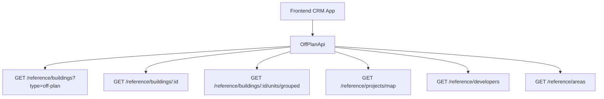

## Overview

The off-plan directory is a comprehensive real estate listing feature that displays all published buildings from developer portal users in a modern card grid view with rich filtering capabilities, 2GIS map integration, and detailed building views.

<Note>
This implementation requires minimal backend changes as most API endpoints already exist. The frontend consumes existing endpoints with the `?type=off-plan` filter parameter.
</Note>

The system replaces existing real estate sidebar tabs (Areas, Developments, Units) with a unified off-plan directory that provides:
- Card-based building listings with cover images and status badges
- Interactive 2GIS map integration with project markers
- Advanced filtering (developer, price, payment plans, handover dates)
- Detailed building pages with unit availability and amenities

## Architecture Decision

### Buildings vs Projects as Primary Entity

Based on the existing data model, **buildings** serve as the primary enrichment entity rather than projects:

<CardGroup cols={2}>
<Card title="Buildings Advantages" icon="building">
- Have their own `isPublished`, `priceFrom`, `coverImageUrl` fields
- Can override inherited project fields (status, area, community)
- Support independent pricing and payment plans
- Enable granular status management per building
</Card>
<Card title="Data Flow Benefits" icon="flow">
- List page queries `GET /reference/buildings?type=off-plan`
- Detail page queries `GET /reference/buildings/:id`
- Consistent API patterns across components
</Card>
</CardGroup>

### Data Flow Architecture



## Navigation Implementation

### Sidebar Structure

<Steps>
<Step title="Update CRMLayout component">
Replace the entire `realEstate` array in `src/components/layouts/CRMLayout.tsx`:

```typescript
realEstate: [
  {
    title: 'Off-Plan',
    url: '/home/real-estate/off-plan',
    icon: Building2,  // from lucide-react
  },
],
```
</Step>

<Step title="Remove legacy entries">
Remove existing sidebar entries for:
- Areas (`/real-estate/areas`)
- Developments (`/real-estate/developments`) 
- Units (`/real-estate/units`)
- Prospects (`/real-estate/prospects`)
</Step>

<Step title="Update breadcrumbs">
Replace all existing real-estate breadcrumb handling with off-plan routes:
- List page: `Real Estate > Off-Plan`
- Detail page: `Real Estate > Off-Plan > {Building Name}`
</Step>
</Steps>

## Route Structure

The off-plan directory uses a clean, hierarchical route structure:

```
src/app/home/real-estate/off-plan/
├── page.tsx                    # List page (grid + map toggle)
└── [id]/
    └── page.tsx                # Building detail page
```

<Note>
Both page files follow the component extraction guide and contain only the page function (< 200 lines).
</Note>

## Component Architecture

### List Page Components

<AccordionGroup>
<Accordion title="Core List Components">
```
src/components/pages/off-plan/
├── off-plan-building-card.tsx          # Building card for grid view
├── off-plan-filters.tsx               # Horizontal filter bar
├── off-plan-map-view.tsx              # 2GIS map with markers + popover
├── off-plan-grid-view.tsx             # Grid of building cards + pagination
├── off-plan-toolbar.tsx               # View toggle, sort, saved filters
```
</Accordion>

<Accordion title="Detail Page Components">
```
src/components/pages/off-plan/
├── building-detail-header.tsx          # Sticky sidebar with key info
├── building-detail-description.tsx     # Description with Read More
├── building-detail-units.tsx           # Units grouped by bedrooms
├── building-detail-unit-modal.tsx      # Unit detail popup
├── building-detail-gallery.tsx         # Gallery grid with lightbox
├── building-detail-amenities.tsx       # Features/Amenities grid
├── building-detail-location.tsx        # Location with 2GIS map
├── building-detail-info-table.tsx      # Details table
├── building-detail-payment-plan.tsx    # Payment plan visualization
├── building-detail-documents.tsx       # Documents & links
├── building-detail-developer.tsx       # Developer info card
```
</Accordion>
</AccordionGroup>

## API Layer Implementation

### Off-Plan API Service

Create `src/services/api/off-plan.api.ts` to wrap existing reference data endpoints:

<CodeGroup>
```typescript Filter Types
export interface OffPlanBuildingFilters {
  q?: string;
  status?: string;
  areaId?: number;
  communityId?: number;
  developerId?: number;
  propertyTypeId?: number;
  propertySubTypeId?: number;
  minPrice?: number;
  maxPrice?: number;
  bedrooms?: string;
  completionBefore?: string;
  completionAfter?: string;
  maxPreHandoverPercent?: number;
  page?: number;
  limit?: number;
  sortBy?: string;
  sortOrder?: 'asc' | 'desc';
}

export interface MapMarkerFilters {
  type?: string;
  areaId?: number;
  developerId?: number;
  minPrice?: number;
  maxPrice?: number;
}
```

```typescript API Class
export class OffPlanApi {
  /** Search published off-plan buildings */
  static async searchBuildings(filters: OffPlanBuildingFilters) {
    return apiClient.get('/reference/buildings', {
      params: { ...filters, type: 'off-plan' },
    });
  }

  /** Get building detail with all enrichment */
  static async getBuildingDetail(id: number) {
    return apiClient.get(`/reference/buildings/${id}`);
  }

  /** Get units grouped by bedroom category */
  static async getBuildingUnitsGrouped(buildingId: number) {
    return apiClient.get(`/reference/buildings/${buildingId}/units/grouped`);
  }

  /** Get map markers for project visualization */
  static async getMapMarkers(filters?: MapMarkerFilters) {
    return apiClient.get('/reference/projects/map', { params: filters });
  }

  /** Search developers for filter dropdown */
  static async searchDevelopers(q?: string) {
    return apiClient.get('/reference/developers', { params: { q } });
  }

  /** Search areas for filter dropdown */
  static async searchAreas(q?: string, cityId?: number) {
    return apiClient.get('/reference/areas', { params: { q, cityId } });
  }

  /** Get property types for unit type filter */
  static async getPropertyTypes() {
    return apiClient.get('/reference/property-types');
  }
}
```
</CodeGroup>

### Response Type Definitions

Add shared reference data types to `src/services/api/types.ts`:

<Tabs>
<Tab title="Building Types">
```typescript
export interface RefBuildingDto {
  id: number;
  name?: string;
  buildingNumber?: string;
  floors?: string;
  rooms?: string;
  projectId?: number;
  projectName?: string;
  developerName?: string;
  developerId?: number;
  areaName?: string;
  areaId?: number;
  communityName?: string;
  communityId?: number;
  status?: string;
  percentCompleted?: number;
  startDate?: string;
  endDate?: string;
  descriptionEn?: string;
  latitude?: number;
  longitude?: number;
  priceFrom?: number;
  currency?: string;
  coverImageUrl?: string;
  completionDate?: string;
  unitCount?: number;
  isBranded?: boolean;
  isFurnished?: boolean;
  serviceChargePerSqft?: number;
  tags?: string[];
  isPublished?: boolean;
  gallery?: RefGalleryImageDto[];
  paymentPlans?: RefPaymentPlanDto[];
  documents?: RefDocumentDto[];
  amenities?: RefAmenityDto[];
  units?: RefUnitDto[];
  developerContact?: DeveloperContactDto;
}
```
</Tab>

<Tab title="Unit Types">
```typescript
export interface RefUnitDto {
  id: number;
  unitNumber?: string;
  floor?: string;
  rooms?: number;
  actualArea?: number;
  actualCommonArea?: number;
  balconyArea?: number;
  price?: number;
  pricePerSqft?: number;
  availabilityStatus?: string;
  floorPlanUrl?: string;
  isFurnished?: boolean;
  bedroomCategory?: string;
  bedroomsCount?: number;
  bathroomsCount?: number;
  buildingId?: number;
  buildingName?: string;
  projectId?: number;
  projectName?: string;
  propertySubTypeName?: string;
}

export interface RefUnitGroupDto {
  bedroomCategory: string;
  unitCount: number;
  minArea: number;
  maxArea: number;
  minPrice: number;
  maxPrice: number;
  units: RefUnitDto[];
}
```
</Tab>

<Tab title="Supporting Types">
```typescript
export interface RefGalleryImageDto {
  id: number;
  url: string;
  category: string;
  caption?: string;
  sortOrder: number;
}

export interface RefPaymentPlanDto {
  id: number;
  title?: string;
  onBookingPercentage?: number;
  constructionPercentage?: number;
  handoverPercentage?: number;
  postHandoverPercentage?: number;
}

export interface RefDocumentDto {
  id: number;
  name: string;
  type: string;
  url: string;
}

export interface DeveloperContactDto {
  name: string;
  email?: string;
  phone?: string;
  whatsappNumber?: string;
  languages?: string[];
  avatarUrl?: string;
}
```
</Tab>
</Tabs>

## Query Key Management

Add off-plan query keys to `src/lib/query-keys.ts`:

```typescript
// ============================================
// OFF-PLAN DIRECTORY
// ============================================
offPlan: {
  all: ['off-plan'] as const,
  buildings: {
    all: ['off-plan', 'buildings'] as const,
    search: (filters: OffPlanBuildingFilters) => 
      ['off-plan', 'buildings', 'search', filters] as const,
    detail: (id: number) => 
      ['off-plan', 'buildings', 'detail', id] as const,
    units: (buildingId: number) => 
      ['off-plan', 'buildings', buildingId, 'units'] as const,
  },
  map: {
    all: ['off-plan', 'map'] as const,
    markers: (filters?: MapMarkerFilters) => 
      ['off-plan', 'map', 'markers', filters] as const,
  },
  filters: {
    developers: (q?: string) => 
      ['off-plan', 'filters', 'developers', q] as const,
    areas: (q?: string, cityId?: number) => 
      ['off-plan', 'filters', 'areas', q, cityId] as const,
    propertyTypes: () => 
      ['off-plan', 'filters', 'property-types'] as const,
  },
},
```

## Key Features Implementation

### Filter System

<Info>
The filter bar supports horizontal pill-based filtering for optimal user experience.
</Info>

Key filter categories include:
- **Search**: Text search across building names and descriptions
- **Developer**: Multi-select dropdown with developer search
- **Price**: Range slider with currency formatting
- **Payments**: Payment plan percentage filter
- **Handover**: Date range picker for completion dates
- **Unit Type**: Property type and subtype selection
- **Bedrooms**: Studio, 1BR, 2BR, 3BR+ options
- **Status**: EOI, On Sale, Announced, Sold Out

### Map Integration

<Steps>
<Step title="2GIS Map Setup">
Integrate 2GIS interactive maps with custom project markers
</Step>

<Step title="Marker Clustering">
Implement marker clustering for dense project areas
</Step>

<Step title="Popover Previews">
Show building preview cards on marker hover/click
</Step>

<Step title="Synchronized Filtering">
Keep map markers synchronized with active filters
</Step>
</Steps>

### Payment Plan Visualization

<Warning>
The backend requires a new `maxPreHandoverPercent` query parameter to support payment plan filtering.
</Warning>

The payment plan component displays:
- Visual progress bar showing payment distribution
- Percentage breakdown (booking, construction, handover, post-handover)
- Timeline with key milestone dates
- Comparison with market averages

## Backend Integration Requirements

### Minimal Backend Changes

The implementation leverages existing API endpoints with minimal changes:

<Check>
**Existing Endpoints Used:**
- `/reference/buildings` - Building search and details
- `/reference/projects` - Map markers and project data
- `/reference/units` - Unit details and availability
- `/reference/developers` - Developer information
- `/reference/areas` - Location data
</Check>

### Required Backend Addition

<CodeGroup>
```typescript New Filter Parameter
// Add to existing /reference/buildings endpoint
interface BuildingSearchParams {
  // ... existing parameters
  maxPreHandoverPercent?: number; // NEW: Payment plan filter
}
```

```sql Example SQL Filter
-- Filter buildings by pre-handover payment percentage
WHERE (
  COALESCE(pp.onBookingPercentage, 0) + 
  COALESCE(pp.constructionPercentage, 0)
) <= :maxPreHandoverPercent
```
</CodeGroup>

### Data Requirements

<Tip>
Ensure all building records have the required enrichment data populated for optimal display quality.
</Tip>

Critical fields for off-plan display:
- `coverImageUrl` - Primary building image
- `priceFrom` - Starting unit price
- `completionDate` - Handover timeline
- `status` - Building development status
- `isPublished` - Visibility control
- `gallery` - Image collection
- `paymentPlans` - Payment structure
- `amenities` - Building features
- `developerContact` - Sales contact info

## Testing Strategy

### Component Testing
- Unit tests for all filter components
- Integration tests for map functionality
- Visual regression tests for card layouts
- Responsive design testing across devices

### API Testing
- Mock API responses for development
- Error state handling validation
- Performance testing with large datasets
- Real-time data synchronization testing

### User Experience Testing
- Filter performance with large datasets
- Map interaction responsiveness
- Image loading optimization
- Mobile touch interactions

This implementation provides a comprehensive off-plan directory that enhances the real estate browsing experience while maintaining clean architecture patterns and minimal backend dependencies.