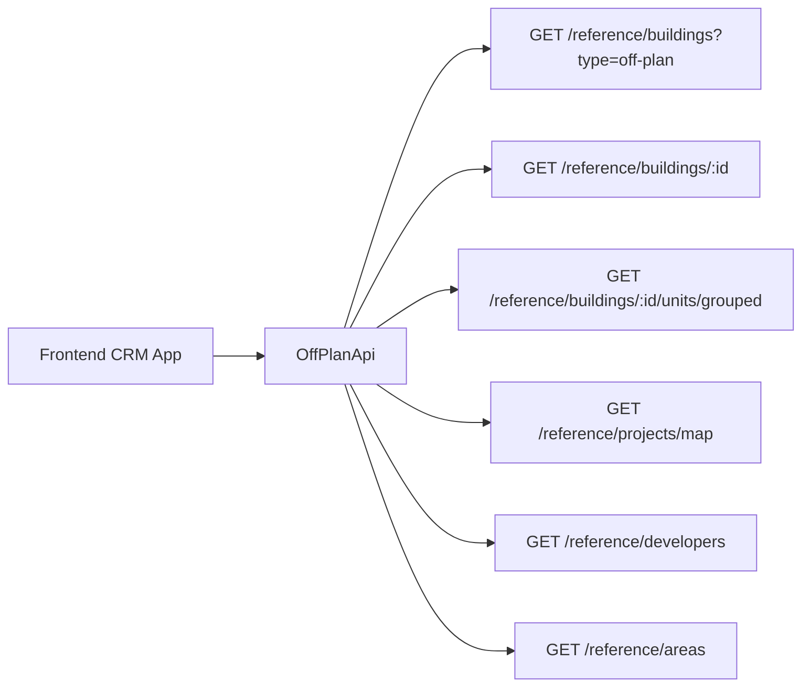

## Overview

Add an **Off-Plan** tab under the **Real Estate** section of the main CRM sidebar. This page displays all published buildings from developer portal users in a card grid view with rich filters, 2GIS map integration, and a detailed building view.

<Note>
Minimal backend changes required. Most API endpoints already exist under `/reference/buildings`, `/reference/projects`, and `/reference/units`. The frontend consumes these with the `?type=off-plan` filter parameter.
</Note>

The only backend addition is a `maxPreHandoverPercent` query parameter on the buildings search endpoint to support the payment plan filter.

## Architecture Decision

### Buildings vs Projects as Primary Entity

Based on the existing data model, **buildings** are the primary enrichment entity:

<CardGroup cols={2}>
  <Card title="Why Buildings?" icon="building">
    Buildings have their own `isPublished`, `priceFrom`, `coverImageUrl`, `status`, `completionDate`, `tags`, `paymentPlans`, `gallery`, `documents`, `amenities`
  </Card>
  <Card title="Override Capability" icon="edit">
    Buildings can override inherited fields from projects (status, area, community, description)
  </Card>
</CardGroup>

The off-plan directory displays **published buildings**, since a project may contain multiple buildings with different statuses and pricing.

### Data Flow Architecture



## Implementation Steps

<Steps>
  <Step title="Update Sidebar Navigation">
    Replace existing Real Estate tabs with single Off-Plan entry in `CRMLayout.tsx`
  </Step>
  <Step title="Create Route Structure">
    Set up `/off-plan` list page and `/off-plan/[id]` detail pages
  </Step>
  <Step title="Build Component Library">
    Create reusable components for cards, filters, maps, and detail views
  </Step>
  <Step title="Implement API Layer">
    Create `OffPlanApi` class wrapping existing reference endpoints
  </Step>
  <Step title="Add Query Management">
    Set up React Query keys and hooks for data fetching
  </Step>
</Steps>

## 1. Sidebar Navigation

### File: `src/components/layouts/CRMLayout.tsx`

**Replace** the entire `data.realEstate` array with a single "Off-Plan" entry:

```typescript
realEstate: [
  {
    title: 'Off-Plan',
    url: '/home/real-estate/off-plan',
    icon: Building2,  // from lucide-react
  },
],
```

<Warning>
Remove the old sidebar entries for Areas, Developments, Units, and Prospects as the off-plan directory supersedes them.
</Warning>

### Breadcrumb Structure

Replace all existing real-estate breadcrumb handling with off-plan routes:

```
Real Estate > Off-Plan                           (list page)
Real Estate > Off-Plan > {Building Name}         (detail page)
```

## 2. Route Structure

<Tabs>
  <Tab title="Directory Structure">
    ```
    src/app/home/real-estate/off-plan/
    ├── page.tsx                    # List page (grid + map toggle)
    └── [id]/
        └── page.tsx                # Building detail page
    ```
  </Tab>
  <Tab title="Implementation Rules">
    Both pages follow the component extraction guide — page files contain ONLY the page function (< 200 lines).
  </Tab>
</Tabs>

## 3. Component Structure

### List Page Components

<AccordionGroup>
  <Accordion title="Core Components">
    ```
    src/components/pages/off-plan/
    ├── index.ts                           # Barrel export
    ├── off-plan-building-card.tsx          # Building card for grid view
    ├── off-plan-filters.tsx               # Horizontal filter bar
    ├── off-plan-map-view.tsx              # 2GIS map with markers + popover
    ├── off-plan-grid-view.tsx             # Grid of building cards + pagination
    ├── off-plan-toolbar.tsx               # View toggle (Grid/Map), sort, saved filters
    ```
  </Accordion>
  
  <Accordion title="Detail Page Components">
    ```
    ├── building-detail-header.tsx          # Sticky sidebar: name, price, units count
    ├── building-detail-description.tsx     # Description section with Read More
    ├── building-detail-units.tsx           # Units & Availability (grouped by bedrooms)
    ├── building-detail-unit-modal.tsx      # Unit detail popup (floor plan, specs)
    ├── building-detail-gallery.tsx         # Gallery grid with lightbox
    ├── building-detail-amenities.tsx       # Features/Amenities image grid
    ├── building-detail-location.tsx        # Location section with 2GIS map
    ├── building-detail-info-table.tsx      # Details table (Project, Developer, etc.)
    ├── building-detail-payment-plan.tsx    # Payment plan visualization
    ├── building-detail-documents.tsx       # Documents & links (PDF cards)
    ├── building-detail-developer.tsx       # Developer info card
    ```
  </Accordion>
</AccordionGroup>

## 4. API Layer

### New File: `src/services/api/off-plan.api.ts`

This API file wraps the existing reference data endpoints with off-plan-specific defaults.

<CodeGroup>
```typescript Filter Types
export interface OffPlanBuildingFilters {
  q?: string;
  status?: string;
  areaId?: number;
  communityId?: number;
  developerId?: number;            // Filter by developer
  propertyTypeId?: number;
  propertySubTypeId?: number;
  minPrice?: number;
  maxPrice?: number;
  bedrooms?: string;               // e.g., "1", "2", "3", "studio"
  completionBefore?: string;       // ISO date — handover filter
  completionAfter?: string;        // ISO date — handover filter
  maxPreHandoverPercent?: number;  // Payment plan filter
  page?: number;
  limit?: number;
  sortBy?: string;
  sortOrder?: 'asc' | 'desc';
}

export interface MapMarkerFilters {
  type?: string;
  areaId?: number;
  developerId?: number;
  minPrice?: number;
  maxPrice?: number;
}
```

```typescript API Class
export class OffPlanApi {
  /** Search published off-plan buildings */
  static async searchBuildings(filters: OffPlanBuildingFilters) {
    return apiClient.get('/reference/buildings', {
      params: { ...filters, type: 'off-plan' },
    });
  }

  /** Get building detail with all enrichment */
  static async getBuildingDetail(id: number) {
    return apiClient.get(`/reference/buildings/${id}`);
  }

  /** Get units grouped by bedroom category */
  static async getBuildingUnitsGrouped(buildingId: number) {
    return apiClient.get(`/reference/buildings/${buildingId}/units/grouped`);
  }

  /** Get single unit detail */
  static async getUnitDetail(unitId: number) {
    return apiClient.get(`/reference/units/${unitId}`);
  }

  /** Get map markers (lightweight project data with coordinates) */
  static async getMapMarkers(filters?: MapMarkerFilters) {
    return apiClient.get('/reference/projects/map', { params: filters });
  }

  /** Search developers for filter dropdown */
  static async searchDevelopers(q?: string) {
    return apiClient.get('/reference/developers', { params: { q } });
  }

  /** Search areas for filter dropdown */
  static async searchAreas(q?: string, cityId?: number) {
    return apiClient.get('/reference/areas', { params: { q, cityId } });
  }

  /** Get property types for unit type filter */
  static async getPropertyTypes() {
    return apiClient.get('/reference/property-types');
  }
}
```
</CodeGroup>

### Response Types in `src/services/api/types.ts`

<Tip>
Add reference data response types that will be shared across off-plan, property-interest, and other modules.
</Tip>

<CodeGroup>
```typescript Core Building DTO
export interface RefBuildingDto {
  id: number;
  name?: string;
  buildingNumber?: string;
  floors?: string;
  rooms?: string;
  projectId?: number;
  projectName?: string;
  developerName?: string;
  developerId?: number;
  areaName?: string;
  areaId?: number;
  communityName?: string;
  communityId?: number;
  // Overridable inherited fields
  status?: string;
  percentCompleted?: number;
  startDate?: string;
  endDate?: string;
  descriptionEn?: string;
  // Enrichment fields
  latitude?: number;
  longitude?: number;
  priceFrom?: number;
  currency?: string;
  coverImageUrl?: string;
  completionDate?: string;
  unitCount?: number;
  isBranded?: boolean;
  isFurnished?: boolean;
  serviceChargePerSqft?: number;
  tags?: string[];
  isPublished?: boolean;
  // Collections (populated on detail)
  gallery?: RefGalleryImageDto[];
  paymentPlans?: RefPaymentPlanDto[];
  documents?: RefDocumentDto[];
  amenities?: RefAmenityDto[];
  units?: RefUnitDto[];
  // Developer contact (populated on detail)
  developerContact?: DeveloperContactDto;
}
```

```typescript Supporting DTOs
export interface RefUnitDto {
  id: number;
  unitNumber?: string;
  floor?: string;
  rooms?: number;
  actualArea?: number;
  actualCommonArea?: number;
  balconyArea?: number;
  price?: number;
  pricePerSqft?: number;
  availabilityStatus?: string;
  floorPlanUrl?: string;
  isFurnished?: boolean;
  bedroomCategory?: string;
  bedroomsCount?: number;
  bathroomsCount?: number;
  buildingId?: number;
  buildingName?: string;
  projectId?: number;
  projectName?: string;
  propertySubTypeName?: string;
}

export interface RefUnitGroupDto {
  bedroomCategory: string;
  unitCount: number;
  minArea: number;
  maxArea: number;
  minPrice: number;
  maxPrice: number;
  units: RefUnitDto[];
}

export interface RefPaymentPlanDto {
  id: number;
  title?: string;
  onBookingPercentage?: number;
  constructionPercentage?: number;
  handoverPercentage?: number;
  postHandoverPercentage?: number;
}
```

```typescript Additional DTOs
export interface DeveloperContactDto {
  name: string;
  email?: string;
  phone?: string;
  whatsappNumber?: string;
  languages?: string[];
  avatarUrl?: string;
}

export interface RefMapProjectDto {
  id: number;
  name?: string;
  latitude?: number;
  longitude?: number;
  priceFrom?: number;
  coverImageUrl?: string;
  developerName?: string;
  status?: string;
  completionDate?: string;
}

export interface PaginatedRefResponse<T> {
  data: T[];
  total: number;
  page: number;
  limit: number;
  totalPages: number;
}
```
</CodeGroup>

## 5. Query Keys

### File: `src/lib/query-keys.ts`

Add a new `offPlan` section to organize React Query cache keys:

```typescript
// ============================================
// OFF-PLAN DIRECTORY
// ============================================
offPlan: {
  all: ['off-plan'] as const,
  buildings: (filters: OffPlanBuildingFilters) => 
    [...queryKeys.offPlan.all, 'buildings', filters] as const,
  buildingDetail: (id: number) => 
    [...queryKeys.offPlan.all, 'building', id] as const,
  buildingUnits: (buildingId: number) => 
    [...queryKeys.offPlan.all, 'building', buildingId, 'units'] as const,
  unitDetail: (unitId: number) => 
    [...queryKeys.offPlan.all, 'unit', unitId] as const,
  mapMarkers: (filters?: MapMarkerFilters) => 
    [...queryKeys.offPlan.all, 'map-markers', filters] as const,
  developers: (q?: string) => 
    [...queryKeys.offPlan.all, 'developers', q] as const,
  areas: (q?: string, cityId?: number) => 
    [...queryKeys.offPlan.all, 'areas', q, cityId] as const,
  propertyTypes: () => 
    [...queryKeys.offPlan.all, 'property-types'] as const,
}
```

## Key Features Implementation

### Filter System

<Steps>
  <Step title="Search Filter">
    Global text search across building names, developer names, and locations
  </Step>
  <Step title="Developer Filter">
    Multi-select dropdown with developer search capability
  </Step>
  <Step title="Price Range Filter">
    Slider component with min/max price bounds
  </Step>
  <Step title="Payment Plan Filter">
    Filter by maximum pre-handover payment percentage
  </Step>
  <Step title="Handover Date Filter">
    Date range picker for completion dates
  </Step>
  <Step title="Unit Type & Bedroom Filters">
    Multi-select for property types and bedroom configurations
  </Step>
</Steps>

### Map Integration

<Info>
The map view uses 2GIS integration with interactive markers and building preview popovers.
</Info>

**Features:**
- Split layout: scrollable building cards on left, interactive map on right
- Project markers with building count indicators
- Click markers to show building preview popover
- Sync between map markers and filter state
- Zoom to bounds based on filtered results

### Building Detail Page

The detail page follows a **sticky sidebar + scrollable content** layout pattern:

<Tabs>
  <Tab title="Sticky Sidebar">
    - Building name and status badge
    - Price from display
    - Available units count
    - Payment plan summary
    - Developer contact info
    - CTA buttons (Save, Share, Contact)
  </Tab>
  
  <Tab title="Scrollable Content">
    - Building description with "Read More"
    - Units & availability (grouped by bedrooms)
    - Gallery with lightbox viewer
    - Amenities grid with images
    - Location section with embedded map
    - Payment plan visualization
    - Documents and links
    - Developer profile card
  </Tab>
</Tabs>

## Design Patterns

### Visual Consistency

<CardGroup cols={2}>
  <Card title="Card Design" icon="rectangle-group">
    Cover image, status badges, handover quarter, building name, area + developer, price from, payment plan ratio
  </Card>
  <Card title="Status Badges" icon="tag">
    EOI (Expression of Interest), On Sale, Announced, Completed
  </Card>
</CardGroup>

### Responsive Behavior

- **Mobile**: Single column card grid, collapsible filters
- **Tablet**: Two column grid, horizontal filter bar
- **Desktop**: Three+ column grid, full feature set with map view

<Check>
All components follow the established design system and maintain consistency with existing CRM patterns.
</Check>