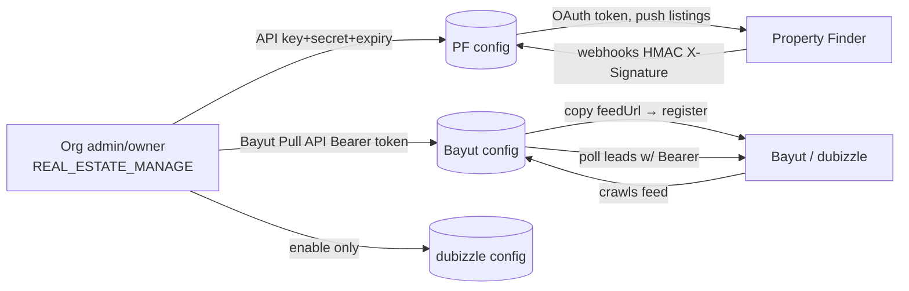

## Overview

This reference shows how a single canonical `Listing` field maps to **both** Bayut/dubizzle and Property Finder portals, highlighting where **field names** differ, where **allowed values** diverge, and which fields are **portal-specific**.

<Note>
The same logical field (e.g. "furnished", "bedrooms", "purpose", "location") often has a **different name AND a different value space** on Bayut vs Property Finder. This document serves as the cross-portal divergence and frontend visibility companion to the full portal syndication specification.
</Note>

**Related documentation:**
- `BAYUT_DUBIZZLE_XML.md` — Bayut external contract
- `PF_API.md` + `PF_OPENAPI.json` — Property Finder contract
- `PORTAL_SYNDICATION_SPECIFICATION.md` — Full design specification

---

## Authentication & Account Linking

<Warning>
None of the three portals use an interactive OAuth "Connect with..." redirect (unlike Meta/Gmail/Outlook integrations). All three require **manual credential/URL exchange**, configured per-organization by an admin/owner with `REAL_ESTATE_MANAGE` permission.
</Warning>

### Authentication Summary

<CardGroup cols={3}>
  <Card title="Property Finder" icon="building">
    **Direction:** Push + Webhooks  
    **Admin Provides:** API Key + Secret + Expiry  
    **PropWise Generates:** `webhookSecret`  
    **Transport:** OAuth2 client-credentials → 30-min Bearer JWT
  </Card>
  <Card title="Bayut" icon="home">
    **Direction:** Feed Pull + Lead Poll  
    **Admin Provides:** Bayut Pull API Bearer token  
    **PropWise Generates:** `feedSecret` + per-org `feedUrl`  
    **Transport:** Org registers feed URL; poll leads with Bearer token
  </Card>
  <Card title="dubizzle" icon="link">
    **Direction:** Shares Bayut  
    **Admin Provides:** Enable only  
    **PropWise Generates:** Reuses unified feed  
    **Transport:** Shares Bayut feed + lead token
  </Card>
</CardGroup>

### Authentication Flow



### Common Configuration Model

All portal configurations share a common `PortalConfiguration` model with one row per `(organization, portal)` (unique constraint).

**RBAC Requirement:** `REAL_ESTATE_MANAGE` (org admin/owner)

**Available Endpoints (Phase 1 - Implemented):**

<Steps>
  <Step title="List Configurations">
    `GET /portal-syndication/config` — Returns list with security flags only (`hasApiKey`, `hasWebhookSecret`, `hasFeedSecret`). Keys are never returned.
  </Step>
  <Step title="Create/Update Configuration">
    `POST /portal-syndication/config` — Upsert with `{ portal, apiKey?, apiSecret?, apiKeyExpiresAt?, isEnabled }`
  </Step>
  <Step title="Toggle Portal">
    `PATCH /portal-syndication/config/:portal/toggle` — Enable/disable portal
  </Step>
</Steps>

<Info>
API credentials are **encrypted at rest** using AES-256-GCM via `EncryptionService`. Raw values are never returned in any response or log. PropWise-generated secrets (`webhookSecret`, `feedSecret`, `feedUrl`) are minted **once** on first creation and never regenerated on update to avoid breaking live portal subscriptions.
</Info>

---

### Property Finder — OAuth2 Client Credentials

<Steps>
  <Step title="Generate Credentials in PF Expert">
    Admin opens **Developer Resources → API Credentials**, generates a key of type **API Integration**, and receives:
    - **API Key**
    - **API Secret**
    - **Expiry** (max 365 days)
    
    Enable required **optional** scopes:
    - `listings:full_access`
    - `leads:read`
    - `credits:read`
    
    <Note>
    Default scopes (`webhooks:full_access`, `compliances:read`, `locations:read`, `projects:read`, `listing_verification:full_access`) are always enabled and don't require manual configuration.
    </Note>
  </Step>
  
  <Step title="Configure in PropWise">
    Admin pastes API Key + API Secret + expiry into `POST /config` with `portal=property_finder`. Credentials are stored encrypted with `apiKeyExpiresAt` for expiry tracking.
  </Step>
  
  <Step title="Runtime Token Exchange">
    `PfTokenService` (Phase B) exchanges key+secret at `POST /v1/auth/token` to receive a **30-minute Bearer JWT**. 
    
    **No refresh-token flow** — PropWise re-issues on expiry, caches per org, and invalidates on 401.
  </Step>
  
  <Step title="Webhook Setup">
    On enable, PropWise auto-generates a `webhookSecret` and (Phase 3) subscribes to PF webhooks via `POST /v1/webhooks` → `.../webhooks/property-finder/{orgId}`. 
    
    PF signs every callback with an HMAC `X-Signature` that PropWise verifies against the `webhookSecret`.
  </Step>
  
  <Step title="Key Rotation">
    Daily `ApiKeyExpirationCheckService` cron warns before 365-day expiry and auto-disables config on expiry. 
    
    A 401 at runtime surfaces "key expired on {date} — regenerate in PF Expert". Admin generates fresh key and re-saves.
  </Step>
</Steps>

---

### Bayut — Two Separate Channels

Bayut requires two separate credential flows for outbound listings and inbound leads.

<Tabs>
  <Tab title="Outbound Listings">
    **Feed Pull Model** — No inbound credential from PropWise required.
    
    <Steps>
      <Step title="PropWise Generates Feed URL">
        PropWise generates a per-org HMAC feed URL with embedded security token
      </Step>
      <Step title="Admin Registers URL">
        Admin copies `feedUrl` from PropWise and registers it in their Bayut account's XML feed settings
      </Step>
      <Step title="Bayut Polls Feed">
        Bayut pulls the feed on their schedule
      </Step>
    </Steps>
  </Tab>
  
  <Tab title="Inbound Leads">
    **Pull API Model** — Bayut issues a static Bearer token.
    
    **Endpoint:** `www.bayut.com/api-v7/stats/website-client-leads`  
    **Auth:** `Authorization: Bearer <API KEY>` (static per-client key, not OAuth)
    
    <Steps>
      <Step title="Get Token from Bayut">
        Bayut issues a **Pull API Bearer token** for your account
      </Step>
      <Step title="Configure in PropWise">
        Admin pastes token into PropWise as Bayut config's `apiKey` (stored encrypted)
      </Step>
      <Step title="Polling Service">
        `BayutLeadPollerService` cron (every 15 min) decrypts token and polls 7 lead type/target combinations since `lastLeadPollAt`
      </Step>
      <Step title="Error Handling">
        On 401, does **not** advance `lastLeadPollAt` so the window is retried after key is fixed. No webhooks.
      </Step>
    </Steps>
  </Tab>
</Tabs>

---

### dubizzle — Piggybacks on Bayut

<Info>
dubizzle shares Bayut's infrastructure for both listings and leads. Creating a dubizzle configuration simply enables access to the existing Bayut feed and lead polling.
</Info>

**Listings:**
- dubizzle reads the **same unified feed** as Bayut
- Per-listing `<Portals>` tag includes `dubizzle` when its `ListingPortalSync` row is enabled

**Leads:**
- dubizzle **shares Bayut's endpoint and token**
- The `source` field on each lead response discriminates `bayut` vs `dubizzle`
- dubizzle config row's `apiKey` is **not used**

**Setup:**
- Create a dubizzle config row
- Enable it to piggyback on Bayut feed + lead token

<Check>
**Implementation Status:** The `PortalConfiguration` model, credential capture + encryption, secret/feed-URL generation, and config/list/toggle endpoints exist today (Phase 1). `PfTokenService` token exchange, PF webhook subscription, public feed controller, and Bayut lead poller are planned for Phase B/3/4.
</Check>

---

### Feed URL Architecture

<Warning>
**Each organization gets its own feed URL.** Bayut/dubizzle use a **pull** model where PropWise exposes a public XML endpoint and the portal crawls it on a schedule.
</Warning>

**Feed Endpoint Structure:**

```http
GET /portal-syndication/feeds/{orgId}?token={hmac}
```

**Implementation Details:**

<AccordionGroup>
  <Accordion title="Security & Validation">
    - Decorated with `@PublicEndpoint()` — no auth/org context, RLS bypass scoped to `{orgId}` in path
    - Token is `HMAC-SHA256(orgId, feedSecret)` in hex format
    - Validated with `timingSafeEqual` for timing-attack resistance
    - Verified via `PortalConfigurationService.verifyFeedToken` (constant-time, format-checked, RLS-bypassed lookup scoped to `orgId`)
  </Accordion>
  
  <Accordion title="URL Generation">
    - Generated **once** when Bayut or dubizzle `PortalConfiguration` is first created
    - Created by `PortalConfigurationService.createOrUpdate` → `generateFeedUrl`
    - Org copies and pastes this URL into their Bayut/dubizzle account
  </Accordion>
  
  <Accordion title="Unified Feed">
    **Single endpoint returns ALL live listings** for the organization
    
    The `<Portals>` tag inside each `<Property>` determines visibility:
    - Driven by enabled `ListingPortalSync` rows
    - Can show on Bayut only, dubizzle only, or both
    - No separate dubizzle feed needed
  </Accordion>
</AccordionGroup>

---

### Open Reconciliation Items

<Warning>
The following items were flagged during review and require resolution:
</Warning>

<Tabs>
  <Tab title="F1: Two feedSecrets">
    **Issue:** Two `feedSecret`s for one unified feed
    
    `createOrUpdate` mints a separate `feedSecret` + `feedUrl` for both the **Bayut** row AND the **dubizzle** row, even though the feed is unified. `verifyFeedToken` accepts **either** token, so both URLs work and return the same combined feed.
    
    **Decision needed:**
    - (a) Share **one** org-level feed secret/URL across both portals, OR
    - (b) Keep per-portal secrets for independent rotation and clearly state that **either URL may be given to either portal**
  </Tab>
  
  <Tab title="F2: Deleted Retention">
    **Issue:** `deleted`-retention vs "published only" query
    
    The contract requires recently-removed listings to stay in the feed as `Property_Status = deleted` for ≥1 crawl cycle so portals can delist them. The plan's feed query says "load **published** sync rows" — that would drop removed rows too early.
    
    **Resolution needed:** Feed query must also include recently-`removed`/disabled rows for one cycle.
  </Tab>
  
  <Tab title="F3: Cache Strategy">
    **Issue:** Cache vs live generation
    
    `PORTAL_SYNDICATION_SPECIFICATION.md` §10 shows a `FeedCacheService` (Redis, `max-age=300`) and generates via `executeInOrg`. Current plan builds live via `executeWithBypass` and omits the cache.
    
    **Resolution needed:** Pick one approach and keep plan + spec in sync.
  </Tab>
</Tabs>

---

## Mapping Helper Inventory

<Tabs>
  <Tab title="Existing">
    ### Property Type Mappings ✅
    
    **Location:** `src/modules/shared/property-type-portal-map.ts`
    
    **Available mappings:**
    - `LAYOUT_TYPE_TO_BAYUT` — Convert PropWise types to Bayut format
    - `LAYOUT_TYPE_TO_PF_SLUG` — Convert PropWise types to Property Finder slugs
    
    **Status:** ✅ Centralized and used by both adapters
  </Tab>
  
  <Tab title="Built - Value Maps">
    ### Portal Value Mappings ✅
    
    **Location:** `src/modules/shared/portal-value-map.ts`
    
    **Status: BUILT** — All value-level transforms now centralized with paired functions consumed by both adapters AND `PortalValidationService`.
    
    ```typescript
    // Purpose mappings
    purposeToBayut(p)                    // SALE→'Buy', RENT→'Rent'
    purposeToPfPriceType(p, rentalPeriod) // SALE→'sale', RENT→'yearly'|'monthly'|'weekly'|'daily'
    
    // Furnished status
    furnishedToBayut(f)     // FURNISHED→'Yes', UNFURNISHED→'No', PARTLY_FURNISHED→'Partly'
    furnishedToPf(f)        // FURNISHED→'furnished', UNFURNISHED→'unfurnished', PARTLY_FURNISHED→'semi-furnished'
    
    // Bedrooms
    bedroomsToBayut(n)      // 0→'-1', 1..10→'1'..'10', >10→'10+', null→omit
    bedroomsToPf(n)         // 0→'studio', 1..30→'1'..'30' (cap 30)
    
    // Bathrooms
    bathroomsToBayut(n)     // 1..10, >10→'10', null→omit
    bathroomsToPf(n, type)  // land/farm→'none', else '1'..'20' (cap 20)
    
    // Rental period
    rentalPeriodToBayut(p)  // daily→'Daily' ... (Rent_Frequency, capitalized)
    
    // Finishing (PF only)
    finishingToPf(f)        // fully_finished→'fully-finished' ...
    
    // Compliance
    emirateToPfCompliance(e) // dubai→'rera'|'dtcm', abu_dhabi→'adrec', northern_emirates→omit
    ```
    
    <Check>
    Both adapters, `PortalValidationService`, and frontend metadata sources share **one** source of truth.
    </Check>
  </Tab>
</Tabs>

---

## Field Name Divergence

The following table shows how the same logical data field maps to different field names across portals.

<Note>
`Listing field` refers to self-contained Listing columns (snapshotted from the unit in linked mode, or entered manually). "—" indicates the field is not supported by that portal.
</Note>

| Canonical (`Listing`) | Bayut XML Tag | Property Finder JSON Field | Notes |
|---|---|---|---|
| `id` (+ org short code) | `<Property_Ref_No>` | `reference` | Format: `UNIT-{orgShortCode}-{listing.id}`, unique per org |
| `permitNumber` | `<Permit_Number>` | `compliance.listingAdvertisementNumber` | PF may be composite (`permit#license`, ADREC sub-permit) |
| — (org license) | — | `compliance.issuingClientLicenseNumber` | Property Finder only |
| `purpose` | `<Property_purpose>` | `price.type` | **Value + concept differ** (see Field Value Divergence) |
| `propertyType` | `<Property_Type>` | `type` | Different value maps (see Property Type Mapping) |
| `price` | `<Price>` | `price.amounts.{sale\|yearly\|monthly\|weekly\|daily}` | PF splits by `price.type`; Bayut uses one number |
| `rentalPeriod` | `<Rent_Frequency>` | Folded into `price.type` + `price.amounts` | Bayut keeps separate frequency tag |
| `furnished` | `<Furnished>` | `attributes.furnishing` | Different value sets (see Value Divergence) |
| `bedrooms` | `<Bedrooms>` | `attributes.bedrooms` | Different value ranges and special cases |
| `bathrooms` | `<Bathrooms>` | `attributes.bathrooms` | Different value ranges |
| `area` (sqft) | `<Size>` | `area.value` (sqm) + `area.unit` | **Unit conversion required** (Bayut sqft → PF sqm) |
| `builtUpArea` | — | `attributes.built_up_area` | Property Finder only |
| `plotArea` | `<Plot_Area>` | `attributes.plot_area` | Both support, may differ in requirements |
| `description` | `<Web_Remarks>` | `name` + `description` | PF splits into title + body |
| `amenities` (array) | `<Web_Amenities>` (CSV) | `attributes.amenities` (array of enums) | Different formats and value sets |
| `images` (order matters) | `<Images><Image>` | `photos[].url` | Both preserve order, first = primary |
| `completionStatus` | — | `attributes.completion_status` | Property Finder only |
| `finishing` | — | `attributes.finishing` | Property Finder only |
| `referenceNumber` (RERA/DLD) | — | `compliance.listingReferenceNumber` | Property Finder only |
| `developerName` | `<Web_Tour>` (misused) | `attributes.developer` | Bayut lacks proper field |
| `projectName` | — | `attributes.project_name` | Property Finder only |
| `projectStatus` | — | Derived from `completion_status` | Property Finder only |
| `virtual360Url` | `<Virtual_Tour>` | `attributes.view_360` | Both support |
| `videoUrl` | `<Video_Tour>` | `attributes.video_tour` | Both support |

<Info>
Where field names match between portals but **value formats differ**, see the Field Value Divergence section below.
</Info>

---

## Field Value Divergence

Even when field names are similar, the **allowed values** often differ between portals. This section details those differences.

### Purpose (Sale vs Rent)

<Tabs>
  <Tab title="PropWise Enum">
    ```typescript
    enum Purpose {
      SALE = 'SALE',
      RENT = 'RENT'
    }
    ```
  </Tab>
  
  <Tab title="Bayut Mapping">
    **Field:** `<Property_purpose>`
    
    | PropWise | Bayut |
    |----------|-------|
    | `SALE` | `Buy` |
    | `RENT` | `Rent` |
    
    **Helper:** `purposeToBayut(p)`
  </Tab>
  
  <Tab title="Property Finder Mapping">
    **Field:** `price.type`
    
    | PropWise | Property Finder | Depends On |
    |----------|-----------------|------------|
    | `SALE` | `sale` | — |
    | `RENT` | `yearly` | `rentalPeriod = YEARLY` |
    | `RENT` | `monthly` | `rentalPeriod = MONTHLY` |
    | `RENT` | `weekly` | `rentalPeriod = WEEKLY` |
    | `RENT` | `daily` | `rentalPeriod = DAILY` |
    
    **Helper:** `purposeToPfPriceType(p, rentalPeriod)`
    
    <Note>
    Property Finder combines purpose and rental period into a single `price.type` field and uses different `price.amounts` keys accordingly.
    </Note>
  </Tab>
</Tabs>

---

### Furnished Status

<Tabs>
  <Tab title="PropWise Enum">
    ```typescript
    enum FurnishedStatus {
      FURNISHED = 'FURNISHED',
      UNFURNISHED = 'UNFURNISHED',
      PARTLY_FURNISHED = 'PARTLY_FURNISHED'
    }
    ```
  </Tab>
  
  <Tab title="Bayut Mapping">
    **Field:** `<Furnished>`
    
    | PropWise | Bayut |
    |----------|-------|
    | `FURNISHED` | `Yes` |
    | `UNFURNISHED` | `No` |
    | `PARTLY_FURNISHED` | `Partly` |
    
    **Helper:** `furnishedToBayut(f)`
  </Tab>
  
  <Tab title="Property Finder Mapping">
    **Field:** `attributes.furnishing`
    
    | PropWise | Property Finder |
    |----------|-----------------|
    | `FURNISHED` | `furnished` |
    | `UNFURNISHED` | `unfurnished` |
    | `PARTLY_FURNISHED` | `semi-furnished` |
    
    **Helper:** `furnishedToPf(f)`
  </Tab>
</Tabs>

---

### Bedrooms

<Tabs>
  <Tab title="PropWise">
    **Type:** `number | null`
    
    **Range:** 0 to unlimited (practical max ~30)
  </Tab>
  
  <Tab title="Bayut Mapping">
    **Field:** `<Bedrooms>`
    
    | PropWise Value | Bayut Value | Notes |
    |----------------|-------------|-------|
    | `0` | `-1` | Studio apartments |
    | `1` to `10` | `'1'` to `'10'` | String format |
    | `> 10` | `'10+'` | Capped display |
    | `null` | Omit tag | Optional field |
    
    **Helper:** `bedroomsToBayut(n)`
  </Tab>
  
  <Tab title="Property Finder Mapping">
    **Field:** `attributes.bedrooms`
    
    | PropWise Value | Property Finder Value | Notes |
    |----------------|----------------------|-------|
    | `0` | `'studio'` | Special string value |
    | `1` to `30` | `'1'` to `'30'` | String format, capped at 30 |
    | `> 30` | `'30'` | Hard cap |
    | `null` | Error | Required for most types |
    
    **Helper:** `bedroomsToPf(n)`
    
    <Warning>
    Property Finder **requires** bedroom count for most property types. Returns error if null for non-land/farm types.
    </Warning>
  </Tab>
</Tabs>

---

### Bathrooms

<Tabs>
  <Tab title="PropWise">
    **Type:** `number | null`
    
    **Range:** 1 to unlimited (practical max ~20)
  </Tab>
  
  <Tab title="Bayut Mapping">
    **Field:** `<Bathrooms>`
    
    | PropWise Value | Bayut Value | Notes |
    |----------------|-------------|-------|
    | `1` to `10` | `'1'` to `'10'` | String format |
    | `> 10` | `'10'` | Capped at 10 |
    | `null` | Omit tag | Optional field |
    
    **Helper:** `bathroomsToBayut(n)`
  </Tab>
  
  <Tab title="Property Finder Mapping">
    **Field:** `attributes.bathrooms`
    
    | PropWise Value | Property Finder Value | Notes |
    |----------------|----------------------|-------|
    | Land/Farm type | `'none'` | Special handling |
    | `1` to `20` | `'1'` to `'20'` | String format, capped at 20 |
    | `> 20` | `'20'` | Hard cap |
    | `null` | `'none'` or Error | Depends on property type |
    
    **Helper:** `bathroomsToPf(n, type)`
    
    <Note>
    Property Finder bathroom handling is **property-type aware**. Land and farm properties should use `'none'`.
    </Note>
  </Tab>
</Tabs>

---

### Rental Period

<Tabs>
  <Tab title="PropWise Enum">
    ```typescript
    enum RentalPeriod {
      DAILY = 'DAILY',
      WEEKLY = 'WEEKLY',
      MONTHLY = 'MONTHLY',
      YEARLY = 'YEARLY'
    }
    ```
  </Tab>
  
  <Tab title="Bayut Mapping">
    **Field:** `<Rent_Frequency>` (separate from purpose)
    
    | PropWise | Bayut |
    |----------|-------|
    | `DAILY` | `Daily` |
    | `WEEKLY` | `Weekly` |
    | `MONTHLY` | `Monthly` |
    | `YEARLY` | `Yearly` |
    
    **Helper:** `rentalPeriodToBayut(p)`
    
    <Info>
    Bayut keeps rental frequency as a **separate tag** alongside `<Property_purpose>Rent</Property_purpose>`.
    </Info>
  </Tab>
  
  <Tab title="Property Finder Mapping">
    **Field:** Folded into `price.type`
    
    | PropWise | Property Finder `price.type` |
    |----------|------------------------------|
    | `DAILY` | `daily` |
    | `WEEKLY` | `weekly` |
    | `MONTHLY` | `monthly` |
    | `YEARLY` | `yearly` |
    
    **Also affects:** `price.amounts` key selection
    
    ```json
    {
      "price": {
        "type": "monthly",
        "amounts": {
          "monthly": 5000
        }
      }
    }
    ```
    
    <Warning>
    Property Finder **combines** rental period into the `price.type` field. There is no separate rental period field. The `price.amounts` object must use the matching key.
    </Warning>
  </Tab>
</Tabs>

---

### Finishing Status

<Info>
**Bayut does not have an equivalent field for finishing status.** This is a Property Finder-only attribute.
</Info>

<Tabs>
  <Tab title="PropWise Enum">
    ```typescript
    enum FinishingStatus {
      SHELL_AND_CORE = 'SHELL_AND_CORE',
      SEMI_FINISHED = 'SEMI_FINISHED',
      FULLY_FINISHED = 'FULLY_FINISHED',
      FURNISHED = 'FURNISHED',
      UNFURNISHED = 'UNFURNISHED'
    }
    ```
  </Tab>
  
  <Tab title="Property Finder Mapping">
    **Field:** `attributes.finishing`
    
    | PropWise | Property Finder |
    |----------|-----------------|
    | `SHELL_AND_CORE` | `shell-and-core` |
    | `SEMI_FINISHED` | `semi-finished` |
    | `FULLY_FINISHED` | `fully-finished` |
    | `FURNISHED` | `furnished` |
    | `UNFURNISHED` | `unfurnished` |
    
    **Helper:** `finishingToPf(f)`
    
    <Note>
    Finishing status is primarily used for off-plan properties in Property Finder. Not applicable to Bayut feeds.
    </Note>
  </Tab>
</Tabs>

---

### Emirate to Compliance Mapping

Property Finder requires emirate-specific compliance fields. Bayut does not have this requirement.

<Tabs>
  <Tab title="PropWise Emirate Enum">
    ```typescript
    enum Emirate {
      DUBAI = 'DUBAI',
      ABU_DHABI = 'ABU_DHABI',
      SHARJAH = 'SHARJAH',
      AJMAN = 'AJMAN',
      UMM_AL_QUWAIN = 'UMM_AL_QUWAIN',
      RAS_AL_KHAIMAH = 'RAS_AL_KHAIMAH',
      FUJAIRAH = 'FUJAIRAH'
    }
    ```
  </Tab>
  
  <Tab title="Property Finder Compliance">
    **Field:** `compliance.issuingCompany`
    
    | PropWise Emirate | Property Finder Value | Notes |
    |------------------|----------------------|-------|
    | `DUBAI` (commercial) | `rera` | RERA regulated |
    | `DUBAI` (short-term) | `dtcm` | DTCM regulated |
    | `ABU_DHABI` | `adrec` | ADREC regulated |
    | Northern Emirates | Omit | No specific compliance |
    
    **Helper:** `emirateToPfCompliance(e)`
    
    <Warning>
    Dubai requires differentiating between RERA (residential/commercial long-term) and DTCM (short-term rentals). The compliance mapping depends on both emirate **and** listing purpose/rental period.
    </Warning>
  </Tab>
</Tabs>

---

## Property Type Mapping

Property types represent the most complex mapping between portals due to fundamentally different categorization systems.

<Tabs>
  <Tab title="Mapping Overview">
    **Source:** `src/modules/shared/property-type-portal-map.ts`
    
    **Exports:**
    - `LAYOUT_TYPE_TO_BAYUT` — PropWise → Bayut type
    - `LAYOUT_TYPE_TO_PF_SLUG` — PropWise → Property Finder slug
    
    <Note>
    Both portals support the same core categories (Residential, Commercial, Land) but with different granularity and naming conventions.
    </Note>
  </Tab>
  
  <Tab title="Residential Types">
    | PropWise Type | Bayut Type | Property Finder Slug |
    |---------------|------------|---------------------|
    | `APARTMENT` | `Apartment` | `apartment` |
    | `VILLA` | `Villa` | `villa` |
    | `TOWNHOUSE` | `Townhouse` | `townhouse` |
    | `PENTHOUSE` | `Penthouse` | `penthouse` |
    | `STUDIO` | `Apartment` | `apartment` |
    | `DUPLEX` | `Duplex` | `duplex` |
    | `COMPOUND` | `Compound` | `compound` |
    | `HOTEL_APARTMENT` | `Hotel Apartment` | `hotel-apartment` |
    | `VILLA_COMPOUND` | `Villa Compound` | `villa-compound` |
    | `RESIDENTIAL_FLOOR` | `Residential Floor` | `residential-floor` |
    | `RESIDENTIAL_BUILDING` | `Residential Building` | `residential-building` |
    | `RESIDENTIAL_PLOT` | `Residential Land` | `residential-plot` |
  </Tab>
  
  <Tab title="Commercial Types">
    | PropWise Type | Bayut Type | Property Finder Slug |
    |---------------|------------|---------------------|
    | `OFFICE` | `Office` | `office` |
    | `SHOP` | `Shop` | `shop` |
    | `WAREHOUSE` | `Warehouse` | `warehouse` |
    | `LABOR_CAMP` | `Labour Camp` | `labor-camp` |
    | `COMMERCIAL_VILLA` | `Commercial Villa` | `commercial-villa` |
    | `COMMERCIAL_FLOOR` | `Commercial Floor` | `commercial-floor` |
    | `COMMERCIAL_BUILDING` | `Commercial Building` | `commercial-building` |
    | `COMMERCIAL_PLOT` | `Commercial Land` | `commercial-plot` |
    | `FACTORY` | `Factory` | `factory` |
    | `INDUSTRIAL_LAND` | `Industrial Land` | `industrial-plot` |
    | `SHOWROOM` | `Showroom` | `showroom` |
    | `BULK_UNITS` | `Bulk Rent Units` | `bulk-units` |
  </Tab>
  
  <Tab title="Land & Other Types">
    | PropWise Type | Bayut Type | Property Finder Slug |
    |---------------|------------|---------------------|
    | `LAND` | `Land` | `land` |
    | `MIXED_USE_LAND` | `Mixed Use Land` | `mixed-use-plot` |
    | `FARM` | `Farm` | `farm` |
    | `HALF_FLOOR` | `Half Floor` | `half-floor` |
    | `WHOLE_BUILDING` | `Whole Building` | `whole-building` |
    | `BUSINESS_CENTRE` | `Business Centre` | `business-center` |
    | `RETAIL_CENTRE` | `Retail Centre` | `retail-center` |
    
    <Warning>
    Some property types have special validation requirements:
    - `STUDIO` maps to `Apartment` in Bayut but must have `bedrooms=0`
    - Land/Farm types may not require bedroom counts in Property Finder
    - Commercial types may have different required fields than residential
    </Warning>
  </Tab>
</Tabs>

---

## Area & Unit Conversion

<Warning>
**Critical:** Bayut uses **square feet** while Property Finder uses **square meters**. Conversion is required.
</Warning>

### Conversion Rules

<Tabs>
  <Tab title="Bayut Format">
    **Field:** `<Size>`  
    **Unit:** Square feet (sqft)  
    **Type:** Integer
    
    ```xml
    <Size>1200</Size>
    ```
    
    <Info>
    PropWise stores area in square feet. Direct mapping to Bayut requires no conversion.
    </Info>
  </Tab>
  
  <Tab title="Property Finder Format">
    **Fields:** `area.value` + `area.unit`  
    **Unit:** Square meters (sqm)  
    **Type:** Float
    
    ```json
    {
      "area": {
        "value": 111.48,
        "unit": "sqm"
      }
    }
    ```
    
    **Conversion:**
    ```typescript
    const sqm = Math.round(sqft * 0.092903 * 100) / 100; // Round to 2 decimals
    ```
    
    <Note>
    **Conversion factor:** 1 sqft = 0.092903 sqm  
    **Precision:** Round to 2 decimal places for Property Finder
    </Note>
  </Tab>
  
  <Tab title="Additional Area Fields">
    Both portals support additional area measurements:
    
    | Concept | Bayut Field | PF Field | Notes |
    |---------|-------------|----------|-------|
    | Built-up area | — | `attributes.built_up_area` | PF only |
    | Plot area | `<Plot_Area>` | `attributes.plot_area` | Both support |
    | Balcony area | — | `attributes.balcony_area` | PF only |
    
    <Info>
    All area values in Property Finder must use `sqm` regardless of field. Bayut assumes `sqft` for all area measurements.
    </Info>
  </Tab>
</Tabs>

---

## Portal-Specific Fields

Some fields exist only on one portal and should be hidden in the UI when that portal is disabled.

### Property Finder Exclusive

<AccordionGroup>
  <Accordion title="Compliance Fields">
    - `compliance.issuingClientLicenseNumber` — Org's broker license
    - `compliance.listingReferenceNumber` — RERA/DLD/ADREC reference
    - `compliance.issuingCompany` — Auto-derived from emirate
    
    **Required when:** Property Finder is enabled for the organization
  </Accordion>
  
  <Accordion title="Property Attributes">
    - `attributes.finishing` — Shell/core, semi-finished, fully-finished
    - `attributes.completion_status` — Ready, off-plan, under-construction
    - `attributes.built_up_area` — Different from primary area
    - `attributes.developer` — Developer name for projects
    - `attributes.project_name` — Project/building name
    - `attributes.view_360` — 360° virtual tour URL
    - `attributes.balcony_area` — Separate balcony measurement
    
    **UI behavior:** Show these fields only when Property Finder is enabled
  </Accordion>
  
  <Accordion title="Price Structure">
    Property Finder splits rental pricing by period:
    
    ```json
    {
      "price": {
        "type": "monthly",
        "amounts": {
          "monthly": 5000
        }
      }
    }
    ```
    
    Whereas Bayut uses a single `<Price>` with separate `<Rent_Frequency>`.
  </Accordion>
</AccordionGroup>

---

### Bayut Exclusive

<AccordionGroup>
  <Accordion title="Workaround Fields">
    Bayut has fewer structured fields, leading to workarounds:
    
    - `<Web_Tour>` — Misused for developer name (no proper developer field)
    - `<Virtual_Tour>` — 360° tour URL (same concept as PF)
    - `<Video_Tour>` — Video URL (same concept as PF)
    
    <Warning>
    Developer name must be placed in `<Web_Tour>` for Bayut due to lack of dedicated field.
    </Warning>
  </Accordion>
  
  <Accordion title="Frequency Tag">
    `<Rent_Frequency>` — Separate tag for rental period
    
    Property Finder folds this into `price.type`, but Bayut keeps it distinct from `<Property_purpose>`.
  </Accordion>
</AccordionGroup>

---

### Shared Fields with Different Requirements

<CardGroup cols={2}>
  <Card title="Permit Number" icon="file-certificate">
    **Bayut:** `<Permit_Number>` (simple string)  
    **PF:** `compliance.listingAdvertisementNumber` (may be composite: `permit#license`)
    
    Both require permit numbers but format differs.
  </Card>
  
  <Card title="Amenities" icon="list">
    **Bayut:** `<Web_Amenities>` (comma-separated string)  
    **PF:** `attributes.amenities` (array of enum values)
    
    Both support amenities but with different structures and allowed values.
  </Card>
  
  <Card title="Images" icon="image">
    **Bayut:** `<Images><Image>` (XML nested tags)  
    **PF:** `photos[].url` (JSON array)
    
    Both preserve order (first = primary), but format differs.
  </Card>
  
  <Card title="Description" icon="align-left">
    **Bayut:** `<Web_Remarks>` (single text block)  
    **PF:** `name` + `description` (split into title + body)
    
    Property Finder requires splitting long descriptions.
  </Card>
</CardGroup>

---

## Frontend Visibility Rules

The frontend should show/hide fields based on which portals are enabled for the organization.

### Implementation Pattern

```typescript
interface PortalFieldVisibility {
  field: string;
  showWhen: {
    propertyFinder?: boolean;
    bayut?: boolean;
    dubizzle?: boolean;
  };
}
```

<Steps>
  <Step title="Fetch Portal Config">
    On listing form load, call `GET /portal-syndication/config` to determine which portals are enabled
  </Step>
  
  <Step title="Apply Visibility Rules">
    Show/hide fields based on portal configuration:
    
    ```typescript
    const showFinishing = portals.propertyFinder?.isEnabled;
    const showDeveloper = portals.propertyFinder?.isEnabled || portals.bayut?.isEnabled;
    ```
  </Step>
  
  <Step title="Validate Conditionally">
    Required field validation should also respect portal enablement:
    
    ```typescript
    const permitRequired = portals.propertyFinder?.isEnabled || portals.bayut?.isEnabled;
    const complianceRequired = portals.propertyFinder?.isEnabled;
    ```
  </Step>
</Steps>

---

### Field Visibility Matrix

| Field | Show When | Required When | Notes |
|-------|-----------|---------------|-------|
| `permitNumber` | Any portal enabled | Any portal enabled | All portals require |
| `finishing` | Property Finder enabled | PF enabled + off-plan | PF exclusive |
| `completionStatus` | Property Finder enabled | PF enabled | PF exclusive |
| `referenceNumber` (RERA) | Property Finder enabled | PF enabled + Dubai | PF exclusive, emirate-dependent |
| `developerName` | Any portal enabled | Optional | Bayut uses `<Web_Tour>` |
| `projectName` | Property Finder enabled | Optional | PF exclusive |
| `builtUpArea` | Property Finder enabled | PF enabled + certain types | PF exclusive |
| `rentalPeriod` | Purpose = RENT | Purpose = RENT | Both portals, different representation |

<Tip>
**Best practice:** Load portal configuration once per session and cache it in the frontend state. Update only when the admin changes portal settings.
</Tip>

---

## Validation Differences

<Warning>
Field validation rules differ between portals. A listing valid for Bayut may be invalid for Property Finder and vice versa.
</Warning>

### Common Validation Patterns

<Tabs>
  <Tab title="Required Fields">
    **Bayut minimum:**
    - Permit number
    - Property type
    - Purpose
    - Price
    - Bedrooms (except studios)
    - Area (sqft)
    - Location (emirate, city, community)
    - At least 1 image
    
    **Property Finder minimum:**
    - All Bayut fields, plus:
    - Compliance fields (license, reference)
    - Bathrooms (or 'none' for land)
    - Completion status
    - Description split (name + description)
    - Area in sqm (converted)
  </Tab>
  
  <Tab title="Value Constraints">
    **Bedrooms:**
    - Bayut: `-1` to `10+`
    - PF: `studio` or `1` to `30`
    
    **Bathrooms:**
    - Bayut: `1` to `10`
    - PF: `none` or `1` to `20`
    
    **Area:**
    - Bayut: Integer sqft, no max
    - PF: Float sqm (2 decimals), reasonable range
    
    **Price:**
    - Bayut: Single integer
    - PF: Different fields by rental period
  </Tab>
  
  <Tab title="Conditional Requirements">
    **Property Finder:**
    - Dubai listings must have RERA or DTCM compliance
    - Abu Dhabi listings must have ADREC compliance
    - Off-plan requires `completion_status` + `finishing`
    - Land/farm allows `bathrooms: 'none'`
    
    **Bayut:**
    - Studios must have `bedrooms: -1`
    - Rentals must have `Rent_Frequency`
    - All types need permit number
  </Tab>
</Tabs>

---

## Shared Validation Service

<Info>
**Implementation:** `PortalValidationService` uses the centralized mapping helpers to validate listings for each portal.
</Info>

### Service Methods

<CodeGroup>

```typescript Validate for Bayut
async validateForBayut(listing: Listing): Promise<ValidationResult> {
  const errors: string[] = [];
  
  // Required fields
  if (!listing.permitNumber) errors.push('Permit number required');
  if (!listing.propertyType) errors.push('Property type required');
  if (!listing.purpose) errors.push('Purpose required');
  
  // Bayut-specific value validation
  if (listing.bedrooms !== null) {
    const bayutBedrooms = bedroomsToBayut(listing.bedrooms);
    if (!bayutBedrooms) errors.push('Invalid bedroom count for Bayut');
  }
  
  // Area validation (sqft)
  if (!listing.area || listing.area <= 0) {
    errors.push('Area in sqft required');
  }
  
  return { valid: errors.length === 0, errors };
}
```

```typescript Validate for Property Finder
async validateForPropertyFinder(listing: Listing): Promise<ValidationResult> {
  const errors: string[] = [];
  
  // All Bayut requirements plus PF-specific
  const bayutResult = await this.validateForBayut(listing);
  errors.push(...bayutResult.errors);
  
  // Compliance requirements
  if (!listing.complianceReferenceNumber) {
    errors.push('RERA/DLD reference number required');
  }
  
  // PF-specific fields
  if (!listing.completionStatus) {
    errors.push('Completion status required for Property Finder');
  }
  
  // Area conversion validation
  const sqm = listing.area ? Math.round(listing.area * 0.092903 * 100) / 100 : 0;
  if (sqm < 1 || sqm > 100000) {
    errors.push('Area out of reasonable range');
  }
  
  return { valid: errors.length === 0, errors };
}
```

```typescript Validate for Both
async validateForAllPortals(
  listing: Listing, 
  enabledPortals: string[]
): Promise<Record<string, ValidationResult>> {
  const results: Record<string, ValidationResult> = {};
  
  if (enabledPortals.includes('property_finder')) {
    results.property_finder = await this.validateForPropertyFinder(listing);
  }
  
  if (enabledPortals.includes('bayut')) {
    results.bayut = await this.validateForBayut(listing);
  }
  
  if (enabledPortals.includes('dubizzle')) {
    // dubizzle shares Bayut validation
    results.dubizzle = await this.validateForBayut(listing);
  }
  
  return results;
}
```

</CodeGroup>

---

## Summary & Best Practices

<CardGroup cols={2}>
  <Card title="Use Centralized Helpers" icon="code">
    Always use functions from `portal-value-map.ts` and `property-type-portal-map.ts` for transformations. Never hardcode mappings.
  </Card>
  
  <Card title="Validate Per Portal" icon="shield-check">
    Run portal-specific validation before syndication. A listing may be valid for one portal but invalid for another.
  </Card>
  
  <Card title="Handle Units Carefully" icon="ruler">
    Remember Bayut uses sqft, Property Finder uses sqm. Always convert with proper precision (2 decimals for PF).
  </Card>
  
  <Card title="Respect Portal Features" icon="toggle-on">
    Show/hide fields based on enabled portals. Don't ask for Property Finder-exclusive data if PF is disabled.
  </Card>
</CardGroup>

### Key Takeaways

<Steps>
  <Step title="Authentication is Manual">
    No OAuth flows — admins manually enter credentials from each portal's admin panel
  </Step>
  
  <Step title="Same Data, Different Names">
    Nearly every field has a different name between Bayut and Property Finder
  </Step>
  
  <Step title="Same Name, Different Values">
    Even when field names are similar, allowed values often differ (purpose, furnished, bedrooms, etc.)
  </Step>
  
  <Step title="Portal-Specific Fields">
    Some fields only exist on one portal (finishing, compliance details, built-up area)
  </Step>
  
  <Step title="Unified Feed, Per-Listing Targeting">
    Bayut and dubizzle share one feed URL; `<Portals>` tags control per-listing visibility
  </Step>
</Steps>

<Tip>
For complete payload examples and external API contracts, refer to:
- `BAYUT_DUBIZZLE_XML.md` for Bayut XML schema
- `PF_API.md` for Property Finder REST API
- `PORTAL_SYNDICATION_SPECIFICATION.md` §6.3 (PF) and §6.4 (Bayut) for full payload tables
</Tip>