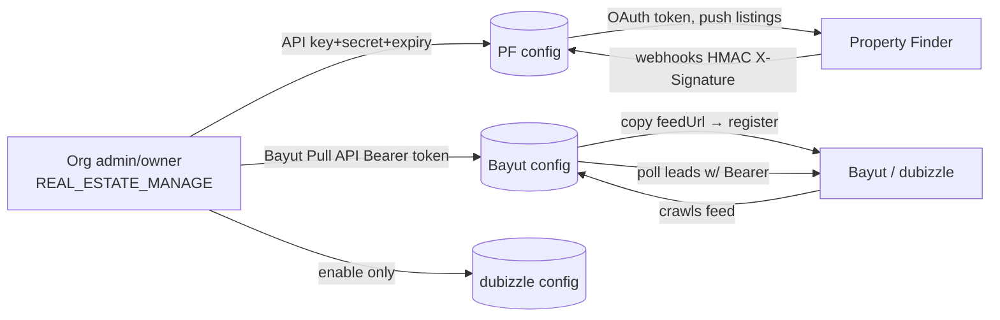

<Note>
**Purpose:** A single side-by-side reference for how one canonical `Listing` field maps to **both** portals, where the **field name** differs, where the **allowed values** differ, and which fields are **portal-specific** (so the frontend can show/hide inputs based on which portal an org has enabled).

**Why this exists:** The same logical field (e.g. "furnished", "bedrooms", "purpose", "location") has a **different name AND a different value space** on Bayut vs Property Finder. The per-portal payload tables live in `PORTAL_SYNDICATION_SPECIFICATION.md` §6.3 (PF) and §6.4 (Bayut). This doc is the **cross-portal divergence + frontend visibility** companion.
</Note>

<Info>
**Related docs:** `BAYUT_DUBIZZLE_XML.md` (Bayut external contract), `PF_API.md` + `PF_OPENAPI.json` (PF contract), `PORTAL_SYNDICATION_SPECIFICATION.md` (full design).
</Info>

## Authentication & Account Linking

**None of the three portals use an interactive OAuth "Connect with…" redirect** (unlike the Meta/Gmail/Outlook integrations). All three are **manual credential / URL exchange**, configured per-organization by an admin/owner.

| Portal | Direction | What the admin provides | What PropWise generates | Transport auth |
|--------|-----------|------------------------|------------------------|----------------|
| **Property Finder** | push + webhooks | API Key + API Secret + expiry (from PF Expert) | `webhookSecret` | OAuth2 client-credentials → 30-min Bearer JWT |
| **Bayut** | feed pull + lead poll | Bayut **Pull API Bearer token** (inbound leads only) | `feedSecret` + per-org `feedUrl` (outbound listings) | Org registers PropWise's feed URL; PropWise polls leads with the Bearer token |
| **dubizzle** | shares Bayut | (nothing new — piggybacks Bayut) | reuses the unified feed | Shares Bayut feed + Bayut lead token |



### Common Model

<CardGroup cols={2}>
  <Card title="Data Model" icon="database">
    One `PortalConfiguration` row per `(organization, portal)` with unique constraint
  </Card>
  <Card title="RBAC" icon="shield">
    Requires `REAL_ESTATE_MANAGE` permission (org admin/owner)
  </Card>
</CardGroup>

**Endpoints (Phase 1, implemented):**

- `GET /portal-syndication/config` — list (keys never returned; only `hasApiKey` / `hasWebhookSecret` / `hasFeedSecret`)
- `POST /portal-syndication/config` — upsert `{ portal, apiKey?, apiSecret?, apiKeyExpiresAt?, isEnabled }`
- `PATCH /portal-syndication/config/:portal/toggle` — enable/disable

<Warning>
API credentials are **encrypted at rest** (AES-256-GCM via `EncryptionService`); raw values are never returned in any response or log.

PropWise-generated secrets (`webhookSecret` for PF; `feedSecret` + `feedUrl` for Bayut/dubizzle) are minted **once** on first creation and never regenerated on update (regenerating would break a live portal subscription).
</Warning>

### Property Finder — OAuth2 Client Credentials

<Steps>
  <Step title="Generate credentials in PF Expert">
    Admin opens **Developer Resources → API Credentials**, generates a key of type **API Integration** → receives **API Key + API Secret**, sets an **expiry (max 365 days)**, and enables the required **optional** scopes.
    
    Per `PF_API.md`, the optional scopes to enable are:
    - `listings:full_access`
    - `leads:read`
    - `credits:read`
    
    The webhook/compliance/location/project/verification scopes are **default scopes** — always on, not manually enabled.
  </Step>
  
  <Step title="Configure in PropWise">
    Admin pastes API Key + API Secret + expiry into `POST /config` (`portal=property_finder`). Stored encrypted; `apiKeyExpiresAt` saved for expiry tracking.
  </Step>
  
  <Step title="Runtime token exchange">
    **`PfTokenService` (Phase B):** PropWise exchanges key+secret at `POST /v1/auth/token` → a **30-minute Bearer JWT**. 
    
    **No refresh-token flow** — PropWise re-issues on expiry, caches per org, and invalidates on 401.
  </Step>
  
  <Step title="Enable webhooks">
    PropWise auto-generates a `webhookSecret` and (Phase 3) subscribes to PF webhooks (`POST /v1/webhooks` → `…/webhooks/property-finder/{orgId}`). 
    
    PF signs every callback with an HMAC `X-Signature` that PropWise verifies against that `webhookSecret` (publish confirmations + lead push back).
  </Step>
  
  <Step title="Key rotation">
    The daily `ApiKeyExpirationCheckService` cron warns before the 365-day expiry and auto-disables the config on expiry; a 401 at runtime surfaces "key expired on {date} — regenerate in PF Expert". 
    
    The admin generates a fresh key and re-saves.
  </Step>
</Steps>

### Bayut — Two Separate Channels

**Outbound (listings):**

No inbound credential from PropWise's side. PropWise *generates* a per-org HMAC feed URL; the admin **copies `feedUrl` from PropWise and registers it in their Bayut account's XML feed settings**. Bayut then **pulls** it on a schedule.

**Inbound (leads):**

Bayut issues a **Pull API Bearer token**. Endpoint `www.bayut.com/api-v7/stats/website-client-leads`, auth `Authorization: Bearer <API KEY>` (a **static per-client key, not OAuth** — see `BAYUT_DUBIZZLE_PULL_API.md` §3).

The admin pastes this token into PropWise as the Bayut config's `apiKey` (encrypted). `BayutLeadPollerService` (cron, every 15 min) decrypts it and polls the 7 lead type/target combinations since `lastLeadPollAt`. 

<Warning>
On 401 it does **not** advance `lastLeadPollAt` (so the window is retried after the key is fixed). No webhooks.
</Warning>

### dubizzle — Rides on Bayut

<Tabs>
  <Tab title="Listings">
    dubizzle reads the **same unified feed**; the per-listing `<Portals>` tag includes `dubizzle` when its `ListingPortalSync` row is enabled.
  </Tab>
  <Tab title="Leads">
    dubizzle **shares Bayut's endpoint and token**; the `source` field on each lead response discriminates `bayut` vs `dubizzle`, so the dubizzle config row's `apiKey` is **not used** (per the `PortalConfiguration` entity comment).
  </Tab>
  <Tab title="Linking">
    **Linking = create a dubizzle config row + enable it.** It piggybacks on the Bayut feed + Bayut lead token.
  </Tab>
</Tabs>

<Info>
**Implementation status:** The `PortalConfiguration` model, credential capture + encryption, secret/feed-URL generation, and the config/list/toggle endpoints exist today (Phase 1). `PfTokenService` token exchange, PF webhook subscription, the public feed controller, and the Bayut lead poller are planned (Phase B/3/4); `pf/agent-mappings/refresh` currently returns `501`.
</Info>

### Feed URL Architecture

**Each organization gets its own feed URL.** Bayut/dubizzle is a **pull** model: PropWise exposes a public XML endpoint and the portal crawls it on a schedule.

```http
GET /portal-syndication/feeds/{orgId}?token={hmac}
@PublicEndpoint()           # no auth/org context — RLS bypass scoped to the {orgId} in the path
token = HMAC-SHA256(orgId, feedSecret)   # hex, validated with timingSafeEqual
```

<Steps>
  <Step title="Generate feed URL">
    The URL + token are generated **once** when the Bayut (or dubizzle) `PortalConfiguration` is first created (`PortalConfigurationService.createOrUpdate` → `generateFeedUrl`). The org pastes this URL into their Bayut/dubizzle account.
  </Step>
  
  <Step title="Verify token">
    The token is verified in the public feed controller via `PortalConfigurationService.verifyFeedToken` (constant-time, format-checked, RLS-bypassed lookup scoped to `orgId`).
  </Step>
  
  <Step title="Unified feed">
    It is a **single unified feed**: one endpoint returns ALL of the org's live listings, and the `<Portals>` tag **inside each `<Property>`** decides whether that listing shows on Bayut, dubizzle, or both (driven by the enabled `ListingPortalSync` rows). A separate dubizzle feed is **not** needed.
  </Step>
</Steps>

### Open Reconciliation Items

<AccordionGroup>
  <Accordion title="F1: Two feedSecrets for one unified feed">
    `createOrUpdate` mints a separate `feedSecret` + `feedUrl` for the **Bayut** row AND the **dubizzle** row, even though the feed is unified. `verifyFeedToken` accepts **either** token, so both URLs work and return the same combined feed. 
    
    **Decision needed:** either (a) share **one** org-level feed secret/URL across both portals, or (b) keep per-portal secrets for independent rotation and clearly state that **either URL may be given to either portal**.
  </Accordion>
  
  <Accordion title="F2: deleted-retention vs published only query">
    The contract requires recently-removed listings to stay in the feed as `Property_Status = deleted` for ≥1 crawl cycle so portals delist them. The plan's feed query says "load **published** sync rows" — that would drop removed rows too early. 
    
    **The feed query must also include recently-`removed`/disabled rows for one cycle.**
  </Accordion>
  
  <Accordion title="F3: Cache vs live generation">
    `PORTAL_SYNDICATION_SPECIFICATION.md` §10 shows a `FeedCacheService` (Redis, `max-age=300`) and generates via `executeInOrg`; the current plan builds live via `executeWithBypass` and omits the cache. 
    
    **Pick one and keep plan + spec in sync.**
  </Accordion>
</AccordionGroup>

## Mapping Helper Inventory

| Concern | Helper | Status |
|---------|--------|--------|
| Property type → portal value | `LAYOUT_TYPE_TO_BAYUT`, `LAYOUT_TYPE_TO_PF_SLUG` in `src/modules/shared/property-type-portal-map.ts` | ✅ Centralized, used by both adapters |
| Purpose, furnished, bedrooms, bathrooms, rental period, finishing, emirate→compliance, projectStatus | — | ❌ Not centralized. Described in prose/§6.3/§6.4 tables only; each adapter would hand-roll its own transform |

<Check>
**Status: BUILT.** `src/modules/shared/portal-value-map.ts` (sibling to `property-type-portal-map.ts`) now owns every value-level transform with paired functions (consumed by both adapters AND `PortalValidationService`).
</Check>

```typescript
purposeToBayut(p)        // SALE→'Buy',  RENT→'Rent'
purposeToPfPriceType(p, rentalPeriod)  // SALE→'sale', RENT→'yearly'|'monthly'|'weekly'|'daily'
furnishedToBayut(f)      // FURNISHED→'Yes', UNFURNISHED→'No', PARTLY_FURNISHED→'Partly'
furnishedToPf(f)         // FURNISHED→'furnished', UNFURNISHED→'unfurnished', PARTLY_FURNISHED→'semi-furnished'
bedroomsToBayut(n)       // 0→'-1', 1..10→'1'..'10', >10→'10+', null→omit
bedroomsToPf(n)          // 0→'studio', 1..30→'1'..'30' (cap 30)
bathroomsToBayut(n)      // 1..10, >10→'10', null→omit
bathroomsToPf(n, type)   // land/farm→'none', else '1'..'20' (cap 20)
rentalPeriodToBayut(p)   // daily→'Daily' ... (Rent_Frequency, capitalized)
finishingToPf(f)         // fully_finished→'fully-finished' ... (Bayut: no equivalent)
emirateToPfCompliance(e) // dubai→'rera'|'dtcm', abu_dhabi→'adrec', northern_emirates→omit
```

Both adapters, `PortalValidationService`, and a frontend-facing metadata source then share **one** source of truth.

## Field Name Divergence

`Listing field` = self-contained Listing column (snapshotted from the unit in linked mode, or entered manually). "—" = not supported by that portal.

| Canonical (`Listing`) | Bayut XML tag | PF JSON field | Notes |
|-----------------------|---------------|---------------|-------|
| `id` (+ org short code) | `<Property_Ref_No>` | `reference` | `UNIT-{orgShortCode}-{listing.id}`, unique per org |
| `permitNumber` | `<Permit_Number>` | `compliance.listingAdvertisementNumber` | PF may be composite (`permit#license`, ADREC sub-permit) |
| — (org license) | — | `compliance.issuingClientLicenseNumber` | PF only |
| `purpose` | `<Property_purpose>` | `price.type` | **value + concept differ** (see below) |
| `propertyType` | `<Property_Type>` | `type` | different value maps (see Property Type section) |
| `price` | `<Price>` | `price.amounts.{sale\|yearly\|monthly\|weekly\|daily}` | PF splits by `price.type`; Bayut is one number |
| `rentalPeriod` | `<Rent_Frequency>` | folded into `price.type` + `price.amounts` | Bayut keeps a separate frequency tag; PF embeds in price structure |
| `furnished` | `<Furnished>` | `furnishing` | different enums (see Furnished section) |
| `bedrooms` | `<Bedrooms>` | `bedroom` | PF uses `'studio'` for 0; Bayut uses `-1` |
| `bathrooms` | `<Bathrooms>` | `bathroom` | PF supports `'none'` for land/farm |
| `size` | `<Unit_Builtup_Area>` | `size` | both in sqft |
| `plotSize` | `<Plot_Area>` | `plotSize` | both in sqft (villa/townhouse/land) |
| `finishing` | — | `finishingStatus` | PF only; Bayut has no equivalent |
| `readyByQuarter`, `readyByYear` | — | `ready` (computed ISO date) | PF off-plan only |
| `emirate` | `<emirate>` (location hierarchy) | `compliance.authority` (via lookup) | Dubai→RERA/DTCM, Abu Dhabi→ADREC |
| `title` | `<Property_Title>` | `title.en` / `title.ar` | PF requires both languages; Bayut one field |
| `description` | `<Description>` | `description.en` / `description.ar` | PF requires both languages; Bayut one field |
| `photos` (URLs) | `<Images><Image>` | `photo.images[].url` + `originalUrl` | PF requires 2 sizes |
| `agentId` → `Agent.name` | `<Agent><Name>` | `agent.name` | mapped via `AgentPortalMapping` |
| `agentId` → `Agent.email` | `<Agent><Email>` | `agent.email` | same |
| `agentId` → `Agent.phone` | `<Agent><Phone>` | `agent.phone` | same |
| `completionStatus` | computed from `readyBy*` | `offeringType` + `ready` | both map to off-plan vs ready |

<Note>
For detailed property type mappings, see the Property Type Mapping section below.
</Note>

## Purpose Field Mapping

The `purpose` field conceptually represents "for sale" vs "for rent", but the portals model this differently:

<Tabs>
  <Tab title="Bayut">
    **Bayut:** stores purpose as a **separate field** `<Property_purpose>` with values:
    - `'Buy'` (sale)
    - `'Rent'` (rental)
    
    The rental frequency lives in a **separate** tag `<Rent_Frequency>`.
  </Tab>
  
  <Tab title="Property Finder">
    **Property Finder:** **folds purpose into the price structure**. The `price.type` field determines:
    - `'sale'` → for-sale listing
    - `'yearly'`, `'monthly'`, `'weekly'`, `'daily'` → for-rent with embedded frequency
    
    The `price.amounts` object then has a key matching `price.type`.
  </Tab>
</Tabs>

### Mapping Functions

```typescript
// Bayut
purposeToBayut(purpose: 'SALE' | 'RENT'): 'Buy' | 'Rent'

// Property Finder
purposeToPfPriceType(
  purpose: 'SALE' | 'RENT',
  rentalPeriod?: 'DAILY' | 'WEEKLY' | 'MONTHLY' | 'YEARLY'
): 'sale' | 'yearly' | 'monthly' | 'weekly' | 'daily'
```

<Warning>
**Validation impact:** A `SALE` listing with a `rentalPeriod` set is invalid. A `RENT` listing with a null `rentalPeriod` is invalid (PF requires it to determine `price.type`; Bayut requires `<Rent_Frequency>`).
</Warning>

## Property Type Mapping

Both portals maintain their own property type taxonomies. PropWise's canonical `propertyType` enum must map to:

- **Bayut:** `<Property_Type>` (capitalized, underscored)
- **Property Finder:** `type` (kebab-case slug)

### Residential Types

| Canonical | Bayut | Property Finder |
|-----------|-------|-----------------|
| `APARTMENT` | `AP` | `apartment` |
| `VILLA` | `VH` | `villa` |
| `TOWNHOUSE` | `TH` | `townhouse` |
| `PENTHOUSE` | `PH` | `penthouse` |
| `COMPOUND` | `HF` | `compound` |
| `DUPLEX` | `DX` | `duplex` |
| `FULL_FLOOR` | `FF` | `full-floor` |
| `HALF_FLOOR` | `HF` | `half-floor` |
| `WHOLE_BUILDING` | `WB` | `whole-building` |
| `BULK_UNITS` | `BU` | `bulk-units` |

### Commercial Types

| Canonical | Bayut | Property Finder |
|-----------|-------|-----------------|
| `OFFICE` | `OF` | `office` |
| `SHOP` | `RE` | `shop` |
| `WAREHOUSE` | `WH` | `warehouse` |
| `LABOUR_CAMP` | `LC` | `labor-camp` |
| `COMMERCIAL_VILLA` | `CV` | `commercial-villa` |
| `COMMERCIAL_BUILDING` | `CB` | `commercial-building` |
| `COMMERCIAL_PLOT` | `LP` | `commercial-land` |
| `FACTORY` | `FA` | `factory` |
| `INDUSTRIAL_LAND` | `CD` | `industrial-land` |
| `MIXED_USE_LAND` | `CD` | `mixed-use-land` |
| `SHOWROOM` | `SR` | `showroom` |

### Land Types

| Canonical | Bayut | Property Finder |
|-----------|-------|-----------------|
| `RESIDENTIAL_LAND` | `LP` | `residential-land` |
| `COMMERCIAL_LAND` | `LP` | `commercial-land` |

<Info>
**Implementation:** `src/modules/shared/property-type-portal-map.ts` exports:
- `LAYOUT_TYPE_TO_BAYUT: Record<PropertyType, string>`
- `LAYOUT_TYPE_TO_PF_SLUG: Record<PropertyType, string>`

Both adapters import and use these maps.
</Info>

## Furnished Field Mapping

The `furnished` field has three states in PropWise's canonical model, but the portals use different enums:

<CodeGroup>
```typescript Canonical
enum FurnishedStatus {
  FURNISHED = 'FURNISHED',
  UNFURNISHED = 'UNFURNISHED', 
  PARTLY_FURNISHED = 'PARTLY_FURNISHED'
}
```

```xml Bayut
<Furnished>Yes</Furnished>      <!-- FURNISHED -->
<Furnished>No</Furnished>       <!-- UNFURNISHED -->
<Furnished>Partly</Furnished>   <!-- PARTLY_FURNISHED -->
```

```json Property Finder
{
  "furnishing": "furnished"        // FURNISHED
  "furnishing": "unfurnished"      // UNFURNISHED
  "furnishing": "semi-furnished"   // PARTLY_FURNISHED
}
```
</CodeGroup>

### Mapping Functions

```typescript
furnishedToBayut(furnished: FurnishedStatus | null): 'Yes' | 'No' | 'Partly' | undefined

furnishedToPf(furnished: FurnishedStatus | null): 'furnished' | 'unfurnished' | 'semi-furnished' | undefined
```

## Bedrooms & Bathrooms

Both portals support a numeric bedroom/bathroom count, but with different edge-case handling:

### Bedrooms

<Tabs>
  <Tab title="Bayut">
    **Bayut:**
    - `0` → `'-1'` (studio)
    - `1..10` → `'1'`..`'10'`
    - `>10` → `'10+'`
    - `null` → omit tag
  </Tab>
  
  <Tab title="Property Finder">
    **Property Finder:**
    - `0` → `'studio'`
    - `1..30` → `'1'`..`'30'` (capped at 30)
    - `null` → omit field (or validation error if required by type)
  </Tab>
</Tabs>

```typescript
bedroomsToBayut(bedrooms: number | null): string | undefined
bedroomsToPf(bedrooms: number | null): string | undefined
```

### Bathrooms

<Tabs>
  <Tab title="Bayut">
    **Bayut:**
    - `1..10` → `'1'`..`'10'`
    - `>10` → `'10'`
    - `null` → omit tag
  </Tab>
  
  <Tab title="Property Finder">
    **Property Finder:**
    - land/farm types → `'none'`
    - `1..20` → `'1'`..`'20'` (capped at 20)
    - `null` → omit or validation error
  </Tab>
</Tabs>

```typescript
bathroomsToBayut(bathrooms: number | null): string | undefined
bathroomsToPf(bathrooms: number | null, propertyType: PropertyType): string | undefined
```

<Warning>
**Validation:** PF's `bedroom` is **required** for residential types. Bayut allows omission but recommends including it.
</Warning>

## Rental Period Mapping

For `RENT` listings, PropWise stores a `rentalPeriod` enum:

```typescript
enum RentalPeriod {
  DAILY = 'DAILY',
  WEEKLY = 'WEEKLY', 
  MONTHLY = 'MONTHLY',
  YEARLY = 'YEARLY'
}
```

<Tabs>
  <Tab title="Bayut">
    **Bayut:** separate XML tag `<Rent_Frequency>`:
    ```xml
    <Rent_Frequency>Daily</Rent_Frequency>   <!-- DAILY -->
    <Rent_Frequency>Weekly</Rent_Frequency>  <!-- WEEKLY -->
    <Rent_Frequency>Monthly</Rent_Frequency> <!-- MONTHLY -->
    <Rent_Frequency>Yearly</Rent_Frequency>  <!-- YEARLY -->
    ```
  </Tab>
  
  <Tab title="Property Finder">
    **Property Finder:** embedded in `price.type`:
    ```json
    {
      "price": {
        "type": "daily",    // or "weekly", "monthly", "yearly"
        "amounts": {
          "daily": 500      // key matches type
        }
      }
    }
    ```
  </Tab>
</Tabs>

```typescript
rentalPeriodToBayut(period: RentalPeriod): 'Daily' | 'Weekly' | 'Monthly' | 'Yearly'

// Property Finder folds this into purposeToPfPriceType
purposeToPfPriceType(purpose, rentalPeriod) // → 'daily' | 'weekly' | 'monthly' | 'yearly'
```

## Finishing Status (PF only)

Property Finder supports a `finishingStatus` field for off-plan properties. **Bayut has no equivalent**.

| Canonical | Property Finder |
|-----------|-----------------|
| `FULLY_FINISHED` | `'fully-finished'` |
| `SEMI_FINISHED` | `'semi-finished'` |
| `SHELL_AND_CORE` | `'shell-and-core'` |
| `UNFURNISHED` | `'unfurnished'` |
| `FURNISHED` | `'furnished'` |

```typescript
finishingToPf(finishing: FinishingStatus | null): string | undefined
```

<Note>
This field is optional even on PF. Bayut adapters should ignore it.
</Note>

## Compliance & Permit Numbers

Both portals require permit/license numbers, but model them differently:

### Permit Number

<Tabs>
  <Tab title="Bayut">
    **Bayut:** single field `<Permit_Number>`
    
    Example: `71453832117`
  </Tab>
  
  <Tab title="Property Finder">
    **Property Finder:** compound field `compliance.listingAdvertisementNumber`
    
    May be formatted as `{permit}#{license}` for ADREC sub-permits.
    
    Example: `71453832117` or `71453832117#CN-1234567`
  </Tab>
</Tabs>

### Issuing Authority & License

<CardGroup cols={2}>
  <Card title="Bayut" icon="file-xml">
    No separate org license field. Permit number is standalone.
  </Card>
  <Card title="Property Finder" icon="file-code">
    Requires `compliance.issuingClientLicenseNumber` (org-level broker license).
    
    Also requires `compliance.authority` derived from emirate:
    - Dubai → `'rera'` or `'dtcm'`
    - Abu Dhabi → `'adrec'`
    - Northern Emirates → omit
  </Card>
</CardGroup>

```typescript
emirateToPfCompliance(emirate: Emirate | null): 'rera' | 'dtcm' | 'adrec' | undefined
```

<Warning>
**PF validation:** `compliance.authority` is **required** for Dubai and Abu Dhabi listings. PropWise must infer it from the listing's emirate field (which lives in the nested location hierarchy).
</Warning>

## Location Hierarchy

Both portals require a multi-level location hierarchy, but use different field structures:

### Bayut

```xml
<Property>
  <emirate>dubai</emirate>
  <Community>dubai-marina</Community>
  <Sub_Community>marina-promenade</Sub_Community>
  <!-- Property_Name tag for building -->
</Property>
```

### Property Finder

```json
{
  "location": {
    "city": 4,              // numeric ID from PF's /locations endpoint
    "community": [123],     // array of community IDs
    "subCommunity": [456],  // array of sub-community IDs (optional)
    "tower": 789            // building/project ID (optional)
  }
}
```

<Warning>
**PF location IDs:** Property Finder uses **numeric IDs** instead of slugs. PropWise must maintain a mapping table (`pfLocationId` on `Location` entity) and call `GET /v1/locations` to sync the official PF taxonomy.

**Challenge:** PF's location tree is 5 levels (country → city → community → sub-community → tower/project), while PropWise's is 4 (country → emirate → community → sub-community). The "tower" level may need to be denormalized or stored separately.
</Warning>

## Agent Mapping

Both portals require agent details (name, email, phone). PropWise maps via `AgentPortalMapping`:

```typescript
interface AgentPortalMapping {
  agentId: string              // PropWise Agent.id
  portal: 'property_finder' | 'bayut' | 'dubizzle'
  portalAgentId: string        // external ID (PF agent ID or Bayut ref)
  name: string
  email: string
  phone: string
  isActive: boolean
}
```

<Steps>
  <Step title="Create mapping">
    Admin calls `POST /portal-syndication/agent-mappings` with the portal-specific agent ID and contact details.
  </Step>
  
  <Step title="Adapter lookup">
    When syncing a listing, the adapter queries `AgentPortalMapping` by `(agentId, portal)` to retrieve the portal-specific name/email/phone.
  </Step>
  
  <Step title="Fallback">
    If no mapping exists, the adapter can fall back to the PropWise `Agent` record's own name/email/phone (or fail validation if the portal requires a pre-registered agent).
  </Step>
</Steps>

<Info>
**Property Finder:** agent IDs must be pre-registered in PF Expert. The mapping's `portalAgentId` is the PF-issued numeric ID.

**Bayut:** no pre-registration; the feed includes agent details inline. The `portalAgentId` can be an arbitrary reference string (e.g., `agent-{propwiseAgentId}`).
</Info>

## Images & Media

Both portals require image URLs, with different structural requirements:

### Bayut

```xml
<Images>
  <Image>
    <url>https://cdn.example.com/photo1.jpg</url>
    <tag>photos</tag>
  </Image>
  <Image>
    <url>https://cdn.example.com/photo2.jpg</url>
    <tag>photos</tag>
  </Image>
</Images>
```

- **Format:** XML list, each with `<url>` + `<tag>` (always `'photos'`)
- **Size:** no explicit thumbnail/full-size split in the spec
- **Order:** first image is the primary

### Property Finder

```json
{
  "photo": {
    "images": [
      {
        "url": "https://cdn.example.com/photo1_thumb.jpg",
        "originalUrl": "https://cdn.example.com/photo1_full.jpg"
      },
      {
        "url": "https://cdn.example.com/photo2_thumb.jpg", 
        "originalUrl": "https://cdn.example.com/photo2_full.jpg"
      }
    ]
  }
}
```

- **Format:** JSON array, each with `url` (thumbnail) + `originalUrl` (full-size)
- **Requirement:** both sizes are **required** per image
- **Order:** first image is the primary

<Warning>
**PropWise challenge:** The current `Listing.photos` is a simple `string[]` of URLs. To support PF's two-size requirement, PropWise must either:

1. **Generate thumbnails on-the-fly** (via a CDN or image service)
2. **Store both sizes** (extend the schema to `{ thumbnail: string, original: string }[]`)
3. **Use the same URL for both** (if high-res images are acceptable as "thumbnails")

The chosen approach should be documented and implemented consistently across all listings.
</Warning>

## Title & Description (i18n)

<Tabs>
  <Tab title="Bayut">
    **Bayut:** single-language fields
    ```xml
    <Property_Title>Luxury 2BR Marina View</Property_Title>
    <Description>Spacious apartment with...</Description>
    ```
  </Tab>
  
  <Tab title="Property Finder">
    **Property Finder:** bilingual (English + Arabic) **required**
    ```json
    {
      "title": {
        "en": "Luxury 2BR Marina View",
        "ar": "شقة فاخرة بغرفتي نوم إطلالة المارينا"
      },
      "description": {
        "en": "Spacious apartment with...",
        "ar": "شقة واسعة مع..."
      }
    }
    ```
  </Tab>
</Tabs>

<Warning>
**PropWise schema:** The current `Listing` model has `title: string` and `description: string` (single language). To support PF:

1. **Option A:** Extend schema to `title: { en: string, ar?: string }` (breaking change)
2. **Option B:** Store Arabic in separate fields (`titleAr`, `descriptionAr`) (simpler migration)
3. **Option C:** Auto-translate on sync (requires translation service integration)

**Recommendation:** Option B (separate fields) is the safest near-term approach. Option A is cleaner long-term but requires a schema migration + UI updates.
</Warning>

## Completion Status & Off-Plan

Both portals distinguish "ready" vs "off-plan" properties, but model it differently:

<Tabs>
  <Tab title="Bayut">
    **Bayut:** computed from `readyByQuarter` + `readyByYear`
    
    If both are null → ready (omit completion fields)
    
    If set → off-plan (include `<Completion_Status>off_plan</Completion_Status>`)
  </Tab>
  
  <Tab title="Property Finder">
    **Property Finder:** explicit `offeringType` + `ready` date
    ```json
    {
      "offeringType": "sale",    // or "off-plan", "rented", "holiday-home"
      "ready": "2025-06-30"      // ISO 8601 date (off-plan only)
    }
    ```
  </Tab>
</Tabs>

```typescript
// PropWise canonical
interface Listing {
  readyByQuarter?: 'Q1' | 'Q2' | 'Q3' | 'Q4'
  readyByYear?: number
}

// Bayut: if both null → omit completion tags, else set Completion_Status=off_plan

// PF: convert to ISO date
function readyToPfDate(quarter: string, year: number): string {
  const monthMap = { Q1: '03', Q2: '06', Q3: '09', Q4: '12' }
  return `${year}-${monthMap[quarter]}-30`  // last day of quarter
}
```

<Info>
**PF validation:** `offeringType` is required. For rentals, it's typically `'sale'` (even though purpose is rent — the offering type refers to the listing type, not transaction type). For off-plan, it's `'off-plan'` and `ready` becomes required.
</Info>

## Portal-Specific Fields (Frontend Visibility)

Some fields are **only used by one portal** and should be hidden in the UI when that portal is disabled for the org:

| Field | Bayut | PF | Frontend rule |
|-------|-------|----|--------------| 
| `finishing` | ❌ | ✅ | Show if PF enabled |
| `compliance.issuingClientLicenseNumber` | ❌ | ✅ | Show if PF enabled |
| `title.ar` / `description.ar` | ❌ | ✅ (required) | Show if PF enabled |
| `photo.originalUrl` | ❌ | ✅ (required) | Show if PF enabled |
| `readyByQuarter` / `readyByYear` | ✅ | ✅ | Always show (both use it) |
| `permitNumber` | ✅ | ✅ | Always show (both use it) |

<Note>
**Implementation:** The frontend should query `GET /portal-syndication/config` to see which portals are enabled, then conditionally render fields based on the response. A shared `usePortalFields()` hook can encapsulate this logic.
</Note>

## Validation Rules (Cross-Portal)

The `PortalValidationService` enforces **both** portal rulesets and returns a union of errors/warnings:

```typescript
interface ValidationResult {
  isValid: boolean
  errors: ValidationError[]    // blocking (prevents publish)
  warnings: ValidationWarning[] // non-blocking (shows in UI)
  portalSpecific: {
    bayut: { errors: [], warnings: [] }
    propertyFinder: { errors: [], warnings: [] }
  }
}
```

### Common Rules (Both Portals)

<Check>
- `permitNumber` is required
- `price > 0`
- `bedrooms >= 0` (if provided)
- `bathrooms >= 0` (if provided)
- At least 1 photo
- `agentId` must have a valid `AgentPortalMapping` for each enabled portal
</Check>

### Bayut-Specific Rules

<Check>
- `purpose` + `rentalPeriod` combination must be valid (`SALE` → no period, `RENT` → period required)
- `bedrooms` max 10 (or `'10+'`)
- `bathrooms` max 10
- Location must map to a valid Bayut community slug
</Check>

### Property Finder-Specific Rules

<Check>
- `title.en` + `title.ar` both required
- `description.en` + `description.ar` both required
- Each photo must have `url` + `originalUrl`
- `bedroom` required for residential types
- `compliance.authority` required for Dubai/Abu Dhabi
- `compliance.issuingClientLicenseNumber` required
- `bedrooms` max 30
- `bathrooms` max 20
- Location must map to valid PF location IDs (city, community, subCommunity)
- Off-plan listings require `ready` date
</Check>

<Tip>
The validation service should run **before** sync and surface errors in the UI with portal-specific badges ("Bayut", "PF") so the user knows which portal is blocking.
</Tip>

## Sync State Machine

Each `ListingPortalSync` row tracks per-portal sync state:

```typescript
enum SyncStatus {
  PENDING = 'PENDING',       // queued, not yet sent
  PUBLISHING = 'PUBLISHING', // push in progress
  PUBLISHED = 'PUBLISHED',   // live on portal
  UPDATING = 'UPDATING',     // update in progress
  FAILED = 'FAILED',         // error (see errorMessage)
  REMOVED = 'REMOVED'        // delisted/disabled
}
```

<Steps>
  <Step title="Enable sync">
    User enables a portal for a listing → `ListingPortalSync` row created with `status=PENDING`
  </Step>
  
  <Step title="Validation">
    Pre-sync validation runs (blocking errors prevent transition to `PUBLISHING`)
  </Step>
  
  <Step title="Publish">
    Adapter pushes listing (PF) or feed includes it (Bayut) → `status=PUBLISHING`
  </Step>
  
  <Step title="Confirm">
    Success response (PF) or first crawl (Bayut) → `status=PUBLISHED`, `lastSyncedAt` updated
  </Step>
  
  <Step title="Update">
    Listing changes → `status=UPDATING`, adapter re-syncs → back to `PUBLISHED`
  </Step>
  
  <Step title="Error">
    Any failure → `status=FAILED`, `errorMessage` populated, `errorDetails` JSON logged
  </Step>
  
  <Step title="Remove">
    User disables portal → `status=REMOVED`, adapter sends delete (PF) or feed emits `Property_Status=deleted` (Bayut)
  </Step>
</Steps>

<Warning>
**Bayut delay:** Because Bayut is a pull model, the transition from `PENDING` → `PUBLISHED` is **not immediate**. The listing appears in the feed as soon as it's enabled, but the portal may take hours to crawl. PropWise should show a "waiting for Bayut to crawl" message in the UI during this period.
</Warning>

## Summary: Cross-Portal Compatibility Matrix

| Feature | Bayut | Property Finder | Handling |
|---------|-------|-----------------|----------|
| **Auth model** | Feed URL + Lead token | OAuth2 client credentials | Per-portal config rows |
| **Listing push** | Pull (XML feed) | Push (REST API) | Separate adapters |
| **Lead delivery** | Poll (REST API) | Webhook (HMAC signed) | Separate ingestors |
| **Property type** | Bayut codes | PF slugs | `LAYOUT_TYPE_TO_*` maps |
| **Purpose** | Separate field | Folded into price.type | Different adapters |
| **Rental period** | Separate tag | Folded into price.type | `purposeToPfPriceType` |
| **Furnished** | Yes/No/Partly | furnished/unfurnished/semi | `furnishedTo*` |
| **Bedrooms** | -1 for studio | 'studio' for 0 | `bedroomsTo*` |
| **Bathrooms** | 1..10 | 1..20, 'none' for land | `bathroomsTo*` |
| **Finishing** | Not supported | Optional off-plan field | PF-only |
| **Title/Desc** | Single language | En + Ar required | PF requires translation |
| **Images** | Single URL | Thumbnail + original | PF requires 2 sizes |
| **Location** | Slug-based | Numeric IDs | Separate mapping tables |
| **Compliance** | Permit only | Permit + license + authority | PF requires emirate→authority |
| **Off-plan** | readyBy* → off_plan tag | offeringType + ready date | Both support, different format |
| **Agent** | Inline in feed | Pre-registered ID | `AgentPortalMapping` |

<CardGroup cols={2}>
  <Card title="Bayut/dubizzle Spec" icon="file-xml" href="/backend/real-estate/bayut-dubizzle-xml">
    Full Bayut XML schema and feed requirements
  </Card>
  <Card title="Property Finder API" icon="file-code" href="/backend/real-estate/pf-api">
    Complete PF REST API documentation
  </Card>
  <Card title="Portal Syndication Design" icon="diagram-project" href="/backend/real-estate/portal-syndication-specification">
    Overall syndication architecture and flows
  </Card>
  <Card title="Lead Ingestion" icon="inbox" href="/backend/real-estate/portal-lead-ingestion">
    How leads flow back from portals to PropWise
  </Card>
</CardGroup>