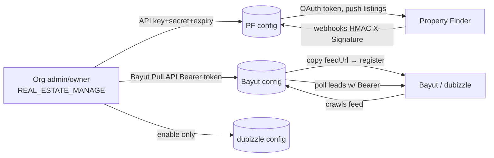

## Overview

This documentation provides a comprehensive cross-portal field mapping reference for real estate listing syndication between Bayut/dubizzle and Property Finder. It serves as a single source of truth for understanding how canonical `Listing` fields map to both portals, highlighting differences in field names, allowed values, and portal-specific requirements.

<Note>
This is a companion document to the full portal syndication specification. It focuses specifically on field mapping divergences and frontend visibility considerations.
</Note>

## Authentication & Portal Configuration

### Portal Authentication Overview

None of the three portals (Property Finder, Bayut, dubizzle) use interactive OAuth "Connect with..." redirects. All use manual credential exchange configured per-organization by admins.

<Tabs>
  <Tab title="Property Finder">
    **Direction:** Push + Webhooks  
    **Admin provides:** API Key + API Secret + expiry (from PF Expert)  
    **PropWise generates:** `webhookSecret`  
    **Transport auth:** OAuth2 client-credentials → 30-min Bearer JWT
  </Tab>
  <Tab title="Bayut">
    **Direction:** Feed pull + Lead poll  
    **Admin provides:** Bayut Pull API Bearer token (inbound leads only)  
    **PropWise generates:** `feedSecret` + per-org `feedUrl` (outbound listings)  
    **Transport auth:** Org registers PropWise's feed URL; PropWise polls leads with Bearer token
  </Tab>
  <Tab title="dubizzle">
    **Direction:** Shares Bayut  
    **Admin provides:** Nothing new (piggybacks Bayut)  
    **PropWise generates:** Reuses unified feed  
    **Transport auth:** Shares Bayut feed + Bayut lead token
  </Tab>
</Tabs>

### Authentication Flow Architecture



### Common Configuration Model

<Steps>
  <Step title="Portal Configuration Setup">
    One `PortalConfiguration` row per `(organization, portal)` with unique constraint
    - RBAC requires `REAL_ESTATE_MANAGE` permission (org admin/owner)
    - API credentials encrypted at rest using AES-256-GCM via `EncryptionService`
    - Raw credential values never returned in responses or logs
  </Step>
  
  <Step title="Available Endpoints">
    - `GET /portal-syndication/config` — List configurations (keys never returned)
    - `POST /portal-syndication/config` — Upsert portal configuration
    - `PATCH /portal-syndication/config/:portal/toggle` — Enable/disable portal
  </Step>
  
  <Step title="Secret Generation">
    PropWise-generated secrets are minted once on first creation and never regenerated on update to avoid breaking live portal subscriptions
  </Step>
</Steps>

### Property Finder OAuth2 Configuration

<Steps>
  <Step title="Portal Setup">
    Admin opens PF Expert → Developer Resources → API Credentials, generates API Integration key with required scopes:
    - **Optional scopes to enable:** `listings:full_access`, `leads:read`, `credits:read`
    - **Default scopes (always on):** `webhooks:full_access`, `compliances:read`, `locations:read`, `projects:read`, `listing_verification:full_access`
  </Step>
  
  <Step title="PropWise Configuration">
    Admin enters API Key + API Secret + expiry date via `POST /config` with `portal=property_finder`
  </Step>
  
  <Step title="Runtime Token Exchange">
    `PfTokenService` exchanges key+secret at `POST /v1/auth/token` → 30-minute Bearer JWT
    - No refresh-token flow
    - PropWise re-issues on expiry and caches per organization
  </Step>
  
  <Step title="Webhook Subscription">
    On enable, PropWise auto-generates `webhookSecret` and subscribes to PF webhooks with HMAC `X-Signature` verification
  </Step>
</Steps>

### Bayut Dual-Channel Configuration

<AccordionGroup>
  <Accordion title="Outbound Listings Channel">
    - PropWise generates per-org HMAC feed URL
    - Admin copies `feedUrl` and registers in Bayut account's XML feed settings
    - Bayut pulls feed on schedule
    
    **Feed URL Format:**
    ```
    GET /portal-syndication/feeds/{orgId}?token={hmac}
    ```
  </Accordion>
  
  <Accordion title="Inbound Leads Channel">
    - Bayut issues Pull API Bearer token (static per-client key)
    - Admin pastes token as Bayut config's `apiKey`
    - `BayutLeadPollerService` polls every 15 minutes
    - Endpoint: `www.bayut.com/api-v7/stats/website-client-leads`
  </Accordion>
</AccordionGroup>

### dubizzle Piggyback Configuration

<Info>
dubizzle shares infrastructure with Bayut for both listings and leads, requiring only a configuration row to be enabled.
</Info>

- **Listings:** Reads same unified feed as Bayut
- **Leads:** Shares Bayut's endpoint and token (source field discriminates)
- **Setup:** Create and enable dubizzle config row (no additional credentials needed)

## Mapping Helper Inventory

### Available Helpers

<Check>
**Property Type Mapping** - Centralized in `property-type-portal-map.ts`
- `LAYOUT_TYPE_TO_BAYUT`
- `LAYOUT_TYPE_TO_PF_SLUG`
</Check>

### Value Transformation Functions

The following helper functions are available in `portal-value-map.ts`:

<CodeGroup>
```typescript Purpose Mapping
purposeToBayut(p)        // SALE→'Buy',  RENT→'Rent'
purposeToPfPriceType(p, rentalPeriod)  // SALE→'sale', RENT→'yearly'|'monthly'|'weekly'|'daily'
```

```typescript Furnished Status
furnishedToBayut(f)      // FURNISHED→'Yes', UNFURNISHED→'No', PARTLY_FURNISHED→'Partly'
furnishedToPf(f)         // FURNISHED→'furnished', UNFURNISHED→'unfurnished', PARTLY_FURNISHED→'semi-furnished'
```

```typescript Room Counts
bedroomsToBayut(n)       // 0→'-1', 1..10→'1'..'10', >10→'10+', null→omit
bedroomsToPf(n)          // 0→'studio', 1..30→'1'..'30' (cap 30)
bathroomsToBayut(n)      // 1..10, >10→'10', null→omit
bathroomsToPf(n, type)   // land/farm→'none', else '1'..'20' (cap 20)
```

```typescript Additional Fields
rentalPeriodToBayut(p)   // daily→'Daily' ... (Rent_Frequency, capitalized)
finishingToPf(f)         // fully_finished→'fully-finished' ... (Bayut: no equivalent)
emirateToPfCompliance(e) // dubai→'rera'|'dtcm', abu_dhabi→'adrec', northern_emirates→omit
```
</CodeGroup>

## Field Name Mapping Matrix

The following table shows how canonical `Listing` fields map to different field names across portals:

| Canonical Field | Bayut XML Tag | PF JSON Field | Notes |
|---|---|---|---|
| `id` (+ org short code) | `<Property_Ref_No>` | `reference` | `UNIT-{orgShortCode}-{listing.id}`, unique per org |
| `permitNumber` | `<Permit_Number>` | `compliance.listingAdvertisementNumber` | PF may be composite (`permit#license`, ADREC sub-permit) |
| — (org license) | — | `compliance.issuingClientLicenseNumber` | PF only |
| `purpose` | `<Property_purpose>` | `price.type` | **Value + concept differ** |
| `propertyType` | `<Property_Type>` | `type` | Different value maps |
| `price` | `<Price>` | `price.amounts.{sale\|yearly\|monthly\|weekly\|daily}` | PF splits by `price.type`; Bayut is one number |
| `rentalPeriod` | `<Rent_Frequency>` | Folded into `price.type` + `price.amounts` | Bayut keeps separate frequency |
| `furnished` | `<Furnished>` | `features.furnished` | Different value vocabularies |
| `bedrooms` | `<Bedrooms>` | `specifications.bedrooms` | Bayut caps at "10+", PF caps at 30 |
| `bathrooms` | `<Bathrooms>` | `specifications.bathrooms` | PF sets "none" for land/farm types |
| `size` | `<Size>` | `specifications.area` | Both in sqft; PF requires `unit: 'sqft'` |
| `title` | `<Title_En>` | `title` | Bayut has separate `<Title_Ar>` |
| `description` | `<Description_En>` | `description` | Bayut has separate `<Description_Ar>` |
| `images` | `<Web_Tour>` URLs | `media.photos[].url` | Different structures; PF has metadata |
| `location` | `<City>`, `<Location>` | `location.slug` + geocoding | PF uses hierarchical slugs |
| `agentName` | `<Agent_Name>` | `contact.name` | — |
| `agentEmail` | `<Agent_Email>` | `contact.email` | — |
| `agentPhone` | `<Agent_Phone>` | `contact.phoneNumber.number` | PF has country code structure |
| `listingDate` | `<Last_Updated>` | `publishedAt` | Bayut uses update time, PF uses publish time |

## Portal-Specific Fields

### Property Finder Only

<CardGroup cols={2}>
  <Card title="Compliance Fields" icon="shield-check">
    - `compliance.issuingClientLicenseNumber`
    - `compliance.certifiedByType` (RERA/DTCM/ADREC)
    - `compliance.listingVerificationStatus`
  </Card>
  
  <Card title="Enhanced Location" icon="map-pin">
    - `location.slug` (hierarchical)
    - `location.coordinates` (lat/lng)
    - `project.slug` (if applicable)
  </Card>
</CardGroup>

### Bayut/dubizzle Only

<CardGroup cols={2}>
  <Card title="Arabic Content" icon="language">
    - `<Title_Ar>`
    - `<Description_Ar>`
    - `<Unit_Reference_No>`
  </Card>
  
  <Card title="Feed Metadata" icon="rss">
    - `<Listing_Agent>` (RERA number)
    - `<Portals>` (bayut/dubizzle targeting)
    - `<Property_Status>` (active/deleted)
  </Card>
</CardGroup>

## Value Transformation Examples

### Purpose & Pricing

<Tabs>
  <Tab title="Sale Properties">
    **Canonical:** `purpose: SALE, price: 1500000`
    
    **Bayut:**
    ```xml
    <Property_purpose>Buy</Property_purpose>
    <Price>1500000</Price>
    ```
    
    **Property Finder:**
    ```json
    {
      "price": {
        "type": "sale",
        "amounts": {
          "sale": 1500000
        }
      }
    }
    ```
  </Tab>
  
  <Tab title="Rental Properties">
    **Canonical:** `purpose: RENT, price: 80000, rentalPeriod: YEARLY`
    
    **Bayut:**
    ```xml
    <Property_purpose>Rent</Property_purpose>
    <Price>80000</Price>
    <Rent_Frequency>Yearly</Rent_Frequency>
    ```
    
    **Property Finder:**
    ```json
    {
      "price": {
        "type": "yearly",
        "amounts": {
          "yearly": 80000
        }
      }
    }
    ```
  </Tab>
</Tabs>

### Room Counts & Furnished Status

<Tabs>
  <Tab title="Studio Apartment">
    **Canonical:** `bedrooms: 0, bathrooms: 1, furnished: FURNISHED`
    
    **Bayut:**
    ```xml
    <Bedrooms>-1</Bedrooms>
    <Bathrooms>1</Bathrooms>
    <Furnished>Yes</Furnished>
    ```
    
    **Property Finder:**
    ```json
    {
      "specifications": {
        "bedrooms": "studio",
        "bathrooms": "1"
      },
      "features": {
        "furnished": "furnished"
      }
    }
    ```
  </Tab>
  
  <Tab title="Large Villa">
    **Canonical:** `bedrooms: 12, bathrooms: 15, furnished: PARTLY_FURNISHED`
    
    **Bayut:**
    ```xml
    <Bedrooms>10+</Bedrooms>
    <Bathrooms>10</Bathrooms>
    <Furnished>Partly</Furnished>
    ```
    
    **Property Finder:**
    ```json
    {
      "specifications": {
        "bedrooms": "12",
        "bathrooms": "15"
      },
      "features": {
        "furnished": "semi-furnished"
      }
    }
    ```
  </Tab>
</Tabs>

## Implementation Status

<Steps>
  <Step title="Phase 1 - Complete ✅">
    - `PortalConfiguration` model and encryption
    - Credential capture endpoints
    - Secret/feed-URL generation
    - Configuration management APIs
  </Step>
  
  <Step title="Phase B - In Development">
    - `PfTokenService` token exchange
    - Property Finder webhook subscription
    - Portal value transformation helpers
  </Step>
  
  <Step title="Phase 3 - Planned">
    - Public feed controller implementation
    - Unified XML feed generation
    - Portal-specific field filtering
  </Step>
  
  <Step title="Phase 4 - Planned">
    - Bayut lead poller service
    - Lead source discrimination
    - Error handling and retry logic
  </Step>
</Steps>

## Outstanding Integration Issues

<Warning>
The following items require resolution before full implementation:
</Warning>

### Feed Architecture Decisions

<AccordionGroup>
  <Accordion title="F1: Dual Feed Secrets">
    **Issue:** Two `feedSecret`s generated for one unified feed (Bayut + dubizzle)
    
    **Options:**
    - Share one org-level feed secret/URL across both portals
    - Keep per-portal secrets for independent rotation
    
    **Decision needed:** Document which approach to implement
  </Accordion>
  
  <Accordion title="F2: Deleted Listing Retention">
    **Issue:** Recently-removed listings must stay in feed as `Property_Status = deleted` for ≥1 crawl cycle
    
    **Current plan:** Query loads "published only" sync rows
    **Problem:** Would drop removed rows too early
    **Solution:** Include recently-removed/disabled rows for one cycle
  </Accordion>
  
  <Accordion title="F3: Cache vs Live Generation">
    **Issue:** Specification shows `FeedCacheService` (Redis, 300s TTL), current plan builds live
    
    **Decision needed:** Choose caching strategy and align documentation
  </Accordion>
</AccordionGroup>

## Related Documentation

<CardGroup cols={2}>
  <Card title="Bayut/dubizzle XML Contract" href="/backend/real-estate/bayut-dubizzle-xml" icon="code">
    External XML feed specification and requirements
  </Card>
  
  <Card title="Property Finder API" href="/backend/real-estate/pf-api" icon="api">
    REST API specification and OpenAPI definitions
  </Card>
  
  <Card title="Portal Syndication Specification" href="/backend/real-estate/portal-syndication-specification" icon="share-nodes">
    Complete syndication system design document
  </Card>
  
  <Card title="Portal Authentication" href="/backend/real-estate/portal-authentication" icon="lock">
    Detailed authentication flow documentation
  </Card>
</CardGroup>